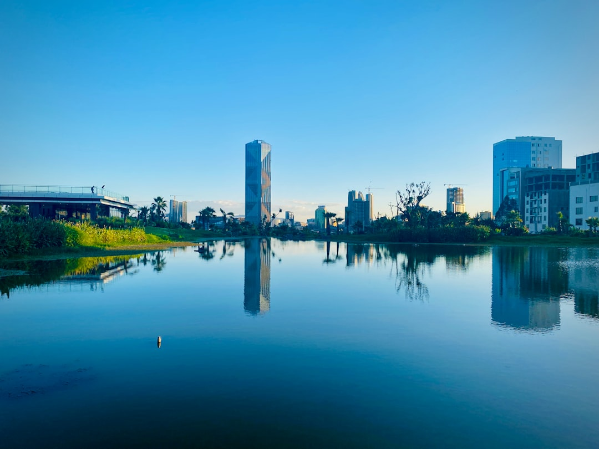

# Addis Ababa, Ethiopia

Country: Ethiopia
Region: Africa

Addis Ababa sits at 2,400 metres on the Entoto plateau, the political and cultural heart of the only African nation never formally colonised. Coffee was first cultivated here, the African Union is headquartered here, and the city moves at the speed of long conversations in shared spaces.

---

## 🧭 Step 1: Choices

### ✨ Why Visit

Addis is one of Africa's great unsung capitals. The National Museum holds Lucy, the 3.2 million year old hominid. The Holy Trinity Cathedral is a working masterpiece of Ethiopian Orthodox architecture. The Mercato is one of the largest open-air markets on the continent.

The city is also the diplomatic capital of Africa, with the African Union and the UN Economic Commission for Africa here. That gives it a cosmopolitan layer unusual for its size.

You come for the coffee, the food (one of the great undersold cuisines), the music, and a window into a civilisation that runs on a different calendar (literally; Ethiopia uses its own thirteen-month calendar).

### 🌍 Ethical Compass

- **💰 Economy.** Eat where Ethiopians eat. Family-run injera restaurants in Bole, Piazza, and Kazanchis are inexpensive and excellent. Buy coffee directly at producer-owned cafés (Tomoca, Galani, Mukush) where the supply chain is shortest. Avoid the pressure to "tip in dollars"; pay in birr at fair rates.
- **👥 Employment.** Hire a licensed guide through your hotel or a registered tour operator rather than freelancers who approach you on the street. Tipping is expected for guides, drivers, and porters; ask what is customary before you arrive.
- **📚 Education.** Read at least one Ethiopian author before you visit; Maaza Mengiste and Dinaw Mengestu are good starts. Understand that the political situation, especially regarding Tigray and other regions, has been unstable in recent years; verify current safety advisories before travel.
- **🌱 Ecology.** Addis sits in highland forest country that has been heavily deforested. Visit the Gullele Botanic Garden and the Entoto Park reforestation project. Avoid single-use plastics; Ethiopia has limited recycling infrastructure.

---

## 🎒 Step 2: Preparation

### 🔍 Governance Management

- Verify your **visa requirement** on the official Ethiopian e-Visa portal before booking flights. Rules change.
- Check current **travel advisories** from your home government before booking. Regional security in Ethiopia has been volatile, and "Addis is fine" can coexist with "do not travel to X region".
- Confirm any guided tour operator is registered with the Ministry of Tourism. Verify on the official portal.
- The Ethiopian **calendar and clock** differ from Western norms (a thirteen-month calendar, and a clock that starts at sunrise). Confirm meeting times in both systems.
- Bring **cash in major currency** to exchange at official outlets; ATM reliability varies and card acceptance is uneven outside high-end hotels.

### 📡 Information Curation

- **Addis Standard** and **The Reporter Ethiopia** (English-language Ethiopian news) for current events.
- The official **Ethiopian Tourism Organization** site for cultural calendars and major festivals.
- A book by an Ethiopian author: Maaza Mengiste's *The Shadow King*, or Dinaw Mengestu's earlier novels.
- A locally guided Addis walking tour (several social enterprises offer them) for a resident perspective.
- Wikivoyage Addis Ababa and the Bradt guide to Ethiopia for the deepest practical detail.

### 🎯 Inference Interaction

- **You decide whether the timing is right.** Ethiopia's security situation has been mixed in recent years. The decision to travel is yours to make on current information, not on assumption.
- **You decide on altitude.** Addis sits at 2,400 metres. Plan an easy first day; this is real altitude.
- **You decide whether to engage with the harder political conversations** that locals may or may not raise. Listen first.
- **You decide your festival timing.** Timkat (Epiphany) in January and Meskel (Finding of the True Cross) in September are extraordinary. They also fill the city.
- **You decide your photography ethics.** Ask before photographing people, especially Orthodox clergy and worshippers. The answer is sometimes no.

### 🔄 Intelligence Cooperation

Ethiopia runs on its own time. The thirteen-month calendar means major holidays fall on different Western dates each year, the day starts at what Westerners call 6 am (the local "1 o'clock"), and political and weather conditions can change quickly.

Bring a soft plan. If an unannounced strike (a *bandh*) closes shops one day, switch to museum and church visits. If the rainy season runs late and the Entoto forest is mud, swap to a coffee ceremony and a long lunch at Yod Abyssinia. Patience is the operating currency.

### 📍 Top 5 Anchor Spots

1. **National Museum of Ethiopia.** Home to Lucy (*Dinkinesh*) and a sweeping anthropological collection. Plan two hours.
2. **Holy Trinity Cathedral.** Burial place of Haile Selassie, with rich Ethiopian Orthodox iconography. Dress modestly; shoes off in the inner sanctuary.
3. **Merkato.** One of the largest open-air markets in Africa. Go with a guide your first time; come back alone on foot if you feel confident.
4. **Tomoca Coffee (Piazza) and the wider coffee ceremony tradition.** Coffee was domesticated here. A ceremony at a friend's home or at Yod Abyssinia is the proper introduction.
5. **Entoto Park and Mountain.** A reforestation success and a panoramic view over the capital. Pair with the small Entoto Maryam Church and museum.

### 🧰 Practical Essentials

- **Recommended Length.** Three to four days for the city. Add three to seven for a northern circuit (Lalibela, Gondar, Axum, the Simien Mountains) or a southern Omo Valley loop, both of which justify a separate trip.
- **Transport.** Taxis (blue and white, or licensed yellow) and ride-hail apps (Ride, Feres) for almost everything. Walk in central neighbourhoods during daylight. The light rail (LRT) runs two lines and is cheap, slow, and useful for north-south trips. Bole International Airport is twenty minutes from the city in light traffic, longer at rush hour.
- **Daily Cost (per person).**
  - **Budget:** roughly USD 30 to 60. Guesthouse, local injera restaurants, ride-hail and LRT, a guided museum visit.
  - **Mid-range:** roughly USD 80 to 160. Three- or four-star hotel, mixed dining, private driver for half a day, all the major sites.
  - **Higher-comfort:** roughly USD 200 and up. Sheraton or Hyatt, private guides for cultural and food tours, day trips by chartered vehicle.
- **Booking Notes.**
  - **E-Visa.** Most travellers can apply on the official Ethiopian e-Visa portal before arrival; verify your nationality's current requirement.
  - **Yellow fever** vaccination is required if arriving from a country with risk; check current rules.
  - **Major festivals** (Timkat in January, Meskel in September, Ethiopian Christmas in January, Ethiopian New Year in September) move the whole city. Book accommodation months ahead.
  - **Cash.** Bring USD or EUR in clean, recent notes for exchange at licensed outlets or banks; do not rely solely on cards or ATMs.
  - **Altitude.** Sleep low your first night if you have come from sea level; drink water; skip alcohol on day one.

---

## ✈️ Step 3: Delivery

### 🤖 AI Prompt

Copy this into your own AI assistant, fill in the brackets, and treat the answer as a researcher's draft, not a final plan.

> Please help me plan an ethical visit to Addis Ababa, Ethiopia for [NUMBER] days in [MONTH]. I am travelling with [WHO] and my interests are [INTERESTS, e.g. coffee, Orthodox culture, food, music, anthropology]. My total budget is around [AMOUNT] and my comfort level is [budget / mid-range / higher-comfort].
>
> Please structure your answer in three steps.
>
> **Step 1: Choices.** Help me decide what to prioritise. Recommend the two or three Addis experiences I should not miss given my interests, and one I should consider skipping. For each, briefly explain the trade-off.
>
> **Step 2: Preparation.** Cover all four of the following:
> - **Governance Management.** What assumptions should I check before I book? Include current visa requirements on the official Ethiopian e-Visa portal, current home-government travel advisories, registered tour operators, and Ethiopian calendar and clock differences.
> - **Information Curation.** Suggest at least four different source types: one official Ethiopian source, one Ethiopian news outlet, one Ethiopian author, and one locally guided walking tour or social-enterprise operator.
> - **Inference Interaction.** List the decisions I personally need to make (whether to travel given current advisories, altitude pacing, festival timing, photography ethics, which conversations I engage with).
> - **Intelligence Cooperation.** How should I trust my own judgment and local advice over algorithmic defaults when conditions change? Build me a soft plan with at least two alternates for likely disruptions (a closed road, an unannounced strike, heavy rainy-season mud, a festival rerouting traffic).
>
> **Step 3: Delivery.** Give me the actual itinerary, day by day, with realistic timings and named places. Include at least one proper coffee ceremony and one injera meal at a family-run restaurant. Mark each business as confidently locally owned, or flag it for me to verify.
>
> Finally, please remind me at the end to verify your suggestions against:
> 1. Official sources: the Ethiopian e-Visa portal, the Ethiopian Tourism Organization, and my home country's current travel advisory.
> 2. Real people: a local resident, a licensed guide, or hotel staff who live in Addis Ababa now.
>
> Treat your output as a researcher's draft. I will make the final calls.

---

Part of **Gyro Governance Ethical Travel: AI-Empowered Guides for Human Adventures**.

Explore more destinations, ethical domains, and AI prompts at [travel.gyrogovernance.com](https://travel.gyrogovernance.com/).
