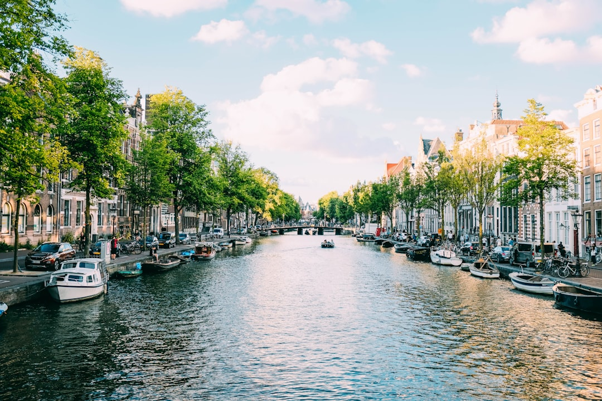

# Amsterdam, Netherlands

Country: Netherlands
Region: Europe

Amsterdam fits a Golden Age, a global art collection, a colonial reckoning, and a quietly radical urban plan into a UNESCO ring of canals you can walk across in twenty minutes. It is also one of the most pressure-tested tourism cities in Europe, and openly trying to design a different relationship with its visitors.

---

## 🧭 Step 1: Choices

### ✨ Why Visit

Amsterdam is the working capital of one of the world's oldest functioning democracies, built on land reclaimed from water and held together by bicycles, brick, and consensus. The Rijksmuseum and the Van Gogh Museum sit ten minutes apart on the same square. The Anne Frank House faces the Westerkerk where Rembrandt is buried.

The city is also, deliberately, a case study in overtourism response: an active "Stay Away" campaign aimed at certain stag-do tourism, caps on river cruises, limits on new hotel construction, and a redirection of visitors towards the wider region. How you visit here is part of the policy conversation.

You come for the museums, the canals, the cycling, and the chance to see a city actively choosing its visitors rather than accepting all of them.

### 🌍 Ethical Compass

- **💰 Economy.** Stay outside the canal ring (Oost, West, Noord, De Pijp) and you pay less, sleep better, and put your euros into neighbourhoods that benefit. Eat at Indonesian rijsttafel restaurants, Surinamese rotis, and Dutch brown cafés rather than the chains thickly clustered around Dam Square.
- **👥 Employment.** Tip a small amount at sit-down meals, even though Dutch service staff are properly paid. Buy from registered Albert Cuyp Market vendors rather than tourist-trap souvenir shops. The Red Light District is a real workplace; respect the no-photo rule.
- **📚 Education.** Read about Dutch colonial history (the VOC, the slave trade, Indonesia) before you visit the Rijksmuseum; the museum has done strong work re-curating these stories and you will see them better with context. The Anne Frank House is a serious place; book ahead and arrive prepared.
- **🌱 Ecology.** Cycle, walk, or use the tram and metro. The car is the worst possible way to experience Amsterdam. Visit shoulder seasons (April to June, September to October) for tulip and museum balance without the August crush.

---

## 🎒 Step 2: Preparation

### 🔍 Governance Management

- Book the **Anne Frank House** strictly through its official site. Tickets are released on a rolling schedule and sell out fast. No legitimate reseller sells them.
- Book the **Van Gogh Museum** and the **Rijksmuseum** on their official sites with timed entry. Verify current pricing on each portal.
- Confirm any short-term rental is **registered** with the City of Amsterdam (registration number must appear on the listing). The city actively enforces caps on rental nights and has shut down many listings.
- Confirm the operator of any canal cruise is a licensed Amsterdam operator. River-cruise capacity caps have changed how excursions run; verify current rules on the city's official portal.
- **Cannabis coffee shops** and the Red Light District operate under specific local rules that are tightening. Verify current rules before assuming what is allowed where.

### 📡 Information Curation

- **I amsterdam** (the official city tourism site) for current event listings and clear visitor policy.
- **DutchNews.nl** for English-language coverage of Dutch politics, housing, and tourism debates.
- A book or documentary on Dutch colonial history: anything by David Van Reybrouck, or the Rijksmuseum's own publications on slavery.
- A neighbourhood walking host based in Noord, De Pijp, or Oost for a non-canal-ring perspective.
- Wikivoyage Amsterdam for transport and district orientation.

### 🎯 Inference Interaction

- **You decide your role in the overtourism conversation.** The city has asked certain visitors (loud stag parties, drug-tourism weekenders) to "stay away". You decide what kind of visitor you want to be.
- **You decide where to sleep.** A canal-ring hotel, a registered apartment outside the ring, or a stay in nearby Haarlem or Utrecht with a short train ride are all fair choices.
- **You decide whether to cycle.** Renting a bike is excellent if you ride confidently; in heavy traffic it is genuinely dangerous if you do not. There is no shame in walking and tramming.
- **You decide your approach to the Red Light District.** Visiting is fine; gawking, group tours that linger, and photographing the workers is not. Your call to walk through respectfully or skip.
- **You decide how to engage colonial history.** The Rijksmuseum has done the work; whether you read the labels and absorb them is up to you.

### 🔄 Intelligence Cooperation

Amsterdam adapts constantly. New museum wings open, neighbourhoods shift in character, transport routes change, and tourism policy is rewritten on a regular cycle. A guidebook printed three years ago will be wrong on the details.

Bring a soft plan. If a strike grounds the trams (rare but possible), walk or cycle; the city is small. If a sudden cold snap or summer heatwave changes the day, the museums absorb a lot of weather. If your favourite brown café is closed for renovation, the one two streets over is probably better anyway.

### 📍 Top 5 Anchor Spots

1. **Rijksmuseum.** The national museum of the Netherlands. Plan three hours minimum; the Asian Pavilion is often empty.
2. **Van Gogh Museum.** The deepest single collection of his work in the world. Pre-booked timed entry essential.
3. **Anne Frank House.** Booked strictly on the official site, well in advance. Allow ninety minutes plus quiet time afterwards.
4. **Jordaan and the canal ring walk.** From the Westerkerk south through the Nine Streets and east to the Amstel. Best on foot, early morning or after dinner.
5. **NDSM Wharf and Amsterdam Noord.** The free ferry from Centraal Station crosses to the post-industrial north, now home to street art, indie galleries, and the EYE Film Museum. A genuine breath of non-canal Amsterdam.

### 🧰 Practical Essentials

- **Recommended Length.** Three to four days for the city. Add one to two for a day trip to Haarlem, Utrecht, or the Keukenhof tulip gardens in spring.
- **Transport.** Walk and cycle in the centre. The GVB tram, metro, and ferry network is excellent; contactless payment with any major bank card or mobile wallet works on all of it (tap on entry and exit). Schiphol Airport is fifteen to twenty minutes from Centraal Station by direct train. Avoid cars in the city.
- **Daily Cost (per person).**
  - **Budget:** roughly €80 to €130. Hostel or pod hotel, supermarket and bakery meals, public transport, two major sites.
  - **Mid-range:** roughly €150 to €260. Three-star hotel or registered apartment outside the ring, café and brown-bar dining, all the major museums, a canal cruise.
  - **Higher-comfort:** roughly €320 and up. Boutique canal-ring hotel, private museum guides, fine dining at De Kas or Restaurant 212, taxis and water taxis.
- **Booking Notes.**
  - **Anne Frank House:** book the moment your slot opens. The official site is the only legitimate seller.
  - **Van Gogh and Rijksmuseum:** timed entry, official portals, book days ahead in peak season.
  - **Short-term rentals:** registration number must appear in the listing; rental-night caps apply. Verify current rules on the City of Amsterdam portal.
  - **Coffee shops and Red Light District:** local rules are tightening. Verify current restrictions before you arrive.
  - **King's Day (late April)** turns the entire city into an open-air party. Book months ahead or avoid the dates entirely.

---

## ✈️ Step 3: Delivery

### 🤖 AI Prompt

Copy this into your own AI assistant, fill in the brackets, and treat the answer as a researcher's draft, not a final plan.

> Please help me plan an ethical visit to Amsterdam, Netherlands for [NUMBER] days in [MONTH]. I am travelling with [WHO] and my interests are [INTERESTS, e.g. art history, cycling, colonial history, neighbourhood walking]. My total budget is around [AMOUNT] and my comfort level is [budget / mid-range / higher-comfort].
>
> Please structure your answer in three steps.
>
> **Step 1: Choices.** Help me decide what to prioritise. Recommend the two or three Amsterdam experiences I should not miss given my interests, and one I should consider skipping to protect my time, my budget, or the city's overtourism response. Briefly explain each trade-off.
>
> **Step 2: Preparation.** Cover all four of the following:
> - **Governance Management.** What assumptions should I check before I book? Include official ticketing for Anne Frank, Van Gogh, and Rijksmuseum, the short-term rental registration regime, current cannabis and Red Light District rules, and King's Day or major festival dates.
> - **Information Curation.** Suggest at least four different source types: one official Dutch source, one Dutch news outlet, one Dutch or colonial-history author, and one neighbourhood walking host outside the canal ring.
> - **Inference Interaction.** List the decisions I personally need to make (what kind of visitor I am, where I sleep, whether to cycle, how I engage the Red Light District, how I read colonial history).
> - **Intelligence Cooperation.** How should I trust my own judgment and local advice over algorithmic defaults when conditions change? Build me a soft plan with at least two alternates for likely disruptions (a sold-out Anne Frank slot, a sudden weather flip, a strike or canal-cruise cap change).
>
> **Step 3: Delivery.** Give me the actual itinerary, day by day, with realistic timings and named places. Include at least one half-day outside the canal ring (Noord, De Pijp, or Oost). Mark each business as confidently locally owned, or flag it for me to verify.
>
> Finally, please remind me at the end to verify your suggestions against:
> 1. Official sources: I amsterdam, the Anne Frank, Van Gogh, and Rijksmuseum portals, and the City of Amsterdam's rental-rules page.
> 2. Real people: a local resident, a licensed guide, or hotel staff who live in Amsterdam now.
>
> Treat your output as a researcher's draft. I will make the final calls.

---

Part of **Gyro Governance Ethical Travel: AI-Empowered Guides for Human Adventures**.

Explore more destinations, ethical domains, and AI prompts at [travel.gyrogovernance.com](https://travel.gyrogovernance.com/).
