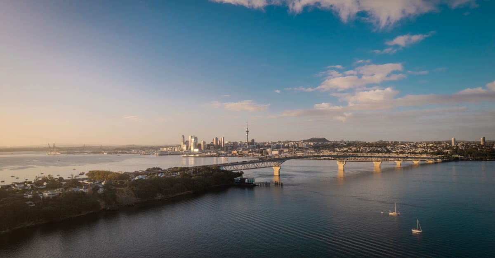

# Auckland, New Zealand

Country: New Zealand
Region: Oceania

Auckland (*Tāmaki Makaurau* in te reo Māori) is built on fifty-three volcanoes and wrapped by two harbours. It is the largest Polynesian city in the world, the gateway to most of New Zealand, and a place where Māori, Pacific, Asian, and European histories actively share the same urban grammar.

---

## 🧭 Step 1: Choices

### ✨ Why Visit

Auckland is more than a transit lounge for the rest of New Zealand. The volcanic field gives it a topography unlike any other major city; you can climb a dormant cone in your lunch hour. The Hauraki Gulf islands (Waiheke, Rangitoto, Tiritiri Matangi) are ferry-close. The Auckland Museum holds one of the world's best collections of Māori and Pacific *taonga* (treasures).

The city is also the cultural centre of Polynesian diaspora communities. South Auckland's Samoan, Tongan, Cook Islands, and Niuean communities make this the largest Polynesian city anywhere, and that shapes the food, music, and rugby on every level.

You come for the islands, the food, the *taonga*, and a city that wears its multiple identities openly.

### 🌍 Ethical Compass

- **💰 Economy.** Eat at Pacific and Asian family-run spots in Onehunga, Mt Eden village, Sandringham (the Indian strip), and Otahuhu rather than the homogenised waterfront chains. Buy at producer-led farmers' markets (La Cigale, Matakana) rather than supermarket tourist sections.
- **👥 Employment.** Use the AT HOP card and licensed taxis or ride-hail. Tip is not customary in New Zealand and adding one can feel awkward; reward great service by saying so and coming back.
- **📚 Education.** Learn a handful of te reo Māori words (*kia ora* hello, *ngā mihi* thanks, *whānau* family, *wāhi tapu* sacred site). Visit the Auckland War Memorial Museum's Māori and Pacific galleries before any other tourist experience. The country is in an active conversation about Te Tiriti o Waitangi (the Treaty); read about it.
- **🌱 Ecology.** Volcanic cones are *wāhi tapu*: walk paths, do not summit roped-off ones, and respect Māori-led restrictions. The Hauraki Gulf is a marine park; choose operators that follow the strict biosecurity rules (clean shoes between islands to protect pest-free sanctuaries).

---

## 🎒 Step 2: Preparation

### 🔍 Governance Management Traceability

- Verify your **NZeTA (Electronic Travel Authority)** requirement and the **International Visitor Conservation and Tourism Levy** on the official Immigration New Zealand portal before booking.
- Confirm Hauraki Gulf ferry timetables on the official **Fullers360** or **SeaLink** sites; weather cancels services regularly.
- Check current **biosecurity rules** for visiting pest-free islands (Tiritiri Matangi, Rangitoto): shoes cleaned, no food contraband. Verify on the Department of Conservation (DOC) portal.
- Some Māori sites have *rāhui* (temporary protective closures). Verify status with local iwi before climbing volcanic cones such as Maungawhau (Mount Eden).
- Confirm wine-tour and Waiheke operators are licensed; verify ferry-and-tour bundle pricing on each official site.

### 📡 Information Curation Variety

- **The New Zealand Herald** and **Stuff** for current Auckland and national news.
- **Auckland Council's official tourism site** for event listings, opening hours, and current *rāhui* notices.
- A book by a Māori or Pacific author: Witi Ihimaera, Patricia Grace, or Albert Wendt.
- A Māori-led cultural tour (TIME Unlimited Tours, Potiki Adventures) for tangata whenua perspective.
- **Department of Conservation (DOC)** site for any nature-based visit; their advice is authoritative.

### 🎯 Inference Interaction Accountability

- **You decide whether to engage with Te Tiriti.** Visiting Aotearoa without understanding the Treaty is like visiting Berlin and ignoring the wall. Your choice, but a real one.
- **You decide your *rāhui* response.** If a site is closed by iwi, the answer is to respect it, not to argue.
- **You decide your gulf-versus-city balance.** A day on Waiheke is excellent; spending all four days drinking wine on Waiheke is a missed city.
- **You decide where in Auckland you actually go.** The CBD is a small fraction of the city; South Auckland is where much of the cultural life happens.
- **You decide on Tiritiri Matangi.** This rare predator-free bird sanctuary is one of the great conservation success stories on Earth. It needs a full day and serious biosecurity care.

### 🔄 Intelligence Cooperation Integrity

Auckland weather is its own character. "Four seasons in a day" is not a tourist-board cliché; it is operationally true. The Hauraki Gulf can cancel ferries with little warning, the volcanic cones can be slick after rain, and the city's outdoor calendar shifts accordingly.

Bring a soft plan. If the ferry to Rangitoto is cancelled, the Auckland Museum and the Wynyard Quarter absorb a wet day well. If a perfect summer day arrives, drop the indoor plan and go to the west coast beaches (Piha, Karekare). Cooperate with what the gulf gives you.

### 📍 Top 5 Anchor Spots

1. **Auckland War Memorial Museum.** The Māori and Pacific galleries on the ground floor are world-class. The cultural performance (separate ticket) is genuinely worth the time.
2. **Waiheke Island.** Forty minutes by ferry. Vineyards, beaches, and Oneroa village. Best as a full day, by bike or hop-on bus.
3. **Maungawhau (Mount Eden) and Maungakiekie (One Tree Hill).** Two of the great volcanic cones, both with panoramic views. Walk the paths; respect any *rāhui*.
4. **Tiritiri Matangi.** A predator-free island sanctuary in the gulf, home to takahē, hihi, and tieke. A guided walk with the volunteer Supporters of Tiritiri is unforgettable.
5. **Karangahape Road (K Road) and Ponsonby.** The inner-city neighbourhoods for queer culture, independent shops, late-night food, and live music.

### 🧰 Practical Essentials

- **Recommended Length.** Three to four days for the city and at least one gulf island. Add days for the Coromandel, Bay of Islands, or as a base before going further south.
- **Transport.** Walk in the CBD, Britomart, Wynyard, and Ponsonby. The AT HOP card covers buses, trains, and ferries; contactless bank-card payment also works on most routes. Auckland Airport is thirty to fifty minutes from the CBD depending on traffic; the SkyDrive bus and AirportLink are the cheapest reliable options.
- **Daily Cost (per person).**
  - **Budget:** roughly NZD 100 to 170. Hostel or simple guesthouse, food courts and bakeries, public transport, free volcanic-cone walks and beaches.
  - **Mid-range:** roughly NZD 220 to 380. Three-star hotel, mixed dining, a Waiheke day, the museum and one cultural performance.
  - **Higher-comfort:** roughly NZD 500 and up. Waterfront or Ponsonby boutique hotel, private guided tours, Waiheke vineyard lunches, helicopter or charter options.
- **Booking Notes.**
  - **NZeTA and conservation levy** required for most visa-waiver visitors; verify on the official Immigration New Zealand portal.
  - **Ferries** to Waiheke and Rangitoto run frequently in summer, less so in winter; book the day's first or last to avoid crowds.
  - **Tiritiri Matangi** ferry slots are limited; book well ahead in summer.
  - **Te Matatini** (national kapa haka festival) and **Pasifika Festival** are extraordinary if your dates align; check official calendars.
  - **Cultural performances at the Auckland Museum** sell out daily; book the morning slot if you can.

---

## ✈️ Step 3: Delivery

### 🤖 AI Prompt

Copy this into your own AI assistant, fill in the brackets, and treat the answer as a researcher's draft, not a final plan.

> Please help me plan an ethical visit to Auckland (Tāmaki Makaurau), New Zealand for [NUMBER] days in [MONTH]. I am travelling with [WHO] and my interests are [INTERESTS, e.g. Māori and Pacific culture, gulf islands, food, hiking, wine]. My total budget is around [AMOUNT] and my comfort level is [budget / mid-range / higher-comfort].
>
> Please structure your answer in three steps.
>
> **Step 1: Choices.** Help me decide what to prioritise. Recommend the two or three Auckland experiences I should not miss given my interests, and one I should consider skipping. Briefly explain each trade-off.
>
> **Step 2: Preparation.** Cover all four of the following:
> - **Governance Management Traceability.** What assumptions should I check before I book? Include the NZeTA and conservation levy on the official Immigration New Zealand portal, Department of Conservation biosecurity rules for island visits, any current rāhui on volcanic cones, and ferry weather cancellations.
> - **Information Curation Variety.** Suggest at least four different source types: one official New Zealand government source, one New Zealand news outlet, one Māori or Pacific author, and one Māori-led cultural tour or guide.
> - **Inference Interaction Accountability.** List the decisions I personally need to make (engaging with Te Tiriti, rāhui response, city vs gulf balance, which neighbourhoods I actually explore, whether to commit a full day to Tiritiri Matangi).
> - **Intelligence Cooperation Integrity.** Build me a soft plan with at least two alternates for likely disruptions (cancelled ferry, sudden weather change, a rāhui mid-trip, a sold-out cultural performance).
>
> **Step 3: Delivery.** Give me the actual itinerary, day by day, with realistic timings and named places. Include at least one Māori or Pacific cultural experience and one day in or beyond the CBD. Mark each business as confidently locally owned, or flag it for me to verify.
>
> Finally, please remind me at the end to verify your suggestions against:
> 1. Official sources: Immigration New Zealand, Auckland Council tourism site, Department of Conservation, and the official ferry operators.
> 2. Real people: a local resident, a licensed Māori guide, or hotel staff who live in Auckland now.
>
> Treat your output as a researcher's draft. I will make the final calls.

---

Part of **Gyro Governance Ethical Travel: AI-Empowered Guides for Human Adventures**.

Explore more destinations, ethical domains, and AI prompts at [travel.gyrogovernance.com](https://travel.gyrogovernance.com/).
