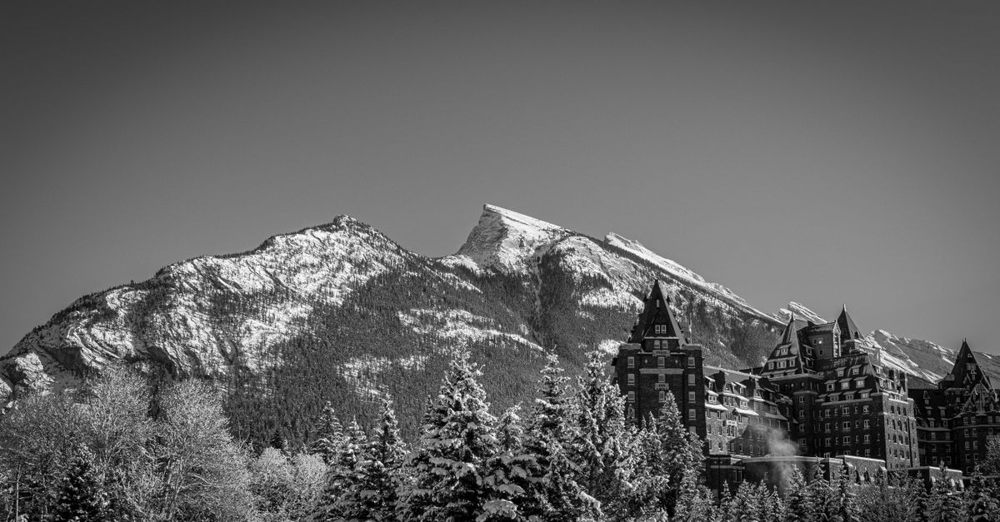

# Banff, Canada

Country: Canada
Region: Americas

Banff National Park is Canada's first national park and the heart of the Canadian Rockies UNESCO World Heritage site. Turquoise glacial lakes, grizzly bear corridors, and a small Alpine-style townsite at 1,400 metres sit inside a working ecological reserve managed by Parks Canada.

---

## 🧭 Step 1: Choices

### ✨ Why Visit

Banff is one of the few places on Earth where wild grizzly bears, wolves, elk, and bighorn sheep live within an hour of an espresso bar. Lake Louise and Moraine Lake are postcards for a reason; the colour comes from glacial flour, real ice melting upstream.

The park is also a case study in how to manage extreme visitor pressure on fragile ecology. Parks Canada has introduced shuttle-only access to several headline sites, parking restrictions, and a serious wildlife-corridor management plan. Visiting here means cooperating with those rules, not working around them.

You come for the mountains, the lakes, the wildlife, and a working example of public land done at scale.

### 🌍 Ethical Compass

- **💰 Economy.** Stay in Banff townsite or Canmore (outside the park) rather than in chain motels along the highway. Eat at locally owned places in Banff Avenue, Canmore's Main Street, and the Bow Valley. Buy from local outfitters rather than international chains.
- **👥 Employment.** Hire certified mountain guides (ACMG, Association of Canadian Mountain Guides) for any backcountry, ice-walk, or scrambling activity. Tip generously in service-industry contexts; many workers live precariously in expensive resort labour markets.
- **📚 Education.** This is Treaty 7 territory; the Stoney Nakoda, Tsuut'ina, and Blackfoot nations have presence here. Visit the Buffalo Nations Luxton Museum and any Indigenous-led tour for the long story of this land. The Banff Park Museum is the oldest of its kind in Canada.
- **🌱 Ecology.** Bears need corridors; do not feed wildlife, store food in bear-proof lockers, carry bear spray and know how to use it. Stay on trails, particularly around Lake Louise and Moraine Lake. The shuttle system exists to reduce road impact; use it.

---

## 🎒 Step 2: Preparation

### 🔍 Governance Management

- A **Parks Canada Discovery Pass** or daily park pass is required for everyone in the park. Buy on the official Parks Canada portal.
- **Moraine Lake** is now accessible by **shuttle, mass transit, or commercial operator only**; private vehicle access is closed. Verify the current shuttle booking window on the Parks Canada portal.
- **Lake Louise parking** is heavily managed; the Parks Canada shuttle is the practical default. Book ahead.
- Backcountry permits (camping, certain trails) must be booked through Parks Canada in advance.
- Confirm any guide is **ACMG certified** for technical activities (climbing, ice walks, ski touring). Verify on the official ACMG portal.

### 📡 Information Curation

- **Parks Canada Banff** site for trail closures, wildlife reports, shuttle bookings, and fire bans.
- **Banff and Lake Louise Tourism** for events and lodging.
- **Avalanche Canada** (official) for winter backcountry conditions; non-negotiable in shoulder and winter seasons.
- A book on the Indigenous history of the region: Trevor Herriot's writing on the prairies, or anything by Treaty 7 authors.
- **Friends of Banff National Park** and **Yellowstone to Yukon Conservation Initiative** for the broader ecological context.

### 🎯 Inference Interaction

- **You decide your season.** Summer means crowds and shuttle-only access; September is the quietest with the best larches; winter is a different park entirely.
- **You decide on the shuttle.** Trying to drive to Moraine Lake is no longer possible. Trying to drive to Lake Louise in peak hours is futile. Accept the shuttle.
- **You decide on bear safety.** Bear spray, a noisy group, situational awareness. The mountain owes you nothing.
- **You decide on backcountry vs frontcountry.** A day hike on Plain of Six Glaciers is a serious commitment; the Bow Valley Parkway pullouts are achievable in normal shoes.
- **You decide on Indigenous engagement.** Take the Indigenous-led tour, read the interpretive plaques, learn the names of the nations whose land this is.

### 🔄 Intelligence Cooperation

Mountain weather is the boss. A blue-sky morning can turn into a snow squall by afternoon at any time of year. Wildfires close trails on short notice. Wildlife sightings close roads. The shuttle system constrains your timing.

Bring a soft plan. If your Moraine Lake shuttle is at 6 am, accept the early start. If a bear is on a trail, take the closure seriously and pick another. If wildfire smoke degrades the air, the museums in Banff townsite and the indoor pool at the Banff Upper Hot Springs absorb a bad-air day well.

### 📍 Top 5 Anchor Spots

1. **Lake Louise and the Plain of Six Glaciers.** The lake by shuttle in the morning, then the 14 km return hike to the tea house with glacial views.
2. **Moraine Lake.** Shuttle-only access. The Rockpile sunrise is famous for a reason; book the earliest shuttle.
3. **Johnston Canyon and the Ink Pots.** A walkway through limestone canyons to colourful spring pools beyond. Strenuous but achievable.
4. **Banff townsite, the Cave and Basin, and the Banff Park Museum.** The original hot spring that founded the park, and the country's oldest natural history museum.
5. **Icefields Parkway to the Columbia Icefield.** The 230 km drive north from Lake Louise to Jasper is one of the world's great mountain roads. Stop at Peyto Lake and Mistaya Canyon.

### 🧰 Practical Essentials

- **Recommended Length.** Three to seven days for the park. Five lets you combine Banff townsite, Lake Louise area, and a day on the Icefields Parkway. A week or more if you want serious hiking or are pairing with Jasper.
- **Getting There and Around.** Fly into Calgary International Airport (YYC), then drive or shuttle 90 minutes west on Highway 1. The Banff Airporter and Brewster Express buses are reliable alternatives to a rental car. Inside the park, the **Roam Transit** bus connects Banff, Canmore, Lake Louise, and the Moraine Lake shuttle hub. Avoid driving in midsummer if you can.
- **Daily Cost (per person).**
  - **Budget:** roughly CAD 100 to 180. HI hostel or shared cabin, groceries and bakery meals, Roam Transit and Parks shuttle, free hiking.
  - **Mid-range:** roughly CAD 250 to 450. Three-star hotel in Banff or Canmore, restaurant dinners, shuttle plus occasional car rental, a guided hike or hot springs day.
  - **Higher-comfort:** roughly CAD 600 and up. Fairmont Banff Springs or Chateau Lake Louise, fine dining, private guided hiking or ice walks, helicopter or heli-hike experiences.
- **Booking Notes.**
  - **Park pass** required for everyone; buy on the official Parks Canada portal.
  - **Moraine Lake shuttle** is the only way in for most visitors; book the window the moment it opens.
  - **Lake Louise shuttle** strongly recommended; private parking fills by 6 am in peak season.
  - **Backcountry permits** (Skoki, Egypt Lake, Magog) book up months ahead.
  - **Bear spray** is essential for any hiking; it cannot be flown, buy or rent in Banff or Canmore.
  - **Wildfire smoke** can dominate August and September; check air quality before strenuous outdoor plans.

---

## ✈️ Step 3: Delivery

### 🤖 AI Prompt

Copy this into your own AI assistant, fill in the brackets, and treat the answer as a researcher's draft, not a final plan.

> Please help me plan an ethical visit to Banff National Park, Canada for [NUMBER] days in [MONTH]. I am travelling with [WHO] and my interests are [INTERESTS, e.g. hiking, wildlife, photography, Indigenous culture, winter sports]. My total budget is around [AMOUNT] and my comfort level is [budget / mid-range / higher-comfort].
>
> Please structure your answer in three steps.
>
> **Step 1: Choices.** Help me decide what to prioritise. Recommend the two or three Banff experiences I should not miss given my interests and season, and one I should consider skipping. Briefly explain each trade-off.
>
> **Step 2: Preparation.** Cover all four of the following:
> - **Governance Management.** What assumptions should I check before I book? Include the Parks Canada Discovery Pass, the mandatory Moraine Lake shuttle booking, Lake Louise parking and shuttle, any backcountry permits, and ACMG certification for technical guides.
> - **Information Curation.** Suggest at least four different source types: Parks Canada Banff, Banff and Lake Louise Tourism, Avalanche Canada (in winter), a book or article on Treaty 7 Indigenous history, and a Yellowstone to Yukon or Friends of Banff ecological source.
> - **Inference Interaction.** List the decisions I personally need to make (season, shuttle vs car, bear safety, backcountry vs frontcountry, Indigenous engagement).
> - **Intelligence Cooperation.** How should I trust my own judgment and local advice over algorithmic defaults when conditions change? Build me a soft plan with at least two alternates for likely disruptions (wildfire smoke, sudden snow, trail closure for wildlife, shuttle cancellation).
>
> **Step 3: Delivery.** Give me the actual itinerary, day by day, with realistic timings, shuttle bookings, and named trails. Include at least one Indigenous-led or interpretive experience if my dates allow. Mark each business as confidently locally owned, or flag it for me to verify.
>
> Finally, please remind me at the end to verify your suggestions against:
> 1. Official sources: Parks Canada Banff, Roam Transit, ACMG, and Avalanche Canada in winter.
> 2. Real people: a local guide, a Roam Transit driver, or accommodation staff who live in Banff or Canmore now.
>
> Treat your output as a researcher's draft. I will make the final calls.

---

Part of **Gyro Governance Ethical Travel: AI-Empowered Guides for Humane Adventures**.

Explore more destinations, ethical domains, and AI prompts at [travel.gyrogovernance.com](https://travel.gyrogovernance.com/).
