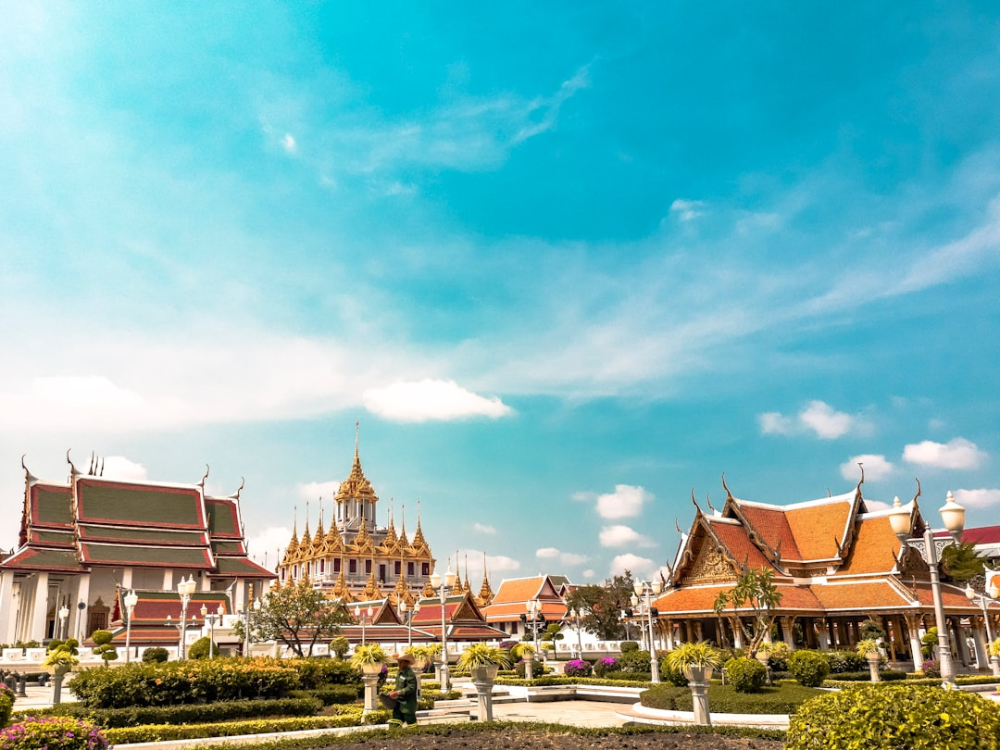

# Bangkok, Thailand

Country: Thailand
Region: Asia

Bangkok (*Krung Thep*) is one of the most visited cities on Earth and a working Thai capital of nearly ten million. Royal temples and a tropical river at the centre, a vast street-food culture, and a relentless 24-hour energy that locals navigate by motorbike and BTS Skytrain.

---

## 🧭 Step 1: Choices

### ✨ Why Visit

Bangkok concentrates more of Southeast Asia's energy into one city than almost anywhere. The Grand Palace and Wat Pho are foundational sites of Thai Buddhism. The Chao Phraya river is a working transport spine. The street food on a single Yaowarat (Chinatown) block is better than most cities' entire restaurant scenes.

The city is also where global tourism meets Thai life, sometimes uncomfortably. Patpong and Soi Cowboy exist in the same square kilometre as quiet Buddhist temples and the Thai royal palace. How you visit shapes which Bangkok you find.

You come for the temples, the food, the rivers and canals, and a city that rewards walking, eating, and asking questions.

### 🌍 Ethical Compass

- **💰 Economy.** Eat at street stalls, market vendors, and small shophouse restaurants. Tipping is not customary; rounding up is appreciated. Buy from Chatuchak Weekend Market vendors and small Or Tor Kor market sellers rather than mall chains.
- **👥 Employment.** Use metered taxis (insist on the meter), the BTS, MRT, and Chao Phraya boats. Avoid tuk-tuk "free tour" scams that route you to tailor shops paying commission. The sex industry is real here; how you engage or do not engage is a moral choice with consequences for workers.
- **📚 Education.** Thailand has lèse-majesté laws; criticism of the monarchy in conversation, online, or anywhere is a serious legal matter. Dress code at temples is non-negotiable: shoulders and knees covered, no shoes inside. Learn basic Thai (*sawatdee*, *khob khun*, *mai ao*).
- **🌱 Ecology.** Bangkok flooding worsens each year; choose Skytrain over taxi where possible (air quality), refuse plastic, and skip ethically dubious animal experiences (elephant rides, tiger temples). The Bangkok Botanic Garden and Bang Krachao (the "green lung") are real escapes.

---

## 🎒 Step 2: Preparation

### 🔍 Governance Management

- Confirm your **visa exemption or visa-on-arrival** eligibility on the official Thai Ministry of Foreign Affairs portal; rules vary by nationality.
- The **Grand Palace** has a strict dress code (no shorts, no exposed shoulders or knees, no flip-flops). Verify on the official palace portal. Cover-ups can be rented or bought; better to bring your own.
- **Tourist scams** at the Grand Palace are well documented. Ignore anyone outside the gate saying it is "closed today"; it is not.
- For elephant interactions, only support **walk-with-elephant sanctuaries** that do not allow riding or shows; verify the operator's policies in writing.
- Verify any **Thai massage** establishment is licensed (Wat Pho's traditional medicine school is the gold-standard reference).

### 📡 Information Curation

- **Bangkok Post** and **The Nation Thailand** (English-language Thai newspapers) for current events and traffic-major-event warnings.
- The official **Tourism Authority of Thailand (TAT)** site for festivals, transport updates, and official events.
- A Thai author: Saneh Sangsuk, Prabda Yoon, or English-translated works of Chart Korbjitti.
- A Bangkok-resident expat-and-local podcast or YouTube channel for ground-truth on food, neighbourhoods, and current scam patterns.
- **Wikivoyage Bangkok** for district-by-district orientation; the city is huge.

### 🎯 Inference Interaction

- **You decide your neighbourhood.** Sukhumvit, Silom, the Old City (Rattanakosin), Thonburi, and Chinatown are wildly different Bangkoks; choose one to base in deliberately.
- **You decide on tuk-tuks vs taxis.** Tuk-tuks are theatre, taxis with the meter are transport. Both are fine; "free tuk-tuk tours" are always scams.
- **You decide your engagement with the sex industry.** Walking through Patpong as a curiosity is morally different from purchasing services. The choice is yours; the consequences for the workers are not abstract.
- **You decide your dress code commitment.** Temple entry rules apply across the country, not just at the Grand Palace.
- **You decide your political conversation comfort.** Thai politics, the monarchy, and the military are sensitive subjects; lèse-majesté is a real law with real prison sentences.

### 🔄 Intelligence Cooperation

Bangkok is hot and the rainy season floods streets. The traffic is legendary. The Skytrain and MRT solve much of it but not all. Major Buddhist holidays close temples, royal events close roads, and demonstrations occasionally close central areas without notice.

Bring a soft plan. If a downpour closes outdoor markets, the city's malls are climate-controlled and the food courts excellent. If traffic is impossible, take the boat. If a royal procession closes Rattanakosin, swap to Chinatown or Thonburi.

### 📍 Top 5 Anchor Spots

1. **The Grand Palace and Wat Phra Kaew.** Dress code strict; arrive at opening or late afternoon to avoid both crowds and worst heat.
2. **Wat Pho.** The Reclining Buddha and Thailand's traditional massage school. Walk here from the Grand Palace.
3. **Chao Phraya river and the canals of Thonburi.** Take the orange-flag commuter boat for views; a longtail-boat *klong* tour on the Thonburi side shows the old water-city.
4. **Yaowarat (Chinatown) after dark.** The food street comes alive after 6 pm; walk Charoen Krung Road and side lanes.
5. **Chatuchak Weekend Market.** Hundreds of stalls; go early Saturday morning, work in sections. Pair with the Or Tor Kor produce market across the road.

### 🧰 Practical Essentials

- **Recommended Length.** Three to four days for the city. Add a day for Ayutthaya (the old capital, train-accessible). Onward to islands or Chiang Mai justifies extra time.
- **Transport.** BTS Skytrain and MRT for everything in the modern districts; tap a Rabbit Card or use contactless where supported. Chao Phraya Express Boat for the river. Metered taxis are cheap; insist on the meter or use Grab. Avoid private cars in central Bangkok during rush hours.
- **Daily Cost (per person).**
  - **Budget:** roughly THB 800 to 1,500 (about USD 25 to 45). Hostel, street food, Skytrain and boats, free or low-cost sites.
  - **Mid-range:** roughly THB 2,500 to 5,000 (about USD 75 to 150). Three-star hotel, mixed dining including a high-end Thai restaurant, all major sites, a guided food tour.
  - **Higher-comfort:** roughly THB 8,000 and up. Five-star riverside or Sukhumvit hotel, fine dining, private guides, a longtail-boat charter and rooftop bars.
- **Booking Notes.**
  - **Visa:** verify your nationality's current status on the Thai Ministry of Foreign Affairs portal.
  - **Grand Palace dress code:** enforced strictly. Bring or wear cover-ups; ignore "closed today" scammers outside.
  - **Songkran (April Thai New Year)** floods the streets with water fights; some travellers love it, some hate it.
  - **Loy Krathong (November)** is beautiful but books out the city.
  - **Air pollution** can be serious in dry-season months (December to March); check air quality and consider an N95 mask.

---

## ✈️ Step 3: Delivery

### 🤖 AI Prompt

Copy this into your own AI assistant, fill in the brackets, and treat the answer as a researcher's draft, not a final plan.

> Please help me plan an ethical visit to Bangkok, Thailand for [NUMBER] days in [MONTH]. I am travelling with [WHO] and my interests are [INTERESTS, e.g. street food, Buddhist temples, river life, design, markets]. My total budget is around [AMOUNT] and my comfort level is [budget / mid-range / higher-comfort].
>
> Please structure your answer in three steps.
>
> **Step 1: Choices.** Help me decide what to prioritise. Recommend the two or three Bangkok experiences I should not miss given my interests, and one I should consider skipping (the over-marketed elephant shows, the Patpong "ping-pong" tours, the dubious "floating market" day-trips). Briefly explain each trade-off.
>
> **Step 2: Preparation.** Cover all four of the following:
> - **Governance Management.** What assumptions should I check before I book? Include the visa rules on the Thai Ministry of Foreign Affairs portal, the Grand Palace dress code, common scams at major sites, the policy of any animal-encounter operator, and air-quality conditions in my dates.
> - **Information Curation.** Suggest at least four different source types: one official Tourism Authority of Thailand source, one Thai English-language newspaper, one Thai author, and one Bangkok-resident food or neighbourhood guide.
> - **Inference Interaction.** List the decisions I personally need to make (neighbourhood base, taxi vs tuk-tuk, engagement with the sex industry, dress code commitment, political conversation comfort).
> - **Intelligence Cooperation.** How should I trust my own judgment and local advice over algorithmic defaults when conditions change? Build me a soft plan with at least two alternates for likely disruptions (rainy-season downpour, traffic gridlock, a royal procession closing roads, an air-quality red day).
>
> **Step 3: Delivery.** Give me the actual itinerary, day by day, with realistic timings, BTS/MRT routes, and named neighbourhoods. Include at least one early-morning temple visit and one evening on the river or in Chinatown. Mark each business as confidently locally owned, or flag it for me to verify.
>
> Finally, please remind me at the end to verify your suggestions against:
> 1. Official sources: the Tourism Authority of Thailand, the Grand Palace official portal, and the Bangkok Post for current city news.
> 2. Real people: a local resident, a licensed Thai guide, or hotel staff who live in Bangkok now.
>
> Treat your output as a researcher's draft. I will make the final calls.

---

Part of **Gyro Governance Ethical Travel: AI-Empowered Guides for Human Adventures**.

Explore more destinations, ethical domains, and AI prompts at [travel.gyrogovernance.com](https://travel.gyrogovernance.com/).
