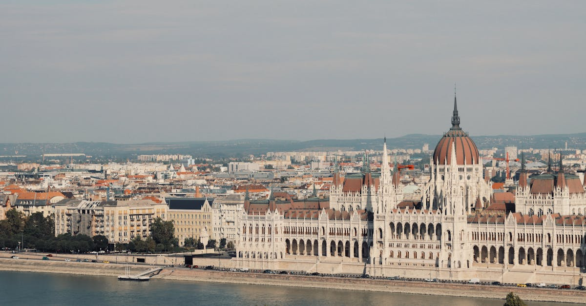

# Budapest, Hungary

Country: Hungary
Region: Europe

Budapest is two old cities (hilly Buda and flat Pest) on opposite banks of the Danube, stitched together by nine bridges and a parliament that looks like a wedding cake. Roman bones, Ottoman thermal baths, Habsburg facades, Soviet-era housing, and one of Central Europe's most active food and ruin-bar scenes.

---

## 🧭 Step 1: Choices

### ✨ Why Visit

Budapest is more affordable than its Western European peers and architecturally as dense as any of them. The Parliament is one of the largest in the world. The Buda Castle and Fisherman's Bastion give one of Europe's great urban panoramas. The thermal baths (Széchenyi, Gellért, Rudas) are working public infrastructure, not just attractions; Hungarians actually use them.

The city also has a sharp political weather. Hungary's national politics has drawn international attention in recent years; Budapest itself has been more contested. Visiting respectfully means reading some history and listening to locals rather than assuming.

You come for the baths, the river, the Jewish quarter, the food (Hungarian cuisine is undersold abroad), and a city that delivers serious depth at moderate cost.

### 🌍 Ethical Compass

- **💰 Economy.** Eat at *étkezde* (working-class lunch canteens) and small family restaurants in District VII, VIII, and IX rather than the tourist traps around the Castle. Use the Central Market Hall's upper floor for souvenirs but its ground floor for actual food shopping.
- **👥 Employment.** Tipping at sit-down meals is 10 to 12 percent; check whether service is already added. Use BKK public transport rather than taxis where possible. Avoid the unofficial taxis at the airport; book Főtaxi or use Bolt.
- **📚 Education.** Read about Hungary's twentieth century: the World War II occupation, the Holocaust (one of the most rapid and complete in Europe), 1956, and the post-1989 transition. The House of Terror and the Holocaust Memorial Centre are essential.
- **🌱 Ecology.** Walk, use the BKK trams and metros, and the riverside paths. The thermal baths use natural geothermal water; respect the rules and the bathing-pool etiquette (no swimwear in some pools, swim caps required in others).

---

## 🎒 Step 2: Preparation

### 🔍 Governance Management

- **Schengen visa** rules apply; verify your nationality's current status on the official Hungarian government or your home consulate portal.
- The **Parliament** offers guided tours only; book on the official portal with passport. Sells out days ahead in peak season.
- **Thermal baths** (Széchenyi, Gellért, Rudas, Lukács) each have different rules; check the official bath portal for hours, pool closures, and swimwear requirements.
- Confirm any **boat cruise** on the Danube is operated by a licensed Hungarian company; the river has had safety incidents in recent years and standards vary.
- Verify any **food tour or wine tour** operator (Hungary has serious wine regions reachable as day trips) is registered.

### 📡 Information Curation

- **Telex** and **Hungary Today** (English coverage of Hungarian news) for current politics and city events.
- **Budapest Info** (the official city tourism site) for events, rules, and pass options.
- A Hungarian author: Imre Kertész's *Fatelessness*, Magda Szabó's *The Door*, or Péter Nádas for ambition.
- A locally led Jewish Quarter walking tour with a Jewish-Hungarian guide for a non-superficial reading of District VII.
- **Wikivoyage Budapest** for transport and district orientation.

### 🎯 Inference Interaction

- **You decide on Parliament timing.** The tour is short, ticketed, and sells out. Book days ahead in the language you want.
- **You decide on which bath, on which day.** Széchenyi is the postcard; Gellért is Art Nouveau; Rudas has Turkish-era pools and male/female-only days. Read the rules of your chosen bath.
- **You decide your ruin-bar approach.** Szimpla Kert and the District VII ruin bars are a real scene but also overrun in summer. The smaller ones one street over are often better.
- **You decide how you engage Hungarian politics.** Avoid lectures. Listen to locals; many are themselves divided.
- **You decide on Buda vs Pest as a base.** Pest is dense, walkable, and where the nightlife is. Buda is quieter, leafier, and where the castle and many baths are.

### 🔄 Intelligence Cooperation

Budapest weather is continental; summers are hot and humid (the baths help), winters are bitter (the indoor baths still help). Major events (national holidays, Sziget Festival in August) reshape the city. Renovations rotate through the major historic buildings.

Bring a soft plan. If your Parliament slot is full, the Hungarian National Museum or the House of Terror absorb a city-history afternoon. If summer heat is brutal, an evening bath under stars at Széchenyi is unforgettable. If winter snow closes Castle Hill paths, the metro to Heroes' Square solves it.

### 📍 Top 5 Anchor Spots

1. **Hungarian Parliament Building.** Tour-only, official portal, book days ahead. The Crown Jewels are inside.
2. **Buda Castle, Fisherman's Bastion, and Matthias Church.** Walk up Castle Hill in the morning; the panorama over the Danube is the city's signature image.
3. **Széchenyi or Gellért Thermal Baths.** A morning or evening soak. Bring flip-flops, a towel, and the willingness to learn the etiquette.
4. **Jewish Quarter (District VII) and the Dohány Street Synagogue.** The largest synagogue in Europe; the surrounding district holds ruin bars, kosher restaurants, and street art.
5. **Central Market Hall and a long walk down Váci utca or across the Liberty Bridge.** Ground floor for food, upper floor for sober souvenir shopping; cross the river for Gellért Hill.

### 🧰 Practical Essentials

- **Recommended Length.** Three to four days for the city. Add a day for Szentendre (riverside town), Eger (wine), or the Lake Balaton region.
- **Transport.** Walk in District V, VI, and VII. The BKK metro (four lines), trams (the 4/6 ring tram runs all night), and buses are excellent and cheap; buy a 24- or 72-hour pass. Bolt for ride-hail. Avoid unofficial airport taxis; the 100E airport bus or pre-booked Főtaxi are reliable.
- **Daily Cost (per person).**
  - **Budget:** roughly HUF 18,000 to 35,000 (about EUR 45 to 90). Hostel, étkezde lunches, transport pass, one bath, two paid sites.
  - **Mid-range:** roughly HUF 45,000 to 90,000 (about EUR 110 to 230). Three-star hotel or licensed apartment, restaurant dinners, all the major sites, two baths.
  - **Higher-comfort:** roughly HUF 130,000 and up. Boutique hotel near the river, fine dining at places like Onyx or Costes, private guides, a Danube cruise.
- **Booking Notes.**
  - **Parliament tour:** book on the official portal days ahead; specify language.
  - **Thermal baths:** verify hours, swim cap and swimwear rules, and any single-sex day requirements on each bath's official portal.
  - **Sziget Festival (August)** fills the city; book accommodation months ahead.
  - **St Stephen's Day (20 August)** fireworks over the Danube draw huge crowds.
  - **Christmas markets (late November to early January)** are excellent; the Vörösmarty Square one is the original.

---

## ✈️ Step 3: Delivery

### 🤖 AI Prompt

Copy this into your own AI assistant, fill in the brackets, and treat the answer as a researcher's draft, not a final plan.

> Please help me plan an ethical visit to Budapest, Hungary for [NUMBER] days in [MONTH]. I am travelling with [WHO] and my interests are [INTERESTS, e.g. thermal baths, Habsburg architecture, Jewish history, food, ruin bars]. My total budget is around [AMOUNT] and my comfort level is [budget / mid-range / higher-comfort].
>
> Please structure your answer in three steps.
>
> **Step 1: Choices.** Help me decide what to prioritise. Recommend the two or three Budapest experiences I should not miss given my interests, and one I should consider skipping (the tourist traps on Castle Hill, an unofficial airport taxi, the worst of Váci utca). Briefly explain each trade-off.
>
> **Step 2: Preparation.** Cover all four of the following:
> - **Governance Management.** What assumptions should I check before I book? Include the Parliament tour passport booking, thermal-bath rules and hours on each official portal, Schengen visa rules for my nationality, and licensed Danube cruise operators.
> - **Information Curation.** Suggest at least four different source types: one official Hungarian source, one English-language Hungarian news outlet, one Hungarian author, and one Jewish Quarter or neighbourhood-led walking host.
> - **Inference Interaction.** List the decisions I personally need to make (Parliament tour timing, which bath and when, Buda vs Pest base, how I engage Hungarian politics).
> - **Intelligence Cooperation.** How should I trust my own judgment and local advice over algorithmic defaults when conditions change? Build me a soft plan with at least two alternates for likely disruptions (sold-out Parliament slot, a summer heatwave, a winter snowstorm, a closed wing at a major museum).
>
> **Step 3: Delivery.** Give me the actual itinerary, day by day, with realistic timings and named districts. Include at least one thermal bath visit, one Jewish Quarter walk, and one étkezde or family-restaurant meal. Mark each business as confidently locally owned, or flag it for me to verify.
>
> Finally, please remind me at the end to verify your suggestions against:
> 1. Official sources: Budapest Info, the Parliament tour portal, the specific bath's official site, and BKK for transport.
> 2. Real people: a local resident, a licensed Hungarian guide, or hotel staff who live in Budapest now.
>
> Treat your output as a researcher's draft. I will make the final calls.

---

Part of **Gyro Governance Ethical Travel: AI-Empowered Guides for Human Adventures**.

Explore more destinations, ethical domains, and AI prompts at [travel.gyrogovernance.com](https://travel.gyrogovernance.com/).
