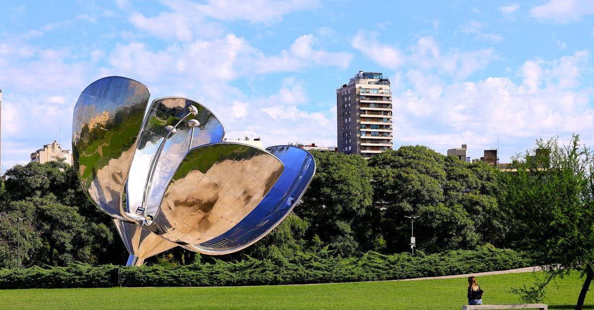

# Buenos Aires, Argentina

Country: Argentina
Region: Americas

Buenos Aires is the largest city in Spanish-speaking South America, a Belle Époque capital of around 15 million in the metropolitan area, and one of the most literary and stylish cities on the continent. Tango was invented in its port neighbourhoods, beef in its grasslands; both define meals here.

---

## 🧭 Step 1: Choices

### ✨ Why Visit

Buenos Aires runs on conversation, espresso, and late dinners. The Recoleta Cemetery is the city of the dead built like a city of the living. Palermo's bookshops and bars outlast political weather. San Telmo's Sunday antique fair and tango on cobblestones are not invented for tourists.

The city is also a living seminar in inflation and macroeconomic stress. Argentine politics and currency move fast, and the price you pay tomorrow may not be the price you paid yesterday. Visiting respectfully means understanding the country's volatility rather than assuming stability.

You come for the literature (Borges, Cortázar, Piglia), the beef and Malbec, the tango, the architecture, and a city that takes itself seriously without being earnest.

### 🌍 Ethical Compass

- **💰 Economy.** Use the *dólar blue* (parallel exchange rate) thoughtfully through reputable casas de cambio or services such as Western Union pickups; the official rate punishes tourists. Eat at *parrillas* and *bodegones* (neighbourhood grills and family restaurants) rather than international chains.
- **👥 Employment.** Tip about 10 percent at restaurants in cash. Use radio taxis (black and yellow, Buenos Aires-licensed), Cabify, or Uber rather than informal drivers. Argentine wages have been hit hard by inflation; tipping is genuinely important.
- **📚 Education.** Read at least one Argentine author. Borges' *Ficciones* is the classical entry; Mariana Enriquez' *Things We Lost in the Fire* for contemporary Buenos Aires. Visit the Parque de la Memoria for the country's open work on the dictatorship and the desaparecidos.
- **🌱 Ecology.** Walk Palermo, Recoleta, San Telmo. The Bosques de Palermo and the Reserva Ecológica Costanera Sur are real green lungs. Refill from public fountains; tap water is safe in the city.

---

## 🎒 Step 2: Preparation

### 🔍 Governance Management

- Verify **visa or visa-exempt** status on the official Argentine Migraciones portal.
- **Currency.** Argentina has multiple exchange rates; the official rate is unfavourable for tourists. Verify current rules and your options (cash USD, Western Union pickup, Visa MEP exchange) on multiple recent sources before assuming.
- The **Recoleta Cemetery** is free; verify opening hours on the official portal. Avoid unlicensed "guides" outside the gate; book a registered tour through the cemetery's official programme or a known operator.
- For **tango shows**, separate the touristic dinner-show (passable) from the *milongas* (real social tango halls). The latter is the experience; do not pay tourist prices to watch a stage version.
- Buy intercity bus tickets only through **Plataforma 10** or the official terminal at Retiro; resellers charge premiums.

### 📡 Information Curation

- **Buenos Aires Times** (English) and **Clarín** or **La Nación** (Spanish) for current news.
- The official **Ciudad de Buenos Aires** tourism site for events and current rules.
- An Argentine author: Borges, Cortázar, Mariana Enriquez, César Aira.
- A locally led walking tour in San Telmo, La Boca (with caveats; see Step 1), or Palermo. Free Walking Tours BA is well regarded.
- **Wikivoyage Buenos Aires** for neighbourhood orientation.

### 🎯 Inference Interaction

- **You decide on the currency strategy.** Cash USD, Western Union, or card rates each have implications. Verify which is best now; the answer changes.
- **You decide your neighbourhood base.** Palermo (Soho, Hollywood, Chico) is restaurant- and nightlife-rich; Recoleta is grand and quieter; San Telmo is bohemian; Puerto Madero is corporate-clean and sterile.
- **You decide on La Boca.** Caminito is photogenic but heavily commercialised and surrounded by neighbourhoods that warrant local advice. A daytime guided visit is safer than a wander.
- **You decide on the tango.** A milonga (Confitería Ideal, La Catedral, Salón Canning) is real social tango; a Caminito dinner show is dinner with a show. The choice is yours.
- **You decide whether to engage with Argentina's political conversation.** Locals are extremely engaged; Peronism, Macrismo, Mileinomics are all everyday conversation. Listen first.

### 🔄 Intelligence Cooperation

Buenos Aires runs on its own clock. Lunch at 2 pm, dinner at 10 pm, nightclubs after 2 am. The summer (December to February) is genuinely hot and the city half-empties for the coast. Inflation reshapes prices weekly.

Bring a soft plan. If a *paro* (strike) closes the subte (metro), the colectivos (buses) and walking cover most of the centre. If a downpour kills your Recoleta plan, the Museo de Bellas Artes is across the street. If your favourite parrilla is closed Sunday, the next one over is fine.

### 📍 Top 5 Anchor Spots

1. **Recoleta Cemetery and the surrounding museums.** Free entry; the Museo de Bellas Artes is steps away. Eva Perón's grave is here; many other Argentine icons too.
2. **San Telmo on a Sunday.** The Feria de San Telmo antique fair down Calle Defensa, with tango on cobblestones at Plaza Dorrego.
3. **Palermo neighbourhood walk.** Plaza Serrano, the bookshops of Honduras and Costa Rica streets, the Bosques de Palermo, the MALBA art museum.
4. **Teatro Colón.** One of the world's great opera houses; book a guided backstage tour or, better, an actual performance.
5. **A real milonga.** A weekday evening at La Catedral or Salón Canning. You can watch; you can also take a beginner class.

### 🧰 Practical Essentials

- **Recommended Length.** Three to five days for the city. Add days for Tigre Delta (day trip), Colonia del Sacramento (Uruguay, ferry), Iguazú Falls, or onward Argentine wine country.
- **Transport.** The Subte (six lines, A through H) is cheap; buy a SUBE card. Colectivos (city buses) take SUBE only. Radio taxis (black and yellow), Cabify, and Uber are the alternatives. EZE (international) airport is 45 to 60 minutes from the centre; Aeroparque (domestic) is 15 minutes.
- **Daily Cost (per person).**
  - **Budget:** roughly USD 30 to 70 (highly variable due to currency volatility). Hostel, parrilla and bodegón meals, SUBE, free museums.
  - **Mid-range:** roughly USD 90 to 180. Three-star hotel or licensed apartment in Palermo or Recoleta, restaurant dinners with wine, all the major sites.
  - **Higher-comfort:** roughly USD 250 and up. Boutique hotel in Palermo Soho or Recoleta, fine dining at Don Julio or Tegui, private guides, a Teatro Colón performance.
- **Booking Notes.**
  - **Visa:** verify your nationality on the Argentine Migraciones portal.
  - **Currency:** Argentina's exchange-rate landscape changes frequently. Verify current rules and best options shortly before travel; bring crisp USD bills as backup.
  - **Teatro Colón** tours and performances book months ahead in season.
  - **Major holidays** (May 25, July 9, Christmas) close many shops and restaurants.
  - **Summer (December to February)** is hot and porteños leave for the coast; the city empties.

---

## ✈️ Step 3: Delivery

### 🤖 AI Prompt

Copy this into your own AI assistant, fill in the brackets, and treat the answer as a researcher's draft, not a final plan.

> Please help me plan an ethical visit to Buenos Aires, Argentina for [NUMBER] days in [MONTH]. I am travelling with [WHO] and my interests are [INTERESTS, e.g. tango, beef and wine, literature, Belle Époque architecture, contemporary art]. My total budget is around [AMOUNT] and my comfort level is [budget / mid-range / higher-comfort].
>
> Please structure your answer in three steps.
>
> **Step 1: Choices.** Help me decide what to prioritise. Recommend the two or three Buenos Aires experiences I should not miss given my interests, and one I should consider skipping (a tourist dinner-tango show, La Boca after dark, an unofficial airport driver). Briefly explain each trade-off.
>
> **Step 2: Preparation.** Cover all four of the following:
> - **Governance Management.** What assumptions should I check before I book? Include the Argentine Migraciones visa portal, current currency exchange options (the official rate vs alternatives), Teatro Colón booking, and licensed San Telmo or La Boca walking guides.
> - **Information Curation.** Suggest at least four different source types: one official Argentine source, one Argentine news outlet, one Argentine author, and one local milonga-going or barrio guide.
> - **Inference Interaction.** List the decisions I personally need to make (currency strategy, neighbourhood base, La Boca approach, tango show vs milonga, how I engage Argentine politics).
> - **Intelligence Cooperation.** How should I trust my own judgment and local advice over algorithmic defaults when conditions change? Build me a soft plan with at least two alternates for likely disruptions (a paro strike, a heatwave, a power-grid outage in summer, a sudden price jump).
>
> **Step 3: Delivery.** Give me the actual itinerary, day by day, with realistic timings and named neighbourhoods. Include at least one milonga visit (or beginner class), one Sunday in San Telmo, and one parrilla lunch. Mark each business as confidently locally owned, or flag it for me to verify.
>
> Finally, please remind me at the end to verify your suggestions against:
> 1. Official sources: Migraciones Argentina, the Ciudad de Buenos Aires tourism portal, and recent reliable currency-rate sources.
> 2. Real people: a local resident, a licensed porteño guide, or hotel staff who live in Buenos Aires now.
>
> Treat your output as a researcher's draft. I will make the final calls.

---

Part of **Gyro Governance Ethical Travel: AI-Empowered Guides for Humane Adventures**.

Explore more destinations, ethical domains, and AI prompts at [travel.gyrogovernance.com](https://travel.gyrogovernance.com/).
