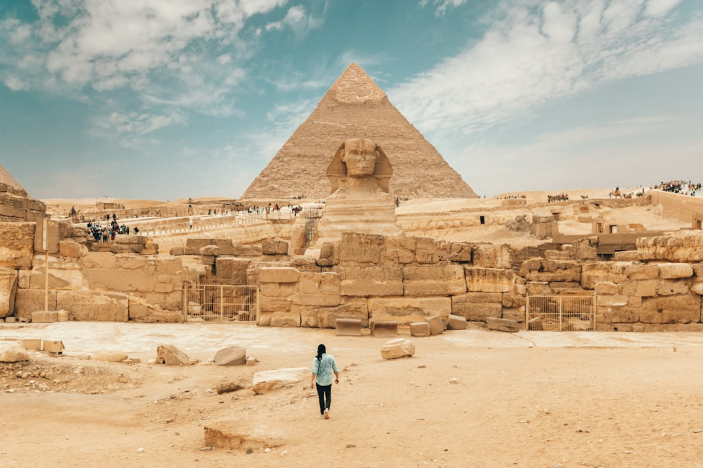

# Cairo, Egypt

Country: Egypt
Region: Africa

Cairo (*Al-Qāhirah*) is the largest city in the Arab world and Africa, a 22 million-person megalopolis on the Nile with five thousand years of human settlement under its streets. Pharaonic, Coptic, Islamic, Ottoman, and modern Cairo all live in the same city; the Grand Egyptian Museum is the new front door.

---

## 🧭 Step 1: Choices

### ✨ Why Visit

Cairo is the door to ancient Egypt and the cultural capital of the Arab world. The Grand Egyptian Museum holds the complete Tutankhamun collection together for the first time. The Pyramids of Giza sit at the city's western edge, 30 minutes from your hotel. Islamic Cairo is a UNESCO-listed warren of medieval mosques and madrasas.

The city is also intense in ways that travel writing often softens. Traffic, pollution, heat, and persistent commercial pressure on visitors are real. Visiting Cairo successfully means accepting that intensity and choosing a slower pace inside it.

You come for the Pyramids, the museums, the medieval Islamic city, and a Nile that still defines life along it after five millennia.

### 🌍 Ethical Compass

- **💰 Economy.** Eat at *koshary* shops, ful-and-tameya stands, and family restaurants in Downtown Cairo and Zamalek rather than hotel restaurants. Buy from small Khan el-Khalili workshop stalls rather than the front-row tourist showrooms (and bargain politely).
- **👥 Employment.** Hire a **licensed Egyptologist guide** (carrying a Ministry of Tourism guide card) for the Pyramids and major museums; freelance "guides" at the sites are usually unlicensed and often misleading. Tipping (*baksheesh*) is part of the economy; budget for it: small notes for everyone who helps.
- **📚 Education.** Read one serious popular book on ancient Egypt before you arrive; Toby Wilkinson's *The Rise and Fall of Ancient Egypt* is a good starter. The Grand Egyptian Museum has substantially changed how Egypt presents its own past; engage it on its own terms.
- **🌱 Ecology.** Cairo has serious air pollution; check air-quality indices and consider an N95 mask. The Pyramids site has water and shade limitations; bring both. Refill water from sealed bottles or trusted hotel sources; avoid tap.

---

## 🎒 Step 2: Preparation

### 🔍 Governance Management Traceability

- Most visitors need an **e-Visa** through the official Egyptian e-Visa portal, or a visa-on-arrival; verify your nationality's current rules.
- The **Grand Egyptian Museum (GEM)** at Giza is now the primary Egyptology museum; verify hours, full opening status of all galleries, and ticketing on the official GEM portal.
- The **Pyramids of Giza** ticket system has multiple tiers (site entry, pyramid interior, Solar Boat museum). Book directly at the site office or with a licensed guide; verify recent rules as the area has been reorganised with new electric shuttles and a new entrance.
- Always verify your **driver and vehicle** are arranged through your hotel or a registered company; avoid airport solicitations.
- For **felucca rides** and **Nile dinner cruises**, verify the operator is licensed; standards vary widely.

### 📡 Information Curation Variety

- **Al-Ahram Online** and **Egypt Independent** (English-language Egyptian outlets) for current events.
- The **Egyptian Tourism Authority** official site for current museum hours and major site rules.
- A book or documentary by an Egyptian author: Naguib Mahfouz's Cairo Trilogy; Alaa Al Aswany's *The Yacoubian Building*.
- A licensed Egyptologist guide for the Pyramids and GEM; recommended through your hotel or a known operator.
- **Wikivoyage Cairo** for transport and district orientation.

### 🎯 Inference Interaction Accountability

- **You decide on the licensed guide.** A serious Egyptologist transforms the Pyramids from a confusing crowded site into a meaningful day; the unlicensed alternative usually does the opposite.
- **You decide on Khan el-Khalili pricing.** Bargaining is expected; aggressive pressure is the norm at the front; the deeper alleys with workshops set fairer first prices.
- **You decide on baksheesh.** Refusing it across the board is read as rude; budget small notes (5 to 20 EGP) for bathroom attendants, helpful strangers, and minor services. Reserve larger tips for serious guides.
- **You decide your physical pace.** Heat and air quality genuinely affect what you can do. Mornings outdoors, afternoons indoors, evenings outdoors is a sensible default.
- **You decide on the dress code.** Modest dress at mosques (shoulders and knees covered, head covering for women in some mosques). Cairo is mixed in everyday dress but conservative outside Zamalek and Downtown.

### 🔄 Intelligence Cooperation Integrity

Cairo traffic is its own weather. A 5 km journey can take 20 minutes or two hours. Friday prayers reshape the day. Ramadan reshapes the month. Sandstorms (khamsin) hit in spring. Major political moments occasionally close central streets.

Bring a soft plan. If the road to Giza is jammed, the GEM is the same direction and serves the morning. If a sandstorm shutters outdoor sites, the Coptic Museum and Islamic Art Museum are indoor. Cairo rewards patience and morning starts.

### 📍 Top 5 Anchor Spots

1. **Grand Egyptian Museum (GEM) at Giza.** The complete Tutankhamun, the Khufu boat, and a Pharaonic timeline at scale. Allow a full half day; verify opening status of all galleries.
2. **Pyramids of Giza and the Sphinx.** Arrive at opening with a licensed guide; combine with the GEM. The new electric shuttle system has changed access.
3. **Islamic Cairo: the Citadel, Sultan Hassan Mosque, Al-Rifa'i Mosque, and Al-Muizz Street.** A morning walk through medieval Cairo, dressed appropriately.
4. **Khan el-Khalili and Al-Azhar.** The historic bazaar and the great university-mosque. Best in late afternoon and evening.
5. **Coptic Cairo and the Old Cairo churches.** The Hanging Church and the Coptic Museum tell the Egyptian Christian story rarely covered in standard itineraries.

### 🧰 Practical Essentials

- **Recommended Length.** Three to five days for Cairo and Giza. Add days for Saqqara, Dahshur, and Alexandria as day trips; longer for the Nile Valley (Luxor and Aswan).
- **Transport.** The Cairo Metro (three lines) is cheap and avoids surface traffic, though crowded; women-only carriages are available. Uber and Careem ride-hail are reliable and let you avoid taxi haggles. Walk only with awareness; pavements are uneven and crossings improvisational.
- **Daily Cost (per person).**
  - **Budget:** roughly EGP 800 to 1,800 (about USD 16 to 40). Guesthouse, koshary and ful meals, metro and Uber, two ticketed sites.
  - **Mid-range:** roughly EGP 3,000 to 6,000 (about USD 65 to 130). Three- or four-star hotel, mixed dining, a private licensed Egyptologist for one day, all the major sites.
  - **Higher-comfort:** roughly EGP 9,000 and up. Marriott Mena House (Pyramid view) or Four Seasons, fine dining at places like Sequoia, private guides for the duration, full-service Nile cruise.
- **Booking Notes.**
  - **e-Visa:** apply on the official Egyptian e-Visa portal; verify your nationality.
  - **GEM:** verify gallery openings and ticketing on the official portal.
  - **Pyramids:** the site has been reorganised; current entrance and shuttle rules are evolving. Book a licensed guide who knows the current system.
  - **Ramadan:** site hours are shorter and many restaurants closed during daylight; the evenings are festive.
  - **Summer (June to September):** heat is genuinely punishing; prioritise winter and shoulder seasons.

---

## ✈️ Step 3: Delivery

### 🤖 AI Prompt

Copy this into your own AI assistant, fill in the brackets, and treat the answer as a researcher's draft, not a final plan.

> Please help me plan an ethical visit to Cairo, Egypt for [NUMBER] days in [MONTH]. I am travelling with [WHO] and my interests are [INTERESTS, e.g. ancient Egypt, Islamic architecture, Coptic history, food, photography]. My total budget is around [AMOUNT] and my comfort level is [budget / mid-range / higher-comfort].
>
> Please structure your answer in three steps.
>
> **Step 1: Choices.** Help me decide what to prioritise. Recommend the two or three Cairo experiences I should not miss given my interests, and one I should consider skipping (an unlicensed Pyramids "guide", a sound-and-light show that loses to a sunrise visit, a budget Nile dinner cruise of questionable standard). Briefly explain each trade-off.
>
> **Step 2: Preparation.** Cover all four of the following:
> - **Governance Management Traceability.** What assumptions should I check before I book? Include the Egyptian e-Visa portal, current GEM gallery openings, the Pyramids' reorganised entrance and shuttle system, licensed Egyptologist guides, and Ramadan or summer-heat scheduling.
> - **Information Curation Variety.** Suggest at least four different source types: one official Egyptian source, one English-language Egyptian news outlet, one Egyptian author, and one licensed Egyptologist guide or hotel concierge.
> - **Inference Interaction Accountability.** List the decisions I personally need to make (licensed guide commitment, bargaining and baksheesh budget, physical pacing for heat and air quality, dress code).
> - **Intelligence Cooperation Integrity.** Build me a soft plan with at least two alternates for likely disruptions (traffic gridlock, sandstorm, Friday prayer street closures, air-quality red day).
>
> **Step 3: Delivery.** Give me the actual itinerary, day by day, with realistic timings and named neighbourhoods. Include at least one full Giza-and-GEM day with a licensed Egyptologist, and one morning walk through Islamic Cairo. Mark each business as confidently locally owned, or flag it for me to verify.
>
> Finally, please remind me at the end to verify your suggestions against:
> 1. Official sources: the Egyptian Tourism Authority, the GEM portal, the Egyptian e-Visa portal, and my home country's current travel advisory.
> 2. Real people: a licensed Egyptologist, hotel staff, or a local resident in Cairo now.
>
> Treat your output as a researcher's draft. I will make the final calls.

---

Part of **Gyro Governance Ethical Travel: AI-Empowered Guides for Human Adventures**.

Explore more destinations, ethical domains, and AI prompts at [travel.gyrogovernance.com](https://travel.gyrogovernance.com/).
