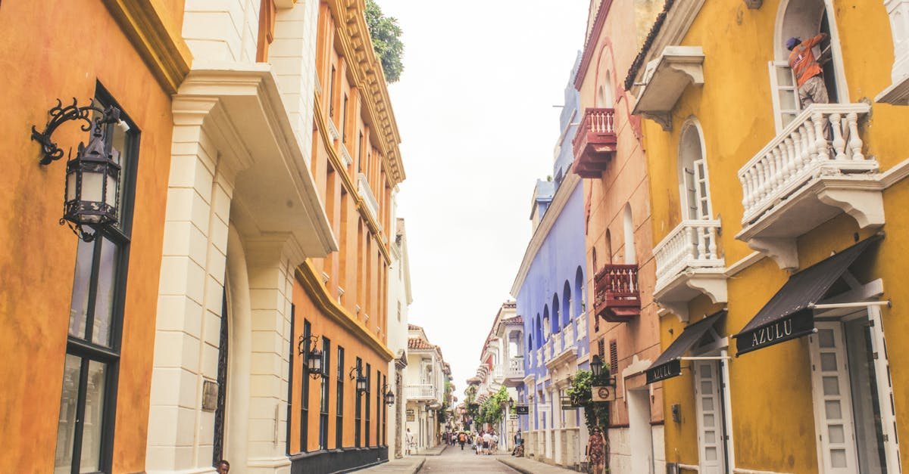

# Cartagena, Colombia

Country: Colombia
Region: Americas

Cartagena de Indias is Colombia's Caribbean port-city, a UNESCO-listed walled colonial centre painted every colour, a fortified Spanish-American showpiece, and one of the most romantic cities in the Americas. It is also one of the most pressure-tested by tourism on the continent.

---

## 🧭 Step 1: Choices

### ✨ Why Visit

Cartagena's walled city (*la Ciudad Amurallada*) is one of the most complete Spanish colonial centres anywhere. The Castillo San Felipe is the largest fortress the Spanish built in the New World. The food (Caribbean-Colombian, with serious Afro-Colombian influence), the music, and the night-time energy on the plazas are exceptional.

The city is also a real conversation about who tourism is for. The walled city's residents have been largely priced out; the cruise-ship traffic floods specific hours; nearby beach islands are managed differently depending on who owns them. How you visit shapes what survives.

You come for the colonial architecture, the Caribbean, the Afro-Colombian heritage, and a chance to make a beach holiday into a deeper trip.

### 🌍 Ethical Compass

- **💰 Economy.** Eat at *fritos*, *arepas*, and Caribbean-Colombian family restaurants in Getsemaní (the working-class neighbourhood adjacent to the walled city) and Bocagrande side streets rather than the international-priced restaurants on the main walled-city plazas. Stay in Getsemaní or San Diego rather than the highest-priced walled-city palaces if you want to support a more balanced economy.
- **👥 Employment.** Tip 10 percent at restaurants. Use registered taxis or Uber; haggle politely with informal drivers but agree the fare before getting in. The street vendors of fruit, hats, and crafts on the plazas are working hard; pay fairly without aggressive bargaining.
- **📚 Education.** Cartagena was a major slave port in the Spanish empire; the Palacio de la Inquisición and the Saint Peter Claver museum tell parts of that story. The nearby Palenque de San Basilio (founded by escaped enslaved Africans) is the first free Afro-descendant town in the Americas; a respectful visit is meaningful.
- **🌱 Ecology.** The Rosario Islands are fragile coral; choose snorkel operators who run conservation-aware trips and avoid sunscreen near the reef. The Caribbean heat is real; hydrate, refill, decline plastic bottles where possible.

---

## 🎒 Step 2: Preparation

### 🔍 Governance Management

- Verify your **visa or visa-exempt** status on the official Colombian Cancillería portal.
- **Castillo San Felipe** and the main museums are publicly run; verify pricing and hours on official Cartagena tourism portals.
- For **Rosario Islands or Playa Blanca** day trips, choose registered operators; the **Tax for Tourism** at the Cartagena port is small and required for boat trips.
- Beach resort all-inclusives on islands (Isla Múcura, Tierra Bomba) operate under various regulatory regimes; verify the operator's status before booking.
- For **chiva (party bus)** evening tours, verify the operator's licence and the route; some routes pass through neighbourhoods that warrant local advice after dark.

### 📡 Information Curation

- **El Universal** (Cartagena's main daily; Spanish, partial English) and **El Tiempo Caribe** for local news.
- **Cartagena de Indias Travel** (official city tourism site) for events and current rules.
- A Colombian author with Caribbean roots: Gabriel García Márquez (born in nearby Aracataca; *Love in the Time of Cholera* is set partly in Cartagena).
- A locally led Getsemaní walking tour with a neighbourhood resident, or a Palenque day with an Afro-Colombian guide.
- **Wikivoyage Cartagena** for orientation.

### 🎯 Inference Interaction

- **You decide where you sleep.** A walled-city palace boutique is a different city from a Getsemaní guesthouse; both are fine, with different economic implications.
- **You decide your beach.** Bocagrande is convenient and average; the Rosario Islands are beautiful and a real day commitment; Playa Blanca is over-touristed by day but quiet at sunset.
- **You decide on the cruise-hour pattern.** When cruise ships are in port, certain plazas are mobbed from 9 am to 2 pm. Reading the schedule means you can be elsewhere.
- **You decide your engagement with Afro-Colombian heritage.** Cartagena's African inheritance is everywhere in the music, food, and dance; a Palenque day or a dedicated Afro-Cartagena walking tour brings it into focus.
- **You decide on the heat.** Outdoor exploration is best 6 am to 10 am and 4 pm to 8 pm; midday is for shade, museums, and pools.

### 🔄 Intelligence Cooperation

The Caribbean coast runs hot and humid year-round. Rainy season (August to November) brings afternoon downpours; the start of the year is the dry, breezy, peak-tourist window. Cruise-ship schedules reshape the walled city's daytime crowds completely.

Bring a soft plan. If a downpour kills your fortress visit, the indoor museums and walled-city restaurants absorb a wet afternoon. If a cruise day fills the plazas, walk to Getsemaní where they will not be. If a Rosario boat trip is cancelled by sea conditions, an air-conditioned cooking class or salsa lesson is the trade.

### 📍 Top 5 Anchor Spots

1. **Walled City (Ciudad Amurallada) sunrise or evening walk.** Start at the Torre del Reloj, walk the perimeter on the wall, drop into Plaza de Santo Domingo and Plaza San Diego. Best before 9 am or after 5 pm.
2. **Castillo San Felipe de Barajas.** The largest Spanish fortress in the Americas. Plan two hours, climb early to beat heat.
3. **Getsemaní by day and night.** Plaza de la Trinidad in the evenings (free music, food vendors, locals); the colourful side streets with murals by day.
4. **Rosario Islands or Isla Barú day trip.** Snorkel or beach day with a registered operator. Verify reef-safe sunscreen, lifejacket rules, and lunch arrangements.
5. **Palenque de San Basilio day trip.** Two hours inland; the first free Afro-descendant town in the Americas, with its own language and music. Go with an Afro-Colombian guide.

### 🧰 Practical Essentials

- **Recommended Length.** Three to four days for the walled city and Getsemaní. Add one to two for islands; one day for Palenque if your itinerary allows.
- **Transport.** Walk in the walled city, Getsemaní, and parts of San Diego. Taxis are metered (insist on it) or use Uber. Buses connect Bocagrande to the centre. The airport (CTG) is 20 minutes from the walled city by taxi.
- **Daily Cost (per person).**
  - **Budget:** roughly COP 150,000 to 300,000 (about USD 35 to 70). Hostel in Getsemaní, fritos and arepas meals, walking, Castillo San Felipe.
  - **Mid-range:** roughly COP 400,000 to 800,000 (about USD 95 to 190). Three- or four-star hotel, restaurant dinners, Rosario Islands day, a Palenque tour.
  - **Higher-comfort:** roughly COP 1,200,000 and up. Boutique hotel inside the walls, fine dining at Carmen or La Cevichería, private guides, charter boat days to Múcura.
- **Booking Notes.**
  - **Visa:** verify on the official Colombian Cancillería portal.
  - **Cruise-ship schedules:** check the Cartagena port schedule; plan your walled-city mornings around them.
  - **Hay Festival Cartagena (January)** is a literary highlight if your dates align; book accommodation months ahead.
  - **Heat and humidity:** verify your accommodation has air conditioning or strong fans.
  - **Beach prices:** beach vendors aggressively price tourists; agree everything in advance.

---

## ✈️ Step 3: Delivery

### 🤖 AI Prompt

Copy this into your own AI assistant, fill in the brackets, and treat the answer as a researcher's draft, not a final plan.

> Please help me plan an ethical visit to Cartagena, Colombia for [NUMBER] days in [MONTH]. I am travelling with [WHO] and my interests are [INTERESTS, e.g. colonial history, Afro-Colombian heritage, Caribbean food, beaches, music]. My total budget is around [AMOUNT] and my comfort level is [budget / mid-range / higher-comfort].
>
> Please structure your answer in three steps.
>
> **Step 1: Choices.** Help me decide what to prioritise. Recommend the two or three Cartagena experiences I should not miss given my interests, and one I should consider skipping (the walled city at midday on a cruise day, an over-priced plaza restaurant, an unregistered boat to Playa Blanca). Briefly explain each trade-off.
>
> **Step 2: Preparation.** Cover all four of the following:
> - **Governance Management.** What assumptions should I check before I book? Include the Colombian Cancillería visa portal, registered Rosario Islands operators, the port tax for boat trips, cruise-ship schedules, and licensed chiva tour operators.
> - **Information Curation.** Suggest at least four different source types: one official Colombian source, one Cartagena local outlet, one Colombian author with Caribbean roots, and one Afro-Colombian or Getsemaní-based guide.
> - **Inference Interaction.** List the decisions I personally need to make (where I sleep, which beach, cruise-hour avoidance, Afro-Colombian engagement, heat pacing).
> - **Intelligence Cooperation.** How should I trust my own judgment and local advice over algorithmic defaults when conditions change? Build me a soft plan with at least two alternates for likely disruptions (heavy rain, a cruise-day flood of plazas, sea conditions cancelling Rosario, a heat advisory).
>
> **Step 3: Delivery.** Give me the actual itinerary, day by day, with realistic timings and named neighbourhoods. Include at least one Getsemaní evening, one early-morning walled-city walk, and one Afro-Colombian-led experience or Palenque day. Mark each business as confidently locally owned, or flag it for me to verify.
>
> Finally, please remind me at the end to verify your suggestions against:
> 1. Official sources: the Cartagena de Indias Travel portal, the Colombian Cancillería, and the Cartagena port cruise-ship schedule.
> 2. Real people: a local resident, a Getsemaní or Palenque guide, or hotel staff who live in Cartagena now.
>
> Treat your output as a researcher's draft. I will make the final calls.

---

Part of **Gyro Governance Ethical Travel: AI-Empowered Guides for Human Adventures**.

Explore more destinations, ethical domains, and AI prompts at [travel.gyrogovernance.com](https://travel.gyrogovernance.com/).
