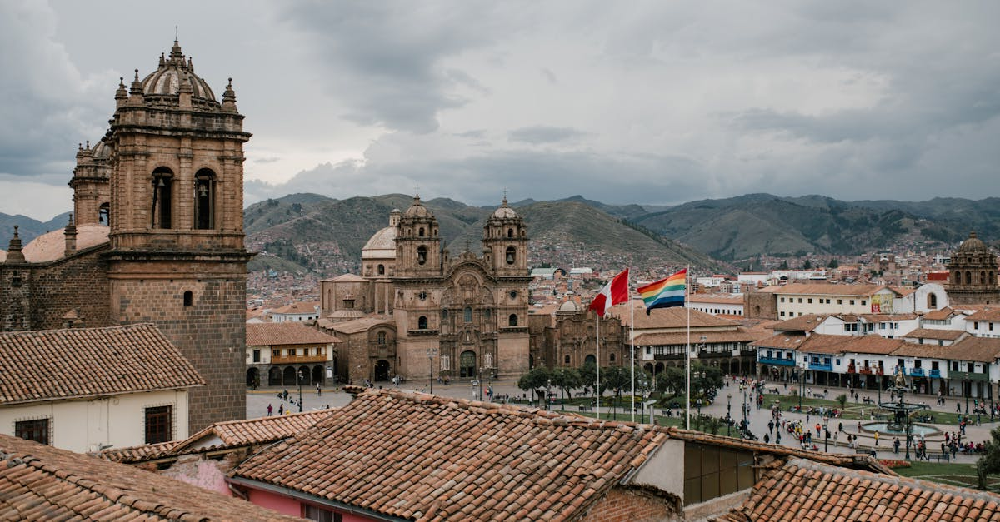

# Cusco, Peru

Country: Peru
Region: Americas

Cusco (*Qosqo* in Quechua) sits at 3,400 metres in the southern Peruvian Andes, the historic capital of the Inca Empire and the gateway to Machu Picchu and the Sacred Valley. A working Quechua-and-Spanish city of around 400,000, layered with Inca walls, Spanish colonial churches, and contemporary Andean life.

---

## 🧭 Step 1: Choices

### ✨ Why Visit

Cusco is the Inca capital made visible. Sacsayhuamán's polygonal walls above the city, the Korikancha's gold-stripped Inca temple now under a Dominican church, and the surviving Inca masonry under Spanish-built houses are unique on Earth. The Sacred Valley (Pisac, Ollantaytambo, Chinchero) and Machu Picchu are all reachable from here.

The city is also a living Quechua place. Quechua is widely spoken, the markets sell Andean produce that has no English name, and the cofradías (religious brotherhoods) organise some of the most beautiful Catholic-Andean syncretic festivals in the Americas.

You come for the Inca history, Machu Picchu, the Sacred Valley, the food (Peruvian cuisine has redefined itself in the last twenty years), and a chance to meet Andean culture on its own terms.

### 🌍 Ethical Compass

- **💰 Economy.** Eat at Mercado de San Pedro lunches, picanterías on the city edges, and family restaurants in San Blas rather than the Plaza de Armas tourist set. Buy textiles from cooperatives that pay weavers directly (the Centro de Textiles Tradicionales del Cusco is the gold standard) rather than mass-market replica shops.
- **👥 Employment.** Hire **MINCETUR-registered guides** for Machu Picchu and the Sacred Valley. Use registered taxis or trusted apps; in Cusco old town walking covers most days. Tip *huaqueros* (porters) on Inca Trail treks fairly; their pay is regulated but bonuses matter.
- **📚 Education.** Learn ten Quechua words before you arrive (*allinllan*, *sulpayki*, *huk* through *qanchis*). Read about the Inca Empire from non-conquistador sources; Gordon McEwan's *The Incas* is a sober start. Visit the Inka Museum and the Pre-Columbian Art Museum.
- **🌱 Ecology.** Altitude affects everything; pace your first two days, drink water and coca tea, skip alcohol. Machu Picchu's circuit and capacity rules are strict; respect them. Choose Inca Trail or Salkantay trek operators that follow porter welfare regulations and pack-out rules.

---

## 🎒 Step 2: Preparation

### 🔍 Governance Management Traceability

- Most travellers are **visa-exempt** for Peru; verify on the official Migraciones Peru portal.
- **Machu Picchu tickets** are capacity-controlled and sold on the official Peruvian Ministry of Culture portal (tuboleto.cultura.pe). Multiple **circuit options** exist; the rules have evolved repeatedly. Verify current circuits and capacity on the official portal before booking.
- The **Inca Trail** is permit-controlled with a strict daily quota; permits sell out months ahead. Book through a **licensed operator** registered with SERNANP; the official list is on the SERNANP portal.
- The **Boleto Turístico del Cusco (BTC)** bundles entry to Sacsayhuamán, Q'enqo, Pisac ruins, Ollantaytambo, and others; verify current price and validity on the official COSITUC portal.
- **Train tickets to Aguas Calientes** are run by PeruRail and Inca Rail; book on official portals weeks ahead in peak season.

### 📡 Information Curation Variety

- **El Comercio** and **La República** (Peruvian dailies, Spanish) for national news; **Andina** for English.
- The official **Ministry of Culture** portal for Machu Picchu rules, and **SERNANP** for Inca Trail and protected-areas rules.
- A Peruvian author: Mario Vargas Llosa for breadth; José María Arguedas for Andean depth; Daniel Alarcón for contemporary.
- A Quechua-led or Quechua-guided experience: weaving workshops in Chinchero, community tourism in the Lares Valley, or the Centro de Textiles Tradicionales.
- **Wikivoyage Cusco** and **Wikivoyage Machu Picchu** for orientation.

### 🎯 Inference Interaction Accountability

- **You decide your altitude pacing.** Two easy days in Cusco before serious hiking is the minimum. The Sacred Valley (2,800 m) is gentler than the city; start lower if possible.
- **You decide on Inca Trail vs Salkantay vs train.** The classic Inca Trail is permit-restricted, four days, deeply meaningful, and books out months ahead. Salkantay is alternative, also four to five days, no permit cap. The train-only option to Aguas Calientes is for those without trek time.
- **You decide on Machu Picchu circuit.** The site has multiple official circuits; the rules change. Plan two visits if you can (a half-day for the classic shot, another for a circuit you missed).
- **You decide your textile spending.** A cooperative-bought weaving costs more, lasts forever, and pays weavers directly. A mass-market replica is the opposite.
- **You decide on coca.** Coca leaves and tea are legal and helpful for altitude; coca products are not legal to bring home in most countries.

### 🔄 Intelligence Cooperation Integrity

The Andes have their own weather. Dry season (May to September) is the practical visitor window; wet season (December to March) closes the Inca Trail in February for restoration. Strikes (*paros*) occasionally close roads or rail lines on short notice.

Bring a soft plan. If altitude hits you hard, drop a day. If a strike closes a Sacred Valley road, your Cusco days still work. If your Machu Picchu day is wet, the site is open but circuits change; the cloud forest at Aguas Calientes is also worth a half-day.

### 📍 Top 5 Anchor Spots

1. **Machu Picchu.** Choose your circuit deliberately, book on the official portal, arrive at opening if your train allows.
2. **Sacred Valley loop (Pisac, Ollantaytambo, Chinchero).** Markets, ruins, and salt pans across one or two days. Stay an overnight in Ollantaytambo before the train to Machu Picchu.
3. **Sacsayhuamán and the ruins above Cusco (Q'enqo, Puca Pucara, Tambomachay).** Walk or take the local bus; allow a half day; covered by the BTC.
4. **Plaza de Armas and the Korikancha.** Walk the plaza in the evening, visit the cathedral and the Korikancha (Inca temple under Santo Domingo church). Add the Pre-Columbian Art Museum on the way.
5. **A Quechua weaving cooperative in Chinchero or with the Centro de Textiles Tradicionales del Cusco.** Half a day or a full day; you watch the dyeing and weaving process and buy fairly.

### 🧰 Practical Essentials

- **Recommended Length.** Five to seven days in the Cusco region (city, Sacred Valley, Machu Picchu). Add days for a trek (Inca Trail 4 days, Salkantay 4 to 5 days, Choquequirao 4 to 5 days) or to extend to Lake Titicaca or the Amazon.
- **Getting There and Around.** Fly into Cusco Alejandro Velasco Astete Airport (CUZ); altitude hits immediately on arrival. Within Cusco, walk and take Uber or Cabify; the old centre is small. The **PeruRail or Inca Rail** train runs from Ollantaytambo (and seasonally from Poroy/Cusco) to Aguas Calientes. Buses or *colectivos* serve the Sacred Valley.
- **Daily Cost (per person).**
  - **Budget:** roughly USD 35 to 70. Hostel, *menú del día* lunches, local transport, BTC sites, train-and-day to Machu Picchu using budget rail tier.
  - **Mid-range:** roughly USD 100 to 200. Three- or four-star hotel, mixed dining, MINCETUR-licensed guide for Machu Picchu, Sacred Valley day with driver-guide.
  - **Higher-comfort:** roughly USD 350 and up. Belmond Sanctuary Lodge at Machu Picchu, fine dining at Cicciolina or MAP Café, private trekking guides, helicopter or Hiram Bingham train.
- **Booking Notes.**
  - **Machu Picchu tickets:** book on the official Ministry of Culture portal; verify current circuit rules.
  - **Inca Trail:** permits sell out three to six months ahead in peak season; book through a SERNANP-registered operator.
  - **Train tickets:** book weeks ahead in dry season.
  - **Altitude:** sleep low (Sacred Valley) on arrival if possible; allow real adjustment days.
  - **Inti Raymi (June 24)** is the Inca festival and Cusco's biggest event; book months ahead.

---

## ✈️ Step 3: Delivery

### 🤖 AI Prompt

Copy this into your own AI assistant, fill in the brackets, and treat the answer as a researcher's draft, not a final plan.

> Please help me plan an ethical visit to Cusco and Machu Picchu, Peru for [NUMBER] days in [MONTH]. I am travelling with [WHO] and my interests are [INTERESTS, e.g. Inca history, hiking the Inca Trail, Quechua textiles, Andean food, photography]. My total budget is around [AMOUNT] and my comfort level is [budget / mid-range / higher-comfort].
>
> Please structure your answer in three steps.
>
> **Step 1: Choices.** Help me decide what to prioritise. Recommend the two or three Cusco-region experiences I should not miss given my interests, and one I should consider skipping (a Plaza de Armas tourist menu when San Blas or San Pedro is steps away, an unlicensed trek operator, the same Machu Picchu circuit twice). Briefly explain each trade-off.
>
> **Step 2: Preparation.** Cover all four of the following:
> - **Governance Management Traceability.** What assumptions should I check before I book? Include Migraciones Peru visa rules, the official Machu Picchu ticketing portal (tuboleto.cultura.pe) and current circuit rules, SERNANP-registered Inca Trail operators, the Boleto Turístico del Cusco, and PeruRail or Inca Rail bookings.
> - **Information Curation Variety.** Suggest at least four different source types: the Peruvian Ministry of Culture, SERNANP, a Peruvian author, and a Quechua-led weaving cooperative or community tourism operator.
> - **Inference Interaction Accountability.** List the decisions I personally need to make (altitude pacing, Inca Trail vs Salkantay vs train, Machu Picchu circuit choice, textile cooperative vs replica, coca use).
> - **Intelligence Cooperation Integrity.** Build me a soft plan with at least two alternates for likely disruptions (altitude sickness, a road strike (paro), a wet Machu Picchu day, sold-out Inca Trail permits).
>
> **Step 3: Delivery.** Give me the actual itinerary, day by day, with realistic timings, altitude considerations, and named places. Include at least one Sacred Valley overnight before Machu Picchu, and one Quechua-led textile or community experience. Mark each business as confidently locally owned, or flag it for me to verify.
>
> Finally, please remind me at the end to verify your suggestions against:
> 1. Official sources: the Peruvian Ministry of Culture Machu Picchu portal, SERNANP, PeruRail and Inca Rail, and Migraciones Peru.
> 2. Real people: a MINCETUR-licensed guide, a Quechua weaver, or hotel staff who live in Cusco now.
>
> Treat your output as a researcher's draft. I will make the final calls.

---

Part of **Gyro Governance Ethical Travel: AI-Empowered Guides for Human Adventures**.

Explore more destinations, ethical domains, and AI prompts at [travel.gyrogovernance.com](https://travel.gyrogovernance.com/).
