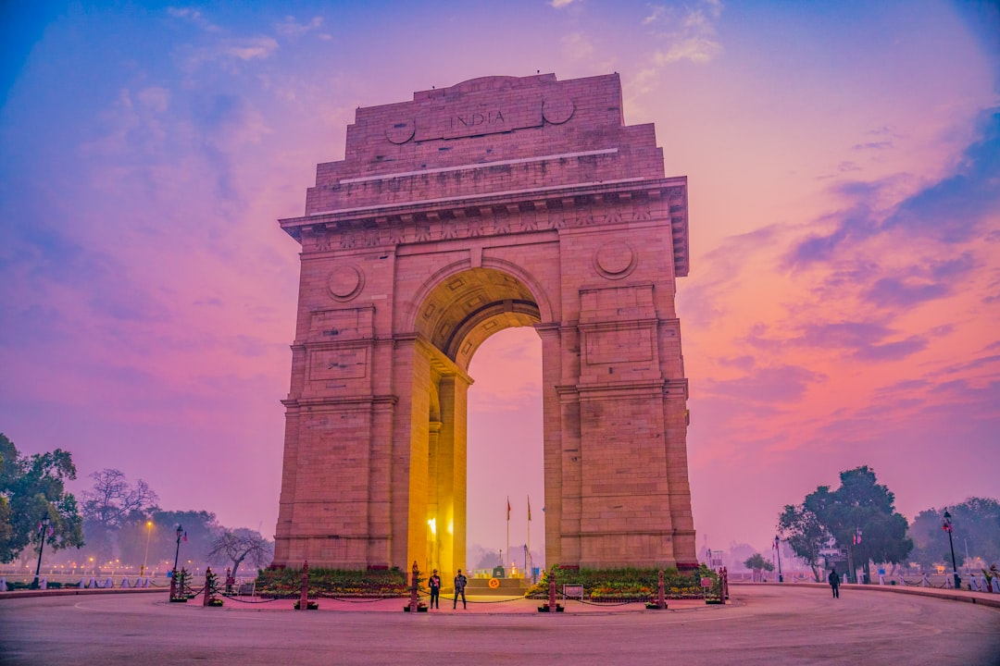

# Delhi, India

Country: India
Region: Asia

Delhi is India's national capital and one of the world's largest urban areas, home to more than thirty million people across Old Delhi, New Delhi, and a dozen satellite cities. Seven historic capitals have been built on this plain over a thousand years; you can walk past four of them in a single afternoon.

---

## 🧭 Step 1: Choices

### ✨ Why Visit

Delhi is the densest stack of South Asian history anywhere. The Red Fort, Jama Masjid, and the chaos of Chandni Chowk are Mughal Old Delhi. Humayun's Tomb and the Qutub Minar are earlier UNESCO sites further south. Lutyens' New Delhi (Rashtrapati Bhavan, India Gate) is the British imperial overlay. The contemporary city extends in every direction.

The city is also a serious working capital and the political heart of India. Visiting respectfully means engaging the present, not just the monuments: the food (one of the world's great cuisines), the bookshops, the political conversations, and the gap between the wealthy and the poor that runs through every street.

You come for the Mughal architecture, the food, the markets, and as a gateway to the wider Indian subcontinent.

### 🌍 Ethical Compass

- **💰 Economy.** Eat at street stalls and small restaurants in Chandni Chowk (paranthas at Paranthe Wali Gali, kebabs at Karim's), at South Delhi markets (Khan Market, Defence Colony), and at Bengali Market sweet shops. Buy from Dilli Haat (a curated handicraft market that pays artisans fairly) rather than tourist showrooms with kickbacks.
- **👥 Employment.** Hire MoT-registered guides at major monuments. Use Uber, Ola, or the official auto-rickshaw app (Uber Auto) where possible; insist on the meter for traditional autos. Tipping is small but appreciated; round up or 10 percent.
- **📚 Education.** Read about Partition (1947) before you visit; the Partition Museum at Dara Shukoh Library at Ambedkar University offers a serious account. Learn ten Hindi phrases (*namaste*, *dhanyavaad*, *kitne paise*, *nahin chahiye*). The Sikh, Mughal, Hindu, and modern secular layers all matter.
- **🌱 Ecology.** Delhi air pollution is severe, especially November to January (post-monsoon, stubble-burning season). Check AQI daily and consider an N95 mask. Refill water from sealed sources or trusted hotels; avoid tap.

---

## 🎒 Step 2: Preparation

### 🔍 Governance Management Traceability

- Most visitors need an **e-Visa** through the official Indian government e-Visa portal; verify your nationality's status before booking.
- **Delhi Metro** is the cleanest, fastest way around; use a Smart Card or contactless on most lines. Verify lines on the official DMRC portal.
- **Major monuments** (Red Fort, Humayun's Tomb, Qutub Minar) charge differential pricing for foreign visitors; book at official ticket counters or the ASI online portal.
- For **Old Delhi food tours**, choose operators with current Tripadvisor or India-based reputations; verify before booking.
- Avoid the **Connaught Place tourist scams** (claims that "the tourist office moved", "the metro is closed", or "I am also visiting from out of town"); the Government of India Tourist Office is in fixed locations only.

### 📡 Information Curation Variety

- **The Hindu** and **The Indian Express** for serious Indian journalism in English.
- The official **Delhi Tourism** portal for events, monument hours, and current advisories.
- An Indian author: Khushwant Singh (Delhi specifically), Rana Dasgupta's *Capital* (modern Delhi), William Dalrymple's *City of Djinns* (a Delhi-resident outsider).
- A locally led Delhi walking or food tour (Reality Tours, Delhi Magic, Old Delhi Food Walks) for a resident perspective.
- **Wikivoyage Delhi** for transport and district orientation.

### 🎯 Inference Interaction Accountability

- **You decide on your season.** October to March is dry-season weather but November to January is air-quality red. April to June is hot. July to September is monsoon. Each is a different city.
- **You decide on Old Delhi pace.** Chandni Chowk is overwhelming the first time; a cycle-rickshaw with a guide for the morning is the right entry, walking afterwards.
- **You decide on Connaught Place caution.** Don't follow strangers to offices, don't accept "free" advice, and ignore anyone insisting your hotel has burned down (it has not).
- **You decide on the Taj Mahal day trip.** Agra is reachable in a long day by Gatimaan or Shatabdi Express; many travellers wish they had given it an overnight.
- **You decide on dress.** Modest dress (shoulders, knees covered) reduces unwanted attention and matters at all temples, mosques, and gurdwaras.

### 🔄 Intelligence Cooperation Integrity

Delhi weather and politics both shift the city. Monsoon (July to September) floods low areas; air-quality red days close schools. Major Hindu, Muslim, and Sikh festivals reroute traffic. Political events occasionally close central Delhi.

Bring a soft plan. If air quality is red, indoor museums, malls, and the metro absorb a day; outdoors becomes unsafe for strenuous exertion. If a monsoon downpour floods Old Delhi, the South Delhi monuments are unaffected. If a procession closes Rajpath, the metro routes around it.

### 📍 Top 5 Anchor Spots

1. **Red Fort and Jama Masjid (Old Delhi).** Walk through Chandni Chowk between them. Best with a local guide on a morning food-and-history tour.
2. **Humayun's Tomb.** UNESCO-listed Mughal masterpiece, prototype for the Taj Mahal. Plan ninety minutes.
3. **Qutub Minar and Mehrauli Archaeological Park.** The 73-metre minaret in South Delhi, with a sprawling park of earlier monuments beyond. A genuine surprise.
4. **Lodi Gardens and the surrounding museums.** A green park threaded with fifteenth-century tombs. Combine with the National Museum (when open and not undergoing renovation; verify current status).
5. **A Sikh gurdwara visit at Bangla Sahib.** The langar (free community kitchen) and the marble pool are extraordinary. Cover your head; remove shoes; everyone is welcome.

### 🧰 Practical Essentials

- **Recommended Length.** Three to five days for Delhi. Add two for Agra and the Taj Mahal as an overnight (Agra-Fatehpur Sikri possible) or three for the wider Golden Triangle (Delhi-Agra-Jaipur).
- **Transport.** **Delhi Metro** is excellent; smart card or contactless on most lines. Uber, Ola, and Uber Auto for ride-hail. Cycle-rickshaws for Old Delhi short trips. The **Airport Express line** connects IGI Airport to New Delhi station in 22 minutes.
- **Daily Cost (per person).**
  - **Budget:** roughly INR 1,500 to 3,000 (about USD 18 to 36). Guesthouse or budget hotel, street food and dhabas, metro, three major monuments.
  - **Mid-range:** roughly INR 5,000 to 12,000 (about USD 60 to 145). Three- or four-star hotel, mixed dining, all the major sites, a guided Old Delhi tour, a half-day driver.
  - **Higher-comfort:** roughly INR 20,000 and up. Five-star (Imperial, Taj Mahal Hotel, Leela Palace), fine dining at Indian Accent or Bukhara, private guides for the duration, business-class train to Agra.
- **Booking Notes.**
  - **e-Visa:** apply on the official Indian government portal; verify your nationality.
  - **Monument tickets:** book through the ASI online portal or at official counters; foreign-visitor pricing is differential.
  - **Train tickets:** book on the official IRCTC portal (foreign visitors can register); Tatkal-day or Foreign Tourist Quota are the practical options.
  - **Major festivals** (Diwali, Holi, Eid, Republic Day) reshape the city; book accommodation months ahead.
  - **Air quality:** verify daily; consider an N95 mask in November to January.

---

## ✈️ Step 3: Delivery

### 🤖 AI Prompt

Copy this into your own AI assistant, fill in the brackets, and treat the answer as a researcher's draft, not a final plan.

> Please help me plan an ethical visit to Delhi, India for [NUMBER] days in [MONTH]. I am travelling with [WHO] and my interests are [INTERESTS, e.g. Mughal architecture, street food, modern history, markets, day-trip to the Taj]. My total budget is around [AMOUNT] and my comfort level is [budget / mid-range / higher-comfort].
>
> Please structure your answer in three steps.
>
> **Step 1: Choices.** Help me decide what to prioritise. Recommend the two or three Delhi experiences I should not miss given my interests, and one I should consider skipping (a Connaught Place "office" scam, an unlicensed Old Delhi guide, an Agra day-trip when an overnight would serve me better). Briefly explain each trade-off.
>
> **Step 2: Preparation.** Cover all four of the following:
> - **Governance Management Traceability.** What assumptions should I check before I book? Include the Indian e-Visa portal, ASI ticketing for monuments, IRCTC train booking for any onward travel, Delhi Metro DMRC routes, and air-quality forecasts.
> - **Information Curation Variety.** Suggest at least four different source types: one official Indian source, one serious Indian English newspaper, one Indian author, and one Delhi resident-led walking or food tour.
> - **Inference Interaction Accountability.** List the decisions I personally need to make (season choice, Old Delhi pace, Connaught Place caution, Taj day vs overnight, dress code).
> - **Intelligence Cooperation Integrity.** Build me a soft plan with at least two alternates for likely disruptions (air-quality red day, a monsoon flood, a major festival rerouting traffic, a political demonstration).
>
> **Step 3: Delivery.** Give me the actual itinerary, day by day, with realistic timings, Metro lines, and named neighbourhoods. Include at least one Old Delhi morning, one Sikh gurdwara visit, and one South Delhi monument afternoon. Mark each business as confidently locally owned, or flag it for me to verify.
>
> Finally, please remind me at the end to verify your suggestions against:
> 1. Official sources: Delhi Tourism, DMRC for the Metro, ASI for monuments, IRCTC for trains, and the Indian e-Visa portal.
> 2. Real people: a local resident, a licensed Delhi guide, or hotel staff who live in Delhi now.
>
> Treat your output as a researcher's draft. I will make the final calls.

---

Part of **Gyro Governance Ethical Travel: AI-Empowered Guides for Human Adventures**.

Explore more destinations, ethical domains, and AI prompts at [travel.gyrogovernance.com](https://travel.gyrogovernance.com/).
