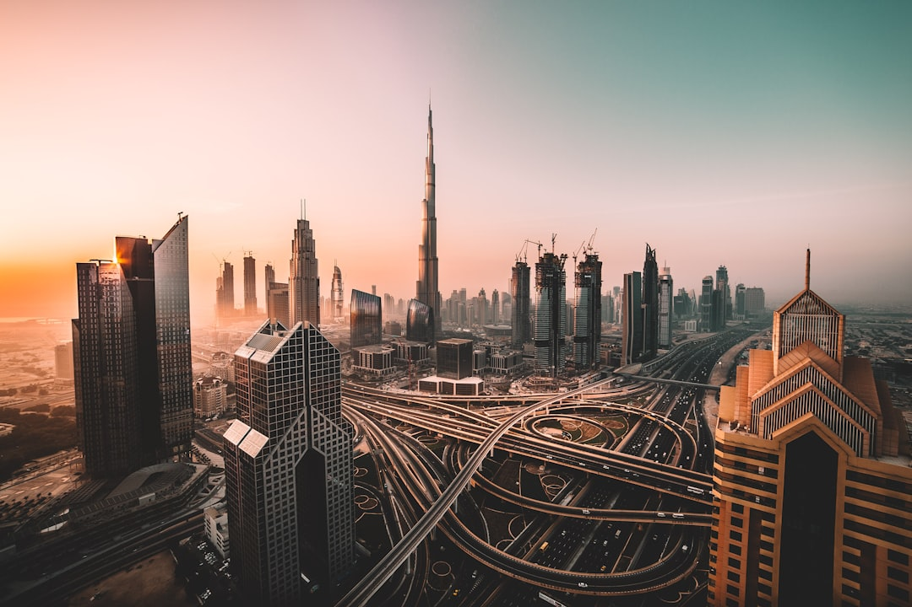

# Dubai, United Arab Emirates

Country: United Arab Emirates
Region: Asia

Dubai is the largest city in the UAE and one of the world's most visited destinations, a global trade and transit hub built from a fishing and pearling town into a skyline of superlatives in roughly two generations. The Burj Khalifa, the Palm Jumeirah, the largest mall on Earth, and an underlying Bedouin and South Asian working population that the postcards rarely show.

---

## 🧭 Step 1: Choices

### ✨ Why Visit

Dubai is a working seminar in twenty-first-century city-building. The Burj Khalifa is the tallest building in the world; the Dubai Mall is among the largest; the metro is fully automated; the airport is a top-three global transit hub. Whatever its critics say about it, the city delivers on its promises with remarkable consistency.

It is also a Gulf city with older layers. Al Fahidi (Bastakiya) preserves the wind-tower architecture of pre-oil Dubai. The Dubai Creek still runs *abras* (water taxis) across to the working spice and gold souks of Deira. The desert begins thirty minutes from Downtown.

You come for the architecture, the global food, the desert, the malls (if that is your thing), and a sober look at the labour and logistics that make a city like this run.

### 🌍 Ethical Compass

- **💰 Economy.** Most spending in Dubai flows to international chains. Eat at Iranian, Pakistani, Filipino, Egyptian, and South Indian canteens in Karama, Satwa, Bur Dubai, and Deira; this is where most Dubai residents actually eat. Buy spices and saffron in the Deira spice souk, gold in the Gold Souk; haggle.
- **👥 Employment.** Dubai's hospitality, construction, and driving workforce is overwhelmingly South Asian, Filipino, and East African on labour contracts. Tip taxi drivers, hotel staff, porters, and delivery workers in cash and generously; their basic pay is low. Address people by name when you can.
- **📚 Education.** Read about the kafala (labour sponsorship) system and the human-rights conversation around Gulf construction; Human Rights Watch and Migrant-Rights.org are honest sources. Visit Al Fahidi and the Etihad Museum for the Emirati story alongside the global one.
- **🌱 Ecology.** Summer cooling drives extreme energy use; visit October through April. Choose desert operators that follow conservation protocols at Dubai Desert Conservation Reserve; avoid dune-bashing and quad-bike tours that damage the desert ecosystem.

---

## 🎒 Step 2: Preparation

### 🔍 Governance Management

- Verify your **visa-exempt, visa-on-arrival, or e-visa** status on the official UAE Federal Authority for Identity and Citizenship portal.
- **Burj Khalifa** and **At the Top** require timed tickets on the official portal; sunset slots are the prize and sell out days ahead.
- The **Dubai Metro** (Red and Green Lines, plus the Route 2020 extension) covers the major spine; **NOL card** or contactless payment for tap-in.
- For **desert experiences**, choose operators within the **Dubai Desert Conservation Reserve** (DDCR) or other licensed protected areas; verify on the official DDCR portal.
- **Alcohol** is legal in licensed venues and at home (with a permit for some categories); verify current rules on UAE government portals. Public drinking carries real legal consequences.

### 📡 Information Curation

- **The National** and **Khaleej Times** (English-language UAE newspapers) for current news and local rules.
- **Visit Dubai** (the official tourism site) for events, openings, and Ramadan timings.
- A book or report from a migrant-worker focused outlet: Migrant-Rights.org, or Human Rights Watch reporting on the Gulf.
- A Dubai-based long-form journalist (Sultan Al Qassemi for cultural context; the local English-language press for daily life).
- **Wikivoyage Dubai** for district orientation and practical tips.

### 🎯 Inference Interaction

- **You decide your season.** Visit May through September and you accept indoor-only days; visit October through April and the city is fully usable.
- **You decide on Ramadan.** During the fast, restaurants outside hotels are closed during daylight, and behaviour rules are tighter. Evenings (iftar) are spectacular.
- **You decide where your dirhams go.** Five-star hotel, local guesthouse, mall food court, Karama canteen, branded desert tour, conservation-reserve safari are all real choices with different impacts.
- **You decide your engagement with the harder questions.** Labour conditions, freedom of expression, regional politics, and migrant rights are real subjects. The Atlas does not pretend they are not.
- **You decide on the desert experience.** A conservation-reserve safari is fundamentally different from a budget dune-bashing tour with quad bikes.

### 🔄 Intelligence Cooperation

Dubai runs on tight infrastructure that mostly hides its complexity. Friday afternoons reshape the city around prayer; public holidays close some venues; major sporting and cultural events (the Dubai World Cup, Art Dubai, the Dubai International Film Festival) draw crowds.

Bring a soft plan. If a sandstorm cancels desert plans, the malls, the museum at Al Shindagha, and the Dubai Frame absorb a day. If a Ramadan day reshapes your eating windows, hotel restaurants and food courts remain open with screens up. The city handles disruption smoothly.

### 📍 Top 5 Anchor Spots

1. **Burj Khalifa and Downtown Dubai.** At the Top observation deck, the Dubai Fountain show below, the Dubai Mall. Book the sunset slot if you can.
2. **Al Fahidi Historic District and Dubai Museum at Al Shindagha.** The original Bastakiya wind-tower neighbourhood; cross the Creek by abra to Deira's souks afterwards.
3. **Deira Gold Souk and Spice Souk.** A *abra* ride for 1 dirham, then walk the markets. Haggle respectfully.
4. **A desert evening in a conservation reserve.** Dinner under the stars, falconry, camels at sunset. Choose a DDCR operator.
5. **Jumeirah Mosque visit.** One of the few mosques in the UAE open to non-Muslim visitors on a guided tour through the Sheikh Mohammed Centre for Cultural Understanding.

### 🧰 Practical Essentials

- **Recommended Length.** Three to four days for the city. Add a day for a desert overnight; another for Abu Dhabi as a day trip; longer to combine with Sharjah and Ras Al Khaimah.
- **Transport.** **Dubai Metro** is automated, clean, and easy; NOL card or contactless. Taxis (cream with coloured roofs) are metered. Careem and Uber operate. The Dubai Tram serves the Marina. Dubai International Airport (DXB) is connected to the Red Line.
- **Daily Cost (per person).**
  - **Budget:** roughly AED 300 to 500. Hostel or budget hotel, food court and canteen meals, metro and taxi, free or low-cost sites.
  - **Mid-range:** roughly AED 700 to 1,500. Four-star hotel, mixed dining, Burj Khalifa, a desert evening, a day at the beach.
  - **Higher-comfort:** roughly AED 2,500 and up. Five-star Palm or Downtown hotel, fine dining (Pierchic, Gaia), private guided tours, helicopter Burj flights, full-day yacht charter.
- **Booking Notes.**
  - **Visa:** verify on the official UAE Federal Authority for Identity and Citizenship portal.
  - **Burj Khalifa:** book the sunset slot days ahead.
  - **Friday prayers** reshape the morning; many businesses open later.
  - **Ramadan:** plan around the daytime fast; evenings (iftar) are exceptional.
  - **Dress code:** modest in public (shoulders and knees covered in malls and public buildings is expected); beach and resort attire is fine in those zones.

---

## ✈️ Step 3: Delivery

### 🤖 AI Prompt

Copy this into your own AI assistant, fill in the brackets, and treat the answer as a researcher's draft, not a final plan.

> Please help me plan an ethical visit to Dubai, United Arab Emirates for [NUMBER] days in [MONTH]. I am travelling with [WHO] and my interests are [INTERESTS, e.g. architecture, food, desert, souks, beaches]. My total budget is around [AMOUNT] and my comfort level is [budget / mid-range / higher-comfort].
>
> Please structure your answer in three steps.
>
> **Step 1: Choices.** Help me decide what to prioritise. Recommend the two or three Dubai experiences I should not miss given my interests, and one I should consider skipping (a dune-bashing tour with no conservation oversight, an over-priced influencer-targeted restaurant, a midday Burj Khalifa slot when sunset is the prize). Briefly explain each trade-off.
>
> **Step 2: Preparation.** Cover all four of the following:
> - **Governance Management.** What assumptions should I check before I book? Include the UAE visa portal, official Burj Khalifa ticketing, NOL card or contactless metro, DDCR-licensed desert operators, and current alcohol and dress rules on UAE government portals.
> - **Information Curation.** Suggest at least four different source types: one official UAE source, one local English-language newspaper, one Emirati or long-resident author, and one migrant-worker or human-rights focused source.
> - **Inference Interaction.** List the decisions I personally need to make (season, Ramadan engagement, where my dirhams go, harder-question engagement, desert operator type).
> - **Intelligence Cooperation.** How should I trust my own judgment and local advice over algorithmic defaults when conditions change? Build me a soft plan with at least two alternates for likely disruptions (sandstorm, extreme heat, Friday prayer reshaping, a public-holiday closure).
>
> **Step 3: Delivery.** Give me the actual itinerary, day by day, with realistic timings and named places. Include at least one Old Dubai (Bastakiya and Deira) day and one conservation-reserve desert experience. Mark each business as confidently locally owned, or flag it for me to verify.
>
> Finally, please remind me at the end to verify your suggestions against:
> 1. Official sources: Visit Dubai, the Burj Khalifa portal, the RTA for metro and transport, and the UAE government portal for current rules.
> 2. Real people: a local resident, a licensed Dubai guide, or hotel staff who live in Dubai now.
>
> Treat your output as a researcher's draft. I will make the final calls.

---

Part of **Gyro Governance Ethical Travel: AI-Empowered Guides for Humane Adventures**.

Explore more destinations, ethical domains, and AI prompts at [travel.gyrogovernance.com](https://travel.gyrogovernance.com/).
