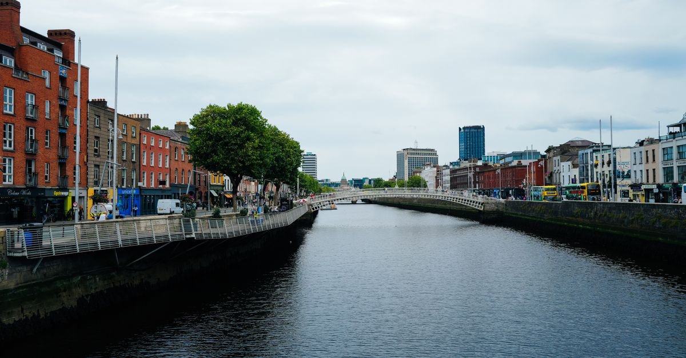

# Dublin, Ireland

Country: Ireland
Region: Europe

Dublin (*Baile Átha Cliath*) is the capital of the Republic of Ireland, a small Georgian-and-Viking city of around 1.4 million in the wider area, walkable end to end in an afternoon. It produced more literature per square mile than almost any city on Earth, and the music keeps coming.

---

## 🧭 Step 1: Choices

### ✨ Why Visit

Dublin is a literary and musical city that punches far above its size. Trinity College's Book of Kells, the Chester Beatty Library, the EPIC Irish Emigration Museum, and the homes (now houses) of Joyce, Yeats, Beckett, Heaney, and Sally Rooney are walking distance from each other. The pub culture is real working culture; the music in Cobblestone or O'Donoghue's is not a tourist show.

The city is also living through serious housing pressure and rapid change. The traditional pubs are under economic stress; the Liberties and the docklands have transformed; the conversation about who can still afford to live in Dublin is loud.

You come for the literature, the music, the Guinness, the conversation, and a city that takes its writers and singers seriously.

### 🌍 Ethical Compass

- **💰 Economy.** Eat at pubs that still serve real food (The Stag's Head, The Brazen Head, Mulligan's of Stoneybatter) and at neighbourhood places in Stoneybatter, Phibsborough, Portobello, and Rathmines. Buy at the Saturday Temple Bar Food Market for producers, not the Temple Bar pubs for inflated pints.
- **👥 Employment.** Tipping at pubs is not customary (round up or leave change); at sit-down restaurants 10 to 12.5 percent if service is not added. Music sessions: buy the musicians a pint or tip the hat.
- **📚 Education.** Read at least one Irish author before your visit. Joyce's *Dubliners* is the obvious entry. For the modern Dublin, Sally Rooney, Donal Ryan, or Roddy Doyle. Engage with the Famine, the 1916 Rising, and the Troubles seriously; the National Museum and Kilmainham Gaol cover them well.
- **🌱 Ecology.** Walk; central Dublin is small. Take Dublin Bus, Luas (tram), and DART (commuter rail). The new Leap Visitor Card simplifies fares. Refill water; Irish tap is excellent.

---

## 🎒 Step 2: Preparation

### 🔍 Governance Management

- Most visitors are **visa-exempt** for Ireland; verify on the official Department of Justice portal. Ireland is not in Schengen.
- **Book of Kells and the Long Room at Trinity College** require timed tickets on the official Trinity portal; book days ahead.
- **Kilmainham Gaol** requires advance booking on the official OPW (Office of Public Works) portal; tours sell out.
- **Guinness Storehouse** sells timed tickets on its official portal.
- For **Cliffs of Moher or Wicklow day trips**, verify operator legitimacy; multiple reliable companies operate.

### 📡 Information Curation

- **The Irish Times** and **RTÉ News** for serious Irish journalism.
- The official **Visit Dublin** portal for events and openings.
- An Irish author: Joyce, Yeats, Beckett (the classics); Sally Rooney, Anna Burns, Kevin Barry, Donal Ryan (the contemporaries).
- A locally led Dublin literary or pub-music walking tour with an Irish guide.
- **Wikivoyage Dublin** for orientation.

### 🎯 Inference Interaction

- **You decide on Temple Bar.** Temple Bar is famous, central, and largely a tourist zone with inflated drink prices. The actual Dublin pubs are everywhere else.
- **You decide on the Book of Kells.** The exhibition has been redesigned recently; verify current format on the official Trinity portal before queuing.
- **You decide on Kilmainham Gaol.** A genuinely serious place; book ahead and arrive prepared.
- **You decide on music.** A trad session at Cobblestone (Smithfield) or O'Donoghue's (Merrion Row) is real working Irish music; a "trad show" in Temple Bar is something else.
- **You decide on day-trips.** Howth, Bray, Glendalough, or the Cliffs of Moher are all reachable; commit to one and do it properly.

### 🔄 Intelligence Cooperation

Dublin weather is changeable; "four seasons in an hour" applies. Pubs fill on weekends and during rugby internationals or major Irish sporting events. Bank Holiday weekends shift transport.

Bring a soft plan. If rain shuts down your park-walk plan, the National Museum and the Chester Beatty are free and brilliant. If a sold-out match clogs the pubs, head to Stoneybatter or Phibsborough. If Glendalough is socked in fog, Howth's cliff walk is closer and often clearer.

### 📍 Top 5 Anchor Spots

1. **Trinity College and the Book of Kells.** Walk the cobbled quads; visit the Book of Kells exhibition (verify current format) and the Long Room.
2. **Kilmainham Gaol.** The history of Irish political imprisonment, the 1916 leaders' last cells. Book ahead.
3. **National Museum of Ireland (Archaeology, Kildare Street).** Free; the bog bodies and Iron Age gold are extraordinary.
4. **A trad music session at Cobblestone (Smithfield) or O'Donoghue's (Merrion Row).** Mid-week evenings are best; the music is the point, not background.
5. **Howth cliff walk (DART to Howth).** A coastal walk from a real fishing village; lunch at the harbour after.

### 🧰 Practical Essentials

- **Recommended Length.** Two to three days for the city. Add a day for Glendalough or the Cliffs of Moher (long day) or a Howth half-day.
- **Transport.** Walk the city centre. Dublin Bus, Luas (tram), and DART (commuter rail) for the rest; tap a **Leap Visitor Card** or contactless. Dublin Airport (DUB) is connected by Aircoach or Dublin Bus to the centre in 25 to 40 minutes.
- **Daily Cost (per person).**
  - **Budget:** roughly EUR 90 to 150. Hostel, pub-lunch and food-market meals, public transport, free museums (most national museums are free).
  - **Mid-range:** roughly EUR 180 to 320. Three-star hotel or guesthouse, pub dinners and one nicer meal, the ticketed sites (Book of Kells, Kilmainham, Guinness), a music session.
  - **Higher-comfort:** roughly EUR 400 and up. Boutique Georgian hotel (The Shelbourne, The Merrion), fine dining at Chapter One or Chapter Six, private guides, day-tour by chartered car to Wicklow.
- **Booking Notes.**
  - **Book of Kells and Kilmainham:** book days ahead on the official portals.
  - **Guinness Storehouse:** book ahead in summer.
  - **St Patrick's Day (March 17)** turns the city into a multi-day parade; book accommodation months ahead.
  - **Rugby internationals (Six Nations, autumn series)** fill the city.
  - **Bloomsday (June 16)** is the Joyce festival; literary visitors should know.

---

## ✈️ Step 3: Delivery

### 🤖 AI Prompt

Copy this into your own AI assistant, fill in the brackets, and treat the answer as a researcher's draft, not a final plan.

> Please help me plan an ethical visit to Dublin, Ireland for [NUMBER] days in [MONTH]. I am travelling with [WHO] and my interests are [INTERESTS, e.g. literature, music, Irish history, pub culture, coastal walks]. My total budget is around [AMOUNT] and my comfort level is [budget / mid-range / higher-comfort].
>
> Please structure your answer in three steps.
>
> **Step 1: Choices.** Help me decide what to prioritise. Recommend the two or three Dublin experiences I should not miss given my interests, and one I should consider skipping (Temple Bar inflated pints, a packaged "trad show" when a real session is steps away, a Cliffs of Moher day that becomes a 14-hour bus). Briefly explain each trade-off.
>
> **Step 2: Preparation.** Cover all four of the following:
> - **Governance Management.** What assumptions should I check before I book? Include the Irish visa-exempt status on the Department of Justice portal, official Trinity College and Kilmainham Gaol ticketing, the Leap Visitor Card, and major event dates (St Patrick's, Bloomsday, rugby internationals).
> - **Information Curation.** Suggest at least four different source types: one official Irish source, one Irish news outlet, one Irish author, and one locally led Dublin literary or music walking guide.
> - **Inference Interaction.** List the decisions I personally need to make (Temple Bar trade-off, Book of Kells format, music venue choice, day-trip choice).
> - **Intelligence Cooperation.** How should I trust my own judgment and local advice over algorithmic defaults when conditions change? Build me a soft plan with at least two alternates for likely disruptions (rain, sold-out major attractions, a rugby weekend clogging pubs, transport strikes).
>
> **Step 3: Delivery.** Give me the actual itinerary, day by day, with realistic timings and named neighbourhoods. Include at least one trad music session and one serious museum or memorial. Mark each business as confidently locally owned, or flag it for me to verify.
>
> Finally, please remind me at the end to verify your suggestions against:
> 1. Official sources: Visit Dublin, Trinity College, OPW Kilmainham, and Transport for Ireland (Leap card).
> 2. Real people: a local resident, a Dublin literary guide, or hotel staff who live in Dublin now.
>
> Treat your output as a researcher's draft. I will make the final calls.

---

Part of **Gyro Governance Ethical Travel: AI-Empowered Guides for Humane Adventures**.

Explore more destinations, ethical domains, and AI prompts at [travel.gyrogovernance.com](https://travel.gyrogovernance.com/).
