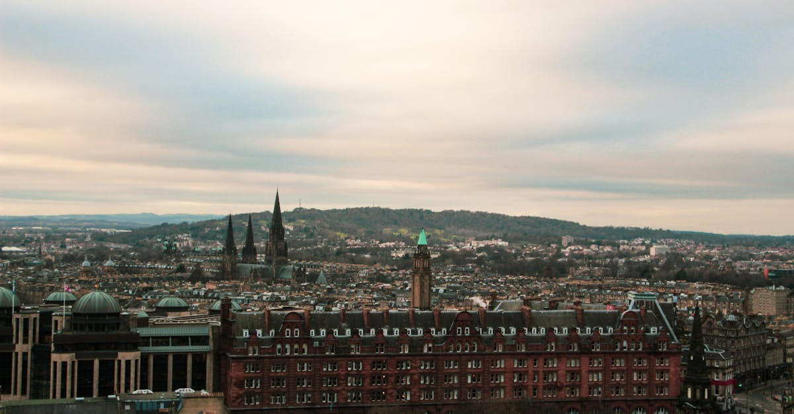

# Edinburgh, Scotland

Country: United Kingdom
Region: Europe

Edinburgh is the Scottish capital, a UNESCO-listed double city of medieval Old Town and Georgian New Town strung along volcanic ridges and an extinct volcano (Arthur's Seat). Home to the world's largest arts festival each August, the Scottish Parliament, and one of Europe's most photogenic skylines.

---

## 🧭 Step 1: Choices

### ✨ Why Visit

Edinburgh fits a serious capital city's depth into a walkable centre. The Castle on the rock, the Royal Mile down to the Palace of Holyroodhouse, the Georgian symmetry of New Town across the railway gardens, and Arthur's Seat rising out of the city are all within an hour's walk.

The city is also one of the world's great festival cities. August brings the Edinburgh International Festival, the Fringe (the largest arts festival on Earth), the Book Festival, the Tattoo, and the Art Festival, all simultaneously. The rest of the year it returns to a thoughtful capital, undertourist much of the time.

You come for the Old Town, the festivals (if your dates allow), the museums, and one of Europe's most genuinely walkable historic cities.

### 🌍 Ethical Compass

- **💰 Economy.** Eat at neighbourhood places in Stockbridge, Marchmont, Bruntsfield, Leith rather than the Royal Mile tourist set. The Edinburgh Farmers' Market on Castle Terrace (Saturdays) sells real Scottish produce. Pub food at Sandy Bell's or the Sheep Heid Inn keeps money local.
- **👥 Employment.** Tipping in pubs is uncommon; at restaurants 10 to 12.5 percent unless service is added. During the Fringe, performers are largely unpaid; buying tickets to small shows directly funds artists, not aggregators.
- **📚 Education.** Read about the Scottish Enlightenment (Hume, Smith, Burns, Scott) and the modern Scottish independence debate. Visit the Scottish Parliament (free, with a tour) and the National Museum of Scotland. The Real Mary King's Close offers a serious working-class history under the Royal Mile.
- **🌱 Ecology.** Walk and take Lothian Buses (one of the best urban bus systems in the UK). Climb Arthur's Seat by the path; the volcanic geology is fragile. Edinburgh's parks (the Meadows, Holyrood, Inverleith) are real city assets; use them.

---

## 🎒 Step 2: Preparation

### 🔍 Governance Management

- Most visitors need an **ETA (UK Electronic Travel Authorization)** or a visa; verify your nationality's current status on the official UK government portal.
- **Edinburgh Castle** requires timed tickets on the official Historic Environment Scotland (HES) portal; sells out days ahead in summer.
- The **Royal Edinburgh Military Tattoo** (August) sells tickets on the official Tattoo portal months in advance.
- The **Edinburgh Festival Fringe** has thousands of shows on its own ticketing platform (edfringe.com); the official Edinburgh International Festival has its own.
- **Lothian Buses** accept contactless tap-and-cap; a daily cap applies. Verify on the official Lothian Buses portal.

### 📡 Information Curation

- **The Scotsman** and **The Herald** for Scottish journalism.
- The official **Visit Scotland** and **Forever Edinburgh** portals for events and openings.
- A Scottish author: Robert Louis Stevenson, Muriel Spark, Irvine Welsh (for Leith specifically), Jenni Fagan.
- A locally led literary walking tour (the Edinburgh Literary Pub Tour is famous) or a guided Real Mary King's Close.
- **Wikivoyage Edinburgh** for orientation.

### 🎯 Inference Interaction

- **You decide on August.** The festivals are extraordinary; they also fill the city to bursting and triple accommodation prices. Either commit (book months ahead) or pick another month deliberately.
- **You decide on the Castle.** Worth it, but timed entry only, and crowded; the morning of opening is the calm option.
- **You decide on Arthur's Seat.** The walk from Holyrood Park is achievable for most fitness levels; on a clear day it gives one of Britain's great urban panoramas.
- **You decide on whisky.** A serious distillery tour (visit a proper distillery on a day trip, not the Royal Mile experience) is more meaningful than a generic tasting.
- **You decide on Leith.** Once the working port, now a serious food and music neighbourhood. Worth a full evening.

### 🔄 Intelligence Cooperation

Edinburgh weather is dramatic; "four seasons in twenty minutes" actually applies. August Fringe weather can be anything. Winter days are short. The Royal Mile becomes hazardous in ice.

Bring a soft plan. If a sudden squall rolls in on Arthur's Seat, the National Museum (free, vast) is twenty minutes away. If a sold-out Fringe show drops the night before, the half-price ticket hut at the Mound has same-day options. If the Castle is rained out, Holyrood Palace and Holyrood Park share the rain better.

### 📍 Top 5 Anchor Spots

1. **Edinburgh Castle.** Timed entry on the HES portal. Book the morning of opening if possible.
2. **The Royal Mile and the Real Mary King's Close.** Walk from the Castle down to Holyrood, with a Mary King's Close visit en route.
3. **Arthur's Seat and Holyrood Park.** A 45-minute walk up; one of the great panoramic views of any British city.
4. **National Museum of Scotland.** Free; covers Scottish history, design, world cultures. Plan three hours.
5. **A Stockbridge or Leith afternoon.** Stockbridge for the Sunday market and Botanic Garden; Leith for the docks, the Royal Yacht Britannia, and excellent food.

### 🧰 Practical Essentials

- **Recommended Length.** Two to three days for the city outside festival season; four to seven days for the Fringe. Add a day for the Highlands (a long day) or a Borders abbeys day trip.
- **Transport.** Walk in the central Old and New Towns. **Lothian Buses** are excellent; tap contactless with a daily cap. Edinburgh Waverley station connects you to the rest of the UK and to a tram to the airport. Walking is generally faster than driving in the centre.
- **Daily Cost (per person).**
  - **Budget:** roughly GBP 70 to 130. Hostel, pub-lunch and food-market meals, Lothian Buses, free museums (most national museums are free).
  - **Mid-range:** roughly GBP 160 to 280. Three-star hotel or guesthouse, pub and bistro dinners, the Castle and a Mary King's Close, two Fringe shows in season.
  - **Higher-comfort:** roughly GBP 380 and up. Boutique New Town hotel (the Witchery, the Balmoral), fine dining at the Kitchin or Restaurant Martin Wishart, private guides, a Highland day-tour by chartered car.
- **Booking Notes.**
  - **ETA:** verify your nationality on the UK government portal.
  - **Castle, Mary King's Close, Tattoo:** book ahead, especially in summer and August.
  - **Hogmanay (December 30 to January 1)** is the city's New Year festival; book accommodation months ahead.
  - **August festivals:** book accommodation months ahead; expect tripled prices.
  - **Sunday opening:** central shops mostly open; some Old Town venues have shorter hours.

---

## ✈️ Step 3: Delivery

### 🤖 AI Prompt

Copy this into your own AI assistant, fill in the brackets, and treat the answer as a researcher's draft, not a final plan.

> Please help me plan an ethical visit to Edinburgh, Scotland for [NUMBER] days in [MONTH]. I am travelling with [WHO] and my interests are [INTERESTS, e.g. history, literature, festivals, hillwalking, whisky]. My total budget is around [AMOUNT] and my comfort level is [budget / mid-range / higher-comfort].
>
> Please structure your answer in three steps.
>
> **Step 1: Choices.** Help me decide what to prioritise. Recommend the two or three Edinburgh experiences I should not miss given my interests, and one I should consider skipping (a Royal Mile shop "tartan and shortbread" trap, an over-priced Castle midday, an Arthur's Seat climb in driving sleet). Briefly explain each trade-off.
>
> **Step 2: Preparation.** Cover all four of the following:
> - **Governance Management.** What assumptions should I check before I book? Include the UK ETA on the official portal, Edinburgh Castle timed entry on HES, the Tattoo and Fringe ticketing, and Lothian Buses contactless cap.
> - **Information Curation.** Suggest at least four different source types: one official Scottish source, one Scottish news outlet, one Scottish author, and one locally led literary or history walking tour.
> - **Inference Interaction.** List the decisions I personally need to make (whether to come in August, Castle timing, Arthur's Seat ambition, whisky depth, Leith vs Stockbridge time).
> - **Intelligence Cooperation.** How should I trust my own judgment and local advice over algorithmic defaults when conditions change? Build me a soft plan with at least two alternates for likely disruptions (sudden weather, sold-out Fringe show, a Castle closure for state events, a winter slip-day on cobbles).
>
> **Step 3: Delivery.** Give me the actual itinerary, day by day, with realistic timings and named neighbourhoods. Include at least one Arthur's Seat or hilltop walk (weather allowing), one museum, and one evening in Stockbridge or Leith. Mark each business as confidently locally owned, or flag it for me to verify.
>
> Finally, please remind me at the end to verify your suggestions against:
> 1. Official sources: Forever Edinburgh, Historic Environment Scotland, Edinburgh Festival Fringe, the Royal Edinburgh Military Tattoo, and Lothian Buses.
> 2. Real people: a local resident, an Edinburgh guide, or hotel staff who live in Edinburgh now.
>
> Treat your output as a researcher's draft. I will make the final calls.

---

Part of **Gyro Governance Ethical Travel: AI-Empowered Guides for Human Adventures**.

Explore more destinations, ethical domains, and AI prompts at [travel.gyrogovernance.com](https://travel.gyrogovernance.com/).
