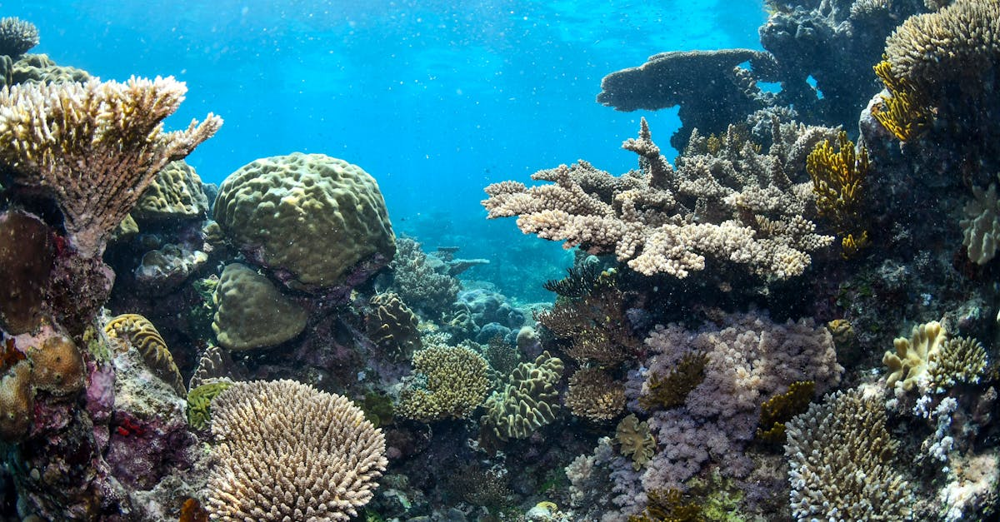

# Great Barrier Reef, Australia

Country: Australia
Region: Oceania

The Great Barrier Reef is the world's largest coral reef system, stretching roughly 2,300 kilometres along the Queensland coast and visible from space. UNESCO World Heritage-listed, managed by the Great Barrier Reef Marine Park Authority, and one of the most ecologically pressured ecosystems on Earth.

---

## 🧭 Step 1: Choices

### ✨ Why Visit

The Great Barrier Reef is one of the few places where you can see a global ecosystem in action and in crisis simultaneously. It is the largest single living structure on the planet; thousands of fish, coral, mollusc, and marine mammal species; and a working laboratory for climate-change science. Snorkelling or diving here is, on a good day, like swimming inside a documentary.

The reef is also visibly under stress. Mass bleaching events have followed roughly one another in recent years. Being honest about what you will see is part of visiting respectfully; some inner-reef sites are degraded, some outer sites and northern and southern extremities remain spectacular.

You come to see it before the reef and the planet change further, and to spend your money with operators who are part of the solution rather than the pressure.

### 🌍 Ethical Compass

- **💰 Economy.** Choose **High Standard Tourism Operators** certified by the Great Barrier Reef Marine Park Authority. They cost a bit more and deliver substantially better education, conservation funding, and standards. Stay in Cairns, Port Douglas, Airlie Beach, Lady Elliot Island, or Heron Island depending on which part of the reef you are visiting.
- **👥 Employment.** Tipping is not customary in Australia. Buy from Indigenous-owned operators where they exist (some Reef operators are Sea Country accredited; verify on official portals). Support the dive instructors and marine biologists; they are the front line of reef-visitor education.
- **📚 Education.** Read about coral bleaching, the Reef 2050 Long-Term Sustainability Plan, and crown-of-thorns starfish before you arrive. Choose operators who explain what you are seeing, not just where to point a camera. The Australian Institute of Marine Science (AIMS) publishes the annual reef condition reports.
- **🌱 Ecology.** **Reef-safe sunscreen** (non-oxybenzone, non-octinoxate) is essential. Never touch coral; even tiny contact damages decades of growth. Keep fins clear of the reef. Follow operator briefings on stinger safety and biosecurity (rinse fins between sites). Avoid feeding fish.

---

## 🎒 Step 2: Preparation

### 🔍 Governance Management

- **ETA or eVisitor** required for most visa-waiver nationals; verify on the Department of Home Affairs portal.
- **High Standard Tourism Operator (HSTO)** certification is the gold standard; the list is on the official Great Barrier Reef Marine Park Authority (GBRMPA) portal.
- An **Environmental Management Charge (EMC)** applies to most reef trips and should be itemised; verify on the GBRMPA portal.
- **Stinger season** runs roughly November to May; outer reef pontoons supply stinger suits but verify.
- **Crocodile risk** in northern Queensland coastal and river waters is real; do not swim in unmarked rivers or estuaries.

### 📡 Information Curation

- **Great Barrier Reef Marine Park Authority** for current reef conditions, certified operators, and education materials.
- **Australian Institute of Marine Science (AIMS)** for annual reef-health reports.
- **Tropical North Queensland Tourism** (official) and **Tourism Whitsundays** for accommodation and operator listings.
- A book on the Reef: J.E.N. Veron's *A Reef in Time* (technical); recent journalism by Anna Krien or Catherine McGregor for the contemporary crisis.
- An **Indigenous Sea Country** voice where present; verify Indigenous-accredited operators on tourism portals.

### 🎯 Inference Interaction

- **You decide on your gateway.** Cairns (most accessible, large operator pool, outer reefs day-trippable), Port Douglas (quieter, similar reef access), Airlie Beach (Whitsundays, Heart Reef, sailing-focused), Lady Elliot Island (southern reef, fly-in, manta-ray central), Heron Island (southern reef, research station). Choose deliberately.
- **You decide on the operator.** HSTO-certified is the right default. The cheapest day boat is rarely the better experience.
- **You decide on inner vs outer.** Outer reef has better-preserved coral; inner is closer, cheaper, and more degraded. Read recent operator reports.
- **You decide on dive vs snorkel.** Diving opens the reef in three dimensions; snorkelling shows you most of it. Either is valid; introductory dives are widely available.
- **You decide on aerial vs in-water.** A scenic flight over Heart Reef (Whitsundays) is photogenic and adds zero ecological pressure; in-water is the real experience.

### 🔄 Intelligence Cooperation

Tropical North Queensland weather is dramatic. Wet season (November to April) brings monsoonal storms, cyclones, and stinger risk. Dry season (May to October) is the practical window. Visibility varies with weather and runoff.

Bring a soft plan. If your reef trip is cancelled by swell, the rainforest (Daintree, Cape Tribulation, Atherton Tablelands) absorbs the day. If a cyclone warning closes operations entirely, lean on travel insurance and a flexible return. If visibility is poor on the day, talk to the operator about a partial-credit or rebook.

### 📍 Top 5 Anchor Spots (Reef Zones and Sites)

1. **Outer Cairns and Port Douglas reefs** (Agincourt, Flynn, Norman, Saxon, Hastings). The most accessible outer-reef cluster for day-trippers and overnight pontoons.
2. **Whitsundays and Heart Reef.** Sailing-focused; Whitehaven Beach as base. Heart Reef is aerial-only.
3. **Lady Elliot Island.** Southern reef, fly-in from Hervey Bay or Bundaberg, world-class manta-ray and turtle snorkelling.
4. **Heron Island.** Southern reef, research-station presence, reef literally at the shore. Boat from Gladstone.
5. **Ribbon Reefs and Cod Hole (northern outer reef).** Liveaboard territory, often paired with the Coral Sea. Serious dive trips only.

### 🧰 Practical Essentials

- **Recommended Length.** Two to five days minimum at a single gateway; a week or more for a serious dive trip or multi-zone reef visit. Combine with Cairns, Daintree, or the Whitsundays as appropriate.
- **Getting There and Around.** Fly into Cairns (CNS), Hamilton Island (HTI), or Brisbane (BNE) plus regional onward. Reef trips are day boats, overnight pontoons, liveaboard vessels, or fly-in island stays depending on destination. Hire car helps in northern Queensland; not needed for an island stay.
- **Daily Cost (per person).**
  - **Budget:** roughly AUD 200 to 350. Cairns hostel, one day on a budget reef operator (verify they are HSTO if possible), self-catered meals.
  - **Mid-range:** roughly AUD 500 to 900. Three-star accommodation, one full HSTO day on the outer reef, mixed dining, one rainforest or hinterland day.
  - **Higher-comfort:** roughly AUD 1,500 and up (often much more). Lady Elliot or Heron Island stay, fine dining, multi-day liveaboard dive trip, helicopter or seaplane Reef flight.
- **Booking Notes.**
  - **ETA or eVisitor:** verify on the Department of Home Affairs portal.
  - **HSTO certification:** verify on the official GBRMPA portal before booking.
  - **EMC (Environmental Management Charge):** should be itemised in your booking; small amount, mandatory.
  - **Stinger suits:** verify whether included or extra in summer.
  - **Cyclone risk** peaks January to March; travel insurance covering weather is wise.

---

## ✈️ Step 3: Delivery

### 🤖 AI Prompt

Copy this into your own AI assistant, fill in the brackets, and treat the answer as a researcher's draft, not a final plan.

> Please help me plan an ethical visit to the Great Barrier Reef, Australia for [NUMBER] days in [MONTH]. I am gateway-flexible between Cairns, Port Douglas, the Whitsundays, Lady Elliot Island, and Heron Island. I am travelling with [WHO] and my interests are [INTERESTS, e.g. snorkelling, diving, manta rays, sailing, marine biology]. My total budget is around [AMOUNT] and my comfort level is [budget / mid-range / higher-comfort].
>
> Please structure your answer in three steps.
>
> **Step 1: Choices.** Help me decide what to prioritise. Recommend the best Reef gateway and the two or three Reef experiences I should not miss given my interests, and one I should consider skipping (the cheapest unverified day boat, an inner-reef-only day on a poor-visibility day, an aerial-only experience if I have water-time available). Briefly explain each trade-off.
>
> **Step 2: Preparation.** Cover all four of the following:
> - **Governance Management.** What assumptions should I check before I book? Include the ETA or eVisitor on the Department of Home Affairs portal, High Standard Tourism Operator certification on GBRMPA, EMC inclusion, stinger and crocodile advisories, and Sea Country Indigenous accreditation where it applies.
> - **Information Curation.** Suggest at least four different source types: GBRMPA, AIMS reef-health reports, Tropical North Queensland or Whitsundays Tourism, and a recent book or article on coral bleaching.
> - **Inference Interaction.** List the decisions I personally need to make (gateway choice, HSTO operator commitment, inner vs outer reef, dive vs snorkel, reef-safe sunscreen).
> - **Intelligence Cooperation.** How should I trust my own judgment and local advice over algorithmic defaults when conditions change? Build me a soft plan with at least two alternates for likely disruptions (Reef trip cancelled by swell, cyclone warning, poor visibility on the day, a sold-out fly-in island).
>
> **Step 3: Delivery.** Give me the actual itinerary, day by day, with realistic timings, named operators, and named reef sites where I should book. Include at least one HSTO-certified Reef day and one alternative if weather cancels. Mark each operator as confidently HSTO-certified or Indigenous-accredited, or flag for me to verify.
>
> Finally, please remind me at the end to verify your suggestions against:
> 1. Official sources: the Great Barrier Reef Marine Park Authority for operators and EMC, AIMS for reef-health context, Tropical North Queensland or Whitsundays Tourism, and the Department of Home Affairs for visa.
> 2. Real people: a Cairns or Port Douglas dive shop, an Indigenous-led operator if available, or hotel staff who live in the gateway town now.
>
> Treat your output as a researcher's draft. I will make the final calls.

---

Part of **Gyro Governance Ethical Travel: AI-Empowered Guides for Humane Adventures**.

Explore more destinations, ethical domains, and AI prompts at [travel.gyrogovernance.com](https://travel.gyrogovernance.com/).
