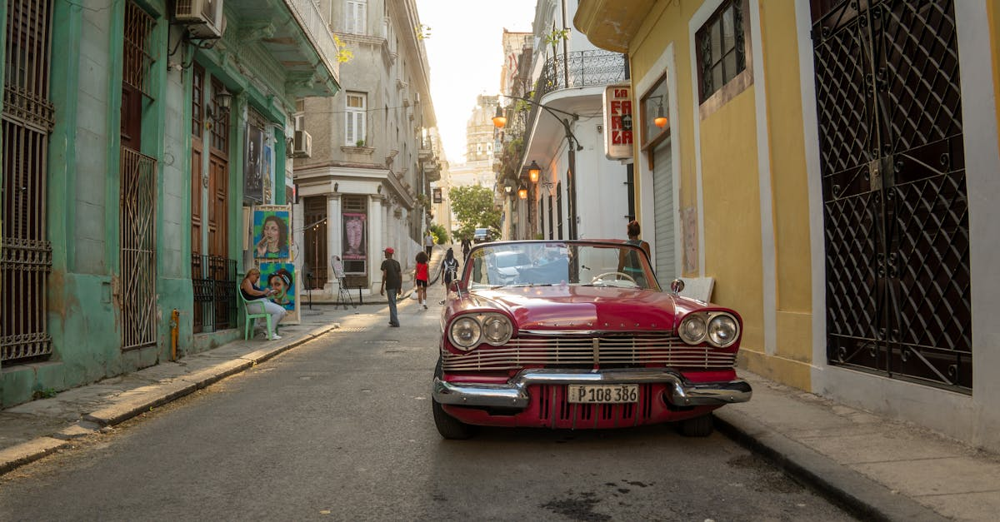

# Havana, Cuba

Country: Cuba
Region: Americas

Havana (*La Habana*) is the Cuban capital, a UNESCO-listed colonial port-city of around 2.1 million people, defined by a five-century Spanish architectural inheritance, sixty-plus years of revolutionary government, and one of the most distinctive cultural lives in the Americas. Music, dance, baseball, and street energy run on their own terms here.

---

## 🧭 Step 1: Choices

### ✨ Why Visit

Havana is unlike anywhere. The Plaza Vieja, Plaza de la Catedral, and the Capitolio are working colonial set-pieces. The Malecón is a six-kilometre seawall promenade that is the city's living room. Live music is everywhere, every night. The 1950s American cars survive because they had to.

The city is also one of the most economically and politically complicated places to visit. Currency reforms, shortages of basic goods, US sanctions, and limits on internet access all shape the visitor experience. Travelling respectfully here means understanding that you are spending dollars (or euros) in an economy that does not have much access to either.

You come for the music, the architecture, the *paladares* (private restaurants), the cigars and rum, and a city that rewards anyone willing to slow down and listen.

### 🌍 Ethical Compass

- **💰 Economy.** Stay in *casas particulares* (registered private guesthouses) rather than state hotels; the money goes directly to Cuban families. Eat at *paladares* (private restaurants) rather than state-run venues; both food and the workers' pay improve dramatically. Tip generously and in convertible currency.
- **👥 Employment.** Tip taxi drivers, musicians (every venue has a tip jar; use it), guides, and casa hosts. Cuban salaries in pesos do not approach what a single tip might bring. Be respectful when you photograph musicians and street performers; ask first.
- **📚 Education.** Read at least one Cuban author and one historical account of the revolution. José Martí for foundation; Leonardo Padura for contemporary mystery-novel Havana; Pedro Juan Gutiérrez for raw realism. The Museum of the Revolution presents one narrative; balance it.
- **🌱 Ecology.** Walk Havana Vieja, Centro, and Vedado. Beach trips to Playas del Este are an easy escape. Refuse single-use plastics; Cuban recycling is limited. Avoid bottled water if you can; use a water filter or trust your casa's filtered supply.

---

## 🎒 Step 2: Preparation

### 🔍 Governance Management

- Most visitors need a **Tourist Card** (Cuba's tourist visa); verify how to obtain it on your home country's Cuban embassy portal or through your airline.
- **US travellers** require a specific licence category for travel to Cuba; verify on the US Treasury OFAC portal before booking.
- **Cash is essential** in Cuba; US-issued cards do not work, and even non-US cards are unreliable. Bring euros or Canadian dollars to exchange (US dollars currently incur an extra penalty).
- **Internet access** has improved but is limited; ETECSA Wi-Fi cards or a portable plan you set up in advance. Verify current options.
- For **classic car tours** and **paladares**, ask your casa host for verified operators; many of the most "famous" places are not the best.

### 📡 Information Curation

- **OnCuba News** and **Granma International** (Cuba's English-language Communist Party paper) for two different lenses on the same news.
- **Cubatravel** (the official tourism portal) for official events.
- A Cuban author: Leonardo Padura's *Havana Quartet*, Pedro Juan Gutiérrez's *Dirty Havana Trilogy*, José Martí for foundational nineteenth-century thought.
- A casa particular host or independent local guide for ground-truth on shortages, queues, and the actual day-to-day.
- **Wikivoyage Cuba** for current practical advice (changes frequently).

### 🎯 Inference Interaction

- **You decide on the casa particular.** Staying in a Cuban family's registered guesthouse is fundamentally different (better) than a state hotel. The whole interaction shifts.
- **You decide on the paladar.** Private restaurants are the food scene; state restaurants are mostly mediocre.
- **You decide on the classic car.** A 1950s American convertible tour is a tourist staple; the cars are often beautifully maintained, sometimes barely held together. Verify what you are riding in.
- **You decide your music engagement.** Live music is everywhere; tipping the band is part of how musicians eat.
- **You decide your political conversation comfort.** Cubans are often happy to talk politics with foreigners; criticism of the government in public still carries risks for them, not you.

### 🔄 Intelligence Cooperation

Cuba's economy is in flux; prices, currency rules, and access to goods change frequently. Tropical weather is hot year-round; hurricane season runs August to November. Power outages (apagones) are common in some periods.

Bring a soft plan. If a power outage closes your evening's plan, candles in Habana Vieja are romantic; live music tends to continue. If a hurricane closes the airport, build flexibility into your bookings. If your favourite paladar has run out of a key ingredient, the menu adapts; so should you.

### 📍 Top 5 Anchor Spots

1. **Havana Vieja walking loop.** Plaza de la Catedral, Plaza Vieja, Plaza de San Francisco de Asís, Plaza de Armas. Best in the morning before the heat.
2. **Malecón and Centro Habana walk.** Walk the seawall west from Habana Vieja to the Hotel Nacional; eat at a Centro paladar afterwards.
3. **Vedado: Hotel Nacional, John Lennon Park, Universidad de La Habana.** A different Havana from Vieja; more 20th-century, more local life.
4. **A live music night at La Casa de la Música, Fábrica de Arte Cubano (FAC), or a small Centro venue.** Tip the band; buy drinks; engage.
5. **Cojímar or Playas del Este half-day.** Cojímar is Hemingway's old fishing village; Playas del Este are the local beaches 30 minutes east.

### 🧰 Practical Essentials

- **Recommended Length.** Three to five days for Havana. Add days for Viñales (tobacco country), Trinidad (colonial town), or Varadero (beach).
- **Transport.** Walk Habana Vieja, Centro, and parts of Vedado. **Coco-taxis, classic-car tours, and shared *colectivos*** for short hops. **Viazul** buses for inter-city. Renting a car is possible but driving in Cuba is its own adventure. José Martí International Airport (HAV) is 30 minutes from Havana centro by taxi.
- **Daily Cost (per person).**
  - **Budget:** roughly USD 50 to 90. Casa particular at the lower end (around USD 25 to 35 per room), paladar meals, walking, occasional taxi, free Malecón and city walking.
  - **Mid-range:** roughly USD 120 to 250. Casa particular at the higher end or a small boutique hotel, paladar dinners, classic car tour, music venues, casa breakfasts.
  - **Higher-comfort:** roughly USD 350 and up. Boutique hotel (Hotel Saratoga, La Reserva Vedado, the restored colonial palaces), fine dining at paladares (San Cristóbal, La Guarida), private guides, day-trips by chartered car.
- **Booking Notes.**
  - **Tourist Card:** verify via your airline or Cuban embassy.
  - **US travellers:** verify current OFAC licence requirements and travel categories.
  - **Cash:** US cards do not work; bring enough EUR or CAD for the whole trip plus reserve.
  - **Hurricane season** (August to November): travel insurance covering weather is wise.
  - **Major holidays** (May 1, July 26, January 1) affect openings and transport.

---

## ✈️ Step 3: Delivery

### 🤖 AI Prompt

Copy this into your own AI assistant, fill in the brackets, and treat the answer as a researcher's draft, not a final plan.

> Please help me plan an ethical visit to Havana, Cuba for [NUMBER] days in [MONTH]. I am travelling with [WHO] and my interests are [INTERESTS, e.g. music, colonial architecture, food, revolutionary history, cigars and rum]. My total budget is around [AMOUNT] and my comfort level is [budget / mid-range / higher-comfort]. I am a [US / non-US] passport holder.
>
> Please structure your answer in three steps.
>
> **Step 1: Choices.** Help me decide what to prioritise. Recommend the two or three Havana experiences I should not miss given my interests, and one I should consider skipping (a state hotel when a casa particular is steps better, a state-run restaurant when paladares are everywhere, a "free" cigar pitch on the street). Briefly explain each trade-off.
>
> **Step 2: Preparation.** Cover all four of the following:
> - **Governance Management.** What assumptions should I check before I book? Include the Tourist Card and (for US travellers) OFAC licence requirements, cash-only practicality, ETECSA Wi-Fi or pre-arranged data, and registered casa particular sources.
> - **Information Curation.** Suggest at least four different source types: one official Cuban source, one independent Cuban-international news outlet, one Cuban author, and a casa particular host or independent local guide.
> - **Inference Interaction.** List the decisions I personally need to make (casa vs hotel, paladar vs state restaurant, classic car ride choice, music tipping, political conversation comfort).
> - **Intelligence Cooperation.** How should I trust my own judgment and local advice over algorithmic defaults when conditions change? Build me a soft plan with at least two alternates for likely disruptions (a power outage, a paladar running out, a hurricane warning, a sudden currency-rule change).
>
> **Step 3: Delivery.** Give me the actual itinerary, day by day, with realistic timings and named neighbourhoods. Include at least one live music night, one Vedado afternoon, and one paladar meal in Centro Habana. Mark each business as confidently locally run (casa or paladar), or flag for me to verify.
>
> Finally, please remind me at the end to verify your suggestions against:
> 1. Official sources: my own Cuban embassy or consulate for the Tourist Card, US Treasury OFAC if I am a US citizen, and a current casa particular host for ground-truth.
> 2. Real people: my casa host, a Cuban friend or guide, or musicians I meet at venues.
>
> Treat your output as a researcher's draft. I will make the final calls.

---

Part of **Gyro Governance Ethical Travel: AI-Empowered Guides for Humane Adventures**.

Explore more destinations, ethical domains, and AI prompts at [travel.gyrogovernance.com](https://travel.gyrogovernance.com/).
