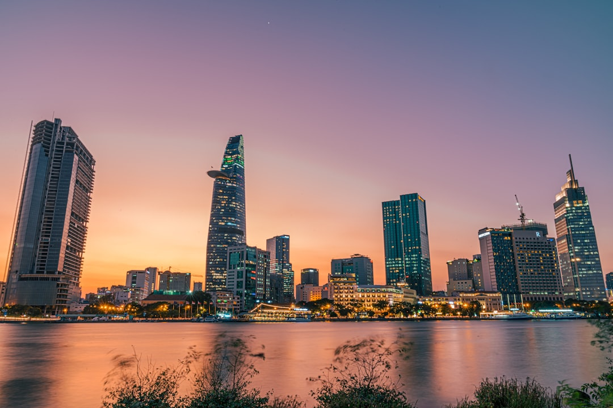

# Ho Chi Minh City, Vietnam

Country: Vietnam
Region: Asia

Ho Chi Minh City (still widely called *Sài Gòn*, especially by residents) is Vietnam's largest city and economic capital, a Mekong-delta-edge metropolis of around nine million people. Younger, hotter, busier, and more commercially driven than Hanoi; the heart of Vietnam's post-1986 economic transformation.

---

## 🧭 Step 1: Choices

### ✨ Why Visit

Ho Chi Minh City is the engine room of contemporary Vietnam. The War Remnants Museum holds the most unflinching account of the American War from the Vietnamese perspective. The Cu Chi Tunnels demonstrate the war as it was actually fought. The food (lighter, sweeter, more Khmer- and Cham-inflected than Hanoi's) is one of the great street-food scenes on Earth.

The city is also where most travellers connect to the Mekong Delta, the Cu Chi Tunnels, and onward to Cambodia or central Vietnam. Spending two or three days here gives you the historical weight; longer lets you read the contemporary energy.

You come for the war history, the food, the French colonial bones, the Mekong gateway, and a Vietnam that is moving fast.

### 🌍 Ethical Compass

- **💰 Economy.** Eat at street stalls and small *pho*, *com tam*, and *banh xeo* shops in districts 1, 3, and Phu Nhuan. Buy from Ben Thanh Market's interior (haggle politely, the front stalls inflate hard) or, better, Binh Tay Market in Cholon (Chinatown), which is local-focused.
- **👥 Employment.** Tipping is not customary but appreciated; small change at restaurants, a small note for guides. Use **Grab** or **Be** for ride-hail; insist on the app fare rather than a separately negotiated rate.
- **📚 Education.** Read both sides of the war. Bao Ninh's *The Sorrow of War* (Vietnamese), Tim O'Brien's *The Things They Carried* (American). Visit the War Remnants Museum knowing it is not neutral; balance it with the Independence Palace and the Cu Chi Tunnels.
- **🌱 Ecology.** Air pollution is real; check AQI. Refill water from sealed sources. For Mekong Delta day trips, choose smaller operators that visit working markets rather than the staged "floating market" experiences.

---

## 🎒 Step 2: Preparation

### 🔍 Governance Management

- Most travellers need an **e-visa** through the official Vietnamese Immigration portal.
- **War Remnants Museum**, **Independence Palace**, and **Cu Chi Tunnels** sell tickets at the gate; verify hours on official portals.
- For **Mekong Delta** day trips, choose operators with current good reputations; the difference between a meaningful day and a packaged tourist circuit is large.
- **Saigon Metro Line 1** is now operational; verify routes and current pricing on the official portal.
- For **scooter food tours**, verify the operator provides helmets and rides at sensible pace; some "vespa tours" are excellent, some risky.

### 📡 Information Curation

- **VnExpress International** and **Tuoi Tre News** for current Vietnamese news.
- The official **Vietnam National Administration of Tourism** site.
- A Vietnamese author: Bao Ninh, Viet Thanh Nguyen (*The Sympathizer*, set partly in Saigon), Duong Thu Huong.
- A locally led Saigon street-food tour by motorbike or on foot (Saigon Street Eats, Back of the Bike Tours).
- **Wikivoyage Ho Chi Minh City** for orientation.

### 🎯 Inference Interaction

- **You decide your war-history approach.** A day combining the War Remnants Museum, the Independence Palace, and Cu Chi Tunnels gives a serious account; cherry-picking one gives less.
- **You decide on a Mekong day.** A standard one-day "floating market" tour is mostly theatre; a two-day trip into Ben Tre, Can Tho, or Cai Be gives the actual delta.
- **You decide on scooter vs walking food tour.** Both work; scooter covers more ground but requires comfort with traffic; walking is gentler.
- **You decide on Cholon (Chinatown).** District 5 is rarely on first-time itineraries; it is one of the city's great market and temple zones.
- **You decide on Sai Gon vs Ho Chi Minh.** Locals say Sai Gon, especially for the centre. Foreigners say Ho Chi Minh City. Either is fine.

### 🔄 Intelligence Cooperation

Ho Chi Minh City weather is tropical; the wet season (May to November) brings predictable afternoon downpours, and traffic snarls when they hit. Tet Lunar New Year closes much of the city for days. Major holidays (Reunification Day, National Day) reshape transport.

Bring a soft plan. If a wet-season downpour kills your scooter tour, the indoor museums and a covered-market visit absorb it. If Cu Chi traffic is impossible, the Mekong is in a different direction. If Tet shuts the central districts, the parks and Sai Gon River walks remain alive.

### 📍 Top 5 Anchor Spots

1. **War Remnants Museum and Independence Palace.** A morning of difficult, important history. Plan two and a half hours for the museum.
2. **Cu Chi Tunnels.** Half-day trip out; the tunnels themselves and the working firing range nearby (decline the latter on principle if you wish).
3. **Ben Thanh Market and the central French colonial loop.** Notre Dame, the Central Post Office, the Saigon Opera House; walk in the evening when it cools.
4. **A street-food tour by scooter or on foot.** This is what most visitors remember.
5. **Cholon (District 5) and the Binh Tay Market.** A working Vietnamese-Chinese district that few first-time visitors see.

### 🧰 Practical Essentials

- **Recommended Length.** Two to three days for the city. Add a day for Cu Chi; one to three days for the Mekong Delta.
- **Transport.** Walk District 1. **Grab** or **Be** (ride-hail, both car and motorbike). The new **Metro Line 1** covers limited routes; expansion is ongoing. Tan Son Nhat International Airport (SGN) is 30 minutes to one hour from the centre depending on traffic.
- **Daily Cost (per person).**
  - **Budget:** roughly VND 500,000 to 1,000,000 (about USD 20 to 40). Hostel in District 1 or Pham Ngu Lao, street food, Grab, two ticketed sites, free walking.
  - **Mid-range:** roughly VND 1,500,000 to 3,500,000 (about USD 60 to 140). Three- or four-star hotel, mixed dining, Cu Chi day, scooter food tour.
  - **Higher-comfort:** roughly VND 5,000,000 and up. The Reverie Saigon or Park Hyatt, fine dining at Anan Saigon or Hum Vegetarian, private guides, day-trips by chartered car.
- **Booking Notes.**
  - **e-Visa:** apply on the official Vietnam Immigration portal.
  - **Tet Lunar New Year (late January or early February)** sees many businesses closed for a week.
  - **Mekong Delta** booking: pick a quality operator (verify on TripAdvisor or recent reviews); the cheapest tours are usually the most scripted.
  - **Traffic** is the biggest variable; build it into your timing.
  - **Air quality** can be poor in dry-season months (December to March).

---

## ✈️ Step 3: Delivery

### 🤖 AI Prompt

Copy this into your own AI assistant, fill in the brackets, and treat the answer as a researcher's draft, not a final plan.

> Please help me plan an ethical visit to Ho Chi Minh City (Saigon), Vietnam for [NUMBER] days in [MONTH]. I am travelling with [WHO] and my interests are [INTERESTS, e.g. street food, war history, French colonial architecture, the Mekong]. My total budget is around [AMOUNT] and my comfort level is [budget / mid-range / higher-comfort].
>
> Please structure your answer in three steps.
>
> **Step 1: Choices.** Help me decide what to prioritise. Recommend the two or three Saigon experiences I should not miss given my interests, and one I should consider skipping (a one-day "floating market" Mekong tour, the Saigon Skydeck for the price, a "vespa tour" with no helmets). Briefly explain each trade-off.
>
> **Step 2: Preparation.** Cover all four of the following:
> - **Governance Management.** What assumptions should I check before I book? Include the Vietnamese e-Visa portal, official ticketing for major museums, scooter-tour helmet and safety practices, Mekong operator quality, and air-quality forecasts.
> - **Information Curation.** Suggest at least four different source types: one official Vietnamese source, one English-language Vietnamese news outlet, one Vietnamese author, and one Saigon-based food guide.
> - **Inference Interaction.** List the decisions I personally need to make (war-history approach, Mekong day vs overnight, scooter vs walking tour, Cholon time, name preference).
> - **Intelligence Cooperation.** How should I trust my own judgment and local advice over algorithmic defaults when conditions change? Build me a soft plan with at least two alternates for likely disruptions (wet-season downpour, Tet closures, Cu Chi traffic, an air-quality red day).
>
> **Step 3: Delivery.** Give me the actual itinerary, day by day, with realistic timings and named districts. Include at least one war-history day and one street-food tour. Mark each business as confidently locally owned, or flag it for me to verify.
>
> Finally, please remind me at the end to verify your suggestions against:
> 1. Official sources: the Vietnamese Immigration portal, the Vietnam National Administration of Tourism, and air-quality forecasts.
> 2. Real people: a local resident, a Saigon-based guide, or hotel staff who live in the city now.
>
> Treat your output as a researcher's draft. I will make the final calls.

---

Part of **Gyro Governance Ethical Travel: AI-Empowered Guides for Humane Adventures**.

Explore more destinations, ethical domains, and AI prompts at [travel.gyrogovernance.com](https://travel.gyrogovernance.com/).
