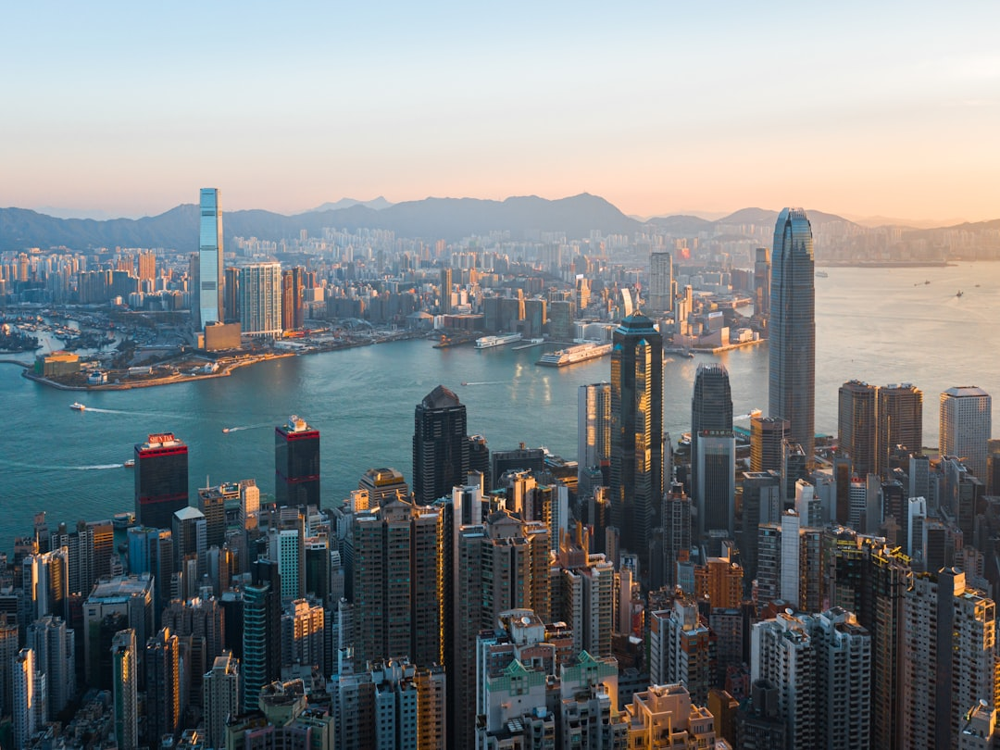

# Hong Kong, China

Country: China
Region: Asia

Hong Kong is a special administrative region of China and one of the world's most densely built cities, a Cantonese-speaking, British-colonial-shaped harbour metropolis of roughly 7.5 million packed onto Hong Kong Island, Kowloon, the New Territories, and 200 smaller islands. The skyline, the dim sum, the trams, and the protected country parks (40 percent of the territory) all share the same compact geography.

---

## 🧭 Step 1: Choices

### ✨ Why Visit

Hong Kong is a working East-meets-East city. The Victoria Harbour skyline at night is one of the planet's iconic urban views. The Star Ferry, the Peak tram, and the double-decker trams are functioning historic transport. Cantonese cuisine reaches its global peak here; dim sum is breakfast, congee is comfort food, roast goose is a destination.

The city is also smaller than its skyline suggests, and 40 percent of its land is protected country park. A 30-minute bus from Central drops you in Sai Kung's hiking country; the Dragon's Back trail rivals any urban hike on Earth.

You come for the food, the views, the trams, the hiking, and a Cantonese culture that has compressed into one of the most pressurised urban spaces in human history.

### 🌍 Ethical Compass

- **💰 Economy.** Eat at *cha chaan teng* (Hong Kong-style diners), small dim sum houses (Tim Ho Wan, Lin Heung Tea House), and family roast-meat shops in Sham Shui Po, Sai Ying Pun, and Yau Ma Tei. Buy at wet markets and small electronics shops rather than only major malls.
- **👥 Employment.** Tipping is small; 10 percent service charge is often added at sit-down restaurants. Use the Octopus card (the most beautifully integrated payment system in Asia) for everything from MTR to corner-store snacks.
- **📚 Education.** Read about the British handover and the post-2020 changes in Hong Kong's political landscape. Be aware that political conversation has changed; locals may not engage on the same topics they would have years ago. The Hong Kong Museum of History (verify current opening status) covers six thousand years of regional history.
- **🌱 Ecology.** Walk and use public transport; cars are penalised by design. Hike the country parks; the MacLehose, Wilson, and Lantau Trails are world-class. The harbour has been cleaned dramatically in recent decades; the swimming beaches on Hong Kong Island's south side (Repulse Bay, Stanley) and Lantau are real.

---

## 🎒 Step 2: Preparation

### 🔍 Governance Management

- Most visitors are **visa-exempt** for Hong Kong (separate from mainland China rules); verify on the official Hong Kong Immigration Department portal.
- The **Octopus card** is the universal payment system; buy at any MTR station or at the airport. Contactless bank cards work on most MTR lines as well.
- **The Peak Tram and Ngong Ping 360 cable car** sell timed tickets on official portals; both sell out in peak season.
- **Hong Kong Disneyland and Ocean Park** sell tickets on official portals.
- For **hiking** (Dragon's Back, Lion Rock, MacLehose Stages), verify current trail status on the official AFCD (Agriculture, Fisheries and Conservation Department) portal.

### 📡 Information Curation

- **South China Morning Post** for serious English-language coverage.
- The official **Hong Kong Tourism Board** for events, openings, and current advisories.
- A Hong Kong-set book: Han Suyin's *A Many-Splendoured Thing* (classic); Dorothy Lai for more recent fiction; Louisa Lim's *Indelible City* for the political context.
- A locally led food tour or neighbourhood walk in Sham Shui Po or Kowloon City.
- **Wikivoyage Hong Kong** for district orientation.

### 🎯 Inference Interaction

- **You decide on the harbour view.** The Symphony of Lights at 8 pm from the Tsim Sha Tsui waterfront is free; from the Peak, it is more expensive and the same view from above; from Star Ferry, it is the best moving picture.
- **You decide on hiking.** Dragon's Back, Victoria Peak Circle, Lantau Trail Stage 2 (above Tai O), and Sai Kung's MacLehose are all achievable in a half day; the country parks transform your understanding of Hong Kong.
- **You decide on dim sum strategy.** Tim Ho Wan is the famous one (and good); Lin Heung Tea House is more traditional (and chaotic); the wider scene is hundreds of small places. Sample widely.
- **You decide your political-conversation register.** Things have changed in recent years. Listen to what locals do and do not bring up.
- **You decide on Macau as a day-trip.** One hour by ferry; the colonial Portuguese centre is UNESCO-listed; the casinos are mostly skippable.

### 🔄 Intelligence Cooperation

Hong Kong weather is subtropical; typhoons can shut the city on short notice in summer and autumn. Air quality on still days can be poor. The MTR is one of the world's best metros but is occasionally affected by political events or maintenance.

Bring a soft plan. If a typhoon signal goes up, museums, malls, and indoor markets are excellent typhoon-day refuges. If air quality is red, push the country park hike to a clearer morning. If your Peak Tram is sold out, the bus to the Peak or the Circle walk works.

### 📍 Top 5 Anchor Spots

1. **Victoria Peak by tram or bus.** Sunset at the Peak Circle Walk. The tram is more atmospheric; the bus is reliable when the tram is sold out.
2. **Tsim Sha Tsui waterfront and Star Ferry.** Walk the Avenue of Stars at sunset; cross to Central or Wan Chai by Star Ferry; watch the Symphony of Lights.
3. **A dim sum lunch and a wet-market walk in Sham Shui Po.** The most local Cantonese district still affordable to live in.
4. **A country-park hike: Dragon's Back, the Peak Circle, or a MacLehose stage.** Half a day, transformative.
5. **Lantau Island day: Ngong Ping cable car, the Big Buddha, Tai O fishing village.** A full day; the cable car is spectacular if heights are fine.

### 🧰 Practical Essentials

- **Recommended Length.** Three to five days for the city and at least one island day. Add a day for Macau.
- **Transport.** The **MTR** is excellent; Octopus card or contactless. The **Star Ferry** is both transport and tourist experience. The **tram (ding ding)** on Hong Kong Island is a slow but charming way to see the north shore. Buses cover everywhere else. Hong Kong International Airport (HKG) is connected to Central in 24 minutes by the Airport Express.
- **Daily Cost (per person).**
  - **Budget:** roughly HKD 600 to 1,000 (about USD 75 to 130). Hostel, cha chaan teng meals and street food, Octopus card, free hiking and the Peak by bus.
  - **Mid-range:** roughly HKD 1,500 to 3,000 (about USD 190 to 380). Three- or four-star hotel, mixed dining including one serious dim sum and one roast-goose meal, all major sites, a country park hike with guide.
  - **Higher-comfort:** roughly HKD 5,000 and up. Five-star (Mandarin Oriental, Four Seasons, Peninsula), fine dining at Lung King Heen, Bo Innovation, or 8½ Otto e Mezzo, private guides, helicopter harbour flights.
- **Booking Notes.**
  - **Visa:** verify on the Hong Kong Immigration Department portal.
  - **Peak Tram and Ngong Ping:** book ahead in peak season.
  - **Typhoon signals:** if signal 8 or above is issued, public transport stops and most businesses close.
  - **Chinese New Year (late January or February)** is a major holiday week.
  - **Hong Kong Sevens (rugby, March/April)** fills the city briefly.

---

## ✈️ Step 3: Delivery

### 🤖 AI Prompt

Copy this into your own AI assistant, fill in the brackets, and treat the answer as a researcher's draft, not a final plan.

> Please help me plan an ethical visit to Hong Kong for [NUMBER] days in [MONTH]. I am travelling with [WHO] and my interests are [INTERESTS, e.g. Cantonese food, harbour views, hiking, Chinese-British history, shopping]. My total budget is around [AMOUNT] and my comfort level is [budget / mid-range / higher-comfort].
>
> Please structure your answer in three steps.
>
> **Step 1: Choices.** Help me decide what to prioritise. Recommend the two or three Hong Kong experiences I should not miss given my interests, and one I should consider skipping (a Peak Tram queue when the bus is steps better, the casinos in Macau, an overpriced harbour cruise when the Star Ferry covers it). Briefly explain each trade-off.
>
> **Step 2: Preparation.** Cover all four of the following:
> - **Governance Management.** What assumptions should I check before I book? Include the Hong Kong visa portal, Octopus card or contactless setup, the Peak Tram and Ngong Ping 360 official portals, country-park trail status, and typhoon signals.
> - **Information Curation.** Suggest at least four different source types: one official Hong Kong source, the South China Morning Post or a serious English-language outlet, a Hong Kong author, and a local food or neighbourhood walking guide.
> - **Inference Interaction.** List the decisions I personally need to make (harbour view from where, hiking commitment, dim sum strategy, political conversation register, Macau add-on).
> - **Intelligence Cooperation.** How should I trust my own judgment and local advice over algorithmic defaults when conditions change? Build me a soft plan with at least two alternates for likely disruptions (typhoon signal 8 closing the city, red air-quality day, sold-out Peak Tram, an MTR line closure).
>
> **Step 3: Delivery.** Give me the actual itinerary, day by day, with realistic timings, MTR lines, and named districts. Include at least one country-park hike and one Sham Shui Po food walk. Mark each business as confidently locally owned, or flag it for me to verify.
>
> Finally, please remind me at the end to verify your suggestions against:
> 1. Official sources: Hong Kong Tourism Board, MTR, AFCD for country parks, and the Hong Kong Immigration Department.
> 2. Real people: a local resident, a Hong Kong food guide, or hotel staff who live in Hong Kong now.
>
> Treat your output as a researcher's draft. I will make the final calls.

---

Part of **Gyro Governance Ethical Travel: AI-Empowered Guides for Humane Adventures**.

Explore more destinations, ethical domains, and AI prompts at [travel.gyrogovernance.com](https://travel.gyrogovernance.com/).
