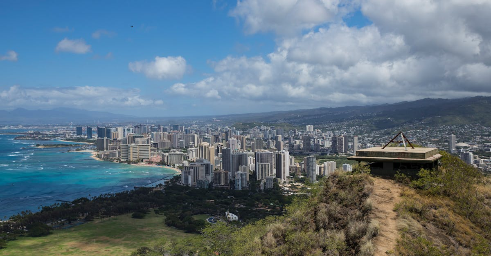

# Honolulu, United States

Country: United States
Region: Americas

Honolulu is the capital and largest city of Hawai'i, located on the south shore of O'ahu. A Polynesian island kingdom illegally overthrown by US interests and annexed; a Pacific naval port and World War II flashpoint; a contemporary city of about a million people; and the gateway to one of the world's most ecologically and culturally distinctive island chains.

---

## 🧭 Step 1: Choices

### ✨ Why Visit

Honolulu and the wider O'ahu sit at a unique cultural and ecological crossroads. The Bishop Museum holds one of the world's most important collections of Polynesian artefacts. Pearl Harbor is a working memorial complex with serious history. The North Shore has some of the world's most famous surf. Diamond Head and Manoa rise from the city.

The islands are also a real conversation about overtourism, Native Hawaiian sovereignty, and water and land use. Hawai'i has formal commitments to *mālama* (to care for) the place; visiting respectfully means engaging Native Hawaiian-led tourism rather than the resort-bubble version.

You come for the beaches, the surf, the volcanic landscape, and a chance to engage with Hawai'i on Hawaiian terms rather than as a generic beach destination.

### 🌍 Ethical Compass

- **💰 Economy.** Stay in Waikīkī if you must, but consider Kaimukī, Kāka'ako, or smaller windward-side accommodation for a more local experience. Eat at *poke* shops, plate-lunch counters, and farmers' markets (KCC Saturday market is excellent) rather than only the Waikīkī chains. Buy from Native Hawaiian artisans where possible.
- **👥 Employment.** Tip 20 percent in restaurants (US standard); tipping at hotels and tour operators is also expected. Hospitality workers in Hawai'i face one of the country's highest cost-of-living to wages ratios.
- **📚 Education.** This is a Native Hawaiian (*Kanaka Maoli*) place. Read about the 1893 overthrow, the annexation, and the contemporary sovereignty movement. The Bishop Museum, the 'Iolani Palace (the only royal palace on US soil), and Native Hawaiian-led cultural tours each tell parts of that story.
- **🌱 Ecology.** Hawai'i has the only **legally enforced reef-safe sunscreen** rules in the US (no oxybenzone, no octinoxate); honour them. Stay on paths in fragile ecosystems. Do not touch sea turtles or monk seals (they are federally protected). Pay reservation fees at Hanauma Bay and other managed sites; they fund conservation.

---

## 🎒 Step 2: Preparation

### 🔍 Governance Management

- Most international visitors need **ESTA (visa waiver) or a B-2 visa** for the US; verify on the official US State Department portal.
- **Hanauma Bay Nature Preserve** requires advance online reservation on the official City and County of Honolulu portal; closed Tuesdays.
- **Diamond Head State Monument** requires advance reservation for non-residents on the official Hawai'i State Parks portal.
- **Pearl Harbor (Pearl Harbor National Memorial)** is free but the USS Arizona Memorial requires a free timed ticket on Recreation.gov; book weeks ahead in peak season.
- **TheBus** is O'ahu's public transit system; HOLO card or contactless on board. The Honolulu Skyline rail is gradually opening; verify current routes.

### 📡 Information Curation

- **Honolulu Star-Advertiser** and **Honolulu Civil Beat** for serious Hawai'i news.
- The official **Go Hawai'i** site and the **Hawai'i Tourism Authority** for events and openings.
- A Native Hawaiian author: Haunani-Kay Trask's *From a Native Daughter*; Lois-Ann Yamanaka for fiction.
- A Native Hawaiian-led cultural experience: Polynesian Cultural Center (Lā'ie), Bishop Museum-affiliated programmes, or smaller community-run tours.
- **Wikivoyage Honolulu** for orientation.

### 🎯 Inference Interaction

- **You decide on Waikīkī.** Convenient but the worst of resort-strip Honolulu; an alternative neighbourhood or windward-side stay gives a different O'ahu.
- **You decide on Pearl Harbor.** Free entry, free USS Arizona Memorial ticket required; book on Recreation.gov weeks ahead.
- **You decide on Hanauma Bay.** Reservations open in advance; sells out instantly in summer. Plan day-of-trip strategy or pick another snorkel spot (Sharks Cove on the North Shore).
- **You decide on the North Shore.** A full day is right; surf-watching at Waimea, Sunset, or Pipeline in winter is genuinely one of the planet's great free shows.
- **You decide on engagement with Native Hawaiian sovereignty.** Read, listen, and engage with respect; this is not abstract.

### 🔄 Intelligence Cooperation

O'ahu weather is dry-and-windy south side, wet windward side; winter brings the North Shore surf and rain showers; summer is hot and dry. Trade winds shape the day. Vog (volcanic smog) from the Big Island occasionally reaches O'ahu.

Bring a soft plan. If a north-swell storm closes the North Shore, the leeward beaches (Ko 'Olina) are calm. If a heavy rain day washes out hiking, the museums and the wider Pearl Harbor complex absorb it well. If your Hanauma reservation falls through, Sharks Cove or Electric Beach (Kahe Point) serve.

### 📍 Top 5 Anchor Spots

1. **Pearl Harbor National Memorial.** USS Arizona Memorial (timed free ticket), USS Missouri (separate ticket), and the Pacific Aviation Museum. Allow a full half day.
2. **Diamond Head crater hike.** Reservation required for non-residents; an hour return; classic Honolulu view from the top.
3. **Bishop Museum.** One of the most important Polynesian collections in the world. Plan three hours.
4. **A North Shore day: Hale'iwa town, Sharks Cove or Three Tables snorkel, surf-watching at Pipeline in winter.** Full day; rent a car or join a tour.
5. **'Iolani Palace and the downtown Hawaiian historic district.** The only royal palace on US soil; guided tours give the overthrow story directly.

### 🧰 Practical Essentials

- **Recommended Length.** Three to five days for O'ahu. Add days for outer islands (Maui, Kaua'i, Big Island) which are separate flights and separate trips.
- **Transport.** **TheBus** covers all of O'ahu cheaply but slowly; HOLO card or contactless. **Renting a car** is the practical default for North Shore and windward-side days. The **Honolulu Skyline rail** is partially operational; verify current routes. Daniel K. Inouye International Airport (HNL) is 25 minutes from Waikīkī by taxi.
- **Daily Cost (per person).**
  - **Budget:** roughly USD 100 to 180. Hostel or budget motel, plate lunches and food trucks, TheBus, free beaches, Diamond Head and Pearl Harbor.
  - **Mid-range:** roughly USD 250 to 450. Three-star hotel (off-strip Waikīkī or boutique elsewhere), mixed dining, all major sites, North Shore day with rental car.
  - **Higher-comfort:** roughly USD 600 and up. Halekulani, Royal Hawaiian, Four Seasons Ko 'Olina, fine dining at Mw Restaurant or 53 by the Sea, private guides, helicopter circle-island flights.
- **Booking Notes.**
  - **ESTA:** apply at least 72 hours before US arrival.
  - **Hanauma Bay reservations:** open in advance; sells out very fast.
  - **Pearl Harbor USS Arizona ticket:** free but timed; book on Recreation.gov weeks ahead.
  - **Diamond Head:** reservation required for non-residents.
  - **Major events** (Honolulu Marathon December, Pipeline Masters winter) book the island; verify dates.

---

## ✈️ Step 3: Delivery

### 🤖 AI Prompt

Copy this into your own AI assistant, fill in the brackets, and treat the answer as a researcher's draft, not a final plan.

> Please help me plan an ethical visit to Honolulu and O'ahu, Hawai'i for [NUMBER] days in [MONTH]. I am travelling with [WHO] and my interests are [INTERESTS, e.g. Native Hawaiian culture, surfing, Pacific war history, snorkelling, hiking]. My total budget is around [AMOUNT] and my comfort level is [budget / mid-range / higher-comfort].
>
> Please structure your answer in three steps.
>
> **Step 1: Choices.** Help me decide what to prioritise. Recommend the two or three O'ahu experiences I should not miss given my interests, and one I should consider skipping (a Waikīkī-only itinerary, a private luau when an authentic cultural centre is steps better, snorkelling at Hanauma without a reservation). Briefly explain each trade-off.
>
> **Step 2: Preparation.** Cover all four of the following:
> - **Governance Management.** What assumptions should I check before I book? Include the US ESTA, Hanauma Bay reservations on the City and County portal, Diamond Head reservations on Hawai'i State Parks, USS Arizona Memorial ticket on Recreation.gov, and reef-safe sunscreen rules.
> - **Information Curation.** Suggest at least four different source types: one official Hawai'i source, one Hawai'i news outlet (Civil Beat or Star-Advertiser), one Native Hawaiian author, and one Native Hawaiian-led cultural experience.
> - **Inference Interaction.** List the decisions I personally need to make (Waikīkī vs alternative neighbourhood, Pearl Harbor depth, Hanauma vs alternative snorkel, North Shore day, engagement with Native Hawaiian sovereignty).
> - **Intelligence Cooperation.** How should I trust my own judgment and local advice over algorithmic defaults when conditions change? Build me a soft plan with at least two alternates for likely disruptions (north-swell storm, sold-out Hanauma reservation, vog day, a Pearl Harbor weather closure).
>
> **Step 3: Delivery.** Give me the actual itinerary, day by day, with realistic timings and named places. Include at least one Native Hawaiian cultural experience and one full North Shore day. Mark each business as confidently locally owned (especially Native Hawaiian-owned where I can support), or flag for me to verify.
>
> Finally, please remind me at the end to verify your suggestions against:
> 1. Official sources: Go Hawai'i, the City and County of Honolulu (Hanauma), Hawai'i State Parks, Recreation.gov (Pearl Harbor), and the US State Department for ESTA.
> 2. Real people: a Native Hawaiian guide, a local resident, or hotel staff who live on O'ahu now.
>
> Treat your output as a researcher's draft. I will make the final calls.

---

Part of **Gyro Governance Ethical Travel: AI-Empowered Guides for Human Adventures**.

Explore more destinations, ethical domains, and AI prompts at [travel.gyrogovernance.com](https://travel.gyrogovernance.com/).
