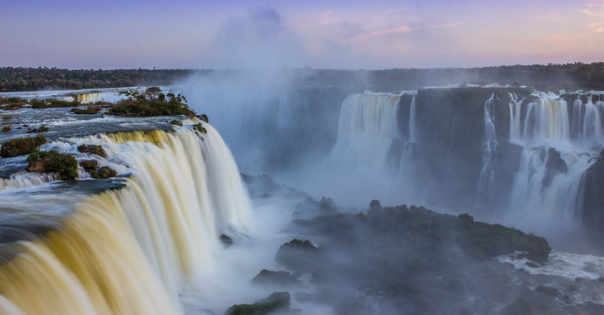

# Iguazu Falls, Argentina and Brazil

Country: Argentina and Brazil
Region: Americas

Iguazu Falls (*Cataratas del Iguazú* in Spanish, *Cataratas do Iguaçu* in Portuguese) is a 2.7 kilometre system of waterfalls on the Iguazu River, straddling the Argentina-Brazil border at the edge of the Atlantic Forest. UNESCO-listed on both sides, more powerful than Niagara, taller than Victoria, and the centrepiece of two adjoining national parks.

---

## 🧭 Step 1: Choices

### ✨ Why Visit

Iguazu is the world's largest waterfall system by area and one of its three or four most spectacular. Roughly 275 individual cataracts arc across a horseshoe; the Devil's Throat (*Garganta del Diablo* / *Garganta do Diabo*) is the centrepiece, a 80-metre drop into a permanent rainbow-shrouded plunge basin.

The two-country geography is the point. Argentina has 80 percent of the falls and the immersive walkway experience; Brazil has 20 percent and the panoramic view. Visiting both is the only complete trip. The surrounding subtropical Atlantic Forest is one of the world's most endangered ecosystems, with jaguars, tapirs, and coatis.

You come because Iguazu makes Niagara look like a leak. And you give it two full days (one per country) because half a day on one side is half the experience.

### 🌍 Ethical Compass

- **💰 Economy.** Stay in **Puerto Iguazú (Argentina)** or **Foz do Iguaçu (Brazil)** rather than only at the in-park luxury hotels (Belmond Hotel das Cataratas on the Brazilian side, Gran Meliá Iguazú on the Argentine). Eat at family restaurants in both towns; tip 10 percent in Argentina, 10 percent in Brazil.
- **👥 Employment.** Hire a registered park guide if you want depth; freelancers outside the gates are usually unlicensed. Park rangers and concession workers depend on visitor traffic; the park entry fees fund conservation.
- **📚 Education.** Read about the Atlantic Forest (*Mata Atlântica*), one of the world's most biodiverse and most threatened biomes, and the Guaraní Indigenous communities of the border region. Visit the Centro de Interpretación on the Argentine side.
- **🌱 Ecology.** Stay on the walkways; the rainforest off-path is fragile. Do not feed coatis (they are aggressive food-seekers); secure your snacks. Reef-safe is not the issue here, but Atlantic Forest ecology is. Choose any Macuco Safari, helicopter, or motorboat operator that follows park-wildlife rules.

---

## 🎒 Step 2: Preparation

### 🔍 Governance Management

- Visa rules differ between Argentina and Brazil; **verify both** on the official Migraciones Argentina and Polícia Federal Brasil portals for your nationality.
- **Argentine side (Parque Nacional Iguazú):** entry tickets are sold on the official APN (Administración de Parques Nacionales) portal; same-day re-entry is half-price the next day; the Devil's Throat walkway is the centrepiece.
- **Brazilian side (Parque Nacional do Iguaçu):** entry tickets on the official Cataratas do Iguaçu portal; the panoramic walkway has a single shuttle bus that takes everyone.
- **Crossing the border** is straightforward by taxi or local bus; both countries stamp passports. Verify reciprocity-fee rules if any.
- For **helicopter or motorboat (Macuco Safari)** experiences, verify the operator's permits and current operations on park portals.

### 📡 Information Curation

- The official **Parques Nacionales Argentina** and **ICMBio (Brazil)** sites for park rules.
- **Buenos Aires Times** and **The Brazilian Report** for regional context if needed.
- A book on the Atlantic Forest or Guaraní culture: Eduardo Viveiros de Castro's anthropological work; or popular nature writing on the Mata Atlântica.
- A local guide based in Puerto Iguazú or Foz do Iguaçu who has worked the parks; recommended through your hotel.
- **Wikivoyage Iguazu Falls** for cross-border logistics.

### 🎯 Inference Interaction

- **You decide on both sides.** Visiting only one is the most common regret. Plan two days, one per side; if your time is hard-limited, the Argentine side is the deeper experience.
- **You decide on the Devil's Throat first or last.** Arriving at opening means a less-crowded centrepiece; arriving later means warmer light but bigger crowds.
- **You decide on Macuco Safari.** The motorboat trip *under* the falls is a soaking, thrilling experience; verify safety and conservation practices.
- **You decide on the helicopter.** Available only on the Brazilian side; spectacular for photos; arguably noise pollution in a national park. Your call.
- **You decide your base.** Puerto Iguazú is smaller and Spanish-speaking; Foz do Iguaçu is larger and Portuguese-speaking; both have airports.

### 🔄 Intelligence Cooperation

Water flow at Iguazu varies enormously. Wet season (November to March) brings maximum flow and occasionally closed walkways from flooding. Dry season (April to October) gives clearer photos but less drama. Subtropical heat and humidity are real year-round.

Bring a soft plan. If high water closes the Devil's Throat walkway, the lower circuits on the Argentine side still work spectacularly. If a thunderstorm grounds the helicopter, the panoramic walkway is unaffected. If your border crossing day runs late, you can usually re-enter Argentina the next day at half price.

### 📍 Top 5 Anchor Spots (Zones and Sites)

1. **Argentine side, Devil's Throat (Garganta del Diablo) walkway.** Train from the visitor centre, then a 1.1 km walkway over the river to the central plunge basin. The single most powerful viewpoint.
2. **Argentine side, Upper and Lower Circuits.** The Upper walks along the top of the falls; the Lower descends to viewpoints from below. A full Argentine day combines all three with the Devil's Throat.
3. **Brazilian side, the Panoramic Walkway.** A 1.2 km path that delivers the postcard sweep; ends at the Devil's Throat overlook from the opposite side.
4. **Macuco Safari (Brazilian side) or Gran Aventura (Argentine side).** Motorboat trip into the lower falls; bring waterproof bags.
5. **Itaipu Dam (Brazilian side, optional).** The world's second-largest hydroelectric dam, a half-day visit, if your interests are technical.

### 🧰 Practical Essentials

- **Recommended Length.** Two days minimum (one per country side). Three is better; allows a slow Argentine day, a Brazilian day, and an extra for Macuco Safari or Itaipu.
- **Getting There and Around.** Fly into **Puerto Iguazú (IGR) Argentina** or **Foz do Iguaçu (IGU) Brazil**. Both park visitor centres are reachable by local bus or taxi from each town in 20 to 30 minutes. Cross-border transfers run regularly; verify current passport-stamp procedures.
- **Daily Cost (per person).**
  - **Budget:** roughly USD 60 to 110. Guesthouse in either town, parrilla or churrascaria meals, local bus to parks, one country side.
  - **Mid-range:** roughly USD 140 to 280. Three-star hotel in either town, mixed dining, both park sides, one Macuco Safari.
  - **Higher-comfort:** roughly USD 400 and up. Belmond Hotel das Cataratas (in-park, Brazil) or Gran Meliá Iguazú (in-park, Argentina), fine dining, helicopter, private guided park days.
- **Booking Notes.**
  - **Visas:** verify both Argentina and Brazil rules.
  - **Park tickets:** official portals for each side; same-day re-entry tickets give a half-price next-day option on the Argentine side.
  - **Devil's Throat walkway** can close in extreme high water (rare but possible).
  - **Macuco Safari** and helicopter weather-dependent.
  - **Argentine peso volatility** affects costs in Puerto Iguazú; carry USD as backup.

---

## ✈️ Step 3: Delivery

### 🤖 AI Prompt

Copy this into your own AI assistant, fill in the brackets, and treat the answer as a researcher's draft, not a final plan.

> Please help me plan an ethical visit to Iguazu Falls (Argentina and Brazil sides) for [NUMBER] days in [MONTH]. I am travelling with [WHO] and my interests are [INTERESTS, e.g. waterfalls, Atlantic Forest wildlife, photography, dam engineering]. My total budget is around [AMOUNT] and my comfort level is [budget / mid-range / higher-comfort].
>
> Please structure your answer in three steps.
>
> **Step 1: Choices.** Help me decide what to prioritise. Recommend the best combination of Argentine-side, Brazilian-side, Macuco Safari, helicopter, and Itaipu given my interests and time, and one I should consider skipping (helicopter as noise pollution, only one country side, an in-park luxury hotel beyond my budget). Briefly explain each trade-off.
>
> **Step 2: Preparation.** Cover all four of the following:
> - **Governance Management.** What assumptions should I check before I book? Include visa rules for both Argentina and Brazil, official park portals for ticketing on each side, same-day re-entry rules on the Argentine side, and Macuco Safari operator permits.
> - **Information Curation.** Suggest at least four different source types: Parques Nacionales Argentina, ICMBio Brazil, a book on the Atlantic Forest or Guaraní culture, and a local Puerto Iguazú or Foz do Iguaçu guide.
> - **Inference Interaction.** List the decisions I personally need to make (both sides commitment, Devil's Throat timing, Macuco Safari, helicopter, base town).
> - **Intelligence Cooperation.** How should I trust my own judgment and local advice over algorithmic defaults when conditions change? Build me a soft plan with at least two alternates for likely disruptions (Devil's Throat walkway closed by high water, thunderstorm grounding helicopter, a border-crossing delay, Argentine currency change).
>
> **Step 3: Delivery.** Give me the actual itinerary, day by day, with realistic timings, named walkways, and park-entrance points. Include one full Argentine day and one full Brazilian day. Mark each operator as confidently park-permitted, or flag for me to verify.
>
> Finally, please remind me at the end to verify your suggestions against:
> 1. Official sources: Parques Nacionales Argentina, ICMBio for Parque Nacional do Iguaçu, the official Cataratas do Iguaçu portal, and visa portals for both countries.
> 2. Real people: a local guide based in Puerto Iguazú or Foz do Iguaçu, or hotel staff in either town.
>
> Treat your output as a researcher's draft. I will make the final calls.

---

Part of **Gyro Governance Ethical Travel: AI-Empowered Guides for Human Adventures**.

Explore more destinations, ethical domains, and AI prompts at [travel.gyrogovernance.com](https://travel.gyrogovernance.com/).
