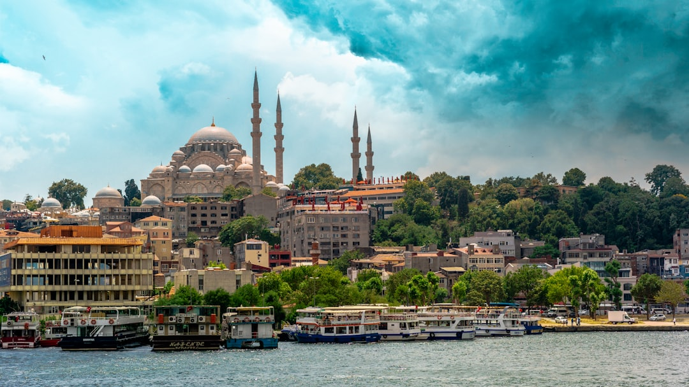

# Istanbul, Turkiye

Country: Turkiye
Region: Asia

Istanbul is the only city in the world built on two continents, a 16-million-person Turkish metropolis straddling the Bosphorus strait between Europe and Asia. Capital of three empires (Roman, Byzantine, Ottoman) and still one of the world's great trade and cultural crossroads.

---

## 🧭 Step 1: Choices

### ✨ Why Visit

Istanbul concentrates more first-rank monuments per square kilometre than almost any city on Earth. Hagia Sophia, the Blue Mosque, Topkapi Palace, the Grand Bazaar, and the Basilica Cistern are walking distance from each other. The Bosphorus is the spine; ferries cross hourly to the Asian side; the Princes' Islands are an hour away.

The city is also one of the most dynamically changing major capitals in the world. Inflation, urban renovation, and political shifts have reshaped neighbourhoods and pricing on a cycle of a few years. Visiting respectfully means engaging the contemporary Turkish city, not only its imperial past.

You come for the Hagia Sophia and the Bosphorus, for the food (one of the world's great cuisines), and for a city that earns the cliché about east meeting west.

### 🌍 Ethical Compass

- **💰 Economy.** Eat at neighbourhood *lokantas* (cafeterias serving home-style dishes), kebab houses, and *meyhanes* (taverns) in Beyoğlu, Kadıköy, and the Asian side rather than only Sultanahmet's tourist zone. Buy from small workshop owners in the Grand Bazaar's interior or the Spice Bazaar; haggle politely.
- **👥 Employment.** Tipping at restaurants 10 percent. Hire licensed guides for Topkapi, Hagia Sophia, and the Bosphorus; freelancers at gates are usually unlicensed. Use BiTaksi or iTaksi apps for licensed taxis with metered fares.
- **📚 Education.** Read Orhan Pamuk's *Istanbul: Memories and the City* before you visit. The city's Greek, Armenian, and Jewish histories are essential to understanding what is here and what has been lost. The Pera Museum and the Salt galleries cover modern Istanbul.
- **🌱 Ecology.** Walk Sultanahmet, Beyoğlu, and Kadıköy. The Bosphorus ferries are both transport and the city's natural air conditioning. Use the modern metro and tram for longer hops; traffic in Istanbul is brutal at all hours.

---

## 🎒 Step 2: Preparation

### 🔍 Governance Management

- Most visitors need an **e-Visa** through the official Turkish e-Visa portal.
- The **Hagia Sophia** changed status from museum to mosque in recent years; access for non-Muslim visitors is generally welcome outside prayer times. Verify current visiting hours and dress code on the official portal.
- The **Blue Mosque (Sultan Ahmed)** is a working mosque, free to enter outside prayer times; dress code applies (shoulders, knees covered; head covering for women).
- **Topkapi Palace, Basilica Cistern, Dolmabahçe Palace** sell timed tickets on official portals.
- For **Bosphorus cruises**, the public ferry (Şehir Hatları) is cheaper, more local, and better than most private tourist cruises.

### 📡 Information Curation

- **Hürriyet Daily News** and **Daily Sabah** (English-language Turkish papers, different political angles).
- The official **Istanbul Tourism** portal for events and openings.
- A Turkish author: Orhan Pamuk (Nobel laureate, Istanbul-born), Elif Şafak, Ahmet Hamdi Tanpınar's *A Mind at Peace*.
- A locally led Istanbul walking or food tour (Istanbul Eats, Culinary Backstreets).
- **Wikivoyage Istanbul** for neighbourhood orientation and ferry routes.

### 🎯 Inference Interaction

- **You decide where you sleep.** Sultanahmet is convenient and tourist-saturated; Beyoğlu/Galata is bohemian and lively; Kadıköy (Asian side) is local and rapidly gentrifying. Each gives a different city.
- **You decide on Hagia Sophia.** Visit outside prayer times; dress modestly; be respectful of worshippers. The Byzantine mosaics on the upper gallery require some attention to spot.
- **You decide on the Bosphorus ferry vs tourist cruise.** The municipal ferry (Şehir Hatları) is the right answer for most visitors.
- **You decide on the carpet shop conversation.** Genuine carpet shops welcome browsing; aggressive sellers are common around the Grand Bazaar. Polite firm "no" works; do not enter if you do not want the experience.
- **You decide on the Asian side.** A Kadıköy afternoon and Moda walk is the most local Istanbul experience most visitors skip.

### 🔄 Intelligence Cooperation

Istanbul weather is four-season; summers hot and humid, winters cold and damp, occasional snow. Friday prayers reshape mosque visits. Major Muslim holidays (Ramadan, Eid) and Turkish secular holidays (Republic Day, Victory Day) shift the city's rhythm. Demonstrations occasionally close central streets in Taksim and Beyoğlu.

Bring a soft plan. If a Friday prayer fills the Blue Mosque, the Spice Bazaar and Galata Bridge fish-sandwich stalls absorb the morning. If a sudden rain closes outdoor café terraces, the Cağaloğlu hammam or the Pera Museum work. If a strike or demonstration affects Taksim, the Asian side is unaffected.

### 📍 Top 5 Anchor Spots

1. **Sultanahmet morning.** Hagia Sophia and the Blue Mosque first; cross Sultanahmet Square; Basilica Cistern; Topkapi Palace afternoon if energy holds.
2. **Grand Bazaar and Spice Bazaar.** Walk between them through the back lanes; haggle politely; lunch at a *lokanta* nearby.
3. **A Bosphorus ferry crossing to Üsküdar or Kadıköy.** Public ferry, late afternoon if possible; the Maiden's Tower view from the water.
4. **Beyoğlu evening: Galata Tower, İstiklal Caddesi, a meyhane dinner.** Walk down from the tower, dinner in a fish-and-rakı meyhane.
5. **Princes' Islands (Adalar) day trip in spring or autumn.** Ferry from Eminönü to Büyükada or Heybeliada; cars banned; cycle or walk.

### 🧰 Practical Essentials

- **Recommended Length.** Four to five days minimum for the city. Add a day for the Princes' Islands; longer for onward Cappadocia, Ephesus, or the Aegean coast.
- **Transport.** Walk in Sultanahmet, Galata, and Kadıköy. **Tram, metro, funicular, and ferry** all use the **İstanbulkart** (or contactless on most lines); the integrated system is excellent. **Şehir Hatları ferries** are both transport and sightseeing. BiTaksi for ride-hail.
- **Daily Cost (per person).**
  - **Budget:** roughly TRY 1,500 to 3,500 (about USD 35 to 80, but Turkish lira volatility makes this approximate). Hostel, lokanta and street food, public transport, the major sites.
  - **Mid-range:** roughly TRY 5,000 to 12,000 (about USD 110 to 270). Three- or four-star hotel, mixed dining, all major sites, a Bosphorus ferry day, a hammam visit.
  - **Higher-comfort:** roughly TRY 18,000 and up. Boutique Bosphorus or Beyoğlu hotel (Four Seasons Sultanahmet, Pera Palace, Çırağan), fine dining at Mikla or Karaköy Lokantası, private guides, hammam at Cağaloğlu.
- **Booking Notes.**
  - **e-Visa:** apply on the official Turkish e-Visa portal.
  - **Hagia Sophia and major mosque dress code:** modest dress, head covering for women in mosques.
  - **Ramadan:** restaurants observe daytime fast in some neighbourhoods (less strict in Beyoğlu and tourist areas); evenings (iftar) are festive.
  - **Major Turkish holidays** (Republic Day, Victory Day, Eid) affect openings.
  - **Turkish lira volatility:** prices in lira can shift quickly; bring USD or EUR as backup.

---

## ✈️ Step 3: Delivery

### 🤖 AI Prompt

Copy this into your own AI assistant, fill in the brackets, and treat the answer as a researcher's draft, not a final plan.

> Please help me plan an ethical visit to Istanbul, Turkiye for [NUMBER] days in [MONTH]. I am travelling with [WHO] and my interests are [INTERESTS, e.g. Byzantine and Ottoman history, food, the Bosphorus, neighbourhoods]. My total budget is around [AMOUNT] and my comfort level is [budget / mid-range / higher-comfort].
>
> Please structure your answer in three steps.
>
> **Step 1: Choices.** Help me decide what to prioritise. Recommend the two or three Istanbul experiences I should not miss given my interests, and one I should consider skipping (a private Bosphorus cruise when the public ferry does it better, a tourist-trap carpet shop, the Galata Tower midday queue). Briefly explain each trade-off.
>
> **Step 2: Preparation.** Cover all four of the following:
> - **Governance Management.** What assumptions should I check before I book? Include the Turkish e-Visa portal, the Hagia Sophia and Blue Mosque visiting and dress rules, official Topkapi and Basilica Cistern ticketing, Istanbulkart setup, and current Turkish lira pricing.
> - **Information Curation.** Suggest at least four different source types: one official Turkish source, one English-language Turkish news outlet, one Turkish author, and one Istanbul-based food or neighbourhood guide.
> - **Inference Interaction.** List the decisions I personally need to make (where I sleep, Hagia Sophia and mosque etiquette, ferry vs tourist cruise, Grand Bazaar approach, Asian side commitment).
> - **Intelligence Cooperation.** How should I trust my own judgment and local advice over algorithmic defaults when conditions change? Build me a soft plan with at least two alternates for likely disruptions (Friday prayer mosque closures, a sudden weather flip, a Taksim demonstration, ferry weather cancellation).
>
> **Step 3: Delivery.** Give me the actual itinerary, day by day, with realistic timings and named neighbourhoods. Include at least one Asian-side afternoon and one Bosphorus ferry. Mark each business as confidently locally owned, or flag it for me to verify.
>
> Finally, please remind me at the end to verify your suggestions against:
> 1. Official sources: Istanbul Tourism, the Turkish e-Visa portal, Hagia Sophia and Topkapi official portals, and Şehir Hatları for ferries.
> 2. Real people: a local resident, a licensed Istanbul guide, or hotel staff who live in Istanbul now.
>
> Treat your output as a researcher's draft. I will make the final calls.

---

Part of **Gyro Governance Ethical Travel: AI-Empowered Guides for Humane Adventures**.

Explore more destinations, ethical domains, and AI prompts at [travel.gyrogovernance.com](https://travel.gyrogovernance.com/).
