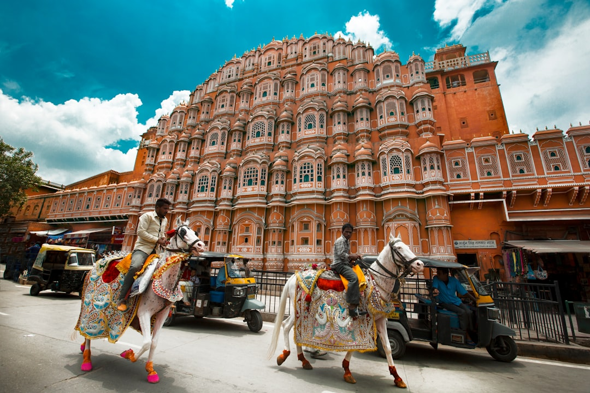

# Jaipur, India

Country: India
Region: Asia

Jaipur is the capital of Rajasthan, India's "Pink City" of around four million on the edge of the Thar desert. The eighteenth-century planned royal capital of the Kachwaha Rajputs, UNESCO-listed for its walled old city, and the western corner of India's classic Golden Triangle (Delhi, Agra, Jaipur).

---

## 🧭 Step 1: Choices

### ✨ Why Visit

Jaipur is one of the few cities in the world planned from scratch on classical Vastu Shastra principles, and the result is a walkable pink-painted grid threaded with palaces, observatories, and bazaars. The Hawa Mahal's lattice screens, the City Palace, the Jantar Mantar's giant astronomical instruments (UNESCO-listed), and the Amber Fort on the ridge above are the headline acts.

The city is also one of India's great craft capitals. Block printing in Bagru and Sanganer, blue pottery, marble inlay, jewelry, and miniature painting all have working ateliers here, many supported by fair-trade cooperatives.

You come for the architecture, the crafts, the Rajput-Mughal hybrid culture, and the desert-edge food (Rajasthani thali is one of India's great vegetarian cuisines).

### 🌍 Ethical Compass

- **💰 Economy.** Buy crafts from cooperative or directly artisan-affiliated shops (Anokhi for block prints, Hot Pink for design with social mission, the Bagru and Sanganer villages directly) rather than tourist-traffic shops with kickback commissions. Eat at *thali* houses, sweet shops, and family restaurants in the old city.
- **👥 Employment.** Hire MoT-registered Rajasthani guides for the City Palace and Amber Fort; freelancers at gates are usually unlicensed. Tip modestly. **Avoid elephant rides at Amber Fort** for animal welfare reasons; walk up, take a jeep, or use the official jeep shuttle.
- **📚 Education.** Read about Rajasthani Rajput history and the Mughal-Rajput political accommodation that built much of Jaipur and Amber. Tom Holland's brief India histories or William Dalrymple's *White Mughals* give context.
- **🌱 Ecology.** Jaipur is hot and dry; refill water from sealed sources or trusted hotels. The Aravalli hills around the city are fragile; stay on paths. Avoid bottled water where filtered supply is available.

---

## 🎒 Step 2: Preparation

### 🔍 Governance Management Traceability

- Most visitors need an **e-Visa** through the official Indian government e-Visa portal.
- **Amber Fort, City Palace, Hawa Mahal, Jantar Mantar** sell tickets at the gate; the **Composite Ticket** bundles several monuments at a discount; verify on the official Rajasthan Tourism portal.
- **Elephant rides at Amber Fort** are under continued animal-welfare scrutiny; verify current operator standards and consider alternatives.
- For **block-print and pottery village visits**, verify the operator is a registered cooperative or fair-trade affiliated.
- **Jaipur Metro** has limited but expanding routes; verify on the official DMRC portal.

### 📡 Information Curation Variety

- **The Hindu (Jaipur edition)** and **The Indian Express Rajasthan** for current news.
- **Rajasthan Tourism** (official) for events, festivals (Pushkar Camel Fair, Jaipur Literature Festival in January).
- A book on Rajasthan: William Dalrymple's *Nine Lives* (Rajasthani stories); the historical novels of Indu Sundaresan on Mughal-Rajput courts.
- A licensed Jaipur guide who can take you into the craft villages.
- **Wikivoyage Jaipur** for orientation.

### 🎯 Inference Interaction Accountability

- **You decide on Amber Fort transport up.** Walk (30 minutes, free), jeep (the right choice), or elephant (animal welfare concerns; consider alternatives).
- **You decide on the Pink City shopping pattern.** The bazaars are intense; aggressive sellers expected. The cooperative-affiliated shops are a different experience.
- **You decide on the Jaipur Literature Festival.** If your January dates align, the festival is one of the world's great literary events; book accommodation months ahead.
- **You decide on the Golden Triangle structure.** Delhi-Agra-Jaipur as a 5- to 7-day loop is the classic; Jaipur deserves at least two days of its own.
- **You decide on heat planning.** April through June are extremely hot; October to March is the practical window.

### 🔄 Intelligence Cooperation Integrity

Rajasthan weather is desert-influenced; summer is brutally hot, winter (December to February) is cool and clear, monsoon (July to September) brings welcome rain. Major Hindu festivals (Diwali, Holi, Teej, Gangaur) reshape the city briefly.

Bring a soft plan. If a sudden heat day makes Amber Fort impossible at noon, the City Palace's air-conditioned wings absorb a midday. If your craft-village visit cancels, an Anokhi Museum visit gives the same context indoors. The city absorbs disruption well.

### 📍 Top 5 Anchor Spots

1. **Amber Fort (Amer).** Walk or jeep up at opening; the Sheesh Mahal (Hall of Mirrors) is the centrepiece. Plan two to three hours.
2. **City Palace, Jantar Mantar, and Hawa Mahal walking circuit.** Half-day in the old city; the Jantar Mantar's eighteenth-century stone astronomical instruments still work.
3. **A block-print or blue-pottery village visit (Bagru, Sanganer, or Neerja Blue Pottery).** Half-day with a registered cooperative-affiliated guide.
4. **Anokhi Museum of Hand Printing.** A small focused museum in a restored haveli that explains the textile traditions; the gift shop benefits the artisans.
5. **Chand Baori (Abhaneri stepwell) day trip.** Two hours from Jaipur; one of the largest and oldest stepwells in India, often combined with Bhangarh.

### 🧰 Practical Essentials

- **Recommended Length.** Two to three days for Jaipur. Add days for the Pushkar Camel Fair (November), the Ranthambore tiger reserve, or the wider Rajasthan circuit (Udaipur, Jodhpur, Jaisalmer).
- **Transport.** Walk in the old city. Auto-rickshaws and Uber for short hops; insist on meter or app fare. The **Jaipur Metro** has limited routes. Hire a car-with-driver for Amber Fort and out-of-city sites. Jaipur International Airport (JAI) is 30 minutes from the centre.
- **Daily Cost (per person).**
  - **Budget:** roughly INR 1,500 to 3,500 (about USD 18 to 42). Guesthouse or budget hotel, thali and street food, autos, major sites with Composite Ticket.
  - **Mid-range:** roughly INR 6,000 to 14,000 (about USD 70 to 170). Heritage haveli or three-star hotel, mixed dining, all major sites with a guided morning, a craft-village day with driver.
  - **Higher-comfort:** roughly INR 25,000 and up. Rambagh Palace, Samode Haveli, or the Oberoi Rajvilas, fine dining at 1135 AD or Suvarna Mahal, private guides, day-trips by chartered vehicle.
- **Booking Notes.**
  - **e-Visa:** apply on the official Indian government portal.
  - **Composite Ticket** at the Albert Hall Museum saves on multiple monument entries.
  - **Jaipur Literature Festival (late January)** is a major event; book accommodation months ahead.
  - **Pushkar Camel Fair (early November)** affects regional accommodation.
  - **Train tickets** from Delhi or Agra: book on the official IRCTC portal.

---

## ✈️ Step 3: Delivery

### 🤖 AI Prompt

Copy this into your own AI assistant, fill in the brackets, and treat the answer as a researcher's draft, not a final plan.

> Please help me plan an ethical visit to Jaipur, India for [NUMBER] days in [MONTH]. I am travelling with [WHO] and my interests are [INTERESTS, e.g. Rajput architecture, crafts, photography, food, Mughal history]. My total budget is around [AMOUNT] and my comfort level is [budget / mid-range / higher-comfort].
>
> Please structure your answer in three steps.
>
> **Step 1: Choices.** Help me decide what to prioritise. Recommend the two or three Jaipur experiences I should not miss given my interests, and one I should consider skipping (an elephant ride at Amber Fort for animal welfare reasons, a kickback-commission souvenir shop, an unlicensed guide at the gate). Briefly explain each trade-off.
>
> **Step 2: Preparation.** Cover all four of the following:
> - **Governance Management Traceability.** What assumptions should I check before I book? Include the Indian e-Visa portal, the Composite Ticket and official Rajasthan Tourism for monuments, current Amber Fort elephant-ride animal-welfare status, registered craft-village cooperative operators, and IRCTC for trains.
> - **Information Curation Variety.** Suggest at least four different source types: one official Indian or Rajasthan source, one Indian news outlet, one author on Rajasthan or Mughal-Rajput history, and one licensed Jaipur guide.
> - **Inference Interaction Accountability.** List the decisions I personally need to make (Amber Fort transport up, craft-shop pattern, festival overlap, Golden Triangle structure, heat planning).
> - **Intelligence Cooperation Integrity.** Build me a soft plan with at least two alternates for likely disruptions (heat day, a festival closing roads, monsoon mud at Amber, a sold-out heritage hotel).
>
> **Step 3: Delivery.** Give me the actual itinerary, day by day, with realistic timings and named monuments. Include at least one craft-village visit and one early-morning Amber Fort. Mark each business as confidently locally owned and fair-trade, or flag for me to verify.
>
> Finally, please remind me at the end to verify your suggestions against:
> 1. Official sources: Rajasthan Tourism, the Indian e-Visa portal, IRCTC for trains, and the official Amber Fort and City Palace portals.
> 2. Real people: a local resident, a Rajasthani guide, or hotel staff who live in Jaipur now.
>
> Treat your output as a researcher's draft. I will make the final calls.

---

Part of **Gyro Governance Ethical Travel: AI-Empowered Guides for Human Adventures**.

Explore more destinations, ethical domains, and AI prompts at [travel.gyrogovernance.com](https://travel.gyrogovernance.com/).
