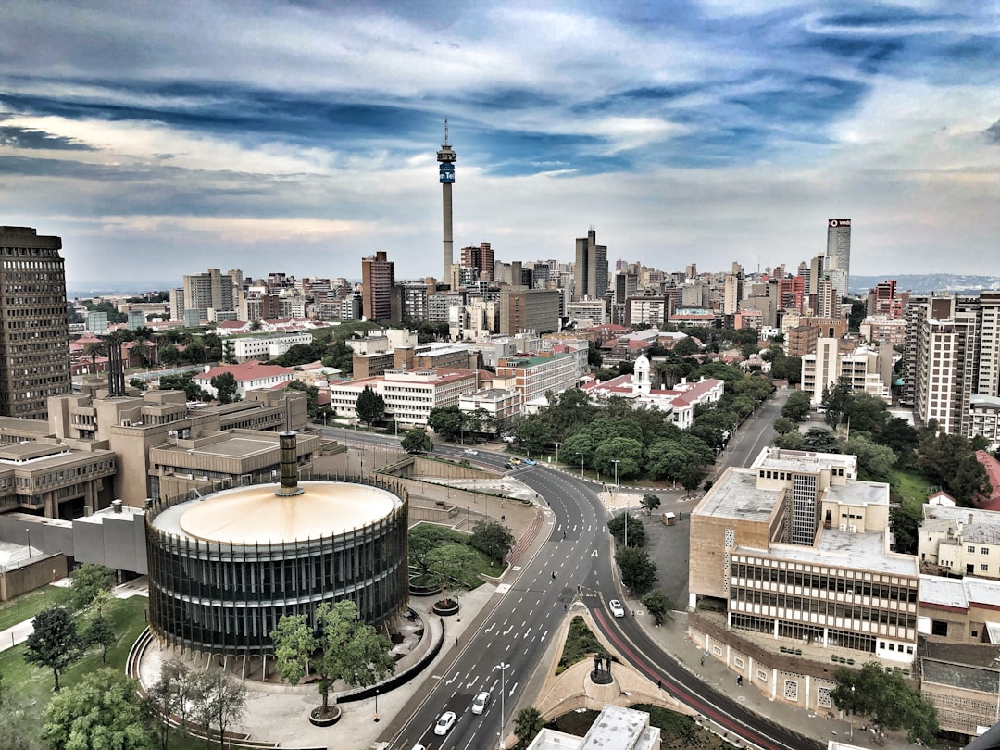

# Johannesburg, South Africa

Country: South Africa
Region: Africa

Johannesburg (*eGoli*, "place of gold", in Zulu) is South Africa's largest city, the economic heart of the country, and Africa's most economically powerful urban area. A 130-year-old gold-rush town turned megalopolis of around six million in the city proper and ten million in Gauteng province, the centre of South African Black political and cultural life and the gateway to Kruger.

---

## 🧭 Step 1: Choices

### ✨ Why Visit

Johannesburg is where modern South Africa was forged. The Apartheid Museum is one of the world's most powerful purpose-built history museums. Soweto, the township that organised the resistance, is a working neighbourhood where Mandela and Tutu lived on the same street. The Cradle of Humankind UNESCO site (Sterkfontein Caves) holds the deepest human evolutionary record on the planet.

The city is also a serious contemporary capital. Maboneng (with caveats; the area has changed) and Braamfontein are gallery and creative quarters. The food scene has matured. Sandton holds the financial district. Johannesburg pulses harder than Cape Town and rewards the visitor willing to engage with that energy.

You come for the modern history, the music and food, and as the gateway to the rest of southern Africa.

### 🌍 Ethical Compass

- **💰 Economy.** Eat at township-restaurant experiences in Soweto (Sakhumzi on Vilakazi Street, Wandies Place) on a guided visit; eat in Maboneng or Braamfontein for the modern creative-city scene; eat in Yeoville for African diaspora cuisine.
- **👥 Employment.** Tipping at restaurants 10 to 15 percent; tip car guards (informal parking attendants) R10 to R20; tip generously at lodges and game-reserve transfers.
- **📚 Education.** Visit the Apartheid Museum, the Hector Pieterson Museum in Soweto, Constitution Hill, the Mandela House, and Liliesleaf Farm. Read at least one South African author: Sindiwe Magona, Mongane Wally Serote, or Antjie Krog.
- **🌱 Ecology.** Use Uber or Bolt for safety and convenience; the Gautrain serves the airport and Sandton-Pretoria axis. Walking in central Johannesburg is best done with a local guide. The Cradle of Humankind protects a UNESCO landscape; respect cave-tour rules.

---

## 🎒 Step 2: Preparation

### 🔍 Governance Management Traceability

- Many visitors are **visa-exempt** for South Africa; verify on the official Department of Home Affairs portal.
- **Soweto tours:** choose resident-led tours rather than bus-window drive-throughs; cooperative operators (Vhupo Tours, Soweto Backpackers) are the right reference.
- **Apartheid Museum and Constitution Hill** sell tickets at the gate; verify hours.
- **Cradle of Humankind (Sterkfontein Caves and Maropeng)** sells tickets on official portals.
- The **Gautrain** connects OR Tambo Airport to Sandton and Pretoria; Gauteng's safest public-transport option for visitors.

### 📡 Information Curation Variety

- **Daily Maverick** and **News24** for serious South African journalism.
- The official **Joburg Tourism** site for events and current advisories.
- A South African author: Sindiwe Magona, Mongane Wally Serote, or Mark Gevisser on Johannesburg specifically.
- A resident-led Soweto tour operator (Vhupo Tours, Lebo's Soweto Backpackers).
- **Wikivoyage Johannesburg** for orientation.

### 🎯 Inference Interaction Accountability

- **You decide on safety strategy.** Johannesburg has high crime in some areas; informed visitors with normal urban awareness rarely have problems. Listen to local advice; do not walk in unfamiliar neighbourhoods after dark.
- **You decide on the Soweto engagement.** A bus-window tour is voyeurism; a resident-led walking visit with conversation, a meal, and time is meaningful. Choose the latter.
- **You decide on the Apartheid Museum.** A serious half-day visit; arrive prepared.
- **You decide on Maboneng.** Once a creative renaissance, the area has had ups and downs. Verify the current status with a local before committing.
- **You decide on Cradle of Humankind.** A full day; the Sterkfontein Caves and Maropeng visitor centre together cover deep human history.

### 🔄 Intelligence Cooperation Integrity

Johannesburg sits at 1,750 metres; summer afternoon thunderstorms (October to April) are dramatic and frequent. Loadshedding (rolling power cuts) is a real factor on most days; most hotels have generators. Major events (Africa Cup of Nations, Comrades Marathon support, Soccer World Cup-era venues) reshape the city briefly.

Bring a soft plan. If a downpour cancels outdoor plans, the Apartheid Museum, Constitution Hill, and the Maboneng galleries absorb a wet half-day. If loadshedding hits the area you wanted to visit, plan around it (apps like EskomSePush show the schedule).

### 📍 Top 5 Anchor Spots

1. **Apartheid Museum.** Half a day, serious. Plan it for when you have energy.
2. **Soweto with a resident-led guide.** Hector Pieterson Memorial, Mandela House on Vilakazi Street, Regina Mundi Church, a meal at a local restaurant.
3. **Constitution Hill.** The Old Fort prison and the new Constitutional Court built into it; an extraordinary site of transition.
4. **Cradle of Humankind (Sterkfontein and Maropeng).** Full day, 45 minutes north of the city.
5. **Braamfontein or Maboneng evening.** The Neighbourgoods Market (Saturday in Braamfontein) is excellent; verify Maboneng's current status before committing.

### 🧰 Practical Essentials

- **Recommended Length.** Two to three days for Johannesburg and Soweto. Add a day for Cradle of Humankind; pair with Pretoria; or use as the gateway for Kruger.
- **Transport.** **Gautrain** for airport-Sandton-Pretoria. **Uber and Bolt** for everything else; cheap, safe, and reliable. Avoid walking in unfamiliar neighbourhoods; avoid taxis hailed from the street. OR Tambo International Airport (JNB) is the largest in Africa; Gautrain reaches Sandton in 15 minutes.
- **Daily Cost (per person).**
  - **Budget:** roughly ZAR 800 to 1,500 (about USD 45 to 85). Backpacker hostel, casual meals, Gautrain and Uber, Apartheid Museum, a resident-led Soweto tour.
  - **Mid-range:** roughly ZAR 2,500 to 5,000 (about USD 140 to 280). Three- or four-star hotel in Rosebank or Sandton, restaurant dinners, all the major museums, a Cradle of Humankind day.
  - **Higher-comfort:** roughly ZAR 8,000 and up. Five-star (Saxon, Four Seasons Westcliff), fine dining at Marble or Wolves, private guides, helicopter Joburg flights.
- **Booking Notes.**
  - **Visa:** verify on the Department of Home Affairs portal.
  - **Soweto tour:** choose a resident-led operator.
  - **Loadshedding:** check the EskomSePush app for daily schedule.
  - **Kruger gateway:** Johannesburg is the typical fly-and-drive or fly-and-transfer point for Kruger National Park.
  - **Major events** (Joy of Jazz Festival, Cape Town/Joburg fashion weeks) book hotels.

---

## ✈️ Step 3: Delivery

### 🤖 AI Prompt

Copy this into your own AI assistant, fill in the brackets, and treat the answer as a researcher's draft, not a final plan.

> Please help me plan an ethical visit to Johannesburg, South Africa for [NUMBER] days in [MONTH]. I am travelling with [WHO] and my interests are [INTERESTS, e.g. apartheid history, Black South African culture, contemporary art, food, gateway to Kruger]. My total budget is around [AMOUNT] and my comfort level is [budget / mid-range / higher-comfort].
>
> Please structure your answer in three steps.
>
> **Step 1: Choices.** Help me decide what to prioritise. Recommend the two or three Johannesburg experiences I should not miss given my interests, and one I should consider skipping (a bus-window Soweto tour, Maboneng without checking current status, walking the CBD without a guide). Briefly explain each trade-off.
>
> **Step 2: Preparation.** Cover all four of the following:
> - **Governance Management Traceability.** What assumptions should I check before I book? Include the Department of Home Affairs visa portal, resident-led Soweto operators, official Apartheid Museum and Constitution Hill, the Gautrain, and loadshedding via the EskomSePush app.
> - **Information Curation Variety.** Suggest at least four different source types: one official South African source, one serious South African news outlet, one South African author, and one Soweto-resident tour operator.
> - **Inference Interaction Accountability.** List the decisions I personally need to make (safety strategy, Soweto engagement style, Apartheid Museum pacing, Maboneng status check, Cradle of Humankind commitment).
> - **Intelligence Cooperation Integrity.** Build me a soft plan with at least two alternates for likely disruptions (loadshedding, summer thunderstorm, a museum closure, a sold-out Soweto tour).
>
> **Step 3: Delivery.** Give me the actual itinerary, day by day, with realistic timings and named neighbourhoods. Include at least one resident-led Soweto day and the Apartheid Museum. Mark each business as confidently locally owned, or flag for me to verify.
>
> Finally, please remind me at the end to verify your suggestions against:
> 1. Official sources: Joburg Tourism, the Department of Home Affairs, and EskomSePush for power schedules.
> 2. Real people: a Soweto-resident guide, a local resident, or hotel staff who live in Johannesburg now.
>
> Treat your output as a researcher's draft. I will make the final calls.

---

Part of **Gyro Governance Ethical Travel: AI-Empowered Guides for Human Adventures**.

Explore more destinations, ethical domains, and AI prompts at [travel.gyrogovernance.com](https://travel.gyrogovernance.com/).
