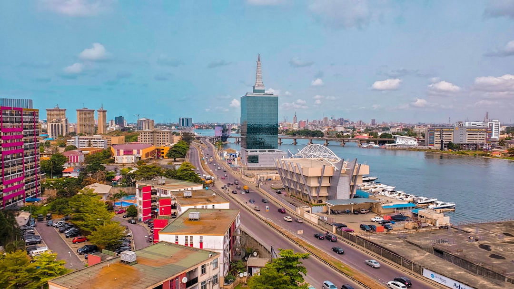

# Lagos, Nigeria

Country: Nigeria
Region: Africa

Lagos is Africa's largest city by metropolitan population, a working megacity of around 22 million on the southwestern Nigerian coast. Commercial capital of West Africa, the heart of Afrobeats and Nollywood, a Yoruba-cultural anchor, and one of the most economically dynamic places on the continent.

---

## 🧭 Step 1: Choices

### ✨ Why Visit

Lagos is the continental capital of contemporary African pop culture. Afrobeats was born here. Nollywood (the world's second-largest film industry by output) operates here. The galleries (Nike Art Gallery, Rele, Kó), the music venues, the rooftop bars of Victoria Island, and the food scene make this an unmatched West African urban experience.

The city is also a serious working capital with major infrastructure pressures: traffic that defies belief, urban inequality, and security considerations that differ by neighbourhood. Visiting Lagos respectfully means engaging the city's reality, not just its highlight reel.

You come for the music, the art, the Nigerian cuisine, and a window onto the future of urban Africa.

### 🌍 Ethical Compass

- **💰 Economy.** Eat at *bukas* (local canteens), *suya* (grilled meat) spots, and Yoruba-cuisine restaurants in Ikeja, Surulere, and Lagos Island rather than only the Victoria Island international chains. Buy from Lekki Arts Market (negotiate), Nike Art Centre, and local designer boutiques on Victoria Island.
- **👥 Employment.** Hire trusted drivers (through your hotel) rather than informal pickup at airport. Tip generously at restaurants (10 to 15 percent), and tip drivers and security generously. Nigerian wages are stretched by inflation.
- **📚 Education.** Read a Nigerian author before you arrive: Chimamanda Ngozi Adichie's *Americanah*, Wole Soyinka, Chinua Achebe, A. Igoni Barrett's *Blackass* (set in Lagos). The National Museum at Onikan has serious Nigerian historical collections.
- **🌱 Ecology.** Lagos air pollution and traffic make walking impractical in much of the city. Use trusted drivers; avoid driving yourself. Plastic-bottle recycling is limited; minimise where possible. Lekki Conservation Centre's canopy walk shows the lagoon ecosystem.

---

## 🎒 Step 2: Preparation

### 🔍 Governance Management Traceability

- Most visitors need a **visa** through the official Nigerian Immigration Service portal; verify your nationality's current rules. **Yellow fever** vaccination is mandatory.
- Check current **travel advisories** from your home government before booking. Lagos itself is broadly fine for prepared visitors with arranged transport; some other Nigerian regions are not.
- **Confirm a trusted driver and pickup** for the airport before arrival; do not improvise.
- For **Nollywood studio visits** or other industry tours, verify the operator through your hotel or a registered Nigerian tour company.
- **Cash:** ATM availability has improved but cash in naira is essential. Bring USD or EUR as backup; use only registered bureaux de change.

### 📡 Information Curation Variety

- **Premium Times** and **The Punch** for serious Nigerian journalism in English.
- **Stears Business** for African business and policy perspective.
- A Nigerian author: Chimamanda Ngozi Adichie, Teju Cole's *Open City* (New York-set but Lagos-resonant), A. Igoni Barrett's *Blackass*.
- A locally led art-and-music tour through a Lagos-based concierge (your hotel can recommend).
- **Wikivoyage Lagos** for neighbourhood orientation and current safety advice.

### 🎯 Inference Interaction Accountability

- **You decide your base.** Victoria Island (corporate, expat, secure, international restaurants), Ikoyi (residential, upmarket), Lekki (newer, beach-adjacent), Lagos Island (historic, daytime only). Each gives a different city.
- **You decide your transport.** Hotel-arranged drivers are the secure default; Uber and Bolt operate but have varying reliability. Do not walk between neighbourhoods at night.
- **You decide on nightlife.** Lagos nightlife is one of Africa's best; Quilox, Hard Rock Café Lagos, smaller VI rooftops. Go with a local or via your hotel concierge.
- **You decide on day-trips.** Badagry (slave-trade history, two hours west), Lekki Conservation Centre (within Lagos), or Tarkwa Bay (beach island, water taxi).
- **You decide your art-and-music engagement.** A Nike Art Gallery visit + a live music night + an Eko Hotel suya dinner is a Lagos crash course.

### 🔄 Intelligence Cooperation Integrity

Lagos weather is tropical; wet season (April to October) brings major rains and flooding in low-lying areas. Traffic is the constant; allow double or triple time for any cross-city journey. Power outages are common; verify your hotel has reliable backup.

Bring a soft plan. If a flood closes a road, the gallery and museum schedule remain. If a major event closes Lagos Island, Victoria Island and Ikoyi continue. If your music night cancels, the next venue is open.

### 📍 Top 5 Anchor Spots

1. **Nike Art Gallery (Lekki).** One of Africa's largest privately owned art galleries; four floors of Nigerian and African contemporary art.
2. **Lekki Conservation Centre.** The longest canopy walk in Africa, in a lagoon-side nature reserve; a real break from the city.
3. **A Yoruba-cuisine lunch + Afrobeats nightlife.** A *jollof* and *suya* meal at a local restaurant; an evening at New Afrika Shrine (the Kuti family club) or Hard Rock Café.
4. **National Museum Onikan + Tafawa Balewa Square area.** Lagos Island historic core, daytime only with a guide.
5. **Tarkwa Bay or Elegushi Beach.** Tarkwa is reached by water taxi from Victoria Island, a quieter beach day; Elegushi is busier and weekend-festive.

### 🧰 Practical Essentials

- **Recommended Length.** Two to four days for Lagos. Add a day for Badagry or onward to other Nigerian cities (Abuja, Calabar, Kano).
- **Transport.** Hotel-arranged drivers for almost everything. Uber and Bolt for some routes. The **BRT (Bus Rapid Transit)** exists but is not recommended for first-time visitors. Murtala Muhammed International Airport (LOS) is 30 minutes to two hours from Victoria Island depending on traffic.
- **Daily Cost (per person).**
  - **Budget:** roughly NGN 30,000 to 70,000 (about USD 20 to 45, but Nigerian naira volatility is real). Mid-range Surulere or Yaba hotel, buka meals, taxis.
  - **Mid-range:** roughly NGN 120,000 to 280,000 (about USD 80 to 185). Three- or four-star VI or Ikoyi hotel, mixed dining, a gallery and a museum day, a music venue night.
  - **Higher-comfort:** roughly NGN 450,000 and up. Eko Hotel & Suites, Wheatbaker, Lagos Continental, fine dining at RSVP or Z Kitchen, private guides for the duration, helicopter to Tarkwa.
- **Booking Notes.**
  - **Visa:** verify on the Nigerian Immigration Service portal; **yellow fever** vaccination mandatory.
  - **Travel advisories:** check your home government's current advisory.
  - **Cash:** bring USD or EUR for backup; the naira's value can shift quickly.
  - **Felabration (October)** celebrates Fela Kuti at the Shrine; an extraordinary cultural week.
  - **Power:** verify your hotel's backup generation.

---

## ✈️ Step 3: Delivery

### 🤖 AI Prompt

Copy this into your own AI assistant, fill in the brackets, and treat the answer as a researcher's draft, not a final plan.

> Please help me plan an ethical visit to Lagos, Nigeria for [NUMBER] days in [MONTH]. I am travelling with [WHO] and my interests are [INTERESTS, e.g. Afrobeats, Nigerian art, Nollywood, food, history]. My total budget is around [AMOUNT] and my comfort level is [budget / mid-range / higher-comfort].
>
> Please structure your answer in three steps.
>
> **Step 1: Choices.** Help me decide what to prioritise. Recommend the two or three Lagos experiences I should not miss given my interests, and one I should consider skipping (an improvised airport pickup, walking between neighbourhoods at night, a music venue without a local). Briefly explain each trade-off.
>
> **Step 2: Preparation.** Cover all four of the following:
> - **Governance Management Traceability.** What assumptions should I check before I book? Include the Nigerian Immigration Service visa portal, yellow-fever requirement, home-government travel advisories, hotel-arranged airport pickup, and verified Lagos tour operators.
> - **Information Curation Variety.** Suggest at least four different source types: one official Nigerian source, one Nigerian news outlet, one Nigerian author, and one Lagos-based hotel concierge or local guide.
> - **Inference Interaction Accountability.** List the decisions I personally need to make (neighbourhood base, transport mode, nightlife approach, day-trip choice, art-and-music engagement).
> - **Intelligence Cooperation Integrity.** Build me a soft plan with at least two alternates for likely disruptions (a flood, severe traffic, a power outage, a security advisory change).
>
> **Step 3: Delivery.** Give me the actual itinerary, day by day, with realistic timings and named neighbourhoods. Include at least one music venue night, one gallery visit (Nike Art Gallery is essential), and one buka meal. Mark each business as confidently locally owned, or flag for me to verify.
>
> Finally, please remind me at the end to verify your suggestions against:
> 1. Official sources: the Nigerian Immigration Service, my home country's current travel advisory, and a Lagos-based hotel concierge.
> 2. Real people: a trusted Lagos driver, a Lagos resident, or hotel staff who live in Lagos now.
>
> Treat your output as a researcher's draft. I will make the final calls.

---

Part of **Gyro Governance Ethical Travel: AI-Empowered Guides for Human Adventures**.

Explore more destinations, ethical domains, and AI prompts at [travel.gyrogovernance.com](https://travel.gyrogovernance.com/).
