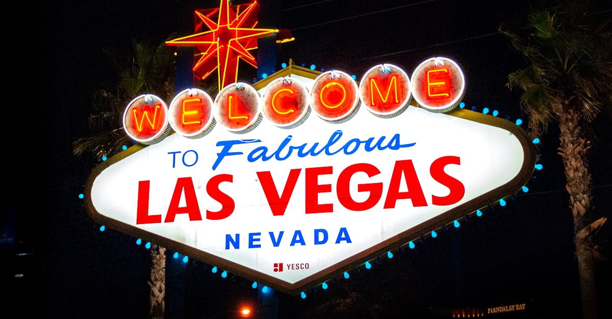

# Las Vegas, United States

Country: United States
Region: Americas

Las Vegas is the largest city in Nevada, a 2.3 million metropolitan area in the Mojave Desert, and the world's most famous casino city. The Strip is a four-mile boulevard of megaresorts; the Mojave Desert, Red Rock Canyon, and the Grand Canyon's south rim sit within a few hours' drive.

---

## 🧭 Step 1: Choices

### ✨ Why Visit

Las Vegas is the most concentrated entertainment city ever built. The Strip's megaresorts (Bellagio, Wynn, the Venetian, Caesars, ARIA, the Cosmopolitan, MGM Grand) compete for visitors with shows, dining, and design at a scale no other city attempts. Headliner residencies, Cirque du Soleil productions, championship boxing and UFC, and the Sphere (the new immersive venue) define the entertainment calendar.

The city is also the gateway to some of the American Southwest's most spectacular natural landscapes. Red Rock Canyon, Valley of Fire State Park, the Hoover Dam, Lake Mead, and the Grand Canyon's south and west rims are all reachable on day trips.

You come for the shows, the food (Vegas has more Michelin-starred and high-profile restaurants per square mile than almost anywhere), the spectacle, and as a base for the Mojave.

### 🌍 Ethical Compass

- **💰 Economy.** Eat at Off-Strip neighbourhood places (the Arts District, Chinatown on Spring Mountain Road, Downtown's Container Park area) for non-megaresort food. The locals' Las Vegas is dramatically different from the Strip's.
- **👥 Employment.** Tip 20 percent at sit-down restaurants; tip dealers when winning (typically a chip or two), bartenders, valet, housekeeping. Las Vegas hospitality wages depend on tipping; the city has one of the strongest service-worker unions (Culinary Union 226).
- **📚 Education.** Read about the history of the city: Mormon-pioneer roots, the Hoover Dam, organised crime in the 1940s to 1970s (the Mob Museum is excellent), the modern corporate megaresort era, and water-scarcity politics in the Southwest.
- **🌱 Ecology.** Las Vegas is in extreme water and energy stress; the megaresorts have begun serious sustainability work, but the city's water budget is real. The Hoover Dam tour explains the Colorado River crisis well. Stay on trails in Red Rock Canyon; the desert ecosystem is fragile.

---

## 🎒 Step 2: Preparation

### 🔍 Governance Management Traceability

- Most international visitors need **ESTA (visa waiver) or a B-2 visa** for the US; verify on the official US State Department portal.
- **Shows, Cirque du Soleil, headliner residencies, the Sphere** sell tickets on official venue portals or Ticketmaster; verify and beware of resale-only sites with markups.
- **Grand Canyon south rim** is a long day (5 hours each way) from Las Vegas; west rim (Skywalk) is closer (2.5 hours each way). Verify operator licensing.
- **Hoover Dam tours** sell tickets through the official US Bureau of Reclamation portal.
- The **monorail and bus** systems serve the Strip; ride-hail (Uber, Lyft) and taxis cover the rest. Walking the Strip is hot in summer and longer than it looks (the resorts are massive).

### 📡 Information Curation Variety

- **Las Vegas Review-Journal** and **KNPR** (Nevada Public Radio) for local news.
- **Visit Las Vegas** (the official tourism site) for events, openings, and shows.
- A book on Las Vegas history: David G. Schwartz's *Roll the Bones*; Hunter S. Thompson's *Fear and Loathing in Las Vegas* (the literary classic).
- A Las Vegas Off-Strip food and Arts District guide for ground-truth.
- **Wikivoyage Las Vegas** for orientation.

### 🎯 Inference Interaction Accountability

- **You decide on the Strip vs Downtown.** The Strip is the megaresort spine; Downtown (Fremont Street) is older Vegas with smaller casinos, the Mob Museum, and a different atmosphere.
- **You decide on the show.** Vegas runs hundreds; the best for first-time visitors are usually a Cirque du Soleil (O at Bellagio, KÀ at MGM Grand), a headliner residency (verify current), or a Sphere immersive experience.
- **You decide on gambling.** No requirement; learn basic strategy if you do; set a strict budget and walk away.
- **You decide on the Grand Canyon.** The south rim is the iconic view but a 10-hour return day; the west rim (Skywalk) is closer and Native American-run.
- **You decide on the Arts District.** The 18b Las Vegas Arts District is the most local-feeling neighbourhood; First Friday is the monthly art-and-food street event.

### 🔄 Intelligence Cooperation Integrity

Las Vegas summers are extreme (40°C+, 105°F+); outdoor walking is dangerous in midday. Winter is mild and ideal. Major convention weeks (CES in January, NAB in April, the World Series of Poker in summer) sell out hotels and push rates dramatically.

Bring a soft plan. If a heat-warning day cancels Red Rock Canyon morning, the megaresort pools and the indoor shows absorb it well. If a sold-out show drops, the half-price ticket booths at the Strip have same-day options. If the Grand Canyon day is weather-cancelled, the Hoover Dam is closer and bookable.

### 📍 Top 5 Anchor Spots

1. **A Cirque du Soleil or major show.** "O" at Bellagio is the classic; verify current residencies.
2. **The Strip from Wynn to Mandalay Bay walk + Bellagio Fountains.** Evening only; the heat of midday makes daytime Strip walking miserable.
3. **Red Rock Canyon scenic loop.** 30 minutes from the Strip; a 13-mile scenic drive with hiking pull-offs. Best at sunrise.
4. **The Mob Museum (Downtown).** Genuinely excellent museum on organised crime in Las Vegas and American history.
5. **Grand Canyon south rim day or overnight, or Hoover Dam half-day.** Pick one major outdoor day-trip.

### 🧰 Practical Essentials

- **Recommended Length.** Three to four days for Las Vegas. Add an overnight for the Grand Canyon if making that trip.
- **Transport.** Walk inside the megaresorts and along the Strip in evening. **The Monorail** runs the eastern Strip. **The Las Vegas Loop** (Tesla tunnels at the Convention Center) is novel. **Uber, Lyft, and taxis** for most other trips. Harry Reid International Airport (LAS) is 5 to 15 minutes from the Strip.
- **Daily Cost (per person).**
  - **Budget:** roughly USD 100 to 180. Off-Strip hotel, casino buffet meals, the Strip walk in evening, a midweek lower-tier show.
  - **Mid-range:** roughly USD 230 to 450. Mid-Strip hotel (Mirage, Treasure Island), Strip and Off-Strip dining mix, a Cirque show, a Red Rock day.
  - **Higher-comfort:** roughly USD 600 and up. Bellagio, Wynn, ARIA, Cosmopolitan, fine dining at Joël Robuchon or Le Bernardin Vegas, premium show seats, Grand Canyon helicopter.
- **Booking Notes.**
  - **ESTA:** apply at least 72 hours before US arrival.
  - **Shows and Cirque:** book on official venue portals; beware resale markups.
  - **Convention weeks** (CES January, NAB April, others): hotel rates can triple.
  - **Resort fee:** most Strip hotels add a daily resort fee on top of room rate; verify on the booking.
  - **Heat:** outdoor activity should be early morning or late evening in summer.

---

## ✈️ Step 3: Delivery

### 🤖 AI Prompt

Copy this into your own AI assistant, fill in the brackets, and treat the answer as a researcher's draft, not a final plan.

> Please help me plan an ethical visit to Las Vegas, United States for [NUMBER] days in [MONTH]. I am travelling with [WHO] and my interests are [INTERESTS, e.g. shows, fine dining, gambling, Red Rock and the Mojave, Grand Canyon]. My total budget is around [AMOUNT] and my comfort level is [budget / mid-range / higher-comfort].
>
> Please structure your answer in three steps.
>
> **Step 1: Choices.** Help me decide what to prioritise. Recommend the two or three Las Vegas experiences I should not miss given my interests, and one I should consider skipping (a daytime Strip walk in summer heat, a resale-only show ticket, a long Grand Canyon south-rim day if I only have two days). Briefly explain each trade-off.
>
> **Step 2: Preparation.** Cover all four of the following:
> - **Governance Management Traceability.** What assumptions should I check before I book? Include the US State Department ESTA, official venue portals for shows, the Bureau of Reclamation Hoover Dam tickets, resort-fee disclosure on hotel bookings, and convention-week hotel rates.
> - **Information Curation Variety.** Suggest at least four different source types: one official Las Vegas source, one local news outlet, one book on Las Vegas history, and one Off-Strip food or Arts District guide.
> - **Inference Interaction Accountability.** List the decisions I personally need to make (Strip vs Downtown, show choice, gambling budget, Grand Canyon day-trip vs Hoover, Arts District time).
> - **Intelligence Cooperation Integrity.** Build me a soft plan with at least two alternates for likely disruptions (extreme heat day, sold-out show, a Grand Canyon weather cancellation, a convention-week hotel price spike).
>
> **Step 3: Delivery.** Give me the actual itinerary, day by day, with realistic timings and named venues. Include at least one Off-Strip neighbourhood evening and one outdoor day. Mark each business as confidently locally owned where I can support local, or flag for me to verify.
>
> Finally, please remind me at the end to verify your suggestions against:
> 1. Official sources: Visit Las Vegas, the official venue portals for shows, the US Bureau of Reclamation (Hoover), and the US State Department for ESTA.
> 2. Real people: a Vegas concierge, a local Off-Strip food guide, or hotel staff who live in Las Vegas now.
>
> Treat your output as a researcher's draft. I will make the final calls.

---

Part of **Gyro Governance Ethical Travel: AI-Empowered Guides for Human Adventures**.

Explore more destinations, ethical domains, and AI prompts at [travel.gyrogovernance.com](https://travel.gyrogovernance.com/).
