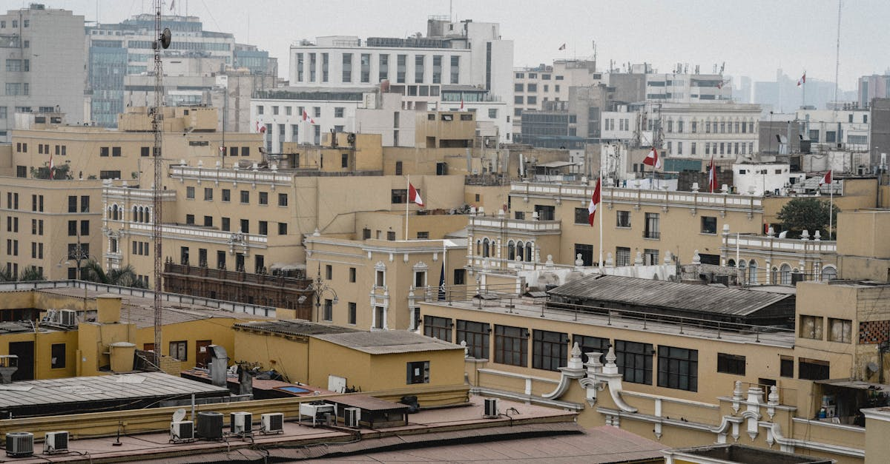

# Lima, Peru

Country: Peru
Region: Americas

Lima is the Peruvian capital, a 10-million-person Pacific-coast city wrapped in coastal fog half the year, and the gastronomic capital of South America. Founded by Pizarro in 1535, the only colonial Spanish capital that survived as the seat of power for South America, and now home to several of the world's top-ranked restaurants.

---

## 🧭 Step 1: Choices

### ✨ Why Visit

Lima is the food city of the Americas. Central, Maido, Mayta, Astrid y Gastón, Kjolle, and Mil are at or near the global top tier of restaurants; *cevicherías* on a budget make Lima the most affordable extraordinary-food city in the world. The country's pre-Columbian wealth (the Larco Museum, the Museum of the Nation) makes Lima a serious archaeology stop too.

The city is also the international gateway for almost everyone heading to Cusco, Machu Picchu, the Sacred Valley, the Amazon, and the Sacred Valley of Colca. Two days in Lima before flying on is a much better trip than zero.

You come for the food, the Pacific coast, the colonial centre, and the pre-Columbian art that anchors any Peruvian itinerary.

### 🌍 Ethical Compass

- **💰 Economy.** Eat at neighbourhood *cevicherías* and *menú del día* lunches in Barranco, Miraflores' side streets, Surquillo Market, and Magdalena. Buy Andean textiles only from cooperatives that pay weavers directly (some Lima-based fair-trade outlets work with Cusco and Puno producers).
- **👥 Employment.** Tip 10 percent at sit-down restaurants. Use Uber, Cabify, or InDriver rather than informal taxis. Hire MoT-licensed guides for the colonial centre and museums.
- **📚 Education.** Read at least one Peruvian author: Mario Vargas Llosa for breadth; Daniel Alarcón for contemporary Lima; the chronicles of Inca Garcilaso de la Vega for early-colonial perspective. Visit the Larco Museum and the Memory Museum (Lugar de la Memoria) for two very different layers of Peruvian history.
- **🌱 Ecology.** Lima sits in coastal desert; water is precious. Refill from sealed sources. The cliff-top Miraflores and Barranco neighbourhoods front the Pacific; the malecón cliff walk is the city's natural amenity. Coastal fog (*la garúa*) defines May to October.

---

## 🎒 Step 2: Preparation

### 🔍 Governance Management Traceability

- Most visitors are **visa-exempt** for Peru; verify on the official Migraciones Peru portal.
- **Top restaurants** (Central, Maido, Kjolle, Mayta, Mil) book months ahead on their official sites; do not assume same-day availability.
- The **Larco Museum** and the major archaeology museums sell tickets at the gate; verify hours on official portals.
- For **historic centre walking**, do so with awareness or with a guide; the Plaza Mayor area is safe in daytime but adjacent streets warrant caution.
- The **Lima Metro Line 1 and 2** serve specific corridors; the Metropolitano BRT covers the coastal axis.

### 📡 Information Curation Variety

- **El Comercio** and **La República** (Peruvian dailies, Spanish) for current news.
- **Andina** for English-language news.
- A Peruvian author: Mario Vargas Llosa, José María Arguedas, Daniel Alarcón.
- A Lima-based food guide or culinary tour (Sky Kitchen, EatPeru, or your top-restaurant concierge).
- **Wikivoyage Lima** for orientation.

### 🎯 Inference Interaction Accountability

- **You decide on the top-restaurant booking.** Central, Maido, and Kjolle book months ahead. If you want one of them, plan accordingly.
- **You decide on Miraflores vs Barranco vs Centro.** Miraflores is convenient and safe; Barranco is bohemian and food-rich; Centro is the colonial centre and best as a day visit with a guide.
- **You decide on the Larco Museum.** A 90-minute to two-hour visit; the pre-Columbian erotic ceramics wing is famous; the cafe in the gardens is excellent.
- **You decide on a cevichería lunch.** A first-class ceviche meal at a working *cevichería* (La Mar, Pescados Capitales, or the neighbourhood spots in Magdalena and Surquillo) is one of the world's great culinary experiences at modest prices.
- **You decide on a Memorial / political-conversation visit.** The Lugar de la Memoria covers the Shining Path internal conflict; serious and important.

### 🔄 Intelligence Cooperation Integrity

Lima weather is unusual: coastal desert with high humidity and almost no rain, but May to October is socked in coastal fog (*la garúa*) and overcast. Summer (December to April) is sunny but not hot. Major political moments occasionally close central Lima.

Bring a soft plan. If the garúa makes the malecón grey, the indoor restaurants and museums absorb a day. If a top-restaurant reservation drops, the next tier is often as good. If a strike closes a road, your Miraflores base remains functional.

### 📍 Top 5 Anchor Spots

1. **A top-restaurant dinner** (Central, Maido, Kjolle, or Mayta), booked months ahead.
2. **Larco Museum** in Pueblo Libre. Pre-Columbian ceramic art at the highest level.
3. **Centro Histórico walking tour with a guide.** Plaza Mayor, the Cathedral, the San Francisco catacombs, the colonial balconies.
4. **Barranco neighbourhood evening.** Plaza Barranco, the Bridge of Sighs, bohemian bars and cevicherías; one of Lima's most pleasant nights.
5. **Miraflores malecón cliff walk and a cevichería lunch.** Walk the cliff-edge park; have ceviche at La Mar or a local cevichería.

### 🧰 Practical Essentials

- **Recommended Length.** Two to three days for Lima; ideal as a stopover at the start or end of a Peru trip.
- **Transport.** Walk Miraflores, Barranco, and the colonial centre (with awareness). **Uber, Cabify, or InDriver** for ride-hail; cheap and easy. The **Metropolitano BRT** runs the coastal axis from north Lima to Miraflores and Barranco. Jorge Chávez International Airport (LIM) is 30 to 60 minutes from Miraflores depending on traffic.
- **Daily Cost (per person).**
  - **Budget:** roughly USD 35 to 70. Miraflores or Barranco hostel, menú del día and cevichería meals, ride-hail, two museums.
  - **Mid-range:** roughly USD 100 to 200. Three- or four-star hotel, mixed dining including one top-tier restaurant booked months ahead, all major museums.
  - **Higher-comfort:** roughly USD 300 and up. Belmond Miraflores Park, Country Club Lima, or a boutique Barranco hotel, fine dining at the world-top-50 restaurants, private guides, day-trips by chartered car.
- **Booking Notes.**
  - **Visa:** verify on the official Migraciones Peru portal.
  - **Top restaurants:** book on their official portals months ahead.
  - **Yellow fever** vaccination required if continuing to Amazon or some other regions; verify.
  - **Garúa season (May to October):** the city is grey and humid; plan accordingly.
  - **Major holidays** (Independence Day 28 July) affect openings.

---

## ✈️ Step 3: Delivery

### 🤖 AI Prompt

Copy this into your own AI assistant, fill in the brackets, and treat the answer as a researcher's draft, not a final plan.

> Please help me plan an ethical visit to Lima, Peru for [NUMBER] days in [MONTH]. I am travelling with [WHO] and my interests are [INTERESTS, e.g. food, pre-Columbian art, colonial history, surfing, the Pacific coast]. My total budget is around [AMOUNT] and my comfort level is [budget / mid-range / higher-comfort].
>
> Please structure your answer in three steps.
>
> **Step 1: Choices.** Help me decide what to prioritise. Recommend the two or three Lima experiences I should not miss given my interests, and one I should consider skipping (a tourist-trap Plaza Mayor restaurant, an informal taxi at the airport, a one-day stopover that gives Lima neither dinner nor museum). Briefly explain each trade-off.
>
> **Step 2: Preparation.** Cover all four of the following:
> - **Governance Management Traceability.** What assumptions should I check before I book? Include the Migraciones Peru visa portal, top-restaurant reservations on official portals, Larco Museum hours, licensed centre-walking guides, and ride-hail safety practice.
> - **Information Curation Variety.** Suggest at least four different source types: one official Peruvian source, one Peruvian news outlet, one Peruvian author, and one Lima-based food or culinary guide.
> - **Inference Interaction Accountability.** List the decisions I personally need to make (top-restaurant commitment, neighbourhood base, Larco visit, cevichería choice, Memoria engagement).
> - **Intelligence Cooperation Integrity.** Build me a soft plan with at least two alternates for likely disruptions (garúa fog week, a top-restaurant reservation drop, a Centro Histórico demonstration, a flight to Cusco delay).
>
> **Step 3: Delivery.** Give me the actual itinerary, day by day, with realistic timings and named neighbourhoods. Include at least one cevichería lunch and one museum half-day. Mark each business as confidently locally owned, or flag for me to verify.
>
> Finally, please remind me at the end to verify your suggestions against:
> 1. Official sources: Migraciones Peru, Visit Peru, the Larco Museum portal, and top-restaurant official portals.
> 2. Real people: a local resident, a Lima-based food guide, or hotel staff who live in Lima now.
>
> Treat your output as a researcher's draft. I will make the final calls.

---

Part of **Gyro Governance Ethical Travel: AI-Empowered Guides for Human Adventures**.

Explore more destinations, ethical domains, and AI prompts at [travel.gyrogovernance.com](https://travel.gyrogovernance.com/).
