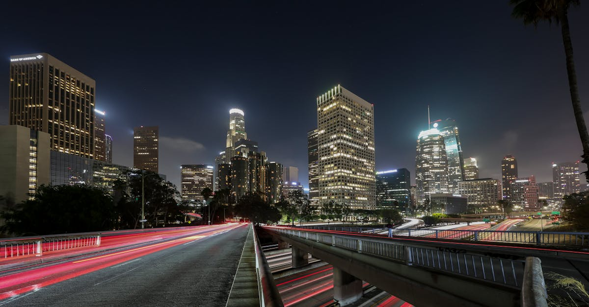

# Los Angeles, United States

Country: United States
Region: Americas

Los Angeles is California's largest city, a 13-million-person Pacific basin sprawl that contains Hollywood, Beverly Hills, downtown LA, Santa Monica, Venice, Compton, East LA, the San Fernando Valley, and a hundred other distinct places stitched together by freeway. The world's entertainment capital and one of its most culturally diverse cities.

---

## 🧭 Step 1: Choices

### ✨ Why Visit

LA is more interesting than the Hollywood postcard suggests. Getty Center and Getty Villa, the Hammer, the Broad, LACMA, MOCA, and the Academy Museum each anchor a different artistic conversation. Griffith Observatory at sunset, Santa Monica and Venice beach, Malibu's surf, and the San Gabriel Mountains all sit within a single county.

The city is also one of the most Latino, Asian, and Black cities in America. Boyle Heights, Koreatown, Little Tokyo, Thai Town, Little Ethiopia, and Leimert Park are real working neighbourhoods with their own cultural depth. Visiting only the Westside is the most common LA mistake.

You come for the museums, the food (one of the country's most diverse), the beaches, and a city that is gradually getting better at being walkable in pockets.

### 🌍 Ethical Compass

- **💰 Economy.** Eat in neighbourhood: Koreatown for Korean BBQ, Boyle Heights for tacos and mariachi, Little Tokyo for ramen, Thai Town for night-market food, Leimert Park for soul food, Grand Central Market downtown. Avoid limiting yourself to Westside chains.
- **👥 Employment.** Tip 20 percent at sit-down restaurants; tip Uber and Lyft drivers; tip valet, housekeeping. California minimum wage is higher than most states but rents are very high; tipping matters.
- **📚 Education.** Read about LA's actual history: the Tongva people who lived here first; the Mexican period (LA was Mexico until 1848); the Watts and Rodney King uprisings; the Japanese-American internment (Manzanar is reachable). Visit the Japanese American National Museum in Little Tokyo and the California African American Museum.
- **🌱 Ecology.** Driving is the default but Metro Rail has expanded substantially in recent years. The new Crenshaw Line and LAX/Metro Transit Center connection make airport-to-city trips possible without ride-hail. Walk in actual walkable neighbourhoods (Old Pasadena, Larchmont, Abbot Kinney, downtown core).

---

## 🎒 Step 2: Preparation

### 🔍 Governance Management

- Most international visitors need **ESTA (visa waiver) or a B-2 visa** for the US; verify on the official US State Department portal.
- **Getty Center and Getty Villa** are free, but require advance parking reservations (Getty Center) or timed tickets (Getty Villa); book on official portals.
- **The Broad** is free but requires advance timed tickets on the official portal; book days ahead.
- **Studio tours** (Warner Bros., Sony, Paramount, Universal) sell official tickets through the studios; verify timed entry.
- **LA Metro** (rail and bus) uses TAP cards or contactless; the LAX/Metro Transit Center connection is the easiest airport transit option.

### 📡 Information Curation

- **Los Angeles Times** and **LAist** for serious local journalism.
- **Discover Los Angeles** (the official tourism site) for events and openings.
- An LA author: Joan Didion's essays (foundational); Walter Mosley for Black LA; Mike Davis's *City of Quartz* for the political history; Salvador Plascencia for Mexican-American LA.
- A neighbourhood food guide or walking tour focused on Boyle Heights, Koreatown, or Leimert Park.
- **Wikivoyage Los Angeles** for orientation.

### 🎯 Inference Interaction

- **You decide on neighbourhood depth.** A trip that never leaves Hollywood, Beverly Hills, and Santa Monica is incomplete. Add at least one day in Boyle Heights, Koreatown, Little Tokyo, or Leimert Park.
- **You decide on the car.** Renting a car gives flexibility; Metro Rail covers more than it used to; Uber and Lyft for short hops. The right answer depends on where you stay.
- **You decide on the Hollywood tour.** Studio tours are real working studios; the Walk of Fame and Hollywood Boulevard area itself is largely tourist trap.
- **You decide on the beach.** Santa Monica is the postcard, Venice is the scene, El Matador in Malibu is the dramatic photo, Hermosa or Manhattan are the local-feel.
- **You decide on Disneyland.** It is in Anaheim (Orange County), a separate full-day trip; book official tickets.

### 🔄 Intelligence Cooperation

LA weather is Mediterranean and reliable; the rare rain shuts the city briefly. Wildfires increasingly affect the region in late summer and autumn; air quality varies. Major events (Oscars, awards-season red carpets, the LA Marathon, Coachella nearby) reshape traffic and neighbourhoods.

Bring a soft plan. If wildfire smoke degrades air quality, indoor museums and the Grand Central Market absorb a bad day. If a freeway closes, surface streets work (slowly). If the beach is socked in May Gray or June Gloom, the Getty Center is in the sun.

### 📍 Top 5 Anchor Spots

1. **Getty Center.** Free general admission; advance parking reservation. Plan three to four hours; the architecture, the gardens, and the collection together.
2. **Griffith Observatory at sunset.** Free; arrive an hour before sunset; walk the planetarium and exhibits, then watch the city light up.
3. **A neighbourhood food day: Koreatown, Boyle Heights, or Little Tokyo.** A street-food crawl with a local guide.
4. **The Broad + LACMA + a downtown walk.** Free Broad with timed ticket; LACMA's Urban Light; the Grand Central Market for lunch.
5. **Santa Monica and Venice walk + Pacific Ocean sunset.** The pier, the boardwalk, the Venice canals. A West LA half-day.

### 🧰 Practical Essentials

- **Recommended Length.** Four to seven days for LA. Add days for Disneyland (Anaheim), Joshua Tree, or San Diego.
- **Transport.** **Renting a car** is the historic default but **Metro Rail** has expanded; **LAX/Metro Transit Center** now connects to the new Crenshaw Line. **Uber and Lyft** are reliable. The Metro Bike-share works in pockets.
- **Daily Cost (per person).**
  - **Budget:** roughly USD 100 to 180. Hostel or budget motel, food-truck and taqueria meals, Metro Rail, free museums, free beaches.
  - **Mid-range:** roughly USD 250 to 450. Three-star hotel, restaurant dinners, rental car, all major museums, a studio tour.
  - **Higher-comfort:** roughly USD 600 and up. Beverly Hills or Santa Monica hotel (Beverly Hills Hotel, Shutters, Hotel Bel-Air), fine dining at Providence, n/naka, or Bestia, private guides, helicopter LA tour.
- **Booking Notes.**
  - **ESTA:** apply at least 72 hours before US arrival.
  - **Getty Center parking, Getty Villa tickets, the Broad** all need advance reservations.
  - **Studio tours** book on the official studio portals.
  - **Awards season (January to early March)** reshapes parts of the city.
  - **Wildfire season** (late summer to autumn): air quality and freeway closures possible.

---

## ✈️ Step 3: Delivery

### 🤖 AI Prompt

Copy this into your own AI assistant, fill in the brackets, and treat the answer as a researcher's draft, not a final plan.

> Please help me plan an ethical visit to Los Angeles, United States for [NUMBER] days in [MONTH]. I am travelling with [WHO] and my interests are [INTERESTS, e.g. art and architecture, food, beaches, Hollywood and entertainment, contemporary Black/Latino/Asian LA]. My total budget is around [AMOUNT] and my comfort level is [budget / mid-range / higher-comfort].
>
> Please structure your answer in three steps.
>
> **Step 1: Choices.** Help me decide what to prioritise. Recommend the two or three LA experiences I should not miss given my interests, and one I should consider skipping (the Walk of Fame area itself, a Westside-only itinerary, a freeway commute when a Metro Rail trip works). Briefly explain each trade-off.
>
> **Step 2: Preparation.** Cover all four of the following:
> - **Governance Management.** What assumptions should I check before I book? Include the US State Department ESTA, advance reservations for Getty Center parking and the Broad, official studio-tour portals, LA Metro TAP/contactless, and wildfire-season air quality.
> - **Information Curation.** Suggest at least four different source types: one official LA tourism source, one local news outlet (LA Times or LAist), one LA author, and one neighbourhood-led food or walking guide (Boyle Heights, Koreatown, Little Tokyo, or Leimert Park).
> - **Inference Interaction.** List the decisions I personally need to make (neighbourhood depth, rental car vs Metro, Hollywood tour ethics, beach choice, Disneyland day commitment).
> - **Intelligence Cooperation.** How should I trust my own judgment and local advice over algorithmic defaults when conditions change? Build me a soft plan with at least two alternates for likely disruptions (wildfire smoke, a freeway closure, May Gray/June Gloom coastal fog, a sold-out studio tour).
>
> **Step 3: Delivery.** Give me the actual itinerary, day by day, with realistic timings and named neighbourhoods. Include at least one neighbourhood beyond the Westside (Boyle Heights, Koreatown, Little Tokyo, or Leimert Park) and the Griffith Observatory at sunset. Mark each business as confidently locally owned, or flag for me to verify.
>
> Finally, please remind me at the end to verify your suggestions against:
> 1. Official sources: Discover Los Angeles, LA Metro, the Getty and Broad portals, and the US State Department for ESTA.
> 2. Real people: a local resident, a neighbourhood food guide, or hotel staff who live in LA now.
>
> Treat your output as a researcher's draft. I will make the final calls.

---

Part of **Gyro Governance Ethical Travel: AI-Empowered Guides for Human Adventures**.

Explore more destinations, ethical domains, and AI prompts at [travel.gyrogovernance.com](https://travel.gyrogovernance.com/).
