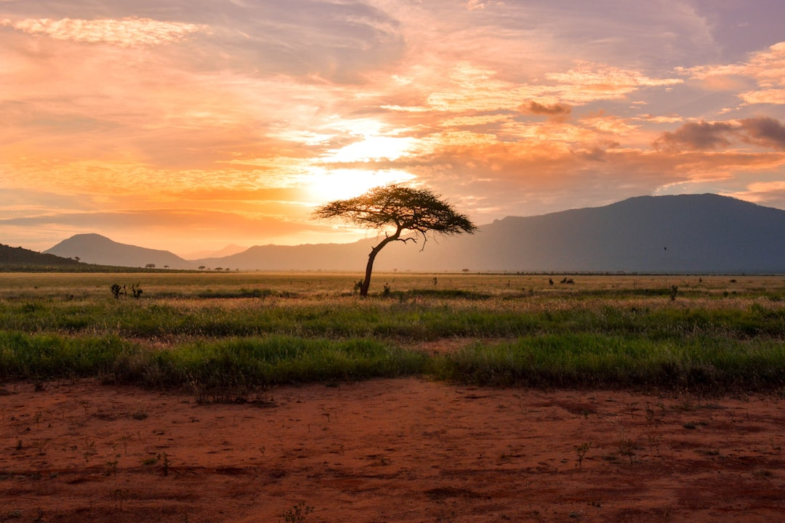

# Maasai Mara, Kenya

Country: Kenya
Region: Africa

The Maasai Mara National Reserve is Kenya's flagship wildlife reserve, a roughly 1,500 square kilometre stretch of savannah in the south-west of the country, continuous with the Serengeti across the Tanzanian border. Home to the annual Great Migration river crossings, exceptional big-cat density, and Maasai pastoralist communities whose land surrounds and includes the conservancies.

---

## 🧭 Step 1: Choices

### ✨ Why Visit

The Mara is the setting for the most photographed wildlife event on Earth: the Great Migration, when more than a million wildebeest and zebra cross the Mara River between roughly July and October. The Mara also has the densest lion and cheetah populations in East Africa, classic acacia-dotted savannah, and the **Maasai Mara conservancies** (Mara North, Naboisho, Olare Motorogi, Ol Kinyei) on the reserve's edges, which combine conservation with direct Maasai community-benefit models.

The destination is also a working example of how community-based conservation can be done. The conservancies' lease-fee model pays Maasai landowners directly; the reserve's revenue model is more contested.

You come for the migration, the cats, the savannah, and a chance to engage with one of the world's most-studied wildlife systems and the Maasai community-conservation movement.

### 🌍 Ethical Compass

- **💰 Economy.** Choose camps in the **Maasai Mara conservancies** (Mara North, Naboisho, Olare Motorogi, Ol Kinyei, Mara Triangle's community trust) rather than only the highest-volume reserve-side lodges. The conservancies' lease fees go directly to Maasai landowners.
- **👥 Employment.** Tip game drivers, spotters, camp staff, and Maasai guides generously (USD 10 to 20 per guide per day, plus shared tip pool for staff). Tipping is the largest single line item of camp-staff compensation.
- **📚 Education.** Read about pastoralist Maasai culture, the history of colonial protected-area creation in Kenya, and the contemporary community-conservation models. Visit a Maasai *manyatta* (village) with a guide arranged through your camp; avoid the highway tourist villages that exist purely for performance.
- **🌱 Ecology.** Stay in the vehicle on game drives (the Maasai Mara reserve has stricter rules than some conservancies). Do not crowd a sighting; rotate. Walking and night drives are conservancy-exclusive privileges. Plastic-bag ban applies in Kenya; do not bring any.

---

## 🎒 Step 2: Preparation

### 🔍 Governance Management Traceability

- Many visitors are **visa-eligible via the eTA (Electronic Travel Authorization)**; verify on the official Kenyan government eTA portal. Yellow fever vaccination may be required from certain origins.
- **Reserve and conservancy fees** are separate and substantial; verify current pricing on the official Narok County or specific-conservancy portal. Reserve fee at the entrance gate; conservancy fees included in lodge rate.
- **Plastic bags are banned** in Kenya; do not bring any.
- For **migration timing**, river crossings cannot be guaranteed on a given day; verify recent reports with your operator before committing to dates.
- **Hot-air balloon safari:** verify operator certification and safety record on the official Kenya Civil Aviation Authority portal.

### 📡 Information Curation Variety

- **Daily Nation** (Kenyan English daily) and **BBC Africa** for regional news.
- The official **Kenya Wildlife Service** and **Magical Kenya** (official tourism) portals.
- A book on the Mara and East African conservation: Joyce Poole on elephants; Bryan Christy's *The Lizard King* and other recent wildlife journalism; Mark Deeble and Vicky Stone's natural-history documentary perspective.
- A Maasai community-conservancy guide (Naboisho, Mara North, or Ol Kinyei conservancy lodges arrange these).
- **Wikivoyage Maasai Mara** for orientation.

### 🎯 Inference Interaction Accountability

- **You decide on the conservancy.** Reserve-side lodges (Sekenani, Talek areas) are cheaper and busier; conservancy lodges (Mara North, Naboisho, Olare Motorogi, Ol Kinyei) are more expensive, less crowded, with off-road and walking and night-drive privileges, and direct community-lease-fee benefit.
- **You decide on migration timing.** July to October is the classic window; the river crossings are unpredictable within that window. Be honest with yourself about the risk that you may not see one.
- **You decide on a balloon safari.** Spectacular, expensive, and ecologically debated (noise, fuel). Choose only certified operators.
- **You decide on a Maasai village visit.** Through your camp with proper protocol is meaningful; a roadside performance village is not.
- **You decide on flight vs drive.** A small bush flight from Nairobi (Wilson Airport) takes 45 minutes; the drive is six to eight hours. The flight costs more; the drive is wearing.

### 🔄 Intelligence Cooperation Integrity

Mara weather is two-season: long rains (March to May), short rains (October to early December), dry seasons in between. The migration is in the Mara roughly July to October, in the Serengeti the rest of the year. River crossings cannot be predicted on a daily basis; flexibility is essential.

Bring a soft plan. If your river-crossing day produces no crossing, the other days deliver elsewhere. If long rains create boggy tracks, your conservancy guides know alternative routes. If a balloon is grounded by wind, the morning drive continues.

### 📍 Top 5 Anchor Spots (Zones and Sectors)

1. **Maasai Mara National Reserve (eastern sector, around Sekenani and Talek).** The main reserve area; busy but high wildlife density; the Mara River crossings are here in season.
2. **Mara North Conservancy.** Just north of the reserve; off-road driving, walking safaris, night drives; community-lease model.
3. **Naboisho and Olare Motorogi Conservancies.** Further north; some of the densest big-cat populations in Africa; lower vehicle density.
4. **Mara Triangle (western reserve sector).** Managed by the Mara Conservancy NGO; better road network; fewer vehicles than the eastern reserve; community-revenue model.
5. **Ol Kinyei Conservancy.** Small, low-vehicle-density conservancy with deep Maasai community-benefit links.

### 🧰 Practical Essentials

- **Recommended Length.** Three days minimum in the Mara; five days for serious wildlife. Combine with Amboseli, Samburu, or the coast for a longer Kenya trip.
- **Getting There and Around.** Fly from **Nairobi Wilson Airport (WIL)** to one of several Mara airstrips (Keekorok, Olkiombo, Mara North, Musiara) on SafariLink or AirKenya; 45 minutes. Or drive (6 to 8 hours; rough roads). In the Mara: lodge-operated 4x4 game drives with the lodge's own guides.
- **Daily Cost (per person, all-inclusive).**
  - **Budget:** roughly USD 200 to 400. Public-camp accommodation or budget lodge on reserve edge, vehicle game drives, drive-in.
  - **Mid-range:** roughly USD 500 to 900. Tented camp in a conservancy or established reserve-edge lodge, full board, two game drives per day, fly-in option.
  - **Higher-comfort:** roughly USD 1,500 and up (sometimes substantially more). Premium conservancy camps (Cottar's 1920s, Mara Plains, Naboisho Camp), full board, expert guides, walking and night-drive privileges, hot-air balloon.
- **Booking Notes.**
  - **eTA:** apply on the official Kenyan portal before flying.
  - **Yellow fever:** verify whether required from your origin.
  - **Migration timing:** rough window is July to October but the river crossings are unpredictable.
  - **Reserve and conservancy fees:** verify current pricing; substantial.
  - **Plastic-bag ban:** strictly enforced.

---

## ✈️ Step 3: Delivery

### 🤖 AI Prompt

Copy this into your own AI assistant, fill in the brackets, and treat the answer as a researcher's draft, not a final plan.

> Please help me plan an ethical visit to the Maasai Mara, Kenya for [NUMBER] days in [MONTH]. I am travelling with [WHO] and my interests are [INTERESTS, e.g. Great Migration, big cats, Maasai culture, photography, walking safari]. My total budget is around [AMOUNT] and my comfort level is [budget / mid-range / higher-comfort].
>
> Please structure your answer in three steps.
>
> **Step 1: Choices.** Help me decide what to prioritise. Recommend the best combination of reserve and conservancy and the two or three experiences I should not miss, and one I should consider skipping (a high-volume reserve-edge lodge when a conservancy is steps better for ethics, a balloon safari if my budget is tight, a Maasai village performance that exists purely for tourists). Briefly explain each trade-off.
>
> **Step 2: Preparation.** Cover all four of the following:
> - **Governance Management Traceability.** What assumptions should I check before I book? Include the Kenyan eTA portal, current reserve and conservancy fees, yellow-fever requirement, hot-air balloon certification, and the plastic-bag ban.
> - **Information Curation Variety.** Suggest at least four different source types: Magical Kenya official, Kenyan news (Daily Nation), a book on the Mara or East African conservation, and a Maasai-community-conservancy lodge or guide.
> - **Inference Interaction Accountability.** List the decisions I personally need to make (reserve vs conservancy, migration timing risk, balloon, Maasai village engagement, fly-in vs drive-in).
> - **Intelligence Cooperation Integrity.** Build me a soft plan with at least two alternates for likely disruptions (no migration river crossings on my dates, boggy tracks in rains, a balloon weather cancellation, a sighting jam).
>
> **Step 3: Delivery.** Give me the actual itinerary, day by day, with realistic timings and named camps or conservancies. Include at least one conservancy night and one Maasai-guide-led experience. Mark each camp as confidently community-benefit-aligned, or flag for me to verify.
>
> Finally, please remind me at the end to verify your suggestions against:
> 1. Official sources: Magical Kenya, the Kenya Wildlife Service, Kenyan eTA, and the specific conservancy's portal.
> 2. Real people: a Maasai guide, a camp manager in the Mara, or a Kenya-based safari operator.
>
> Treat your output as a researcher's draft. I will make the final calls.

---

Part of **Gyro Governance Ethical Travel: AI-Empowered Guides for Human Adventures**.

Explore more destinations, ethical domains, and AI prompts at [travel.gyrogovernance.com](https://travel.gyrogovernance.com/).
