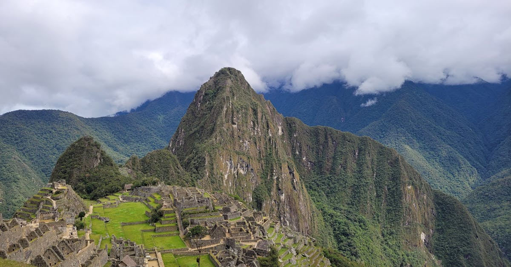

# Machu Picchu, Peru

Country: Peru
Region: Americas

Machu Picchu is the fifteenth-century Inca citadel built on a ridge at 2,430 metres above the Urubamba River in southern Peru. UNESCO World Heritage-listed, capacity-controlled, and one of the most-visited and most-photographed archaeological sites on Earth.

---

## 🧭 Step 1: Choices

### ✨ Why Visit

Machu Picchu is one of the few places where the photograph does not prepare you. The scale, the precision of the masonry, the cloud-forest setting, and the way the Inca engineers placed the site against the surrounding peaks (Huayna Picchu, Machu Picchu Mountain, Putucusi) are only visible in person.

The site is also one of the most actively managed in world heritage. Capacity is capped at less than 5,000 visitors per day; visitors enter through assigned timed-entry **circuits** with route restrictions; tickets are personalised and identity-checked. Visiting respectfully means engaging this system, not trying to work around it.

You come because not visiting is unthinkable if you are in this part of the world, and you give it the time it deserves: ideally two visits across two days.

### 🌍 Ethical Compass

- **💰 Economy.** Stay in **Aguas Calientes (Machu Picchu Pueblo)** in the valley below for the dawn first-bus-up option, or in **Ollantaytambo** or **Cusco** for cheaper rates and bigger choice. The in-park Belmond Sanctuary Lodge is the only hotel at the gate and prices accordingly. Eat in Aguas Calientes town centre, not the highest-tier tourist row.
- **👥 Employment.** Hire **MINCETUR-registered Peruvian guides** at the site; freelance guides outside the gate may be unlicensed. Tip guides, porters (on the Inca Trail), and lodge staff fairly. Local communities along the Sacred Valley and the Inca Trail depend on Machu Picchu's visitor economy.
- **📚 Education.** Read about the site before you go. Hiram Bingham's *Lost City of the Incas* (with caveats; Bingham did not "discover" what local farmers already knew). Modern scholarship: Richard Burger and Lucy Salazar's work; Susan Niles on Inca masonry.
- **🌱 Ecology.** Stay strictly on the marked circuits. Do not bring single-use plastics, food, or large bags into the site. Do not attempt off-trail photography; rangers will turn you back.

---

## 🎒 Step 2: Preparation

### 🔍 Governance Management

- Most travellers are **visa-exempt** for Peru; verify on the Migraciones Peru portal.
- **Machu Picchu tickets** are sold on the official Peruvian Ministry of Culture portal (tuboleto.cultura.pe). Multiple **circuits** exist with route restrictions; the rules have changed repeatedly. Verify **current circuits, capacities, time slots, and which circuits combine with Huayna Picchu, Machu Picchu Mountain, or Huchuy Picchu** before booking.
- **Tickets are personalised**: bring the matching passport to the gate. They are not transferable.
- The **Inca Trail** is permit-controlled with a strict daily quota; permits sell out months ahead; book through a **SERNANP-registered operator** (official list on SERNANP portal).
- **Train tickets to Aguas Calientes** are run by **PeruRail** and **Inca Rail**; book on official portals weeks ahead in peak season.

### 📡 Information Curation

- The **Peruvian Ministry of Culture** portal for site rules and circuits.
- **SERNANP** for the Inca Trail permits and trekking rules.
- **El Comercio** and **Andina** for current Peruvian news affecting the site (strikes, weather closures).
- A book on Inca history: Kim MacQuarrie's *The Last Days of the Incas* (popular); Richard Burger and Lucy Salazar (academic on Machu Picchu specifically).
- A MINCETUR-licensed guide and the **Centro de Textiles Tradicionales del Cusco** for Andean cultural context.

### 🎯 Inference Interaction

- **You decide on the number of visits.** Two days at the site (with two separate timed tickets and two different circuits) gives you a complete read. One visit can feel rushed. The half-price next-day option historically existed; verify current rules.
- **You decide on the trek vs train.** The classic Inca Trail (4 days, permit, book months ahead) is the most meaningful approach. Salkantay (4 to 5 days, no permit cap) is alternative. The train-only option is fine for the time-limited.
- **You decide on circuit.** The Ministry of Culture portal currently sells distinct circuits with different routes and combinations (sun gate, Huayna Picchu, Machu Picchu Mountain, terraces, classic photographs). Verify which circuit gives the experience you want.
- **You decide on the dawn first-bus.** Bus from Aguas Calientes starts before 6 am; queue early to ride the first up. Or the late-afternoon slot for the empty-site experience.
- **You decide on your guide.** A serious Peruvian guide changes the experience; freelancers may misinform.

### 🔄 Intelligence Cooperation

The Sacred Valley and Machu Picchu region have unpredictable weather. Wet season (December to March) closes the Inca Trail in February for restoration; the site itself stays open but circuits may be slick. Dry season (May to September) is the practical visitor window. Strikes (*paros*) occasionally close roads or rail lines.

Bring a soft plan. If a paro closes the train, your dates may slip; build buffer days. If a wet morning fogs the site, often it clears by mid-morning; stay on the circuit and wait. If your Inca Trail permit drops, Salkantay and Lares are good alternatives.

### 📍 Top 5 Anchor Spots (Site and Approaches)

1. **The classic photograph viewpoint (Caretaker's Hut / Sun Gate angle).** Circuit dependent; verify which current circuit includes it.
2. **Huayna Picchu summit.** Limited capacity, separate ticket combination, steep climb. Spectacular.
3. **Machu Picchu Mountain summit.** Longer, less steep, more open view than Huayna Picchu; separate ticket combination.
4. **The Sacred Plaza, Temple of the Sun, and Intihuatana stone.** The ceremonial heart of the site.
5. **The agricultural terraces and lower urban sector.** Often less crowded; the engineering is staggering.

### 🧰 Practical Essentials

- **Recommended Length.** **One full day at the site** is minimum; **two days with two timed tickets** is ideal. **Three to five days in the Sacred Valley region** (Cusco, Ollantaytambo, Aguas Calientes) is the realistic full trip.
- **Getting There and Around.** Fly into **Cusco Alejandro Velasco Astete Airport (CUZ)** or via Lima. Take a **PeruRail or Inca Rail train** from Ollantaytambo (or seasonally Poroy) to **Aguas Calientes**; from there, **shuttle bus** up to the site (or a steep two-hour walk). Inside the site: walking only, follow your circuit.
- **Daily Cost (per person).**
  - **Budget:** roughly USD 80 to 150 for site day. Budget Aguas Calientes hostel, basic ticket, shuttle bus, no guide.
  - **Mid-range:** roughly USD 200 to 400 for site day. Mid-range Aguas Calientes hotel, ticket + Huayna Picchu, MINCETUR-licensed guide, shuttle bus.
  - **Higher-comfort:** roughly USD 600 and up for site day. Belmond Sanctuary Lodge at the gate, private MINCETUR-licensed guide, Huayna Picchu or Machu Picchu Mountain combination.
  - **Plus** train and accommodation outside the site.
- **Booking Notes.**
  - **Tickets:** book on the official Ministry of Culture portal weeks (or months in peak season) ahead.
  - **Circuit rules:** verify current circuits and their content on the official portal; they have changed multiple times.
  - **Personalised tickets:** bring matching passport.
  - **Inca Trail permits:** book three to six months ahead in peak season.
  - **Train tickets:** book weeks ahead in dry season.

---

## ✈️ Step 3: Delivery

### 🤖 AI Prompt

Copy this into your own AI assistant, fill in the brackets, and treat the answer as a researcher's draft, not a final plan.

> Please help me plan an ethical visit to Machu Picchu, Peru for [NUMBER] days in [MONTH] (counting the days at the site and necessary approach days). I am travelling with [WHO] and my interests are [INTERESTS, e.g. Inca history, classic photograph, Huayna Picchu climb, the Inca Trail trek]. My total budget is around [AMOUNT] and my comfort level is [budget / mid-range / higher-comfort].
>
> Please structure your answer in three steps.
>
> **Step 1: Choices.** Help me decide what to prioritise. Recommend the best combination of circuit, Huayna Picchu or Machu Picchu Mountain, single visit vs two visits, and trek vs train approach. Identify one I should consider skipping (a one-day in-and-out without a guide, an unlicensed gate guide, an Inca Trail without proper acclimatisation). Briefly explain each trade-off.
>
> **Step 2: Preparation.** Cover all four of the following:
> - **Governance Management.** What assumptions should I check before I book? Include the official Ministry of Culture portal for circuits and capacities, SERNANP-registered Inca Trail operators, PeruRail and Inca Rail official portals, the personalised-ticket rule, and current paro (strike) reports.
> - **Information Curation.** Suggest at least four different source types: the Ministry of Culture, SERNANP, an Inca history book (Kim MacQuarrie or Richard Burger), and a MINCETUR-licensed Peruvian guide.
> - **Inference Interaction.** List the decisions I personally need to make (one visit vs two, trek vs train, circuit choice, guide commitment, dawn first-bus vs late-afternoon).
> - **Intelligence Cooperation.** How should I trust my own judgment and local advice over algorithmic defaults when conditions change? Build me a soft plan with at least two alternates for likely disruptions (a paro closing the train, a wet-morning fog, sold-out Huayna Picchu, altitude problems delaying the trip).
>
> **Step 3: Delivery.** Give me the actual itinerary, day by day, with realistic timings, train booking, shuttle, and the named circuit I should book. Include at least one MINCETUR-licensed guide for the site itself. Mark each operator and ticket as confidently aligned with official rules, or flag for me to verify.
>
> Finally, please remind me at the end to verify your suggestions against:
> 1. Official sources: the Peruvian Ministry of Culture (tuboleto.cultura.pe), SERNANP for treks, and PeruRail or Inca Rail for trains.
> 2. Real people: a MINCETUR-licensed guide, a Cusco or Aguas Calientes hotel concierge, or a known Peru-based safari operator.
>
> Treat your output as a researcher's draft. I will make the final calls.

---

Part of **Gyro Governance Ethical Travel: AI-Empowered Guides for Humane Adventures**.

Explore more destinations, ethical domains, and AI prompts at [travel.gyrogovernance.com](https://travel.gyrogovernance.com/).
