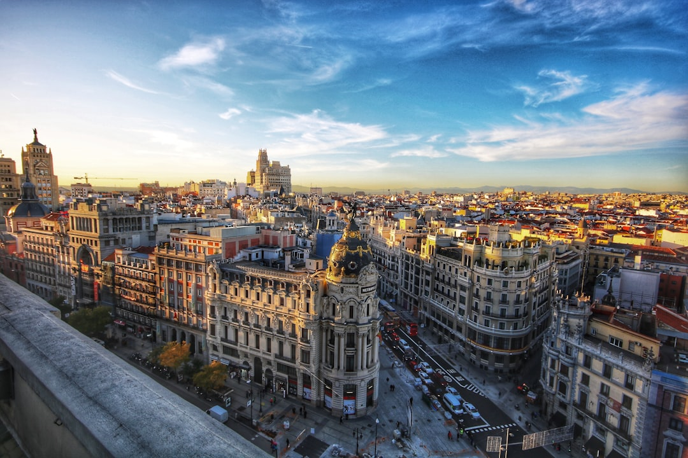

# Madrid, Spain

Country: Spain
Region: Europe

Madrid is the Spanish capital, a 3.3 million-person city on a high plain in the country's centre. Royal-court foundation, Habsburg and Bourbon baroque, twentieth-century democratic capital, and one of Europe's great late-night cities; the world's top concentration of nineteenth-century Spanish painting and one of its best museum triangles.

---

## 🧭 Step 1: Choices

### ✨ Why Visit

Madrid is the Spanish art capital. The Prado, the Reina Sofía (Guernica), and the Thyssen-Bornemisza together make up the "Golden Triangle" of art. The Royal Palace, the Plaza Mayor, and the Habsburg-era centre are walkable from each other. Madrid runs late: dinner at ten, the night starts at midnight, the city does not sleep early on weekends.

The city is less tourist-pressured than Barcelona, more affordable than Paris, and rewards travellers who follow Madrileños into the neighbourhoods. La Latina on Sundays, Malasaña and Chueca in the evenings, Lavapiés for diverse food, and Salamanca for the upmarket aesthetic.

You come for the art, the food, the late-night energy, and a city that has earned its informal "happiest in Europe" claim.

### 🌍 Ethical Compass

- **💰 Economy.** Eat at *tabernas* and *cervecerías* in La Latina, Malasaña, Lavapiés, and Chueca rather than only the Plaza Mayor tourist set. Buy at the Mercado de San Miguel for atmosphere but Mercado de la Cebada or Mercado Antón Martín for actual prices.
- **👥 Employment.** Tip a euro or two at sit-down meals; service is included by law but small tips are appreciated. Use Metro and EMT buses rather than ride-hail for short hops.
- **📚 Education.** Read about the Spanish Civil War and the Franco dictatorship before you visit; the Reina Sofía's Guernica room and the Cuartel del Conde Duque exhibitions cover them. Madrid's neighbourhood histories (Lavapiés as historic Jewish/Moorish-converso quarter, Malasaña as the *movida madrileña* heart) are essential.
- **🌱 Ecology.** Walk and use Metro. Madrid Río's reclaimed riverside park is a model of urban regeneration. Refill from public fountains; the city's water comes from the Sierra and is excellent.

---

## 🎒 Step 2: Preparation

### 🔍 Governance Management

- **Schengen** rules apply; verify on official portals.
- **Prado, Reina Sofía, Thyssen-Bornemisza** sell timed tickets on official portals; the Prado has free entry in late afternoon (verify current times); the Reina Sofía has free entry on certain weekday evenings and Sunday afternoons.
- **Royal Palace** is also free to EU citizens at specific times; verify on the Patrimonio Nacional portal.
- **Short-term rental licensing** in Madrid is regulated; verify the VUT registration number on any listing.
- **Bernabéu Stadium** tour and Real Madrid matches sell on the official Real Madrid portal; Atlético Madrid similarly on its official site.

### 📡 Information Curation

- **El País** and **The Local Spain** (English) for current news.
- **EsMadrid** (the official city tourism site) for events and openings.
- A Spanish author with Madrid resonance: Benito Pérez Galdós (canonical); Camilo José Cela; Almudena Grandes (contemporary).
- A locally led Lavapiés or Malasaña walking tour with a resident guide.
- **Wikivoyage Madrid** for orientation.

### 🎯 Inference Interaction

- **You decide on the Golden Triangle pace.** Three serious museums in three half-days is the right rhythm; doing all three in one day burns out.
- **You decide on the Prado free hours.** Free entry late afternoon is the deal but the museum is crowded; book a paid timed slot for a calmer visit.
- **You decide on the late-night dinner.** Sit-down dinner at 10 pm is normal; restaurants opening at 8 pm for dinner are tourist-oriented.
- **You decide on a flamenco show.** Choose a tablao with a focus on the music (Corral de la Morería, Casa Patas, Cardamomo) rather than a dinner-show; flamenco originated in Andalucía, but Madrid's tablaos are serious.
- **You decide on Sunday La Latina.** Cava Baja and the surrounding streets for *vermut* (sweet vermouth) before lunch is one of Madrid's great Sunday rituals.

### 🔄 Intelligence Cooperation

Madrid weather is dry-continental; very cold winter mornings, very hot summer afternoons, dramatic shoulder seasons. Major events (San Isidro festival in May, Real Madrid Champions League nights) reshape the city briefly.

Bring a soft plan. If August heat makes the city brutal, Madrileños are mostly away on the coast; museums are quieter, but evenings are still hot. If a Real Madrid match is on, the Bernabéu area is impossible; the rest of the city is fine.

### 📍 Top 5 Anchor Spots

1. **Museo del Prado.** Half a day; the Velázquez and Goya rooms are the core.
2. **Museo Reina Sofía.** Half a day; Picasso's Guernica is the centrepiece.
3. **Royal Palace and the Plaza de Oriente.** Two hours; free at certain hours for EU citizens.
4. **A La Latina Sunday: El Rastro flea market in the morning, vermut and tapas crawl on Cava Baja and Cava Alta.**
5. **A neighbourhood evening: Malasaña, Chueca, or Lavapiés.** Dinner at 10 pm; drinks later.

### 🧰 Practical Essentials

- **Recommended Length.** Three to four days for the city. Add a day for Toledo (45 minutes by AVE) or El Escorial or Segovia.
- **Transport.** Walk in the centre. The **Metro** is excellent (12 lines); the EMT buses cover the rest; contactless or Multi card. **Cercanías** for day trips. Madrid-Barajas Airport (MAD) connects to the centre by Metro Line 8 (with a transfer) or direct express bus in 30 to 45 minutes.
- **Daily Cost (per person).**
  - **Budget:** roughly €70 to €120. Hostel or pension, *menú del día* lunches and tapas, Metro, two ticketed sites.
  - **Mid-range:** roughly €140 to €240. Three-star hotel or VUT-registered apartment, tapas dinners with wine, all major museums.
  - **Higher-comfort:** roughly €320 and up. Boutique Letras or Salamanca hotel, fine dining at DiverXO or Sacha, private guides, flamenco at Corral de la Morería.
- **Booking Notes.**
  - **Prado and Reina Sofía:** book ahead in peak season; check free-entry windows.
  - **VUT registration:** verify any short-term rental.
  - **San Isidro (May 15)** is the patron saint's day; festival week is busy and lovely.
  - **AVE high-speed trains** to Barcelona, Sevilla, Málaga, and Valencia book on Renfe official portal.
  - **August:** many small restaurants close for staff holidays; verify before going.

---

## ✈️ Step 3: Delivery

### 🤖 AI Prompt

Copy this into your own AI assistant, fill in the brackets, and treat the answer as a researcher's draft, not a final plan.

> Please help me plan an ethical visit to Madrid, Spain for [NUMBER] days in [MONTH]. I am travelling with [WHO] and my interests are [INTERESTS, e.g. art, flamenco, food, Habsburg history, late-night culture]. My total budget is around [AMOUNT] and my comfort level is [budget / mid-range / higher-comfort].
>
> Please structure your answer in three steps.
>
> **Step 1: Choices.** Help me decide what to prioritise. Recommend the two or three Madrid experiences I should not miss given my interests, and one I should consider skipping (a Plaza Mayor tourist restaurant, an 8 pm dinner when Madrileños eat at 10, a flamenco dinner show when a real tablao is steps better). Briefly explain each trade-off.
>
> **Step 2: Preparation.** Cover all four of the following:
> - **Governance Management.** What assumptions should I check before I book? Include Schengen, official Prado/Reina Sofía/Thyssen ticketing and free-hours, VUT rental registration, Royal Palace free-entry times, and AVE Renfe booking for day trips.
> - **Information Curation.** Suggest at least four different source types: one official Madrid source, one Spanish news outlet, one Spanish author, and one Lavapiés or Malasaña walking guide.
> - **Inference Interaction.** List the decisions I personally need to make (museum pacing, free vs paid hours, dinner timing, flamenco venue choice, Sunday La Latina commitment).
> - **Intelligence Cooperation.** How should I trust my own judgment and local advice over algorithmic defaults when conditions change? Build me a soft plan with at least two alternates for likely disruptions (August heat, a Bernabéu match closure, a strike, a closed restaurant for staff holidays).
>
> **Step 3: Delivery.** Give me the actual itinerary, day by day, with realistic timings and named neighbourhoods. Include at least one La Latina Sunday or a Lavapiés evening if my dates allow. Mark each business as confidently locally owned, or flag for me to verify.
>
> Finally, please remind me at the end to verify your suggestions against:
> 1. Official sources: EsMadrid, the Prado, Reina Sofía, and Thyssen portals, and Renfe for trains.
> 2. Real people: a Madrid resident, a licensed Madrid guide, or hotel staff who live in Madrid now.
>
> Treat your output as a researcher's draft. I will make the final calls.

---

Part of **Gyro Governance Ethical Travel: AI-Empowered Guides for Humane Adventures**.

Explore more destinations, ethical domains, and AI prompts at [travel.gyrogovernance.com](https://travel.gyrogovernance.com/).
