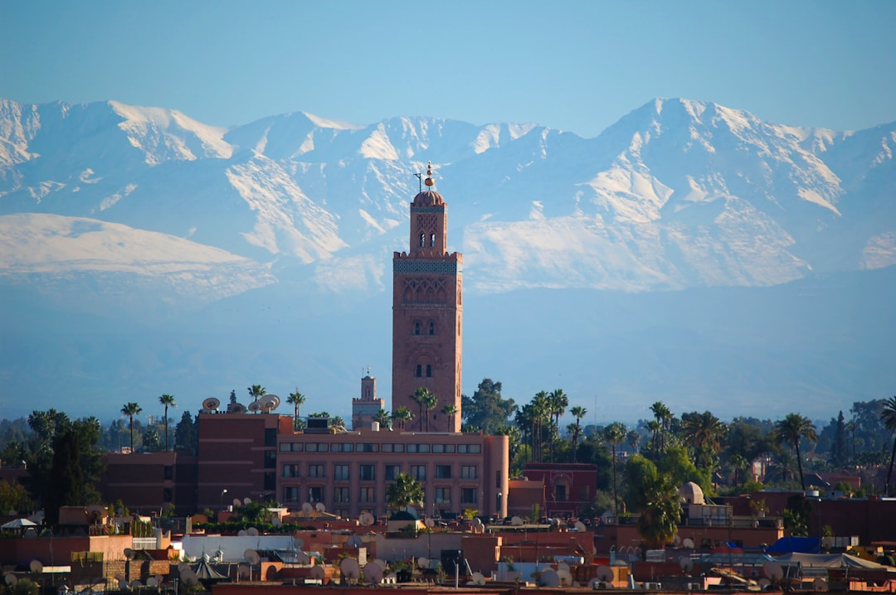

# Marrakech, Morocco

Country: Morocco
Region: Africa

Marrakech is the "Red City", a thousand-year-old imperial capital at the edge of the Atlas Mountains in central Morocco. UNESCO-listed medina, working souks, palace gardens, and a famous main square (Jemaa el-Fna) that transforms from market to outdoor stage every evening. The country's most-visited city after Casablanca.

---

## 🧭 Step 1: Choices

### ✨ Why Visit

Marrakech is the postcard of imperial Morocco. The Jemaa el-Fna at sunset (UNESCO-listed for the oral storytelling tradition that still happens there), the Bahia Palace, El Badi Palace, the Saadian Tombs, the Koutoubia mosque silhouette, and the Majorelle and Yves Saint Laurent museums are the headline acts.

The city is also a real working Moroccan place, with a serious craft economy in the souks and the surrounding mountain villages, a sophisticated *riad* (courtyard guesthouse) hospitality tradition, and growing international fashion and design presence.

You come for the medina, the riads, the food, the High Atlas day trips, and a sensory-dense corner of North Africa.

### 🌍 Ethical Compass

- **💰 Economy.** Stay in a **registered riad** in the medina rather than a chain hotel in Gueliz; the riad keeps money with a smaller-scale owner and gives you the city experience. Eat at family restaurants in the medina (Le Tobsil, Café Clock, Nomad, Naranj) and small *snacks* away from the main square's tourist row.
- **👥 Employment.** Hire **licensed guides** (carrying a Ministry of Tourism guide card) for the souks, palaces, and Atlas day trips. Tip in dirhams; haggle for souk goods politely; pay fair tipped amounts for serious *snake charmers* and storytellers in the square if you watch their performance.
- **📚 Education.** Read about the Almoravid and Almohad dynasties that built much of Marrakech and about Berber (Amazigh) culture, which is everywhere in the surrounding mountains. Visit the Musée Berbère at the Jardin Majorelle and the Maison de la Photographie.
- **🌱 Ecology.** Marrakech is hot and dry; refill water from sealed sources; the city has water-stress problems. Respect the medina's working life; cars are banned in much of it for good reason. For Atlas day trips, choose operators who employ local Berber guides directly.

---

## 🎒 Step 2: Preparation

### 🔍 Governance Management Traceability

- Most Western nationals are **visa-exempt** for Morocco; verify on the Ministry of Foreign Affairs portal.
- **Major sites** (Bahia Palace, El Badi Palace, Saadian Tombs, Majorelle Garden, YSL Museum) sell tickets at the gate or online; the **Majorelle and YSL** are timed-entry and crowded; book on their official portals.
- **Riads** must be registered with the Ministry of Tourism; verify on the booking and look for the *classement* (official rating).
- For **hammam** experiences, distinguish between traditional public hammams (basic, local, cheap) and tourist riad hammams (luxury, expensive). Both are valid; know which you are choosing.
- For **High Atlas day trips** (Imlil, Ourika Valley, Asni), use licensed operators and Berber guides; check for current weather and avalanche advisories in winter for Toubkal.

### 📡 Information Curation Variety

- **Morocco World News** and **Hespress English** for current news.
- The official **Moroccan National Tourist Office (ONMT)** for events and openings.
- A Moroccan author: Tahar Ben Jelloun, Laila Lalami's *The Moor's Account*, Fatima Mernissi's *Dreams of Trespass* (Fez-set but Moroccan).
- A licensed Marrakech medina guide; recommended through your riad.
- **Wikivoyage Marrakech** for orientation.

### 🎯 Inference Interaction Accountability

- **You decide on your riad.** A registered medina riad is the right default; chain hotels in Gueliz are options but miss the point.
- **You decide on a licensed guide for the medina.** A first-day half-day with a guide is genuinely useful; the medina is a maze and freelancers will lead you to commission shops.
- **You decide on the souk haggling style.** Start at a third of the asked price and work up; walk away if it stalls; do not aggressively grind. The seller has to live.
- **You decide on the snake charmers and monkeys.** Animal welfare in the Jemaa el-Fna is genuinely poor; photographing them is paid (often demanded), and the demand drives the practice. Decline to engage if you have an opinion.
- **You decide on the Atlas day trip.** Imlil for Toubkal foothills, Ourika for waterfalls, Asni for valleys, Aït Benhaddou for the kasbah and onward to Ouarzazate. Pick one and do it properly.

### 🔄 Intelligence Cooperation Integrity

Marrakech weather is dry and hot. Summer (June to August) is brutally hot, especially midday; autumn and spring are ideal; winters are cool with sharp temperature drops at night. Ramadan reshapes daytime eating. Friday afternoon prayer reshapes Friday.

Bring a soft plan. If midday heat is impossible, the riad's plunge pool is the answer for a few hours; the museums and the air-conditioned cafés absorb a heat afternoon. If a Friday closes parts of the souk, the gardens and outer sites are open.

### 📍 Top 5 Anchor Spots

1. **Jemaa el-Fna and the medina souk walk at sunset.** Storytellers, musicians, food stalls; the most photographed square in Morocco for good reason.
2. **Bahia Palace and El Badi Palace, plus the Saadian Tombs.** A half-day of palace architecture; combine with the Mellah (historic Jewish quarter).
3. **Jardin Majorelle and YSL Museum.** Timed-entry, book ahead; the Berber Museum inside the garden is essential.
4. **A traditional hammam.** A 90-minute experience with steam, scrub, and oil; choose your level.
5. **High Atlas day trip to Imlil, Ourika Valley, or Aït Benhaddou.** Full day with a licensed guide and a Berber driver.

### 🧰 Practical Essentials

- **Recommended Length.** Three to four days for Marrakech. Add one to two for an Atlas or desert day trip; add three to five for the wider Moroccan circuit (Fes, Chefchaouen, Essaouira).
- **Transport.** Walk in the medina (cars cannot enter the alleys anyway). **Petit taxis** (red) outside the medina; **grand taxis** (white) for inter-city. Marrakech Menara Airport (RAK) is 15 minutes from the medina by taxi.
- **Daily Cost (per person).**
  - **Budget:** roughly MAD 400 to 800 (about USD 40 to 80). Riad guesthouse or hostel, *snack* meals and souk food, walking, two ticketed sites.
  - **Mid-range:** roughly MAD 1,200 to 2,500 (about USD 120 to 250). Mid-range riad, mixed dining including a riad rooftop dinner, all major sites, a hammam, a half-day Atlas trip.
  - **Higher-comfort:** roughly MAD 4,000 and up. Luxury riad (Riad Yasmine, Royal Mansour, La Mamounia), fine dining, private guides, full-day Atlas trip with chartered car.
- **Booking Notes.**
  - **Visa:** verify on the Moroccan Ministry of Foreign Affairs portal.
  - **Riad registration:** verify on booking.
  - **Majorelle and YSL:** timed-entry, book ahead.
  - **Ramadan:** restaurants observe daytime fast outside hotels; evenings are festive.
  - **Friday afternoon prayer:** some businesses close briefly.

---

## ✈️ Step 3: Delivery

### 🤖 AI Prompt

Copy this into your own AI assistant, fill in the brackets, and treat the answer as a researcher's draft, not a final plan.

> Please help me plan an ethical visit to Marrakech, Morocco for [NUMBER] days in [MONTH]. I am travelling with [WHO] and my interests are [INTERESTS, e.g. medina and souks, Berber culture, palaces and gardens, Atlas day trips, food]. My total budget is around [AMOUNT] and my comfort level is [budget / mid-range / higher-comfort].
>
> Please structure your answer in three steps.
>
> **Step 1: Choices.** Help me decide what to prioritise. Recommend the two or three Marrakech experiences I should not miss given my interests, and one I should consider skipping (a chain hotel in Gueliz when a riad is steps better, a snake-charmer or monkey photo, a commission-shop tour with an unlicensed guide). Briefly explain each trade-off.
>
> **Step 2: Preparation.** Cover all four of the following:
> - **Governance Management Traceability.** What assumptions should I check before I book? Include Moroccan visa-exempt status, riad official registration, Majorelle and YSL timed-entry tickets, licensed medina-guide booking through my riad, and Atlas-day-trip operator licensing.
> - **Information Curation Variety.** Suggest at least four different source types: one official Moroccan source, one Moroccan news outlet, one Moroccan author, and one licensed Marrakech medina guide.
> - **Inference Interaction Accountability.** List the decisions I personally need to make (riad vs chain hotel, licensed-guide commitment, souk haggling style, animal-encounter ethics in Jemaa el-Fna, Atlas day choice).
> - **Intelligence Cooperation Integrity.** Build me a soft plan with at least two alternates for likely disruptions (midday heat, Friday prayer closures, Ramadan timing, Atlas weather closure).
>
> **Step 3: Delivery.** Give me the actual itinerary, day by day, with realistic timings and named medina sites. Include one Atlas day, one hammam, and at least one sunset on Jemaa el-Fna. Mark each business as confidently locally owned, or flag for me to verify.
>
> Finally, please remind me at the end to verify your suggestions against:
> 1. Official sources: the Moroccan National Tourist Office, the Majorelle and YSL portals, and the Ministry of Foreign Affairs for visas.
> 2. Real people: my riad host, a licensed Marrakech guide, or a Berber guide for the Atlas.
>
> Treat your output as a researcher's draft. I will make the final calls.

---

Part of **Gyro Governance Ethical Travel: AI-Empowered Guides for Human Adventures**.

Explore more destinations, ethical domains, and AI prompts at [travel.gyrogovernance.com](https://travel.gyrogovernance.com/).
