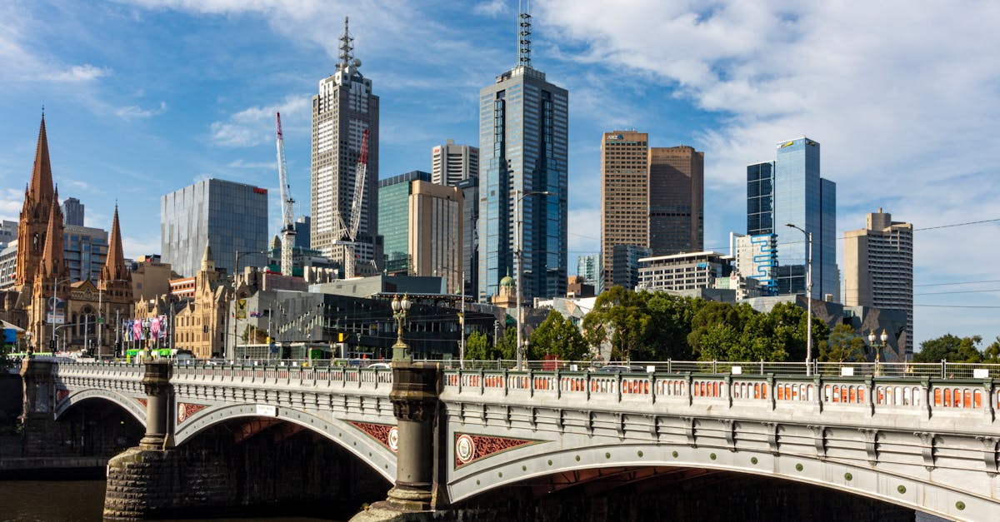

# Melbourne, Australia

Country: Australia
Region: Oceania

Melbourne (*Naarm*) is the capital of Victoria and Australia's second-largest city, a five-million-person grid wrapped around the Yarra River. Often ranked the world's most liveable city, the cultural and sporting capital of Australia, the home of strong coffee, laneway bars, and Australian Rules football.

---

## 🧭 Step 1: Choices

### ✨ Why Visit

Melbourne is Australia's cultural and culinary heart. The laneways of the CBD (Degraves, Centre Place, ACDC Lane, Hosier Lane) are working cafés, bars, and street-art galleries. The National Gallery of Victoria is the country's busiest museum. The MCG (Melbourne Cricket Ground) is the largest stadium in the southern hemisphere. The food scene (Italian, Greek, Vietnamese, Ethiopian, Indian) is the most diverse in Australia.

The city is also the most European-feeling in Australia: trams, theatre, sports, and bars that stay open. The Great Ocean Road, the Mornington Peninsula, the Yarra Valley wine region, and the Phillip Island penguins are all reachable on day trips.

You come for the coffee, the food, the art, the sport, and as a base for some of southern Australia's best landscapes.

### 🌍 Ethical Compass

- **💰 Economy.** Eat in actual neighbourhoods: Lygon Street (Italian), Victoria Street (Vietnamese), Sydney Road (Middle Eastern and Mediterranean), Smith Street (Collingwood), Bridge Road (Richmond). Avoid the worst of Southbank's tourist set.
- **👥 Employment.** Tipping is not customary in Australia; service staff are paid properly. Use Myki on trams, trains, and buses; contactless is also accepted on most metropolitan services.
- **📚 Education.** This is the country of the Wurundjeri people of the Kulin Nation. Visit Bunjilaka (the Aboriginal Cultural Centre at Melbourne Museum) and engage with Wurundjeri-led tours or cultural experiences. Read about the Black Saturday bushfires, the Stolen Generations, and the contemporary reconciliation conversations.
- **🌱 Ecology.** Walk and tram; the free tram zone covers most of the CBD. Cycle the Yarra Trail. Avoid driving in the CBD. Coffee culture supports a network of small, independent roasters; many use ethically sourced beans.

---

## 🎒 Step 2: Preparation

### 🔍 Governance Management

- **ETA or eVisitor** required for most visa-waiver nationals; verify on the Department of Home Affairs portal.
- **Public Transport Victoria** uses **Myki** card or contactless on most metropolitan services; verify on the official PTV portal.
- **Free Tram Zone** in the CBD requires no Myki; verify the boundary on the PTV portal.
- **NGV International and NGV Australia** are free general admission; ticketed exhibitions on the official portal.
- **Sport tickets** (AFL, Australian Open tennis in January, Melbourne Cup Carnival in November) on official AFL, Tennis Australia, or VRC portals.

### 📡 Information Curation

- **The Age** and **ABC Melbourne** for serious local news.
- **Visit Melbourne** (the official tourism site) for events and openings.
- A Melbourne or Aboriginal author with Victorian roots: Helen Garner (canonical Melbourne); Bruce Pascoe's *Dark Emu*; Tony Birch (Aboriginal Melbourne fiction).
- A Wurundjeri-led walking tour or Bunjilaka-affiliated experience.
- **Wikivoyage Melbourne** for orientation.

### 🎯 Inference Interaction

- **You decide on the laneway walking.** The CBD is small and rewards an unhurried morning walking the laneways with coffee stops.
- **You decide on sport.** An AFL match at the MCG or Marvel Stadium is a real Australian experience; the Australian Open or Melbourne Cup depend on dates.
- **You decide on the day trip.** Great Ocean Road (Twelve Apostles, full day), Yarra Valley wineries (full day with a driver), Mornington Peninsula (hot springs and beaches), Phillip Island penguins (evening half-day). Pick one and do it properly.
- **You decide on the food neighbourhood.** Lygon Street is Italian-tourist; Victoria Street is Vietnamese-local; Sydney Road is Mediterranean-and-Middle-Eastern-local. Spend at least one dinner outside the CBD.
- **You decide on the Aboriginal cultural commitment.** Bunjilaka or a Wurundjeri walking tour is the right entry into Melbourne's deep history.

### 🔄 Intelligence Cooperation

Melbourne weather is famously variable; "four seasons in one day" is an actual local saying. Major events (Australian Open January, Melbourne International Comedy Festival March-April, AFL Grand Final September, Melbourne Cup November) reshape parts of the city.

Bring a soft plan. If a sudden rain ruins your outdoor plan, the NGV, the State Library, and Melbourne Museum absorb wet hours brilliantly. If a sport day clogs the MCG area, the laneways are unaffected. If a heatwave hits, Brighton beach is reachable by train.

### 📍 Top 5 Anchor Spots

1. **CBD laneways and coffee walk.** Degraves Street, Centre Place, ACDC Lane, Hosier Lane, the Block Arcade. A morning with multiple coffee stops.
2. **NGV International + Federation Square + a Yarra walk.** Free major museum; the precinct around it is the cultural heart.
3. **MCG (Melbourne Cricket Ground) tour or an AFL match.** The MCG seats 100,000; the tour is excellent; a match is unforgettable if your dates allow.
4. **A Lygon Street, Victoria Street, or Sydney Road dinner.** Outside the CBD; book a small restaurant.
5. **Great Ocean Road or Yarra Valley day trip.** Pick one. Great Ocean Road is the iconic coast; Yarra Valley is wine and food.

### 🧰 Practical Essentials

- **Recommended Length.** Three to four days for the city. Add a day each for Great Ocean Road, Yarra Valley, and Phillip Island.
- **Transport.** Walk in the CBD. **Trams** (the world's largest network), **trains**, and **buses** under Public Transport Victoria; Myki or contactless. The **Free Tram Zone** in the CBD requires no payment. Melbourne Airport (MEL) is 25 to 40 minutes from the CBD by SkyBus or rideshare.
- **Daily Cost (per person).**
  - **Budget:** roughly AUD 100 to 180. Hostel or budget hotel, café and food-hall meals, Myki, free Free Tram Zone and major museums.
  - **Mid-range:** roughly AUD 250 to 450. Three-star hotel, restaurant dinners, all major sites, a Great Ocean Road day with a small-group tour.
  - **Higher-comfort:** roughly AUD 600 and up. Boutique hotel (Crown Towers, Jackalope on the peninsula, the Olsen, the Langham), fine dining at Attica, Vue de Monde, or Cumulus Inc., private guided tours, premium sport seats.
- **Booking Notes.**
  - **ETA or eVisitor:** verify on the Department of Home Affairs portal.
  - **Major sport tickets:** book on the official AFL or Tennis Australia portal months ahead.
  - **Great Ocean Road:** a full day (12 to 14 hours); consider an overnight in Apollo Bay or Port Campbell.
  - **Melbourne Cup Carnival (early November):** the city dresses up.
  - **Coffee:** the locals' tip is to order a *flat white*, not a "regular coffee".

---

## ✈️ Step 3: Delivery

### 🤖 AI Prompt

Copy this into your own AI assistant, fill in the brackets, and treat the answer as a researcher's draft, not a final plan.

> Please help me plan an ethical visit to Melbourne (Naarm), Australia for [NUMBER] days in [MONTH]. I am travelling with [WHO] and my interests are [INTERESTS, e.g. coffee and food, art, sport, Aboriginal culture, Great Ocean Road]. My total budget is around [AMOUNT] and my comfort level is [budget / mid-range / higher-comfort].
>
> Please structure your answer in three steps.
>
> **Step 1: Choices.** Help me decide what to prioritise. Recommend the two or three Melbourne experiences I should not miss given my interests, and one I should consider skipping (a Southbank chain restaurant when a neighbourhood is steps better, a Great Ocean Road one-day if it should be an overnight, a coffee at a tourist café when a roaster is two laneways over). Briefly explain each trade-off.
>
> **Step 2: Preparation.** Cover all four of the following:
> - **Governance Management.** What assumptions should I check before I book? Include the ETA or eVisitor on the Department of Home Affairs portal, Myki/contactless on PTV, the Free Tram Zone boundary, NGV and major museum portals, and official sport ticketing.
> - **Information Curation.** Suggest at least four different source types: one official Melbourne or Victorian source, one local news outlet, one Aboriginal author or Bunjilaka resource, and one Melbourne food or coffee guide.
> - **Inference Interaction.** List the decisions I personally need to make (laneway walking, sport commitment, day-trip choice, neighbourhood dinner, Aboriginal cultural engagement).
> - **Intelligence Cooperation.** How should I trust my own judgment and local advice over algorithmic defaults when conditions change? Build me a soft plan with at least two alternates for likely disruptions (sudden weather change, a major event closing roads, a sport-night MCG crush, a heat wave).
>
> **Step 3: Delivery.** Give me the actual itinerary, day by day, with realistic timings and named neighbourhoods. Include at least one dinner outside the CBD and the laneways walk. Mark each business as confidently locally owned, or flag for me to verify.
>
> Finally, please remind me at the end to verify your suggestions against:
> 1. Official sources: Visit Melbourne, Public Transport Victoria, the NGV, the AFL, and the Department of Home Affairs.
> 2. Real people: a local resident, a Wurundjeri guide, or hotel staff who live in Melbourne now.
>
> Treat your output as a researcher's draft. I will make the final calls.

---

Part of **Gyro Governance Ethical Travel: AI-Empowered Guides for Human Adventures**.

Explore more destinations, ethical domains, and AI prompts at [travel.gyrogovernance.com](https://travel.gyrogovernance.com/).
