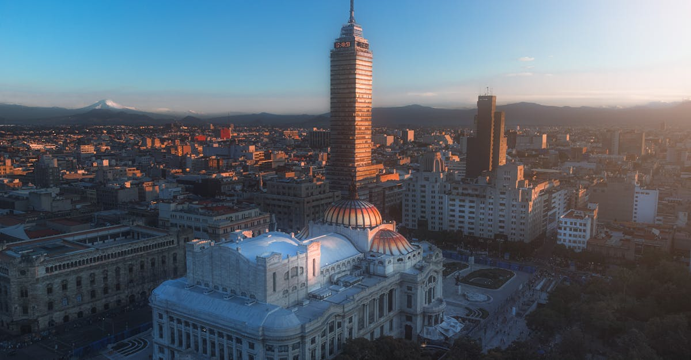

# Mexico City, Mexico

Country: Mexico
Region: Americas

Mexico City (*Ciudad de México*, CDMX) is the largest city in North America, a 22-million-person valley capital built on the drained lake-bed of the Aztec island-city Tenochtitlán. UNESCO-listed historic centre, world-class museums, a serious contemporary art and design scene, and one of the most exciting food cities on the planet.

---

## 🧭 Step 1: Choices

### ✨ Why Visit

Mexico City compresses pre-Columbian, colonial, revolutionary, and twenty-first-century Mexico into one giant city. The Museo Nacional de Antropología is one of the top three anthropological museums in the world. Teotihuacán (45 minutes north) is one of the world's great archaeological sites. Frida Kahlo's Casa Azul, Diego Rivera's murals, and the Palacio de Bellas Artes are walking-distance cultural anchors.

The city is also a real food capital. Pujol, Quintonil, and Contramar share the same district as the country's best taquerías, tortas, and quesadillas. Coyoacán, Roma, Condesa, and the Centro Histórico each have distinct culinary identities.

You come for the museums, the food, the pre-Columbian context, and a city that has quietly become one of North America's most culturally rewarding capitals.

### 🌍 Ethical Compass

- **💰 Economy.** Eat at taquerías (Los Cocuyos, El Tizoncito, El Califa, Tacos Hola in Condesa), small *fondas* (family eateries), and at Mercado Roma, Mercado de Coyoacán, and Mercado Medellín. Stay in licensed hotels or boutique guesthouses in Roma, Condesa, Polanco, or Centro Histórico; CDMX has begun regulating short-term rentals in Roma and Condesa due to displacement pressure.
- **👥 Employment.** Tip 10 to 15 percent at restaurants in cash; tip taxi drivers a small amount; tip hotel staff. Use registered taxis from sitios (taxi ranks), Uber, or DiDi rather than informal street taxis.
- **📚 Education.** Read about the Mexica (Aztec) empire, the conquest, the Mexican Revolution, and the contemporary Mexican political conversation. Visit the Templo Mayor (the Aztec temple under the Zócalo) and the Museo Nacional de Antropología. Carlos Fuentes' *La Región Más Transparente* is the canonical Mexico City novel.
- **🌱 Ecology.** Mexico City sits at 2,250 metres; pace your first day. Air pollution can be severe on specific days (check Hoy No Circula schedules). Metro and Metrobús are excellent. Avoid plastic water; refill from filtered sources at your hotel.

---

## 🎒 Step 2: Preparation

### 🔍 Governance Management Traceability

- Most visitors get an **FMM tourist card** automatically with their flight or on arrival; verify current rules on the INM portal.
- **Museo Nacional de Antropología** and **Museo Frida Kahlo (Casa Azul)** sell timed tickets on official portals; Casa Azul sells out days ahead; book in advance.
- **Teotihuacán** entry is at the gate; verify hours on the INAH (Instituto Nacional de Antropología e Historia) portal.
- **Short-term rentals** in Roma and Condesa are increasingly regulated; verify the listing's status and the local rules.
- **Metro** (12 lines) and **Metrobús** (BRT) use rechargeable cards; verify on the official CDMX Metrobús portal.

### 📡 Information Curation Variety

- **Reforma** and **El Universal** (Mexican dailies, Spanish) for current news; **Mexico News Daily** for English.
- The official **CDMX Turismo** site for events and current rules.
- A Mexico City author: Carlos Fuentes (canonical); Valeria Luiselli (contemporary); Yuri Herrera; Juan Villoro.
- A locally led CDMX food or neighbourhood walking tour (Eat Mexico, Sabores Mexico, Club Tengo Hambre).
- **Wikivoyage Mexico City** for orientation.

### 🎯 Inference Interaction Accountability

- **You decide your neighbourhood.** Roma and Condesa are leafy, walkable, and gentrifying fast; Polanco is upmarket; Centro Histórico is the colonial heart; Coyoacán is bohemian and quieter. Each gives a different city.
- **You decide on altitude.** 2,250 metres is real altitude; an easy first day is the right move.
- **You decide on a guided food tour.** A 3- to 4-hour food walking tour with a local is the best single use of half a day in CDMX.
- **You decide on Teotihuacán timing.** Arrive at opening; the heat and crowds build through morning; consider a guide for the archaeology.
- **You decide on Frida.** Book Casa Azul days ahead; pair with the Coyoacán market and the Diego Rivera Studio Museum (also nearby).

### 🔄 Intelligence Cooperation Integrity

CDMX weather is high-altitude tropical-mild; rainy season (June to September) brings dramatic afternoon storms; dry season (November to May) is sunny. Earthquake awareness is part of city life. Major events (Independence Day September 15-16, Day of the Dead late October to early November, the Grand Prix in October) reshape parts of the city.

Bring a soft plan. If a rainy-season storm closes outdoor plans, the museums absorb a wet afternoon. If a Hoy No Circula day affects rideshare, the Metrobús and Metro are unaffected. If a Day of the Dead celebration fills Mixquic or the Zócalo, the experience is the celebration.

### 📍 Top 5 Anchor Spots

1. **Museo Nacional de Antropología.** Allow a full half day; the Mexica (Aztec) hall, the Maya hall, and the Olmec colossal heads.
2. **Centro Histórico walking loop: Zócalo, Templo Mayor, Catedral Metropolitana, Palacio de Bellas Artes.** A morning of pre-Columbian and colonial Mexico City.
3. **Teotihuacán day trip.** Pyramid of the Sun, Pyramid of the Moon, Avenue of the Dead. Half a day with a guide and a morning start.
4. **Coyoacán: Casa Azul (Frida Kahlo Museum), the Diego Rivera Studio Museum, and the Coyoacán market.** Half a day; book Casa Azul ahead.
5. **A Roma or Condesa food walking tour and evening meal.** Tacos al pastor, sopes, tortas, mezcal.

### 🧰 Practical Essentials

- **Recommended Length.** Four to six days for CDMX. Add days for Puebla, Oaxaca, or San Miguel de Allende as separate trips.
- **Transport.** Walk Roma, Condesa, Centro Histórico, and Coyoacán. **Metro** (12 lines, cheap, very crowded at peak), **Metrobús BRT**, **Ecobici** bike-share, **Uber and DiDi**. AICM (Mexico City International, the older airport) is connected by Metro Line 5; AIFA (the newer, further) requires shuttle.
- **Daily Cost (per person).**
  - **Budget:** roughly MXN 800 to 1,500 (about USD 45 to 85). Hostel in Roma or Centro, taquería meals, Metrobús and Metro, two major museums.
  - **Mid-range:** roughly MXN 2,500 to 5,000 (about USD 140 to 280). Three- or four-star boutique hotel, mixed dining including one high-end restaurant, all major sites, a guided food tour.
  - **Higher-comfort:** roughly MXN 8,000 and up. Four Seasons CDMX, St Regis Polanco, Casa Habita Roma, fine dining at Pujol or Quintonil (book months ahead), private guides, day-trips by chartered car.
- **Booking Notes.**
  - **FMM tourist card:** automatic for most travellers; verify INM rules.
  - **Casa Azul (Frida) and major restaurants** (Pujol, Quintonil, Contramar): book days to months ahead.
  - **Day of the Dead (late October to early November):** book accommodation months ahead.
  - **Earthquake September 19 is a memorial date; September 7 and 19 had major earthquakes in recent history.**
  - **Independence Day (September 15-16):** the Zócalo grito is an extraordinary experience.

---

## ✈️ Step 3: Delivery

### 🤖 AI Prompt

Copy this into your own AI assistant, fill in the brackets, and treat the answer as a researcher's draft, not a final plan.

> Please help me plan an ethical visit to Mexico City (CDMX) for [NUMBER] days in [MONTH]. I am travelling with [WHO] and my interests are [INTERESTS, e.g. pre-Columbian history, contemporary art, food, Frida Kahlo, day trips to pyramids]. My total budget is around [AMOUNT] and my comfort level is [budget / mid-range / higher-comfort].
>
> Please structure your answer in three steps.
>
> **Step 1: Choices.** Help me decide what to prioritise. Recommend the two or three CDMX experiences I should not miss given my interests, and one I should consider skipping (an informal street taxi when Uber or sitio is steps safer, a Casa Azul attempt without an advance ticket, an over-packed first day at altitude). Briefly explain each trade-off.
>
> **Step 2: Preparation.** Cover all four of the following:
> - **Governance Management Traceability.** What assumptions should I check before I book? Include the INM FMM tourist card, official ticketing for Casa Azul and the Anthropology Museum, INAH for Teotihuacán, short-term-rental status in Roma and Condesa, and Hoy No Circula schedules.
> - **Information Curation Variety.** Suggest at least four different source types: one official Mexican source, one Mexican news outlet, one Mexico City author, and one CDMX food or walking guide.
> - **Inference Interaction Accountability.** List the decisions I personally need to make (neighbourhood base, altitude pacing, food-tour commitment, Teotihuacán timing, Frida Kahlo advance ticket).
> - **Intelligence Cooperation Integrity.** Build me a soft plan with at least two alternates for likely disruptions (rainy-season storm, a Hoy No Circula day affecting rideshare, a Day of the Dead crowd, a sold-out top restaurant).
>
> **Step 3: Delivery.** Give me the actual itinerary, day by day, with realistic timings and named neighbourhoods. Include one Teotihuacán morning, one Anthropology Museum half-day, and at least one food walking tour. Mark each business as confidently locally owned, or flag for me to verify.
>
> Finally, please remind me at the end to verify your suggestions against:
> 1. Official sources: CDMX Turismo, INAH for archaeological sites, Casa Azul official portal, and the INM for visa rules.
> 2. Real people: a local resident, a CDMX food guide, or hotel staff who live in Mexico City now.
>
> Treat your output as a researcher's draft. I will make the final calls.

---

Part of **Gyro Governance Ethical Travel: AI-Empowered Guides for Human Adventures**.

Explore more destinations, ethical domains, and AI prompts at [travel.gyrogovernance.com](https://travel.gyrogovernance.com/).
