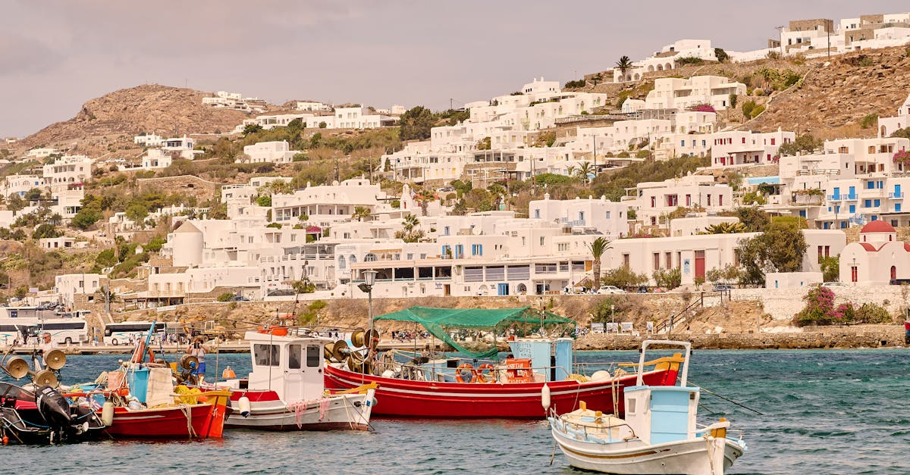

# Mykonos, Greece

Country: Greece
Region: Europe

Mykonos is a small Cycladic island in the central Aegean, around 90 square kilometres with roughly 10,000 permanent residents and one to two million annual visitors. Famous for whitewashed Chora (the main town), the iconic windmills of Kato Mili, party beaches, and as the launching point for sacred Delos.

---

## 🧭 Step 1: Choices

### ✨ Why Visit

Mykonos is the Cyclades at its most photographed: bougainvillea against whitewash, blue-domed churches, fishing-village geometry, and the Aegean light that defines the Greek tourism imagination. The Chora's labyrinth (deliberately built to confuse pirates) is genuinely beautiful, especially after sunset when day-trippers leave.

The island is also the most expensive party destination in Greece, and a real conversation about over-development on a small island with limited fresh water and a real local community. Visiting respectfully means choosing your beaches and accommodation deliberately.

You come for the Chora at dusk, Delos at dawn, a beach you actually like, and one of the Mediterranean's most concentrated nightlife scenes if that suits you.

### 🌍 Ethical Compass

- **💰 Economy.** Eat at small Chora *tavernas* (Joanna's Nikos Place, Kiki's Tavern in Agios Sostis without a sign or menu) and traditional fish places, not only the international beach clubs. Stay in family-run guesthouses in Chora or northern villages (Ano Mera, Houlakia) for a different island than the South Beach scene.
- **👥 Employment.** Tip 10 percent at restaurants; tip beach-club staff in proportion to service. Use the local bus (KTEL) and licensed taxis rather than party-taxi hustle.
- **📚 Education.** Read about Cycladic prehistory; the Delos archaeological site is essential. Mykonos has been important since Bronze Age times, not just since the 1960s. Visit the Archaeological Museum of Mykonos in Chora.
- **🌱 Ecology.** Mykonos has serious water-stress problems; brief showers, no decoration plants on balconies, refill bottles. The island's beaches range from extremely developed (Paradise, Super Paradise) to nearly empty (Fokos, Lia, Agios Sostis); choose what you actually want.

---

## 🎒 Step 2: Preparation

### 🔍 Governance Management

- **Schengen** rules apply; verify on official portals.
- **Delos** (the sacred ancient island) is reached by boat from Mykonos Old Port; tickets sold at the dock; verify the boat schedule (no boats Mondays) on the official portal.
- **Beach clubs** at Paradise, Super Paradise, Psarou, and Nammos charge minimum spends or sunbed fees; verify pricing before committing.
- **High-season transport** can be overwhelmed; book ferry tickets (from Athens or Piraeus) on the official Aegean Ferries or Hellenic Seaways portals weeks ahead.
- For **short-term rentals**, verify any listing has a Greek property registration number; Mykonos has tightened rules.

### 📡 Information Curation

- **Kathimerini English edition** for Greek and Mykonos news.
- The official **Greek Tourism Organization** site for events and ferry status.
- A book on the Cyclades: Lawrence Durrell's *The Greek Islands*; Cycladic prehistory texts.
- A Mykonos resident-led walking tour of the Chora at sunset (limited but available).
- **Wikivoyage Mykonos** for orientation.

### 🎯 Inference Interaction

- **You decide on your beach.** Paradise and Super Paradise are international party beaches; Psarou is luxury beach-club; Agios Sostis and Fokos are quiet local; Elia, Platis Gialos, Ornos in between.
- **You decide on Delos.** Skipping Delos is the single most common Mykonos mistake. A morning at the sacred island puts everything else in context.
- **You decide on your season.** Late June to early September is the international party season; May, early June, and late September give the island back at lower prices.
- **You decide on the food scene.** A €15 souvlaki vs a €300 beach-club lunch are both Mykonos; choose what you want.
- **You decide on Chora timing.** Day-trippers from cruise ships flood Chora from 10 am to 5 pm; before 9 am and after 7 pm are dramatically calmer.

### 🔄 Intelligence Cooperation

Mykonos summer is hot, dry, and windy; the *meltemi* north wind shapes the season (June to September). High-season ferries occasionally cancel for swell. The island shuts down significantly outside the May to October window.

Bring a soft plan. If meltemi cancels the Delos boat one day, try the next. If Chora is mobbed, the northern villages and the inland Ano Mera give a different island. If a heatwave makes the beaches brutal at midday, take the local custom and sleep through the heat.

### 📍 Top 5 Anchor Spots

1. **Mykonos Chora at sunset.** Walk the labyrinth, Little Venice, the windmills of Kato Mili, the Panagia Paraportiani church. Best after 6 pm.
2. **Delos (UNESCO).** Boat from Mykonos Old Port; allow a full half day; the most sacred site in classical Greek religion. No boats Mondays.
3. **A quieter beach: Agios Sostis, Fokos, Kapari, or Houlakia.** A day away from the party beaches.
4. **A taverna evening at Kiki's Tavern (Agios Sostis) or in Ano Mera.** Slow, local, the Mykonos most party-tourists miss.
5. **A sunset at 180° Sunset Bar or simply at the windmills.** Free option works.

### 🧰 Practical Essentials

- **Recommended Length.** Three to four days for Mykonos. Pair with another Cycladic island (Naxos, Paros, Santorini) for a longer Greek island trip.
- **Getting There and Around.** Fly into **Mykonos Airport (JMK)** seasonally direct from many European cities, or fly to Athens and take a ferry from **Piraeus** or **Rafina** (2.5 to 5 hours depending on vessel). On the island: **KTEL local buses**, **rental scooters or quads** (caution: accidents are common), **rental cars**, **licensed taxis** (limited supply).
- **Daily Cost (per person).**
  - **Budget:** roughly €80 to €150. Family-run guesthouse outside Chora, taverna meals, local bus, free beaches and a Delos day.
  - **Mid-range:** roughly €200 to €400. Three-star hotel in Chora or nearby, mixed dining including one beach-club lunch, scooter or car rental.
  - **Higher-comfort:** roughly €600 and up (often vastly more). Luxury hotel (Belvedere, Cavo Tagoo, Bill & Coo), fine dining at Hytra Mykonos, Nammos beach-club, private boat charters.
- **Booking Notes.**
  - **Schengen:** verify your nationality.
  - **Delos:** book the boat the day of or in advance; closed Mondays.
  - **High-season (mid-June to early September):** book accommodation 6 months ahead, prices triple from shoulder.
  - **Ferries:** weather can cancel; build a buffer day in your Athens-Mykonos schedule.
  - **Short-term rental registration:** verify the property number on the listing.

---

## ✈️ Step 3: Delivery

### 🤖 AI Prompt

Copy this into your own AI assistant, fill in the brackets, and treat the answer as a researcher's draft, not a final plan.

> Please help me plan an ethical visit to Mykonos, Greece for [NUMBER] days in [MONTH]. I am travelling with [WHO] and my interests are [INTERESTS, e.g. Cycladic architecture, Delos archaeology, party beaches, quiet beaches, food]. My total budget is around [AMOUNT] and my comfort level is [budget / mid-range / higher-comfort].
>
> Please structure your answer in three steps.
>
> **Step 1: Choices.** Help me decide what to prioritise. Recommend the two or three Mykonos experiences I should not miss given my interests, and one I should consider skipping (a midday Chora visit when cruise ships are in, the most expensive beach club if my budget is moderate, scooter rental without prior experience). Briefly explain each trade-off.
>
> **Step 2: Preparation.** Cover all four of the following:
> - **Governance Management.** What assumptions should I check before I book? Include Schengen rules, the Delos boat schedule (Mondays closed), Cycladic ferry portals (Aegean Ferries, Hellenic Seaways), short-term rental registration, and beach-club minimum-spend rules.
> - **Information Curation.** Suggest at least four different source types: one official Greek source, one Kathimerini or Mykonos news outlet, one book on the Cyclades or Delos, and one Mykonos resident-led walking guide.
> - **Inference Interaction.** List the decisions I personally need to make (beach choice, Delos commitment, season, food-scene level, Chora timing).
> - **Intelligence Cooperation.** How should I trust my own judgment and local advice over algorithmic defaults when conditions change? Build me a soft plan with at least two alternates for likely disruptions (meltemi wind cancelling Delos, a cruise-ship Chora flood, a heatwave, a sold-out high-season ferry).
>
> **Step 3: Delivery.** Give me the actual itinerary, day by day, with realistic timings and named beaches and villages. Include a Delos morning and a Chora evening. Mark each business as confidently locally owned, or flag for me to verify.
>
> Finally, please remind me at the end to verify your suggestions against:
> 1. Official sources: the Greek Tourism Organization, the official Delos boat operators, and Aegean Ferries or Hellenic Seaways for inter-island travel.
> 2. Real people: a Mykonos resident, a Chora-based hotel host, or a Delos boat captain.
>
> Treat your output as a researcher's draft. I will make the final calls.

---

Part of **Gyro Governance Ethical Travel: AI-Empowered Guides for Human Adventures**.

Explore more destinations, ethical domains, and AI prompts at [travel.gyrogovernance.com](https://travel.gyrogovernance.com/).
