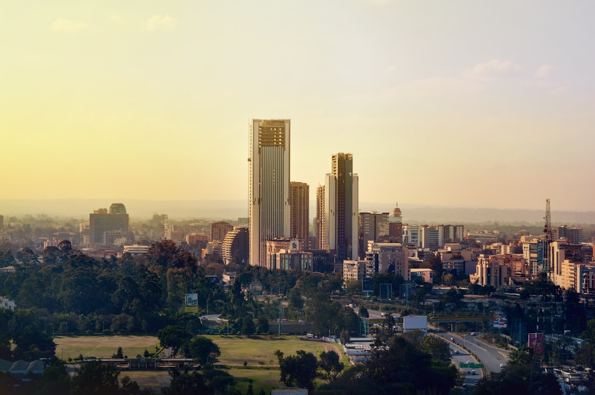

# Nairobi, Kenya

Country: Kenya
Region: Africa

Nairobi is the Kenyan capital, a 5 million-person East African business and political hub at the eastern edge of the Great Rift Valley. The only major capital with a national park within its city limits; the gateway to Kenya's safari circuit; and the diplomatic heart of East Africa.

---

## 🧭 Step 1: Choices

### ✨ Why Visit

Nairobi is more interesting than its transit-stop reputation suggests. Nairobi National Park (giraffes and rhinos against the Nairobi skyline), the Karen Blixen Museum, the Giraffe Centre, the Sheldrick Wildlife Trust elephant orphanage, and the Nairobi National Museum are all in or just outside the city.

The city is also a serious East African capital with a growing food scene, modern art galleries, and as the headquarters of UNEP, UN-Habitat, and many continental organisations. Two nights in Nairobi at the start or end of a safari is well worth the time.

You come for the giraffes and elephants, the food, the museums, and as the practical gateway to the Maasai Mara, Amboseli, Samburu, and the Kenya coast.

### 🌍 Ethical Compass

- **💰 Economy.** Eat at *nyama choma* (roast meat) joints, Indian-Kenyan restaurants on Diani Road, Westlands, and Karen; coffee at small Kenyan-coffee roasters (Connect, Spring Valley Coffee). Buy from craft markets and cooperative shops (Utamaduni, Kazuri Beads, Spinners Web) where artisan earnings are direct.
- **👥 Employment.** Tip 10 percent at restaurants, tip drivers and porters generously, tip safari guides and lodge staff substantially. Use Uber or Bolt rather than informal street taxis. The new SGR train and Madaraka Express are reliable for Mombasa.
- **📚 Education.** Read about the Mau Mau uprising and Kenyan independence; the Karen Blixen house tells the colonial story honestly. Visit the Bomas of Kenya for an introduction to the country's ethnic diversity (40+ groups). Read Ngũgĩ wa Thiong'o or Yvonne Adhiambo Owuor.
- **🌱 Ecology.** Nairobi National Park is a working conservation success; visit early morning. The Sheldrick Wildlife Trust's elephant orphanage funds elephant rehabilitation; visit during the one open hour daily. Plastic-bag ban applies in Kenya.

---

## 🎒 Step 2: Preparation

### 🔍 Governance Management

- Many travellers are **eligible for the eTA** (Electronic Travel Authorization); verify on the official Kenyan government eTA portal. Yellow fever may be required from certain origins.
- **Nairobi National Park** entry: use the SafariCard (cashless system) at the gate or pre-load online; verify on the Kenya Wildlife Service portal.
- **Sheldrick Wildlife Trust** elephant orphanage is open one hour daily (11 am to noon) for the public; verify on the official Sheldrick portal.
- **Giraffe Centre** open daily; verify hours on the official portal.
- **Plastic bags are banned** in Kenya; do not bring any.

### 📡 Information Curation

- **Daily Nation** and **The Standard** (Kenyan dailies in English) for current news.
- The official **Magical Kenya** site for events and openings.
- A Kenyan author: Ngũgĩ wa Thiong'o (*A Grain of Wheat*); Yvonne Adhiambo Owuor (*Dust*); Binyavanga Wainaina's essays.
- A locally led Nairobi walking or food tour (Bonfire Adventures, Stalwart Tours).
- **Wikivoyage Nairobi** for orientation and safety advice.

### 🎯 Inference Interaction

- **You decide on safety strategy.** Nairobi is broadly fine for prepared visitors using ride-hail and licensed transport; do not walk at night in unfamiliar areas; do not display valuables.
- **You decide on the park early-morning game drive.** Nairobi National Park is best at opening (6 am); afternoons are typically less productive.
- **You decide on the Sheldrick visit.** The one-hour window is fixed; arrive at 10:45 am at the latest.
- **You decide on Karen vs Westlands base.** Karen is leafy, near the wildlife sites, quieter; Westlands is urban, restaurant-rich, central.
- **You decide on the SGR train to Mombasa.** A real Kenyan experience, 5 hours, both transport and sightseeing.

### 🔄 Intelligence Cooperation

Nairobi weather is mild year-round (1,795 metres altitude); long rains (March to May), short rains (October to early December). Loadshedding is rare but possible. Major events (UN conferences, the Magical Kenya Open) occasionally fill hotels.

Bring a soft plan. If long rains close park roads, the museum schedule and indoor activities absorb the time. If a wildlife visit is rained out, the Karen Blixen Museum is excellent in any weather. If traffic to the airport is impossible, allow extra time.

### 📍 Top 5 Anchor Spots

1. **Nairobi National Park early-morning game drive.** Rhinos, giraffes, occasionally lions, with the city skyline in the background.
2. **Sheldrick Wildlife Trust** (11 am to noon daily). Orphan elephants funded by your visit; book through their official portal.
3. **Karen Blixen Museum + Giraffe Centre.** A morning in Karen suburb; pair with lunch at Tamambo Karen Blixen Coffee Garden.
4. **Nairobi National Museum + Snake Park.** A solid half-day on Kenyan natural and cultural history.
5. **Bomas of Kenya.** Traditional homestead replicas and daily cultural performances; an introduction to Kenya's ethnic diversity.

### 🧰 Practical Essentials

- **Recommended Length.** Two days for Nairobi at the start or end of a safari trip.
- **Transport.** **Uber, Bolt, Little** for ride-hail; reliable and cheap. Avoid walking at night in unfamiliar areas. **Wilson Airport (WIL)** for safari light flights; **Jomo Kenyatta International Airport (NBO)** for international. The **SGR Madaraka Express** to Mombasa.
- **Daily Cost (per person).**
  - **Budget:** roughly USD 50 to 100. Mid-range Westlands or Karen guesthouse, local meals, Uber, Nairobi NP entry.
  - **Mid-range:** roughly USD 150 to 300. Three- or four-star hotel (Sankara, Hemingways Nairobi), mixed dining, all major wildlife sites, a half-day Karen excursion.
  - **Higher-comfort:** roughly USD 500 and up. Giraffe Manor (book a year ahead), Hemingways Nairobi, Fairmont The Norfolk, fine dining at Cultiva, private guides, helicopter Nairobi National Park flights.
- **Booking Notes.**
  - **eTA:** apply on the Kenyan government portal before flying.
  - **Yellow fever:** verify whether required from your origin.
  - **Giraffe Manor:** book a year ahead.
  - **Plastic-bag ban:** strictly enforced.
  - **Long rains (March to May):** wildlife viewing is still possible; some park roads close.

---

## ✈️ Step 3: Delivery

### 🤖 AI Prompt

Copy this into your own AI assistant, fill in the brackets, and treat the answer as a researcher's draft, not a final plan.

> Please help me plan an ethical visit to Nairobi, Kenya for [NUMBER] days in [MONTH] (likely at the start or end of a safari trip). I am travelling with [WHO] and my interests are [INTERESTS, e.g. urban wildlife, Kenyan food, Karen Blixen and colonial history, elephants, cultural museums]. My total budget is around [AMOUNT] and my comfort level is [budget / mid-range / higher-comfort].
>
> Please structure your answer in three steps.
>
> **Step 1: Choices.** Help me decide what to prioritise. Recommend the two or three Nairobi experiences I should not miss given my interests, and one I should consider skipping (a Nairobi National Park afternoon when morning is better, the Sheldrick if I miss the 11 am to noon window, walking at night in an unfamiliar area). Briefly explain each trade-off.
>
> **Step 2: Preparation.** Cover all four of the following:
> - **Governance Management.** What assumptions should I check before I book? Include the Kenyan eTA, yellow-fever requirement, Sheldrick Wildlife Trust opening hour, Kenya Wildlife Service SafariCard for Nairobi NP, and the plastic-bag ban.
> - **Information Curation.** Suggest at least four different source types: Magical Kenya official, a Kenyan newspaper, a Kenyan author, and a Nairobi-based walking or food guide.
> - **Inference Interaction.** List the decisions I personally need to make (safety strategy, morning park visit, Sheldrick timing, base in Karen vs Westlands, SGR to Mombasa).
> - **Intelligence Cooperation.** How should I trust my own judgment and local advice over algorithmic defaults when conditions change? Build me a soft plan with at least two alternates for likely disruptions (long-rains park-road closure, a sold-out Giraffe Manor, traffic to the airport, a public-event closure).
>
> **Step 3: Delivery.** Give me the actual itinerary, day by day, with realistic timings and named sites. Include at least one early-morning Nairobi NP game drive and the Sheldrick 11 am window. Mark each business as confidently locally owned, or flag for me to verify.
>
> Finally, please remind me at the end to verify your suggestions against:
> 1. Official sources: Magical Kenya, the Kenya Wildlife Service, the Sheldrick Wildlife Trust, and the Kenyan eTA portal.
> 2. Real people: a Nairobi-based guide, a hotel concierge, or a Kenyan safari operator.
>
> Treat your output as a researcher's draft. I will make the final calls.

---

Part of **Gyro Governance Ethical Travel: AI-Empowered Guides for Humane Adventures**.

Explore more destinations, ethical domains, and AI prompts at [travel.gyrogovernance.com](https://travel.gyrogovernance.com/).
