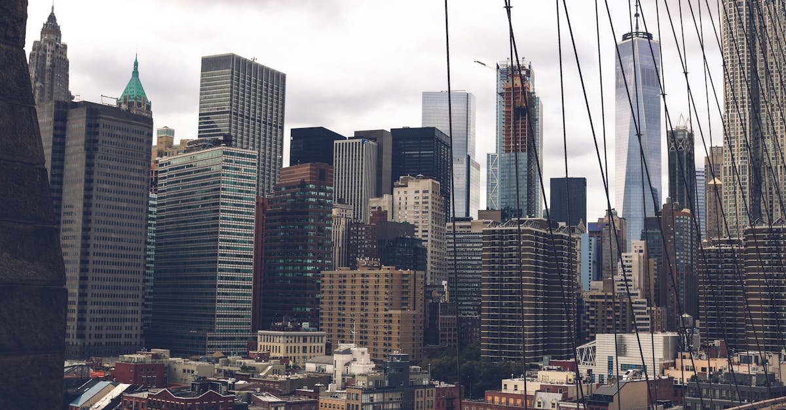

# New York City, United States

Country: United States
Region: Americas

New York City is the largest city in the United States, an 8.8-million-person, five-borough metropolis at the mouth of the Hudson River. Global financial capital, theatre capital, museum capital, and one of the most ethnically and linguistically diverse cities on the planet (around 800 languages spoken).

---

## 🧭 Step 1: Choices

### ✨ Why Visit

New York concentrates more world-class museums, theatre, food, music, and finance into one city than almost anywhere on Earth. The Met, MoMA, the Whitney, the Guggenheim, the American Museum of Natural History, and the Brooklyn Museum each justify a half day. Broadway and Off-Broadway run hundreds of shows. The subway runs 24 hours.

The city is also five distinct boroughs with deeply different characters. Manhattan is the postcard. Brooklyn has the food and the music. Queens is the most ethnically diverse county in the United States. The Bronx invented hip-hop. Staten Island has a free ferry past the Statue of Liberty.

You come because not visiting NYC at least once is a serious gap. And you stay long enough to leave Manhattan.

### 🌍 Ethical Compass

- **💰 Economy.** Eat in actual neighbourhoods: Queens (Flushing for Sichuan, Astoria for Greek and Egyptian, Jackson Heights for South Asian and Latin American), Brooklyn (Brighton Beach for Russian, Sunset Park for Cantonese, Bay Ridge for Middle Eastern), the Bronx (Arthur Avenue for Italian, Bronx Little Italy). Avoid limiting yourself to Times Square chains.
- **👥 Employment.** Tip 20 percent at sit-down restaurants; tip bartenders one to two dollars per drink; tip taxi and rideshare drivers 15 to 20 percent; tip hotel housekeeping. NYC service-industry wages depend on tipping.
- **📚 Education.** Read about the Lenape (the original inhabitants of Manhattan and surroundings), immigrant history (Ellis Island and the tenement experience), the civil rights era in Harlem, the AIDS-era LGBTQ+ history, and the 9/11 attacks. The Tenement Museum is one of the best small museums in America.
- **🌱 Ecology.** Use the subway. NYC is one of the lowest-per-capita-emission American cities precisely because of its density and transit. Walk; the city is more walkable than its size suggests. Refill water; NYC tap water is excellent.

---

## 🎒 Step 2: Preparation

### 🔍 Governance Management

- Most international visitors need **ESTA (visa waiver) or a B-2 visa** for the US; verify on the official US State Department portal.
- **The Met, MoMA, Whitney, Guggenheim, Natural History Museum** sell timed tickets on official portals; book ahead in peak season. The Met technically operates on "suggested admission" for NY state residents only; visitors pay the full price.
- **Broadway tickets** book on the official venue, the TodayTix app, or the TKTS booth in Times Square (same-day discount). Beware resale-only sites.
- **MTA subway** uses **OMNY contactless** (tap any contactless card or phone) or MetroCard; the OMNY weekly cap is automatic.
- **9/11 Memorial Museum** sells timed tickets on the official portal; the outdoor memorial is free.

### 📡 Information Curation

- **The New York Times** and **Curbed** (for the city itself) for local journalism.
- **NYC Tourism + Conventions** (the official tourism site) for events.
- A New York author: Joan Didion (essays); Tom Wolfe; Jhumpa Lahiri (Queens); Junot Díaz; Colson Whitehead.
- A locally led food or neighbourhood tour in Queens, Brooklyn, or the Bronx; the Tenement Museum's walking tours of the Lower East Side are excellent.
- **Wikivoyage New York** for orientation.

### 🎯 Inference Interaction

- **You decide on the borough strategy.** A trip that never leaves Manhattan misses 80 percent of the city. Add at least one full day in Brooklyn (Brooklyn Heights, Williamsburg, DUMBO), Queens (Flushing or Astoria), or Harlem.
- **You decide on the Broadway show.** Big musicals are reliable; smaller plays at the Public Theater, Atlantic Theater Company, or Off-Broadway venues are often more interesting. TKTS for same-day at 50 percent.
- **You decide on the Statue of Liberty / Ellis Island.** The free Staten Island Ferry passes the Statue; the ticketed Statue Cruises lets you visit Liberty Island and Ellis Island. Both valid.
- **You decide your museum pace.** A serious morning at the Met then a serious afternoon at MoMA the next day is the right rhythm.
- **You decide on the Tenement Museum.** Genuinely one of the most powerful small museums in the country; book a tour.

### 🔄 Intelligence Cooperation

NYC weather is four-season; brutally hot summer, cold winter, dramatic shoulder seasons. The subway runs through almost everything (closures published in advance). Major events (Macy's Thanksgiving Parade, New Year's Eve, US Open tennis, NYC Marathon, fashion weeks) reshape parts of the city briefly.

Bring a soft plan. If rain ruins an outdoor day, the major museums absorb a wet afternoon indefinitely. If a Yankees or Knicks game floods a station, plan a different route. If a sudden cold snap surprises you, layer up; the subway is warm.

### 📍 Top 5 Anchor Spots

1. **The Met (Metropolitan Museum of Art).** Plan four hours minimum; the Egyptian wing, the European paintings, the Rooftop Garden in season.
2. **Central Park walking loop.** From the South Pumphouse north past Sheep Meadow, the Bethesda Terrace, the Bow Bridge, the Loeb Boathouse, the Conservatory Garden.
3. **A Broadway or Off-Broadway show.** TKTS for same-day; book ahead for the most popular.
4. **A Brooklyn or Queens neighbourhood food day.** Williamsburg + DUMBO + Brooklyn Bridge walk; or Flushing Chinatown; or Jackson Heights.
5. **The Tenement Museum + Lower East Side walking tour.** Half a day; immigrant history made real.

### 🧰 Practical Essentials

- **Recommended Length.** Four to seven days for NYC. Add days for upstate trips or a Boston/DC train extension.
- **Transport.** **Subway** is the spine; OMNY contactless or MetroCard. Walk everywhere reasonable; NYC is more walkable than its size suggests. JFK, LGA, and EWR airports each have rail or bus options to the city; the AirTrain to Jamaica (JFK) + subway is the cheapest reliable.
- **Daily Cost (per person).**
  - **Budget:** roughly USD 100 to 170. Hostel or budget hotel, food-cart and bodega meals, subway, two ticketed museums.
  - **Mid-range:** roughly USD 280 to 500. Three-star Manhattan hotel, mixed dining, all major museums, a Broadway show.
  - **Higher-comfort:** roughly USD 700 and up. Boutique Manhattan or Brooklyn hotel, fine dining at Eleven Madison Park, Le Bernardin, or Atomix, premium Broadway seats, private guided tours.
- **Booking Notes.**
  - **ESTA:** apply at least 72 hours before US arrival.
  - **Major museums and Broadway:** book ahead in peak season.
  - **9/11 Memorial Museum:** book timed tickets.
  - **Major events** (Marathon early November, Thanksgiving Parade, NYE Times Square): the city is different.
  - **Tipping:** build 20 percent into restaurant budget; it is not optional.

---

## ✈️ Step 3: Delivery

### 🤖 AI Prompt

Copy this into your own AI assistant, fill in the brackets, and treat the answer as a researcher's draft, not a final plan.

> Please help me plan an ethical visit to New York City, United States for [NUMBER] days in [MONTH]. I am travelling with [WHO] and my interests are [INTERESTS, e.g. museums, theatre, food, immigrant and civil rights history, parks]. My total budget is around [AMOUNT] and my comfort level is [budget / mid-range / higher-comfort].
>
> Please structure your answer in three steps.
>
> **Step 1: Choices.** Help me decide what to prioritise. Recommend the two or three NYC experiences I should not miss given my interests, and one I should consider skipping (a Times Square chain restaurant, a Manhattan-only itinerary, a resale-priced Broadway ticket). Briefly explain each trade-off.
>
> **Step 2: Preparation.** Cover all four of the following:
> - **Governance Management.** What assumptions should I check before I book? Include the US State Department ESTA, official museum portals for the Met/MoMA/Whitney/9/11, Broadway through official venues or TKTS, and MTA OMNY contactless setup.
> - **Information Curation.** Suggest at least four different source types: one official NYC source, one local news outlet (NY Times or Curbed), one New York author, and one neighbourhood-led walking guide outside Manhattan.
> - **Inference Interaction.** List the decisions I personally need to make (borough strategy, Broadway show choice, Statue of Liberty approach, museum pace, Tenement Museum commitment).
> - **Intelligence Cooperation.** How should I trust my own judgment and local advice over algorithmic defaults when conditions change? Build me a soft plan with at least two alternates for likely disruptions (a sudden weather change, a subway-line closure, sold-out Broadway, a major event traffic snarl).
>
> **Step 3: Delivery.** Give me the actual itinerary, day by day, with realistic timings, subway lines, and named neighbourhoods. Include at least one full day outside Manhattan (Brooklyn, Queens, or Harlem). Mark each business as confidently locally owned, or flag for me to verify.
>
> Finally, please remind me at the end to verify your suggestions against:
> 1. Official sources: NYC Tourism, the MTA, the major museum portals, and the US State Department for ESTA.
> 2. Real people: a local resident, a NYC neighbourhood guide, or hotel staff who live in NYC now.
>
> Treat your output as a researcher's draft. I will make the final calls.

---

Part of **Gyro Governance Ethical Travel: AI-Empowered Guides for Humane Adventures**.

Explore more destinations, ethical domains, and AI prompts at [travel.gyrogovernance.com](https://travel.gyrogovernance.com/).
