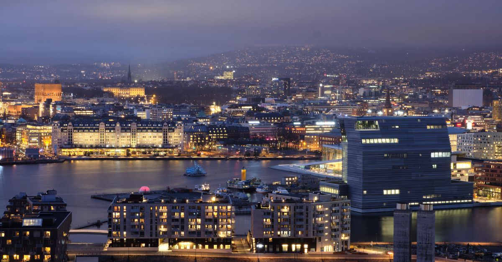

# Oslo, Norway

Country: Norway
Region: Europe

Oslo is the Norwegian capital, a 700,000-person fjord-side city surrounded by forest and the Oslofjord islands. Royal residence, museum capital, and the financial and political heart of one of the world's wealthiest and most carefully designed countries.

---

## 🧭 Step 1: Choices

### ✨ Why Visit

Oslo has transformed dramatically in the last twenty years. The waterfront from Aker Brygge to Bjørvika is a working contemporary city with the Oslo Opera House (climb the roof), the Munch Museum (one of the most important single-artist museums in Europe), and the National Museum (Norway's largest art museum, with The Scream).

The city is also surrounded by genuine wilderness. Marka forest is reachable by Metro and tram from the city centre. The Oslofjord islands are 10-minute ferries from the city hall. The Holmenkollen ski jump is a working sport venue with a panorama.

You come for the museums, the design, the waterfront, the Vikings (Viking Ship Museum is being reborn as the Museum of the Viking Age), and the easy access to forest and fjord.

### 🌍 Ethical Compass

- **💰 Economy.** Norway is expensive; budget honestly. Eat at *vinterhagen* (winter garden) markets, Mathallen food hall, and neighbourhood restaurants in Grünerløkka rather than only the most expensive waterfront spots. Public-transport day passes save real money.
- **👥 Employment.** Tipping is not customary in Norway; service is included by law and Norwegian wages are properly funded. A small tip for exceptional service is appreciated.
- **📚 Education.** Read about the Sámi (the Indigenous people of northern Norway, Sweden, Finland, and Russia); the Norwegian Museum of Cultural History covers some Sámi material. The Nobel Peace Prize is awarded in Oslo (the Nobel Peace Center is excellent). The Viking Age and the maritime history are well-covered at the new Museum of the Viking Age.
- **🌱 Ecology.** Oslo has been one of the most ambitious cities in Europe on climate; the centre is largely car-free, the public transport is excellent, and the surrounding forest is protected. Walk, cycle, and use Ruter (the transport network).

---

## 🎒 Step 2: Preparation

### 🔍 Governance Management Traceability

- Most visitors are **visa-exempt for short Schengen stays**; verify on the official Norwegian Directorate of Immigration portal.
- **National Museum, Munch Museum, Vigeland Museum, Fram Museum** sell timed tickets on official portals.
- The **Museum of the Viking Age** (the rebuilt former Viking Ship Museum) has been under reconstruction; verify current opening status on the official portal before planning a visit.
- **Ruter** (the integrated transport authority) uses tickets on the Ruter app, single tickets, or 24-hour/7-day passes; verify on the official portal.
- The **Oslo Pass** bundles transport and museum entries; verify whether it suits your itinerary on the official Visit Oslo portal.

### 📡 Information Curation Variety

- **The Local Norway** and **Aftenposten** (Norwegian) for current news.
- **Visit Oslo** (the official tourism site) for events and openings.
- A Norwegian author: Karl Ove Knausgård (especially his Oslo memoir volumes); Jo Nesbø for Oslo crime; Roy Jacobsen for coastal Norway.
- A Sámi-led cultural source or the Norwegian Museum of Cultural History for Indigenous Norwegian context.
- **Wikivoyage Oslo** for orientation.

### 🎯 Inference Interaction Accountability

- **You decide on the Oslo Pass.** Run the numbers: if you plan 2+ museums per day plus full transport use, it often pays off; if you have a slow trip, single tickets may be cheaper.
- **You decide on the fjord boat trip.** A summer fjord cruise or hop-on ferry to the Oslofjord islands (Hovedøya, Lindøya, Langøyene) is a genuine Oslo experience.
- **You decide on Marka.** The forest is reachable by Metro to Frognerseteren; cross-country ski in winter, hike or bike in summer.
- **You decide on Vigeland Park.** Free, open 24 hours; 200 sculptures by Gustav Vigeland in a Frogner park.
- **You decide on the Nobel Peace Center.** Genuinely thoughtful; check what current exhibition is.

### 🔄 Intelligence Cooperation Integrity

Oslo weather is wide-amplitude; winter (December to March) is dark and snowy; summer (June to August) has very long days (midnight twilight); shoulder seasons are short.

Bring a soft plan. If a rainy summer day kills your fjord plan, the National Museum, the Munch Museum, and the Opera House roof absorb a wet afternoon. If a winter snow closes some transport, the centre walks fine in proper boots; the Marka cross-country skiing is the gift of the season.

### 📍 Top 5 Anchor Spots

1. **Munch Museum (MUNCH) in Bjørvika.** The most important Munch collection in the world; allow three hours.
2. **National Museum.** The Scream lives here (and at MUNCH); allow three to four hours.
3. **Oslo Opera House (roof walk) + Akerselva river walk.** Free; the roof walk is one of Europe's most generous public spaces.
4. **Vigeland Park (Frogner Park).** Free, 200 Vigeland sculptures; a half-day at any season.
5. **A summer day on the Oslofjord islands or Hovedøya beach.** Free ferry from City Hall pier; bring a picnic.

### 🧰 Practical Essentials

- **Recommended Length.** Three to four days for the city. Add days for Bergen and the western fjords (a longer Norway trip).
- **Transport.** Walk and use Ruter (Metro, tram, bus, ferry). **Ruter app, single tickets, or passes**; contactless on most lines. Oslo Airport (OSL) at Gardermoen is 20 minutes by Flytoget express train.
- **Daily Cost (per person).**
  - **Budget:** roughly NOK 700 to 1,200 (about EUR 60 to 105). Hostel, supermarket and bakery meals, Ruter, two ticketed museums.
  - **Mid-range:** roughly NOK 1,500 to 2,800 (about EUR 130 to 245). Three-star hotel, mixed dining, all major museums, a fjord-ferry day.
  - **Higher-comfort:** roughly NOK 4,000 and up. The Thief, Amerikalinjen, Hotel Bristol, fine dining at Maaemo or Statholdergaarden, private guides, Holmenkollen experience.
- **Booking Notes.**
  - **Schengen:** verify your nationality.
  - **Museum of the Viking Age:** verify current opening status (it was closed for major reconstruction); the Viking ships may be temporarily inaccessible.
  - **Nobel Peace Prize ceremony (December 10)** fills the city briefly.
  - **Summer midnight sun:** very long days; plan rest.
  - **Oslo Pass:** verify the cost-benefit for your specific itinerary.

---

## ✈️ Step 3: Delivery

### 🤖 AI Prompt

Copy this into your own AI assistant, fill in the brackets, and treat the answer as a researcher's draft, not a final plan.

> Please help me plan an ethical visit to Oslo, Norway for [NUMBER] days in [MONTH]. I am travelling with [WHO] and my interests are [INTERESTS, e.g. modern art (Munch), Viking history, Nobel Peace, fjord nature, design]. My total budget is around [AMOUNT] and my comfort level is [budget / mid-range / higher-comfort].
>
> Please structure your answer in three steps.
>
> **Step 1: Choices.** Help me decide what to prioritise. Recommend the two or three Oslo experiences I should not miss given my interests, and one I should consider skipping (a high-end waterfront restaurant if budget is tight, the Viking museum if it is closed for reconstruction, a Marka winter trip without proper gear). Briefly explain each trade-off.
>
> **Step 2: Preparation.** Cover all four of the following:
> - **Governance Management Traceability.** What assumptions should I check before I book? Include Schengen, the Museum of the Viking Age reconstruction status, official museum and Ruter portals, the Oslo Pass cost-benefit, and Nobel Peace Prize ceremony timing if December.
> - **Information Curation Variety.** Suggest at least four different source types: one official Norwegian source, one Norwegian news outlet, one Norwegian author, and a Sámi-related resource.
> - **Inference Interaction Accountability.** List the decisions I personally need to make (Oslo Pass yes/no, fjord ferry, Marka day, Vigeland Park time, Nobel Peace Center).
> - **Intelligence Cooperation Integrity.** Build me a soft plan with at least two alternates for likely disruptions (rainy summer day, winter snow, a closed museum wing, a sold-out Maaemo).
>
> **Step 3: Delivery.** Give me the actual itinerary, day by day, with realistic timings and named neighbourhoods. Include at least one fjord-or-forest day. Mark each business as confidently locally owned, or flag for me to verify.
>
> Finally, please remind me at the end to verify your suggestions against:
> 1. Official sources: Visit Oslo, the National and MUNCH museum portals, Ruter, and the Museum of the Viking Age portal.
> 2. Real people: an Oslo resident, an Oslo guide, or hotel staff who live in the city now.
>
> Treat your output as a researcher's draft. I will make the final calls.

---

Part of **Gyro Governance Ethical Travel: AI-Empowered Guides for Human Adventures**.

Explore more destinations, ethical domains, and AI prompts at [travel.gyrogovernance.com](https://travel.gyrogovernance.com/).
