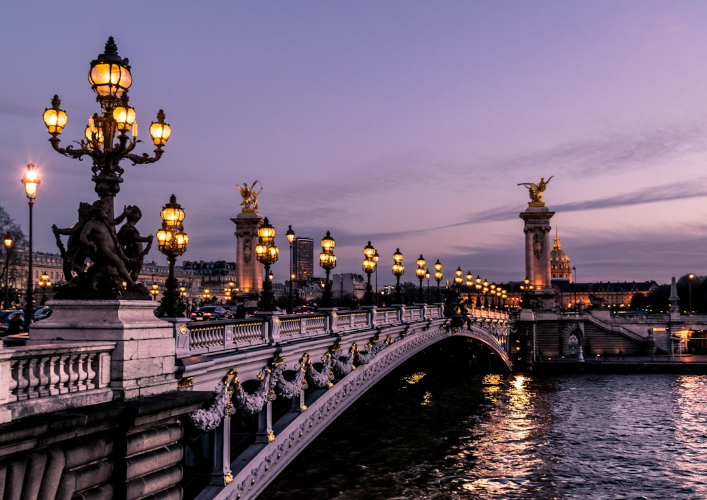

# Paris, France

Country: France
Region: Europe

Paris is the French capital, a 2.1-million-person city centre with 12 million in the wider metropolitan area, organised by Haussmann's nineteenth-century grand boulevards around the Seine. The most-visited city in Europe most years, the home of the Louvre, the Eiffel Tower, Notre-Dame, and an art and food history rivalled by no other city.

---

## 🧭 Step 1: Choices

### ✨ Why Visit

Paris is the most photographed city on Earth for a reason. The Louvre is the largest art museum in the world. The Musée d'Orsay holds the world's most important Impressionist collection. The Marais, the Île de la Cité, Montmartre, the Latin Quarter, Saint-Germain, and Bastille each hold distinct chapters. The food, from boulangeries to three-star Michelin, defines the global culinary syllabus.

The city is also pressure-tested by tourism. Long queues at the Louvre, sold-out Eiffel Tower nights, and Airbnb-rule conflicts in Le Marais and Saint-Germain are real. Visiting respectfully means booking ahead and engaging more than the Tour Eiffel postcard.

You come for the museums, the food, the Seine walks, the boulangeries, and a city that has been the textbook of European urban beauty for two centuries.

### 🌍 Ethical Compass

- **💰 Economy.** Eat at neighbourhood *bistrots* and *brasseries* in the 10th, 11th, 14th, 18th, and 20th arrondissements; the *boulangerie-and-fromagerie* circuit at any local market (Marché d'Aligre, Marché Bastille) is one of the great Paris experiences. Stay in licensed hotels and registered apartments; Paris regulates short-term rentals strictly.
- **👥 Employment.** Tip a euro or two at sit-down meals; service is included by law (look for *service compris*) but small tips are appreciated. Use the Metro and bus rather than taxis where possible.
- **📚 Education.** Read about French Revolution, the Belle Époque, the German occupation and Resistance, May 1968, and contemporary French politics. Visit the Mémorial de la Shoah and the Musée Carnavalet (Paris history). Engage with the colonial history at the Musée du Quai Branly and the new Cité de l'Économie.
- **🌱 Ecology.** Walk; Paris is denser and smaller than most visitors realise. Cycle the **Vélib** bike-share system (cycle lanes have expanded substantially). Use the **Metro and RER**; tap with Navigo Easy or contactless. Refill water; tap is excellent.

---

## 🎒 Step 2: Preparation

### 🔍 Governance Management

- **Schengen** rules apply; verify on official portals.
- **Louvre, Musée d'Orsay, Orangerie, Centre Pompidou, Sainte-Chapelle, Catacombes** sell timed tickets on official portals; book ahead in peak season. The **Louvre** in particular requires advance booking.
- **Eiffel Tower** sells tickets on the official portal; book months ahead for evening summit slots.
- **Notre-Dame Cathedral** is open after major reconstruction; verify current visitor access on the official portal.
- **Versailles** sells timed Palace tickets on the official portal; the gardens are free except on fountain-show days.
- **Short-term rentals** in Paris must be registered; verify the registration number and the 120-night annual cap rule.

### 📡 Information Curation

- **Le Monde** (French) and **The Local France** or **France 24** (English) for current news.
- **Paris.fr** and the official **Visit Paris Region** sites for events and openings.
- A French author with Paris resonance: Patrick Modiano (Nobel laureate, Paris memory); Édouard Louis; Annie Ernaux (Nobel laureate); Marcel Proust (canonical).
- A locally led food or neighbourhood walking tour (Paris by Mouth, Le Foodist, Localers).
- **Wikivoyage Paris** for arrondissement orientation.

### 🎯 Inference Interaction

- **You decide on Louvre timing.** First slot of the day Wednesday or Friday evening (extended hours) are the calmest. Book on the official portal.
- **You decide on the Eiffel Tower.** Climbing summit by lift requires advance booking; climbing the stairs to the second floor is a faster, cheaper alternative.
- **You decide on Versailles.** Half-day rushed or full day proper. Tuesday is closed; consider Bicycle and Boat in summer.
- **You decide on the food strategy.** A morning at a *marché*, a long lunch at a bistrot, a long evening at a wine bar is the Paris rhythm.
- **You decide on Notre-Dame.** Post-fire reconstruction is significant; verify current public-access rules.

### 🔄 Intelligence Cooperation

Paris weather is variable; summer can be hot (the city was unprepared for the 2003 and recent heatwaves); winter is cold and damp. Major events (Tour de France finish in late July, the Olympics retrospective, Fashion Weeks, Bastille Day July 14) reshape parts of the city briefly.

Bring a soft plan. If a Metro strike (it happens) closes a line, the bus network or walking covers most central districts. If a sudden rain ruins a park plan, the museums absorb it. If a sold-out d'Orsay slot drops, the Orangerie next door is excellent.

### 📍 Top 5 Anchor Spots

1. **Louvre.** Half a day minimum; book the first morning slot; enter from the underground Carrousel entrance to skip the pyramid queue.
2. **Musée d'Orsay.** Half a day; Impressionists and Post-Impressionists; the clock-face view is iconic.
3. **A Marais walking afternoon.** Place des Vosges, Musée Picasso, Musée Carnavalet, the boutiques and falafel of Rue des Rosiers.
4. **An evening Seine walk from Notre-Dame to the Eiffel Tower, plus a Pont des Arts crossing.** Free, magical, one of the city's gifts.
5. **A day-trip to Versailles** OR **a Montmartre + Sacré-Cœur half-day.** Pick one.

### 🧰 Practical Essentials

- **Recommended Length.** Four to five days for Paris. Add a day for Versailles, the Champagne region, Giverny, or Reims.
- **Transport.** Walk arrondissement by arrondissement. **Metro (16 lines), RER (5 lines), bus, tram** under RATP; Navigo Easy or contactless. **Vélib bike-share** is excellent. CDG (Charles de Gaulle) and Orly airports both connect to the city by RER or new Metro extensions.
- **Daily Cost (per person).**
  - **Budget:** roughly €90 to €150. Hostel or small pension, bakery and café meals, Metro, two ticketed museums.
  - **Mid-range:** roughly €180 to €320. Three-star hotel, restaurant dinners with wine, all major museums, a Versailles day.
  - **Higher-comfort:** roughly €450 and up. Boutique hotel in the 1st, 6th, or Marais (Le Bristol, Plaza Athénée, Hotel des Grands Boulevards), fine dining at Septime, Frenchie, Arpège, or Le Bernardin, private guides, premium Versailles tours.
- **Booking Notes.**
  - **Schengen:** verify your nationality.
  - **Louvre, Eiffel Tower, Versailles:** book months ahead in peak.
  - **Bastille Day (July 14):** free public events, fireworks, military parade; very crowded.
  - **Fashion Weeks (February-March and September-October):** hotel prices spike.
  - **Short-term rental:** verify Paris registration number and 120-night cap compliance.

---

## ✈️ Step 3: Delivery

### 🤖 AI Prompt

Copy this into your own AI assistant, fill in the brackets, and treat the answer as a researcher's draft, not a final plan.

> Please help me plan an ethical visit to Paris, France for [NUMBER] days in [MONTH]. I am travelling with [WHO] and my interests are [INTERESTS, e.g. art, food, French Revolution and Belle Époque history, fashion, day trips]. My total budget is around [AMOUNT] and my comfort level is [budget / mid-range / higher-comfort].
>
> Please structure your answer in three steps.
>
> **Step 1: Choices.** Help me decide what to prioritise. Recommend the two or three Paris experiences I should not miss given my interests, and one I should consider skipping (a Louvre midday queue when first slot is empty, an unlicensed apartment in Le Marais, an over-priced Champs-Élysées meal). Briefly explain each trade-off.
>
> **Step 2: Preparation.** Cover all four of the following:
> - **Governance Management.** What assumptions should I check before I book? Include Schengen, official ticketing for the Louvre, d'Orsay, Eiffel Tower, Versailles, and Notre-Dame post-reconstruction; Paris short-term rental registration and 120-night cap; Navigo/contactless transit.
> - **Information Curation.** Suggest at least four different source types: one official French source, one French news outlet (Le Monde or The Local), one French author, and one Paris-based food or neighbourhood walking guide.
> - **Inference Interaction.** List the decisions I personally need to make (Louvre slot timing, Eiffel by stairs or lift, Versailles full or half-day, food rhythm, Notre-Dame visit).
> - **Intelligence Cooperation.** How should I trust my own judgment and local advice over algorithmic defaults when conditions change? Build me a soft plan with at least two alternates for likely disruptions (a Metro strike, a heat wave or summer rain, a sold-out major museum slot, a major event closure).
>
> **Step 3: Delivery.** Give me the actual itinerary, day by day, with realistic timings, Metro lines, and named arrondissements. Include at least one neighbourhood-based food day (Marais, 10th, 11th, or 14th). Mark each business as confidently locally owned, or flag for me to verify.
>
> Finally, please remind me at the end to verify your suggestions against:
> 1. Official sources: Visit Paris Region, the Louvre/d'Orsay/Eiffel/Versailles portals, and the RATP for Metro.
> 2. Real people: a Paris resident, a licensed Paris guide, or hotel staff who live in Paris now.
>
> Treat your output as a researcher's draft. I will make the final calls.

---

Part of **Gyro Governance Ethical Travel: AI-Empowered Guides for Human Adventures**.

Explore more destinations, ethical domains, and AI prompts at [travel.gyrogovernance.com](https://travel.gyrogovernance.com/).
