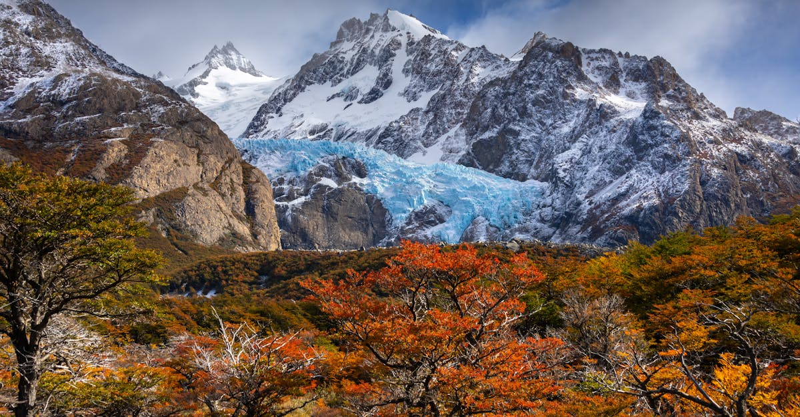

# Patagonia, Chile and Argentina

Country: Chile and Argentina
Region: Americas

Patagonia is the vast southern cone of South America shared between Chile and Argentina, stretching from roughly the 40th parallel south to Tierra del Fuego. Glacial landscapes, granite-tower peaks (Torres del Paine, Fitz Roy), one of the world's largest temperate-glacier systems, and one of the planet's most spectacular trekking regions.

---

## 🧭 Step 1: Choices

### ✨ Why Visit

Patagonia is one of Earth's last great wilderness regions accessible by trekking. **Torres del Paine National Park** in Chilean Patagonia is among the world's premier trekking destinations (the W trek, the O Circuit). **Los Glaciares National Park** in Argentine Patagonia holds **Mount Fitz Roy**, **Cerro Torre**, and the **Perito Moreno Glacier**, which is one of the few glaciers in the world still advancing.

The region is also a working conservation experiment. The Tompkins Conservation effort (which became the Patagonia and Patagonia National Park network) is one of the largest private-to-public land donations in conservation history. Visiting respectfully means engaging the wider conservation story, not just the headline trails.

You come for the trekking, the glaciers, the wildlife (guanacos, condors, pumas), the wind, and a wilderness scale that does not exist elsewhere outside the polar regions.

### 🌍 Ethical Compass

- **💰 Economy.** Stay in Puerto Natales (Chile, gateway to Torres del Paine) or El Calafate / El Chaltén (Argentina, gateway to Los Glaciares); both are smaller working towns. The in-park lodges (EcoCamp, Explora, Tierra Patagonia) cost dramatically more and are limited to specific zones. Eat at family restaurants in the gateway towns rather than only the international tourist set.
- **👥 Employment.** Tip guides, porters (where used), and refugio staff generously; pay-and-tip is the structural compensation. The trail-cleaner programmes that keep the parks open depend on volunteer and seasonal labour.
- **📚 Education.** Read about the Mapuche, Tehuelche, and Selk'nam peoples (now severely reduced) who inhabited the region before European arrival. The Tompkins Conservation story, the rewilding of Patagonia National Park (Chile), and the contested mining-and-salmon-farming politics are all current.
- **🌱 Ecology.** Pack out everything. Stay strictly on trails (the alpine plant communities are decade-slow to recover). Use refugio toilets only. Carry a stove for in-park cooking (open fires are largely banned). Choose operators that meet **CONAF (Chile)** or **APN (Argentina)** standards for guided treks.

---

## 🎒 Step 2: Preparation

### 🔍 Governance Management Traceability

- Verify **visa rules for both Chile and Argentina** on the official portals; most Western nationals are visa-exempt for short stays.
- **Torres del Paine National Park** entry requires **online reservation** through the official **Aspatagonia** (or successor) portal; the **refugio bookings on the W trek** must be made through Vertice and Las Torres (the two refugio operators) months in advance; the O Circuit is even more limited.
- **Los Glaciares National Park** (Argentine) entry at the gate; verify on the APN portal.
- **Perito Moreno Glacier** boardwalks, minitrekking, and big-ice trekking are operated by Hielo y Aventura and similar; book on official operator portals.
- For **flights or buses**, **LATAM, Sky, JetSMART** and others serve Punta Arenas (PUQ) for Chilean side; **Aerolíneas Argentinas** serves El Calafate (FTE) and El Chaltén (via FTE).

### 📡 Information Curation Variety

- **CONAF (Chile)** and **Administración de Parques Nacionales (Argentina)** for official park information.
- **Patagonia.tips** and similar trekking-community resources for current trail conditions.
- A book on the region: Bruce Chatwin's *In Patagonia* (literary classic); Doug and Kris Tompkins' biography; Jonathan Franzen's *The End of the End of the Earth*.
- A registered trekking guide for any technical or multi-day route.
- **Wikivoyage Patagonia** for cross-border logistics.

### 🎯 Inference Interaction Accountability

- **You decide on Chile side, Argentina side, or both.** Both sides reward visits; both have signature treks; the cross-border logistics add a day. Most first-time visitors choose one.
- **You decide on the W trek vs the O Circuit vs day hikes.** The W is 4 to 5 days, refugio-supported, books months ahead. The O is 7 to 10 days, harder, fewer refugios. Day hikes from Hotel Las Torres area give the iconic Towers view without a multi-day commitment.
- **You decide on Perito Moreno depth.** The boardwalks (free time in front of the glacier) work for everyone; minitrekking or big-ice trekking is genuinely meaningful.
- **You decide on El Chaltén.** The Argentinian trekking village beneath Fitz Roy and Cerro Torre is one of the world's great walking towns; day hikes (Laguna de los Tres, Laguna Torre, Loma del Pliegue Tumbado) are all accessible.
- **You decide on the time of year.** Summer (December to February) is busy and most reliable; shoulder (October-November, March) is quieter and gambier with weather; winter mostly closes the major treks.

### 🔄 Intelligence Cooperation Integrity

Patagonia weather is the boss. Wind 100 km/h is normal; storms can move in within an hour; the Torres can be invisible all day and dramatically clear by sunset. Refugio bookings are non-refundable; flights are weather-affected.

Bring a soft plan. If a storm closes the Torres viewpoint day, the lower W routes still walk and the next day is often clear. If a flight to El Calafate is delayed, build in buffer days. If a refugio sleeping space drops, the campsites are still available with reservation.

### 📍 Top 5 Anchor Spots (Zones and Sectors)

1. **Torres del Paine National Park (Chile): the Mirador Las Torres day hike or the W trek (4 to 5 days).** The granite Towers viewpoint is the signature image.
2. **Los Glaciares National Park (Argentina) - El Chaltén sector: Laguna de los Tres day hike to Fitz Roy.** A 10-hour return classic.
3. **Perito Moreno Glacier (Argentina).** The boardwalks at minimum; minitrekking or big-ice trekking for the active.
4. **Punta Arenas and the Magellan Strait.** Often overlooked; the Plaza de Armas, the Sara Braun mansion, and a half-day Magdalena Island penguin trip in season.
5. **Tierra del Fuego (Ushuaia, Argentina).** The "end of the world"; Tierra del Fuego National Park; Beagle Channel boat trips; the launching point for Antarctica.

### 🧰 Practical Essentials

- **Recommended Length.** **Seven to fourteen days** for Patagonia minimum; **two to three weeks** for both sides. Transfers eat time.
- **Getting There and Around.** Fly into **Santiago (SCL, Chile)** or **Buenos Aires (EZE/AEP, Argentina)** then onward to **Punta Arenas (PUQ)** or **El Calafate (FTE)** by domestic flight. From there: bus or transfer to gateway towns. Inside parks: walking, guided 4x4 transfers, or refugio shuttles.
- **Daily Cost (per person).**
  - **Budget:** roughly USD 70 to 140. Gateway-town hostel, supermarket and refugio-kitchen meals, public bus, self-guided W trek with refugio reservations.
  - **Mid-range:** roughly USD 200 to 450. Three-star hotel in Puerto Natales or El Calafate, mixed dining, guided day hikes, Perito Moreno minitrekking.
  - **Higher-comfort:** roughly USD 800 and up. EcoCamp Patagonia, Explora Patagonia, or Tierra Patagonia in-park lodges, all-inclusive with guides, helicopter and private 4x4 transfers.
- **Booking Notes.**
  - **Torres del Paine refugio bookings:** open 6 to 12 months ahead; sell out within hours for the W and O.
  - **Perito Moreno minitrekking:** book weeks ahead in peak.
  - **Cross-border:** verify both Chilean and Argentinian rules.
  - **Argentinean peso volatility:** carry USD as backup.
  - **Summer (December to February):** book everything months ahead.

---

## ✈️ Step 3: Delivery

### 🤖 AI Prompt

Copy this into your own AI assistant, fill in the brackets, and treat the answer as a researcher's draft, not a final plan.

> Please help me plan an ethical visit to Patagonia (Chile and/or Argentina) for [NUMBER] days in [MONTH]. I am travelling with [WHO] and my interests are [INTERESTS, e.g. trekking, glaciers, wildlife, photography, end-of-the-world geography]. My total budget is around [AMOUNT] and my comfort level is [budget / mid-range / higher-comfort].
>
> Please structure your answer in three steps.
>
> **Step 1: Choices.** Help me decide what to prioritise. Recommend the best combination of Chilean (Torres del Paine) and Argentinian (Los Glaciares) Patagonia given my time, and one I should consider skipping (the full O Circuit if I lack experience, an unguided shoulder-season multi-day, a Perito Moreno boardwalk-only if my time and budget allow minitrekking). Briefly explain each trade-off.
>
> **Step 2: Preparation.** Cover all four of the following:
> - **Governance Management Traceability.** What assumptions should I check before I book? Include Chilean and Argentinian visa rules on official portals, CONAF official Torres del Paine reservations, Vertice and Las Torres refugio bookings for the W and O, APN for Los Glaciares, Hielo y Aventura for Perito Moreno minitrekking, and current Argentinean currency status.
> - **Information Curation Variety.** Suggest at least four different source types: CONAF, APN, a Patagonia book (Chatwin or Tompkins biography), and a registered trekking guide or operator.
> - **Inference Interaction Accountability.** List the decisions I personally need to make (Chile-side vs Argentina-side vs both, W vs O vs day hikes, Perito Moreno depth, El Chaltén commitment, season).
> - **Intelligence Cooperation Integrity.** Build me a soft plan with at least two alternates for likely disruptions (Torres viewpoint day storm, refugio drop, a flight to El Calafate delay, an Argentine paro affecting transport).
>
> **Step 3: Delivery.** Give me the actual itinerary, day by day, with realistic timings, named trails, and refugio names where booked. Include at least one buffer day for weather. Mark each operator as confidently CONAF/APN-registered, or flag for me to verify.
>
> Finally, please remind me at the end to verify your suggestions against:
> 1. Official sources: CONAF (Chile), APN (Argentina), and the refugio operators Vertice and Las Torres for Torres del Paine.
> 2. Real people: a Puerto Natales or El Calafate hotel host, a registered trekking guide, or a recent Patagonia trekker.
>
> Treat your output as a researcher's draft. I will make the final calls.

---

Part of **Gyro Governance Ethical Travel: AI-Empowered Guides for Human Adventures**.

Explore more destinations, ethical domains, and AI prompts at [travel.gyrogovernance.com](https://travel.gyrogovernance.com/).
