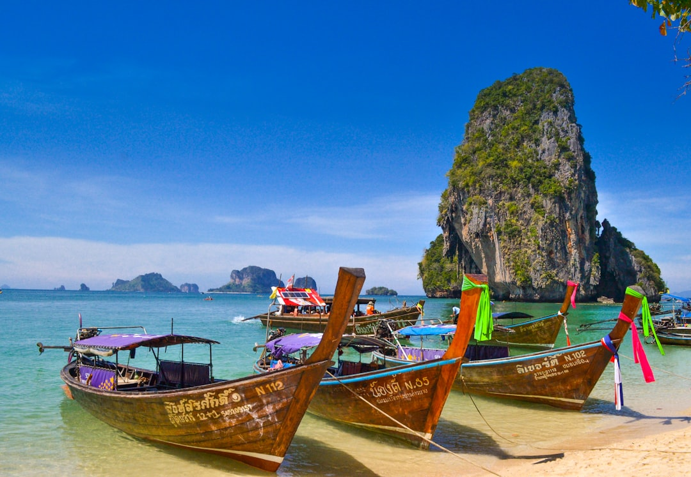

# Phuket, Thailand

Country: Thailand
Region: Asia

Phuket is Thailand's largest island, a 550 square kilometre Andaman Sea hub of 600,000 residents and one of Asia's most-visited beach destinations. Mountainous interior, limestone-karst seascapes nearby (Phang Nga Bay, Phi Phi Islands), serious diving sites, and a complicated tourism economy.

---

## 🧭 Step 1: Choices

### ✨ Why Visit

Phuket is the gateway to one of the world's most photogenic seascapes. **Phang Nga Bay**'s limestone karsts, **the Phi Phi Islands**, **Similan and Surin Islands** (for serious diving), and the working fishing villages of the east coast all sit within reach. **Old Phuket Town**'s Sino-Portuguese architecture is genuinely lovely; the Big Buddha and Wat Chalong are cultural anchors.

The island is also the most pressure-tested beach destination in Thailand. Patong's nightlife economy is one face; the quieter east coast and the inland Sino-Thai culture are another. Visiting respectfully means choosing your Phuket deliberately.

You come for the Andaman Sea, the diving and snorkelling, the food (Phuketian Thai is distinct, with strong Hokkien Chinese influence), and the gateway to nearby islands.

### 🌍 Ethical Compass

- **💰 Economy.** Eat at Phuket Town's small restaurants and street stalls (Phuket Hokkien noodles, *moo hong*, *oh-aew*), not only the resort buffets. Stay in family-run guesthouses or smaller boutique hotels rather than only the largest international chains.
- **👥 Employment.** Tipping is not customary in Thailand but small amounts are appreciated. Use metered taxis or Grab; the "tuk-tuk" mafia on Phuket is notorious for inflated prices; verify before riding.
- **📚 Education.** The 2004 Indian Ocean Tsunami devastated Phuket and the Andaman coast; the Tsunami Memorial in Khao Lak and the small museums on Phi Phi tell the story. Phuket Town's Peranakan (Sino-Portuguese) heritage is one of Southeast Asia's distinctive cultural blends.
- **🌱 Ecology.** **Reef-safe sunscreen** is essential. Do not touch coral. **Avoid riding elephants** anywhere on Phuket; choose Phuket Elephant Sanctuary or similar ethical alternatives. Do not feed monkeys; do not visit "tiger temple" attractions (animal welfare concerns are documented).

---

## 🎒 Step 2: Preparation

### 🔍 Governance Management Traceability

- Confirm your **visa exemption or visa-on-arrival** on the official Thai Ministry of Foreign Affairs portal.
- **Maya Bay** (made famous by *The Beach*) has been managed with closure periods to restore coral; verify current opening status and any reservation system on the Department of National Parks portal.
- For **Phi Phi Islands, Phang Nga Bay, Similan Islands** day trips and overnights, choose operators with strong reputations and conservation focus.
- For **elephant interactions**, choose only walk-with-elephant sanctuaries (Phuket Elephant Sanctuary is the reference); never elephant-ride operators.
- **Khao Lak** (an hour and a half north) is a quieter alternative base; verify operator licensing for Similan trips.

### 📡 Information Curation Variety

- **Bangkok Post** and **Phuket News** for current events and local rules.
- The official **Tourism Authority of Thailand (TAT)** site for events and current advisories.
- A Thai author: Saneh Sangsuk; or Andrew Marshall's *A Kingdom in Crisis* for broader Thai context.
- A Phuket-resident expat-and-local YouTube channel or guide for ground-truth on operators and current scam patterns.
- **Wikivoyage Phuket** for orientation.

### 🎯 Inference Interaction Accountability

- **You decide on your beach.** Patong is loud, dense, party-focused; Karon and Kata are family-mid-range; Surin and Bang Tao are upmarket; Rawai and Nai Harn are quieter; the east coast is the local fishing-village side.
- **You decide on Phi Phi.** A day trip from Phuket gives the postcard view; an overnight on Phi Phi Don is the deeper experience. Maya Bay rules have evolved repeatedly; verify current access.
- **You decide on Phang Nga vs Phi Phi.** Phang Nga's karsts (including James Bond Island) are different from Phi Phi's beaches; pick one or both.
- **You decide on elephant ethics.** A walk-with-elephant sanctuary visit is a different day from a riding-elephant attraction. Choose deliberately.
- **You decide on Old Phuket Town.** A morning of Sino-Portuguese architecture and Hokkien food is one of the island's most overlooked highlights.

### 🔄 Intelligence Cooperation Integrity

Phuket weather is monsoonal; wet season (May to October) brings rain, swell on west coasts, and reduced boat operations; dry season (November to April) is the peak tourist window. Major Thai holidays (Songkran in April, Loy Krathong in November) reshape the island.

Bring a soft plan. If west-coast swell cancels Phi Phi boats, the calmer east-coast or sheltered Phang Nga can run. If a downpour closes outdoor plans, Old Phuket Town walking and a Sino-Portuguese house museum work. Phuket Elephant Sanctuary runs year-round.

### 📍 Top 5 Anchor Spots

1. **Old Phuket Town walking morning.** Sino-Portuguese shophouses, the Thai Hua Museum, Hokkien noodles at Mee Ton Poe, and Talad Yai market.
2. **Phang Nga Bay day trip.** Limestone karsts, James Bond Island, the floating Muslim village of Ko Panyi; choose a small-group or kayak operator.
3. **Phi Phi Islands day trip or overnight.** Maya Bay (verify access), Bamboo Island, Phi Phi Don village.
4. **Phuket Elephant Sanctuary.** Half a day; walk with retired working elephants; book ahead through official portal.
5. **A west-coast sunset (Surin, Bang Tao, Naithon Beach) or a Big Buddha visit.** Free; the sunset over the Andaman is the island's signature.

### 🧰 Practical Essentials

- **Recommended Length.** Four to seven days for Phuket. Add three to five for nearby Krabi or Khao Lak (Similan Islands gateway).
- **Transport.** Walk in Old Phuket Town and beach villages. **Grab** for ride-hail. **Songthaews** (shared blue trucks) for cheap routes. **Tuk-tuks and motorbike-taxis** are common but pricing is contested; verify fares. Phuket International Airport (HKT) is 40 minutes from Patong by taxi.
- **Daily Cost (per person).**
  - **Budget:** roughly THB 1,200 to 2,500 (about USD 35 to 75). Guesthouse or budget hotel, street food, Grab, one boat trip.
  - **Mid-range:** roughly THB 3,500 to 8,000 (about USD 100 to 230). Three- or four-star resort, mixed dining, a Phang Nga or Phi Phi day, elephant sanctuary, scooter rental.
  - **Higher-comfort:** roughly THB 12,000 and up. Trisara, Amanpuri, the Surin, fine dining at the resort restaurants, private boat charters, helicopter island tours.
- **Booking Notes.**
  - **Visa:** verify on the Thai Ministry of Foreign Affairs portal.
  - **Maya Bay:** verify current open or closed status and any reservation rules on the official Department of National Parks portal.
  - **Songkran (April 13-15) and Loy Krathong (November)** are big festivals; book accommodation months ahead.
  - **Monsoon season (May to October)** affects boats and beach safety; verify swell forecasts.
  - **Elephant ethics:** verify the operator's policies in writing before booking.

---

## ✈️ Step 3: Delivery

### 🤖 AI Prompt

Copy this into your own AI assistant, fill in the brackets, and treat the answer as a researcher's draft, not a final plan.

> Please help me plan an ethical visit to Phuket, Thailand for [NUMBER] days in [MONTH]. I am travelling with [WHO] and my interests are [INTERESTS, e.g. diving and snorkelling, beach, Old Phuket Town, elephant sanctuary, Phi Phi]. My total budget is around [AMOUNT] and my comfort level is [budget / mid-range / higher-comfort].
>
> Please structure your answer in three steps.
>
> **Step 1: Choices.** Help me decide what to prioritise. Recommend the two or three Phuket experiences I should not miss given my interests, and one I should consider skipping (an elephant-riding attraction, a Patong nightlife focus if I came for nature, a tuk-tuk ride at the inflated price). Briefly explain each trade-off.
>
> **Step 2: Preparation.** Cover all four of the following:
> - **Governance Management Traceability.** What assumptions should I check before I book? Include the Thai Ministry of Foreign Affairs visa portal, Maya Bay current status, ethical elephant sanctuary verification, Phi Phi and Phang Nga operator reputation, and reef-safe sunscreen.
> - **Information Curation Variety.** Suggest at least four different source types: one official Thai source, one Phuket news outlet, one Thai author or contextual book, and one local guide or ethical sanctuary.
> - **Inference Interaction Accountability.** List the decisions I personally need to make (beach base, Phi Phi vs Phang Nga, elephant ethics, Old Phuket Town time, taxi vs tuk-tuk).
> - **Intelligence Cooperation Integrity.** Build me a soft plan with at least two alternates for likely disruptions (monsoon swell cancelling boats, a Maya Bay closure, a heat wave, a Songkran water-fight during my dates).
>
> **Step 3: Delivery.** Give me the actual itinerary, day by day, with realistic timings and named beaches and sites. Include at least one Old Phuket Town morning and one boat trip. Mark each business as confidently locally owned and ethically operated, or flag for me to verify.
>
> Finally, please remind me at the end to verify your suggestions against:
> 1. Official sources: Tourism Authority of Thailand, the Department of National Parks for Maya Bay, and the official Phuket Elephant Sanctuary portal.
> 2. Real people: a Phuket-based hotel host, a local guide, or recent traveller reviews.
>
> Treat your output as a researcher's draft. I will make the final calls.

---

Part of **Gyro Governance Ethical Travel: AI-Empowered Guides for Human Adventures**.

Explore more destinations, ethical domains, and AI prompts at [travel.gyrogovernance.com](https://travel.gyrogovernance.com/).
