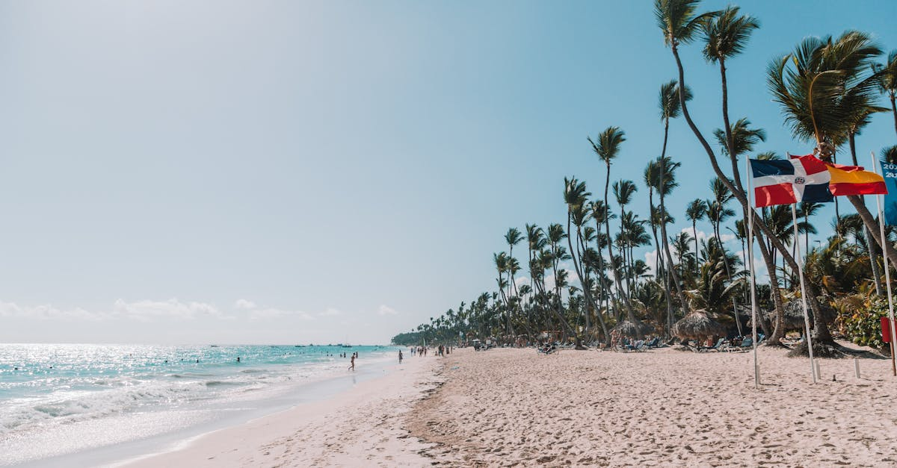

# Punta Cana, Dominican Republic

Country: Dominican Republic
Region: Americas

Punta Cana is the easternmost beach resort region of the Dominican Republic, a 60-kilometre coast on the Caribbean and Atlantic. The country's main beach-resort hub, with one of the largest concentrations of all-inclusive resorts in the Caribbean, white-sand beaches, and proximity to colonial Santo Domingo and the Samaná Peninsula.

---

## 🧭 Step 1: Choices

### ✨ Why Visit

Punta Cana is the most reliable Caribbean beach destination for travellers wanting an all-inclusive resort week. The beaches (Bávaro, Macao, Cap Cana) are long, white, palm-lined, and protected by an offshore reef. The water is calm and warm. The infrastructure is reliable.

The country is also more than its all-inclusive coast. Santo Domingo (3 hours west) is the oldest continuously inhabited European city in the Americas, with a UNESCO-listed colonial centre. The Samaná Peninsula (4 hours north) has humpback whales in winter and dramatic mountain-coast scenery.

You come for the reliable beach week, the warm Caribbean water, and optionally the chance to engage with the wider Dominican Republic beyond the resort gate.

### 🌍 Ethical Compass

- **💰 Economy.** Most spending in Punta Cana flows to international resort chains; very little reaches Dominican households. Counterbalance by booking at least one excursion with a **Dominican-owned local operator**, eating one or two meals outside the resort (the village of Higüey, Bávaro's local side), and tipping resort staff (housekeeping, bartenders, servers, beach attendants) generously.
- **👥 Employment.** Resort staff in the DR are paid Dominican wages; tips are the major part of their income. Tip in USD or pesos: USD 2-5 per drink at the bar, USD 5-10 per day for housekeeping, USD 10-20 per day for a butler, generously for excursion guides.
- **📚 Education.** Read about Dominican history (Taíno indigenous peoples, Spanish colonial period, slavery and sugar, Trujillo dictatorship 1930-61, the contested border with Haiti). Junot Díaz's *The Brief Wondrous Life of Oscar Wao* is the literary entry point. Visit colonial Santo Domingo at least as a day trip.
- **🌱 Ecology.** **Reef-safe sunscreen** is essential. Do not touch coral. The Dominican Republic has a sargassum problem on east-coast beaches (mostly April to August); verify before booking specific dates. Choose excursion operators that follow Indigenous Taíno-site rules.

---

## 🎒 Step 2: Preparation

### 🔍 Governance Management

- Most visitors are **visa-exempt** for the Dominican Republic; a **tourist card** is included in your airline ticket or paid on arrival. Verify on the DR Ministry of Foreign Affairs portal.
- An **eTicket** through the official Dominican Republic portal is required for entry; verify before flying.
- **All-inclusive resort booking:** book on the resort's official portal, a reputable travel agency, or established platforms; verify all-inclusive scope.
- For **Saona Island, Catalina Island, Bávaro Splash adventure park** excursions, verify operator reputation and ownership.
- For **Samaná whale-watching** (January to March), choose **CEBSE** (Center for the Conservation and Eco-development of Samaná Bay)-accredited operators.

### 📡 Information Curation

- **DR1** and **Dominican Today** (English-language Dominican news) for current events.
- The official **Dominican Republic Ministry of Tourism** site for events.
- A Dominican author: Junot Díaz (Pulitzer winner, Dominican-American); Julia Alvarez (*In the Time of the Butterflies*); Rita Indiana for contemporary.
- A locally led Higüey or Santo Domingo walking tour with a Dominican guide.
- **Wikivoyage Punta Cana** for resort and area orientation.

### 🎯 Inference Interaction

- **You decide on the resort vs the country.** A week behind a resort gate is the most common Punta Cana trip; adding a Santo Domingo day or a Samaná overnight transforms it.
- **You decide on the excursion operator.** Resort-tour-desk excursions are convenient; locally booked Dominican operators usually cost less and put more money in the country.
- **You decide on the tipping budget.** Dominican wages are stretched; tip generously and consistently.
- **You decide on the sargassum tolerance.** Sargassum on Punta Cana beaches is heaviest April to August; verify recent beach reports.
- **You decide on Haiti engagement.** The DR-Haiti border is a complicated political subject; understand context before commenting.

### 🔄 Intelligence Cooperation

Punta Cana weather is tropical; warm year-round with afternoon thunderstorms in the wet season (May to October); hurricane season peaks August to October. Hotel rates spike at Christmas/New Year and US spring break.

Bring a soft plan. If a hurricane warning approaches, the resorts coordinate plans well; have travel insurance. If a sargassum bloom fills your beach, the resort pools and excursions to Saona work. If a thunderstorm shuts the beach, the resort's indoor amenities absorb a wet afternoon.

### 📍 Top 5 Anchor Spots

1. **Bávaro Beach.** The classic 30-kilometre Punta Cana beach; choose your resort along it.
2. **Saona Island day trip.** Catamaran or speedboat from Bayahibe; verify operator; the natural pool is the highlight.
3. **Higüey day trip.** The Basilica of Higüey (the country's most important Catholic pilgrimage site) and a local lunch.
4. **Santo Domingo day trip or overnight.** The Zona Colonial UNESCO site is one of the great colonial centres of the Americas; 3 hours by road.
5. **Samaná Peninsula (overnight).** Humpback whales in January-March; El Limón waterfall; dramatic coast.

### 🧰 Practical Essentials

- **Recommended Length.** Five to seven days for a Punta Cana beach week. Add two for Santo Domingo or three for Samaná.
- **Getting There and Around.** Fly into **Punta Cana International Airport (PUJ)** directly from most North American and European cities; the airport has a thatched-roof terminal that is genuinely lovely. Resort transfers are usually pre-arranged. **Public transport** is limited; rent a car for serious exploration or use private drivers.
- **Daily Cost (per person).**
  - **Budget:** roughly USD 80 to 150. Budget all-inclusive (Vista Sol, Riu, Be Live), bus excursions.
  - **Mid-range:** roughly USD 180 to 350. Three-or-four-star all-inclusive (Iberostar, Catalonia, Bahia Principe), guided excursions, day-trip to Santo Domingo.
  - **Higher-comfort:** roughly USD 500 and up. Five-star (Tortuga Bay, Excellence, Eden Roc, Westin Punta Cana), butler-level service, private guided experiences, helicopter excursions.
- **Booking Notes.**
  - **eTicket:** verify on the official Dominican Republic portal before flying.
  - **All-inclusive scope:** verify what is included (drinks, restaurants, excursions, room service).
  - **Hurricane season** (June to November): travel insurance covering weather is wise.
  - **Sargassum:** verify recent reports for east-coast beaches.
  - **Tourist card:** included with most airline tickets but verify.

---

## ✈️ Step 3: Delivery

### 🤖 AI Prompt

Copy this into your own AI assistant, fill in the brackets, and treat the answer as a researcher's draft, not a final plan.

> Please help me plan an ethical visit to Punta Cana, Dominican Republic for [NUMBER] days in [MONTH]. I am travelling with [WHO] and my interests are [INTERESTS, e.g. beach week, snorkelling, day trips, Dominican culture, whale-watching]. My total budget is around [AMOUNT] and my comfort level is [budget / mid-range / higher-comfort].
>
> Please structure your answer in three steps.
>
> **Step 1: Choices.** Help me decide what to prioritise. Recommend the best resort and the two or three experiences I should not miss given my interests, and one I should consider skipping (a resort-only week with no Dominican engagement, an unverified Saona excursion, sargassum-season beach without checking). Briefly explain each trade-off.
>
> **Step 2: Preparation.** Cover all four of the following:
> - **Governance Management.** What assumptions should I check before I book? Include the Dominican Republic eTicket portal, all-inclusive resort scope, CEBSE-accredited Samaná whale operators, sargassum reports, and tipping etiquette.
> - **Information Curation.** Suggest at least four different source types: one official Dominican source, one English-language DR news outlet, one Dominican author (Díaz or Alvarez), and one Dominican-owned local operator.
> - **Inference Interaction.** List the decisions I personally need to make (resort-only vs add Santo Domingo or Samaná, resort-tour vs local operator, tipping budget, sargassum tolerance, dates).
> - **Intelligence Cooperation.** How should I trust my own judgment and local advice over algorithmic defaults when conditions change? Build me a soft plan with at least two alternates for likely disruptions (hurricane warning, heavy sargassum, a tour cancellation by weather, a heat-wave day).
>
> **Step 3: Delivery.** Give me the actual itinerary, day by day, with realistic timings and named excursions. Include at least one day outside the resort (Santo Domingo, Higüey, or a locally booked tour). Mark each business as confidently locally owned or fairly operated, or flag for me to verify.
>
> Finally, please remind me at the end to verify your suggestions against:
> 1. Official sources: the Dominican Republic Ministry of Tourism, the eTicket portal, and CEBSE for whale-watching.
> 2. Real people: a Dominican guide, resort staff, or a recent visitor with on-the-ground experience.
>
> Treat your output as a researcher's draft. I will make the final calls.

---

Part of **Gyro Governance Ethical Travel: AI-Empowered Guides for Humane Adventures**.

Explore more destinations, ethical domains, and AI prompts at [travel.gyrogovernance.com](https://travel.gyrogovernance.com/).
