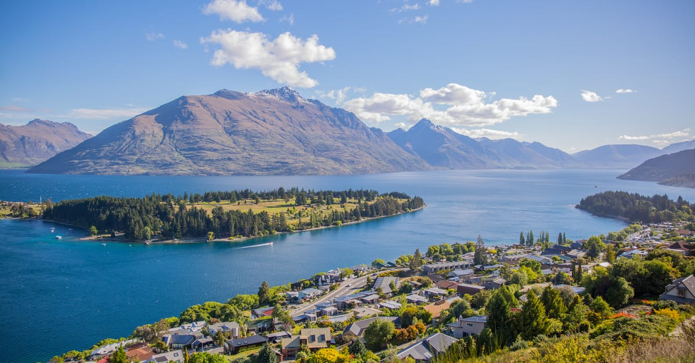

# Queenstown, New Zealand

Country: New Zealand
Region: Oceania

Queenstown (*Tāhuna* in te reo Māori) is a 30,000-resident resort town on the shore of Lake Wakatipu in New Zealand's South Island, surrounded by the Remarkables mountain range. The self-described "adventure capital of the world", the launching point for Fiordland (Milford Sound, Doubtful Sound), and a serious year-round outdoor destination.

---

## 🧭 Step 1: Choices

### ✨ Why Visit

Queenstown is one of the world's best concentrated outdoor-adventure bases. Bungy jumping was commercialised here (AJ Hackett, Kawarau Bridge). Jet boating on the Shotover River, paragliding off Coronet Peak, skiing at the Remarkables and Cardrona in winter, hiking the Routeburn, Kepler, and Milford Tracks, and **the day trip to Milford Sound** are all from here.

The town is also the gateway to **Fiordland National Park** (the deeper South Island wilderness) and to **Aoraki/Mount Cook**, **Wanaka**, and **Glenorchy** (the start of the Routeburn Track).

You come for the adventure, the mountains, Milford Sound, and a base for the South Island's most spectacular landscapes.

### 🌍 Ethical Compass

- **💰 Economy.** Eat at smaller local restaurants in Queenstown, Frankton, and Arrowtown rather than only the expensive lake-front spots. Stay in less-central accommodation if budget matters; Arrowtown, Frankton, and Kelvin Heights offer more space at lower rates.
- **👥 Employment.** Tipping is not customary in New Zealand. Use buses and shuttles. Adventure operators have strong safety culture; the cost reflects it.
- **📚 Education.** Queenstown sits in **Ngāi Tahu** tribal area (the South Island iwi). The Te Atamira cultural centre and Ngāi Tahu-led experiences provide te iwi context. Read about the gold-rush history (Arrowtown's Chinese miners' settlement is genuinely moving).
- **🌱 Ecology.** Stay on marked trails. Choose operators with **Tiaki Promise** alignment (the New Zealand visitor-pledge to care for the land). Helicopter use is loud and ecologically debated; consider whether you need it.

---

## 🎒 Step 2: Preparation

### 🔍 Governance Management

- Verify your **NZeTA (Electronic Travel Authority)** requirement and the **International Visitor Conservation and Tourism Levy** on the official Immigration New Zealand portal.
- **Milford Sound** boat cruises are operated by several companies (Real Journeys, Mitre Peak, JUCY Cruize); book on official portals.
- **Great Walks** (Routeburn, Kepler, Milford) require advance booking through the **Department of Conservation (DOC)** portal months ahead in summer.
- **AJ Hackett bungy, Shotover Jet, paragliding, ski-field passes** sell on official operator portals.
- The **Queenstown Trail** (45 km of cycle path) is free; bike hire from local shops.

### 📡 Information Curation

- **Otago Daily Times** and **NZ Herald** for current news.
- **Queenstown NZ** (official) for events and operator info.
- A New Zealand author: Eleanor Catton (the Booker-winning *The Luminaries* is set in West Coast gold-rush country, deeply related); Witi Ihimaera, Patricia Grace for Māori voices.
- A Ngāi Tahu-led cultural experience (Te Atamira, Mana Tāhuna).
- **Department of Conservation (DOC)** for trail status, hut bookings, and avalanche advisories.

### 🎯 Inference Interaction

- **You decide on the Milford Sound approach.** Day trip from Queenstown is 12 to 14 hours (bus + boat + bus); fly-in is dramatically faster (and more expensive); overnight in Te Anau breaks the journey.
- **You decide on the adventure mix.** Bungy, jet boat, skydive, paraglide all available; choose one big-ticket per day max.
- **You decide on the Great Walk.** Routeburn (3-4 days), Kepler (4 days), Milford (4 days) all need advance booking and trekking experience.
- **You decide on the season.** Winter (June-August) is ski season; summer (December-February) is hiking season; shoulder seasons can be unpredictable.
- **You decide on the helicopter.** Sounds-and-glaciers heli-flights are spectacular and loud; the impact on wilderness experience is a real conversation.

### 🔄 Intelligence Cooperation

Queenstown weather can be dramatic at any season. Fiordland is one of the world's wettest places; Milford Sound is best in any weather (rain creates waterfalls) but boats may be affected. Avalanche risk in winter backcountry is real.

Bring a soft plan. If a Milford boat is cancelled, an Arrowtown day or Glenorchy half-day work. If a ski day is cloud-locked, the indoor hot pools or Kawarau bungy work. If weather closes a Great Walk, day hikes nearby (Ben Lomond, Queenstown Hill) absorb a day.

### 📍 Top 5 Anchor Spots

1. **Milford Sound day or overnight.** Boat cruise on the Sound; bus through the Eglinton Valley; the Chasm; Mirror Lakes.
2. **A bungy or jet-boat experience.** AJ Hackett's Kawarau Bridge for bungy; Shotover Jet for the canyon.
3. **The Queenstown Trail by bike.** 45 km of cycle path; do the lakeside section as a half-day with a stop in Arrowtown.
4. **Arrowtown.** Restored gold-rush town; the Chinese Miners' Settlement; great cafés.
5. **A Great Walk day or full trek.** Routeburn day-walk from the Routeburn Shelter is achievable without a hut booking.

### 🧰 Practical Essentials

- **Recommended Length.** Three to five days for Queenstown and one Milford Sound trip. Add 3 to 4 days for a Great Walk; add days for Wanaka and Aoraki/Mount Cook.
- **Getting There and Around.** Fly into **Queenstown Airport (ZQN)** direct from major Australasian cities. Within the area: walk in central Queenstown; **Orbus** local buses; rental car for further afield. Milford Sound transfers: bus or fly-in or self-drive (4 hours each way from Queenstown).
- **Daily Cost (per person).**
  - **Budget:** roughly NZD 150 to 280. Hostel, supermarket and casual meals, Orbus, free hikes, one big experience.
  - **Mid-range:** roughly NZD 380 to 650. Three-star lakeside hotel, restaurant dinners, Milford Sound day-trip, one or two adventure activities.
  - **Higher-comfort:** roughly NZD 900 and up. The Rees, Eichardt's, Matakauri Lodge, fine dining, helicopter Milford, Great Walk with guided lodge nights (Ultimate Hikes).
- **Booking Notes.**
  - **NZeTA and conservation levy:** verify on the official Immigration New Zealand portal.
  - **Great Walks (Routeburn, Kepler, Milford):** book months ahead through DOC.
  - **Milford Sound cruises:** book ahead; weather-dependent.
  - **Winter ski:** Coronet Peak, Remarkables, Cardrona; book lift passes and rentals ahead in peak.
  - **Adventure activities:** weight, age, and health restrictions apply; verify in advance.

---

## ✈️ Step 3: Delivery

### 🤖 AI Prompt

Copy this into your own AI assistant, fill in the brackets, and treat the answer as a researcher's draft, not a final plan.

> Please help me plan an ethical visit to Queenstown, New Zealand for [NUMBER] days in [MONTH]. I am travelling with [WHO] and my interests are [INTERESTS, e.g. Milford Sound, adventure sports, skiing, Great Walks, Māori culture]. My total budget is around [AMOUNT] and my comfort level is [budget / mid-range / higher-comfort].
>
> Please structure your answer in three steps.
>
> **Step 1: Choices.** Help me decide what to prioritise. Recommend the two or three Queenstown experiences I should not miss given my interests, and one I should consider skipping (a helicopter when a bus + boat works, a packed multi-adventure day that exhausts everyone, an unverified operator). Briefly explain each trade-off.
>
> **Step 2: Preparation.** Cover all four of the following:
> - **Governance Management.** What assumptions should I check before I book? Include the NZeTA and conservation levy, DOC Great Walk bookings, official Milford boat operators, ski-pass portals, and Tiaki Promise.
> - **Information Curation.** Suggest at least four different source types: one official New Zealand source, one local news outlet, one New Zealand author, and one Ngāi Tahu-led cultural source.
> - **Inference Interaction.** List the decisions I personally need to make (Milford approach, adventure mix, Great Walk commitment, season, helicopter ethics).
> - **Intelligence Cooperation.** How should I trust my own judgment and local advice over algorithmic defaults when conditions change? Build me a soft plan with at least two alternates for likely disruptions (Milford boat cancellation, avalanche advisory closing backcountry, helicopter weather, sudden snow or rain).
>
> **Step 3: Delivery.** Give me the actual itinerary, day by day, with realistic timings and named operators where bookings are needed. Include the Milford trip, one adventure, and one Arrowtown or Ngāi Tahu cultural day. Mark each operator as confidently certified, or flag for me to verify.
>
> Finally, please remind me at the end to verify your suggestions against:
> 1. Official sources: Queenstown NZ, the Department of Conservation, Immigration New Zealand, and the official operator portals.
> 2. Real people: a Queenstown adventure-shop guide, a Ngāi Tahu cultural host, or a recent Great Walks trekker.
>
> Treat your output as a researcher's draft. I will make the final calls.

---

Part of **Gyro Governance Ethical Travel: AI-Empowered Guides for Human Adventures**.

Explore more destinations, ethical domains, and AI prompts at [travel.gyrogovernance.com](https://travel.gyrogovernance.com/).
