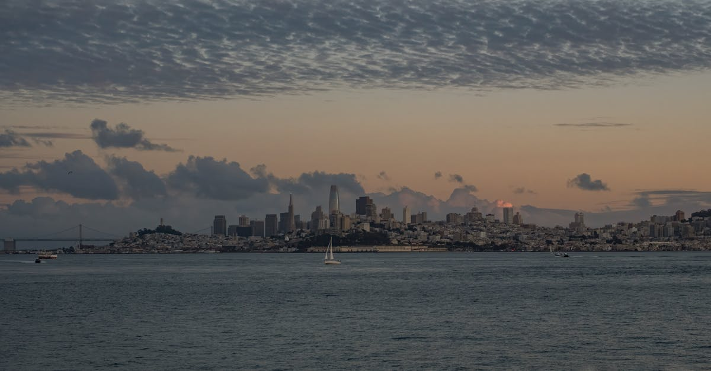

# San Francisco, United States

Country: United States
Region: Americas

San Francisco is the northern California port city of around 850,000 (with around 7 million in the wider Bay Area), built on hills at the mouth of San Francisco Bay. The capital of contemporary tech, the historic centre of West Coast counterculture, and one of America's most architecturally and culturally distinctive cities.

---

## 🧭 Step 1: Choices

### ✨ Why Visit

San Francisco compresses the Golden Gate Bridge, Alcatraz Island, the Painted Ladies, the cable cars, Chinatown (the oldest in North America), the Mission District murals and Mexican-American culture, the Castro's LGBTQ+ history, and the Presidio's reclaimed military forest into a 121-square-kilometre peninsula.

The city is also gateway to the wider Bay Area: Muir Woods redwoods, Napa and Sonoma wine country, Berkeley, Oakland (with its own serious cultural depth), and Big Sur down the coast. Spending three to four days in the city alone, then adding a wine-country or coast day, is the right rhythm.

You come for the bridge, the food (the city has more Michelin stars per capita than almost any US city), the Mission burrito, the contradictions of contemporary tech and California history, and one of America's most beautifully situated cities.

### 🌍 Ethical Compass

- **💰 Economy.** Eat in the Mission (taquerías, La Taqueria), Chinatown (dim sum), the Inner Sunset, the Richmond (Asian-American food), and small Italian places in North Beach rather than only Fisherman's Wharf chains. Tip 20 percent at sit-down restaurants; tip Lyft and Uber drivers.
- **👥 Employment.** SF service-industry wages are stretched by the highest cost of living in America. Tip generously. The unhoused population is visible and large; this is a real city problem, not a tourist nuisance.
- **📚 Education.** Read about the Indigenous Ohlone, the Gold Rush, the Chinese Exclusion Act, the World War II Japanese-American internment, the AIDS-era and Castro LGBTQ+ history, the Black Panthers (Oakland), and the contemporary tech-and-housing crisis. The Asian Art Museum and the Tenement-era visits at Angel Island Immigration Station are essential.
- **🌱 Ecology.** Walk and use **Muni** (cable car, light rail, bus, BART). The city is small enough to walk most days. The Presidio, Golden Gate Park, and Crissy Field are real urban nature. Avoid driving in the city.

---

## 🎒 Step 2: Preparation

### 🔍 Governance Management

- Most international visitors need **ESTA (visa waiver) or a B-2 visa** for the US; verify on the official US State Department portal.
- **Alcatraz Island** tickets sell only through the official **Alcatraz City Cruises** portal; sell out 2 to 8 weeks ahead.
- **Cable cars** charge a fixed fare; tap a Clipper card or pay onboard.
- **Muni and BART** use **Clipper card** or contactless on most lines.
- **De Young Museum, SFMOMA, Asian Art Museum, the California Academy of Sciences** sell timed tickets on official portals.

### 📡 Information Curation

- **San Francisco Chronicle** and **Mission Local** (neighbourhood-focused) for local journalism.
- **San Francisco Travel** (the official tourism site) for events.
- A SF author: Joan Didion (essays); Armistead Maupin (*Tales of the City*); Rebecca Solnit (*Infinite City*); Amy Tan.
- A locally led Mission, Chinatown, or Castro walking tour with a resident guide.
- **Wikivoyage San Francisco** for orientation.

### 🎯 Inference Interaction

- **You decide on Alcatraz.** Book weeks ahead; the day or night tour are both excellent; the audio tour (Antenna's) is one of the best in any museum.
- **You decide on the cable car.** The Powell-Hyde line is the iconic ride; the California Street line is the calmer alternative. The fixed fare is part of the experience.
- **You decide on the bridge.** Walking the Golden Gate Bridge (1.7 miles each way) gives you the bridge; biking gives you Sausalito on the other side.
- **You decide on the neighbourhood depth.** A trip that never leaves Union Square misses 90 percent of SF. Add at least one full day in the Mission, Chinatown, Castro, or Haight.
- **You decide on the tech-history engagement.** Apple Park (Cupertino), the Computer History Museum (Mountain View), or just a Mission Bay walk give different angles.

### 🔄 Intelligence Cooperation

SF weather is famously cool-summer, mild winter, with the city's signature fog (Karl, who has his own Twitter) rolling through July and August. Earthquake awareness is part of city life. Major events (Outside Lands music festival, Pride in June, Chinese New Year) reshape parts of the city.

Bring a soft plan. If summer fog erases the Golden Gate Bridge, the Inner Sunset and the museums absorb a grey day. If a sudden cold wind blows the beach plan, the Embarcadero and the Ferry Building Marketplace work. If a BART line is delayed, Muni or walking covers the centre.

### 📍 Top 5 Anchor Spots

1. **Golden Gate Bridge + Crissy Field walk.** Walk or bike the bridge; pair with the Presidio and a Crissy Field picnic.
2. **Alcatraz Island.** Book weeks ahead; the audio tour is exceptional.
3. **Mission District: Clarion Alley murals, Mission Dolores, a taqueria lunch (La Taqueria, El Farolito).**
4. **Chinatown + North Beach walking loop.** Chinatown gate at Grant and Bush, dim sum, North Beach Italian, the Beat Museum.
5. **A day in Marin (Muir Woods + Sausalito) or Napa/Sonoma.** Pick one.

### 🧰 Practical Essentials

- **Recommended Length.** Three to five days for SF. Add days for Napa/Sonoma, Yosemite (5 hours each way), or Big Sur.
- **Transport.** Walk; SF is small. **Muni** (cable car, F-line streetcars, light rail, buses) and **BART** for longer hops; **Clipper card** or contactless. **Lyft, Uber** for after-hours. SFO connects by BART to downtown in 35 minutes; OAK (Oakland) by BART + AirBART.
- **Daily Cost (per person).**
  - **Budget:** roughly USD 110 to 180. Hostel or budget hotel, Mission and Chinatown meals, Muni, free parks, Alcatraz, one ticketed museum.
  - **Mid-range:** roughly USD 260 to 480. Three-star hotel, mixed dining, all major museums, Alcatraz, a Marin or Napa day.
  - **Higher-comfort:** roughly USD 650 and up. Fairmont, Four Seasons, the Battery, fine dining at Saison, SingleThread, Atelier Crenn, private guides, a wine-country tour with driver.
- **Booking Notes.**
  - **ESTA:** apply at least 72 hours before US arrival.
  - **Alcatraz:** book 2 to 8 weeks ahead.
  - **Major events** (Outside Lands August, Pride June, Chinese New Year January-February) book the city.
  - **Wildfire season** (late summer through autumn) can affect air quality; verify before strenuous outdoor plans.
  - **Tipping:** 20 percent at sit-down meals.

---

## ✈️ Step 3: Delivery

### 🤖 AI Prompt

Copy this into your own AI assistant, fill in the brackets, and treat the answer as a researcher's draft, not a final plan.

> Please help me plan an ethical visit to San Francisco, United States for [NUMBER] days in [MONTH]. I am travelling with [WHO] and my interests are [INTERESTS, e.g. Golden Gate, Alcatraz, neighbourhood food, LGBTQ+ history, day trips, tech]. My total budget is around [AMOUNT] and my comfort level is [budget / mid-range / higher-comfort].
>
> Please structure your answer in three steps.
>
> **Step 1: Choices.** Help me decide what to prioritise. Recommend the two or three SF experiences I should not miss given my interests, and one I should consider skipping (a Fisherman's Wharf tourist restaurant, an attempt at same-day Alcatraz tickets, a wine-country day if my time is limited to two days). Briefly explain each trade-off.
>
> **Step 2: Preparation.** Cover all four of the following:
> - **Governance Management.** What assumptions should I check before I book? Include the US State Department ESTA, official Alcatraz City Cruises, museum portals, Clipper or contactless on Muni and BART, and wildfire-season air quality.
> - **Information Curation.** Suggest at least four different source types: one official SF source, one local news outlet, one SF author (Maupin, Solnit, or Tan), and one neighbourhood-led walking guide.
> - **Inference Interaction.** List the decisions I personally need to make (Alcatraz timing, bridge walk vs bike, neighbourhood depth, tech-history engagement, day-trip choice).
> - **Intelligence Cooperation.** How should I trust my own judgment and local advice over algorithmic defaults when conditions change? Build me a soft plan with at least two alternates for likely disruptions (summer fog, wildfire smoke, sold-out Alcatraz, a BART delay).
>
> **Step 3: Delivery.** Give me the actual itinerary, day by day, with realistic timings and named neighbourhoods. Include at least one Mission and one Chinatown experience, plus the bridge. Mark each business as confidently locally owned, or flag for me to verify.
>
> Finally, please remind me at the end to verify your suggestions against:
> 1. Official sources: SF Travel, Alcatraz City Cruises, Muni and BART, and the US State Department for ESTA.
> 2. Real people: an SF resident, an SF guide, or hotel staff who live in San Francisco now.
>
> Treat your output as a researcher's draft. I will make the final calls.

---

Part of **Gyro Governance Ethical Travel: AI-Empowered Guides for Human Adventures**.

Explore more destinations, ethical domains, and AI prompts at [travel.gyrogovernance.com](https://travel.gyrogovernance.com/).
