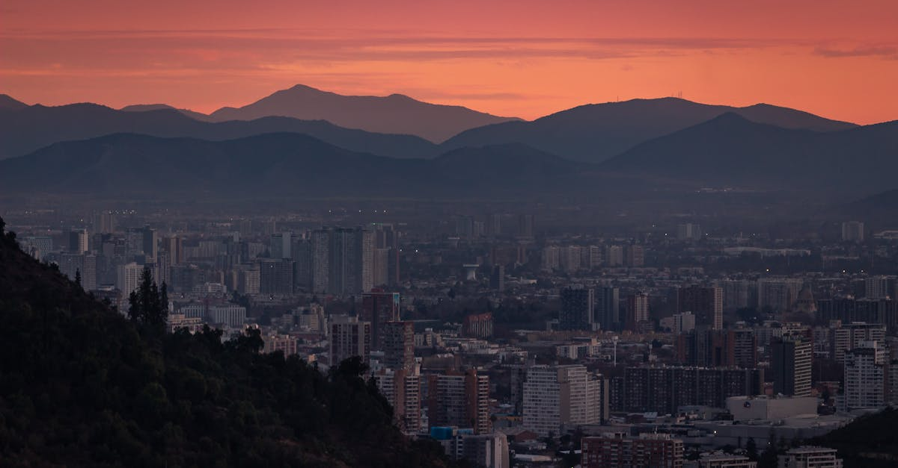

# Santiago, Chile

Country: Chile
Region: Americas

Santiago is Chile's capital, a 7-million-person city in a long valley at the foot of the Andes. South America's most modern major capital, the launching point for the wider Chilean experience (Atacama Desert, Patagonia, central wine valleys, Pacific coast), and a serious cultural and food city in its own right.

---

## 🧭 Step 1: Choices

### ✨ Why Visit

Santiago is one of South America's most liveable cities. Cerro San Cristóbal and Cerro Santa Lucía give Andean views from inside the city. The Plaza de Armas and the colonial centre, the Bellavista neighbourhood (Pablo Neruda's La Chascona home), the Lastarria gallery district, Barrio Italia design quarter, and the Bellas Artes museum cluster all anchor a varied trip.

The city is also a base for the central Chilean wine country (Maipo, Casablanca, Colchagua valleys), the Andean ski resorts (Valle Nevado, Portillo), and the Pacific coast (Valparaíso, Viña del Mar). Many Patagonia or Atacama trips begin and end with a Santiago night.

You come for the food, the wine, the Andean setting, the modern Chilean political and cultural conversation, and as a gateway to wider Chile.

### 🌍 Ethical Compass

- **💰 Economy.** Eat at *cocinerías* and family restaurants in Barrio Italia, Bellavista, Lastarria, and the Persa Bío Bío Sunday market rather than only the high-end Las Condes hotel restaurants. Buy at the Mercado Central (fish) and La Vega Central (produce) for the working markets.
- **👥 Employment.** Tip 10 percent at restaurants (often added but verify in cash). Use the **Santiago Metro** (one of South America's best) rather than Uber for most trips.
- **📚 Education.** Read about the Pinochet dictatorship (1973-90) and the contemporary Chilean political reckoning. Visit the **Museum of Memory and Human Rights** (Museo de la Memoria y los Derechos Humanos); it is one of the most powerful purpose-built memorials anywhere. Pablo Neruda's three houses (La Chascona in Bellavista; La Sebastiana in Valparaíso; Isla Negra on the coast) are essential.
- **🌱 Ecology.** Santiago has a serious air-pollution problem in winter (May to August) when the valley traps emissions; check the air-quality index. Use Metro and walking. The Andean foothills (Cajón del Maipo) are reachable for clean-air days.

---

## 🎒 Step 2: Preparation

### 🔍 Governance Management Traceability

- Most visitors are **visa-exempt** for Chile; verify on the official Chilean Ministry of Foreign Affairs portal.
- **Museum of Memory** is free; verify hours on the official portal.
- **Pablo Neruda houses** (La Chascona, La Sebastiana, Isla Negra) sell tickets through the **Fundación Neruda** portal.
- **Concha y Toro** and other Maipo valley wineries sell tours on official portals; Casablanca and Colchagua valleys require fuller days.
- **Santiago Metro** uses the **Bip!** card; verify on the official Metro de Santiago portal.

### 📡 Information Curation Variety

- **El Mercurio**, **La Tercera** (Chilean dailies, Spanish) and **The Santiago Times** for English.
- The official **Visit Santiago** site for events and openings.
- A Chilean author: Isabel Allende; Roberto Bolaño; Pablo Neruda (poetry); Diamela Eltit.
- A Santiago-resident walking tour or wine guide.
- **Wikivoyage Santiago** for orientation.

### 🎯 Inference Interaction Accountability

- **You decide on the Memory Museum.** A serious half-day visit; the dictatorship history is not abstract for Chileans.
- **You decide on the Neruda house.** La Chascona in Bellavista is the in-Santiago option; Isla Negra is the most beautiful and requires a coast day-trip.
- **You decide on the wine country.** Maipo (45 minutes, easy day); Casablanca (one hour towards the coast); Colchagua (two hours south, fuller day).
- **You decide on Valparaíso.** A genuine day-trip or overnight; UNESCO-listed; the Neruda house La Sebastiana is there.
- **You decide on air-quality days.** Winter air can be genuinely poor in the valley; outdoor plans may need to flex.

### 🔄 Intelligence Cooperation Integrity

Santiago weather is Mediterranean; hot dry summer (December to February), wet winter with valley smog (June to August), beautiful shoulder seasons. Major events (Independence Day September 18-19, Lollapalooza Chile in March) reshape parts of the city.

Bring a soft plan. If air quality is red, the indoor museums and a Cajón del Maipo escape work. If a Bellavista evening rains, the gallery district interiors absorb a wet night. If Valparaíso is fogged in, the central wine valleys are clear.

### 📍 Top 5 Anchor Spots

1. **Museum of Memory and Human Rights.** Free; a serious half-day; arrive prepared.
2. **Cerro San Cristóbal.** Funicular up; panoramic view over the city with the Andes behind.
3. **La Chascona (Pablo Neruda's Bellavista house) + Bellavista evening.** Neruda's playful Santiago home; dinner in Bellavista or Lastarria afterwards.
4. **A Maipo Valley wine day or a Concha y Toro half-day.** Wine tour; 45 minutes from the city.
5. **A Valparaíso day-trip.** Funiculars; street art; the colourful cerros (hills); La Sebastiana Neruda house; 1.5 hours from Santiago.

### 🧰 Practical Essentials

- **Recommended Length.** Two to three days for Santiago. Add a day for Valparaíso, the wine valleys, or the Andean foothills.
- **Transport.** **Santiago Metro** (7 lines); Bip! card or contactless. **Uber, Cabify, DiDi** for ride-hail. **Tur Bus** for inter-city. Comodoro Arturo Merino Benítez Airport (SCL) is 30 minutes from the city.
- **Daily Cost (per person).**
  - **Budget:** roughly CLP 30,000 to 60,000 (about USD 35 to 70). Hostel in Lastarria or Bellavista, *cocinería* meals, Metro, two ticketed sites.
  - **Mid-range:** roughly CLP 80,000 to 160,000 (about USD 95 to 190). Three- or four-star hotel, mixed dining, all major sites, a wine valley day.
  - **Higher-comfort:** roughly CLP 250,000 and up. The Singular, Mandarin Oriental Santiago, Hotel Magnolia, fine dining at Boragó or 99 Restaurante, private guides, an overnight in the wine country.
- **Booking Notes.**
  - **Visa:** verify on the Chilean Ministry of Foreign Affairs portal.
  - **Independence Day (September 18-19)** is *Fiestas Patrias*; the city is festive but many businesses close.
  - **Air quality** in winter: verify daily.
  - **Wine valley:** book ahead in peak season.
  - **Lollapalooza Chile (March)** fills the city.

---

## ✈️ Step 3: Delivery

### 🤖 AI Prompt

Copy this into your own AI assistant, fill in the brackets, and treat the answer as a researcher's draft, not a final plan.

> Please help me plan an ethical visit to Santiago, Chile for [NUMBER] days in [MONTH]. I am travelling with [WHO] and my interests are [INTERESTS, e.g. Chilean wine, modern history, Neruda, Andes, day-trips to Valparaíso]. My total budget is around [AMOUNT] and my comfort level is [budget / mid-range / higher-comfort].
>
> Please structure your answer in three steps.
>
> **Step 1: Choices.** Help me decide what to prioritise. Recommend the two or three Santiago experiences I should not miss given my interests, and one I should consider skipping (a Las Condes business-hotel restaurant when Barrio Italia is steps better, a one-day Colchagua attempt that should be an overnight, a winter air-quality outdoor plan). Briefly explain each trade-off.
>
> **Step 2: Preparation.** Cover all four of the following:
> - **Governance Management Traceability.** What assumptions should I check before I book? Include Chilean visa-exempt status, official Museum of Memory hours, Fundación Neruda house tickets, wine-tour operator portals, and Bip! Metro card setup.
> - **Information Curation Variety.** Suggest at least four different source types: one official Chilean source, one Chilean newspaper, one Chilean author, and one Santiago-based walking or wine guide.
> - **Inference Interaction Accountability.** List the decisions I personally need to make (Memory Museum timing, Neruda house choice, wine-valley depth, Valparaíso day, air-quality days).
> - **Intelligence Cooperation Integrity.** Build me a soft plan with at least two alternates for likely disruptions (winter air-pollution day, a public-event closure, a wine-region weather day, sold-out top restaurant).
>
> **Step 3: Delivery.** Give me the actual itinerary, day by day, with realistic timings and named neighbourhoods. Include the Memory Museum, La Chascona, and one wine half-day or Valparaíso. Mark each business as confidently locally owned, or flag for me to verify.
>
> Finally, please remind me at the end to verify your suggestions against:
> 1. Official sources: Visit Santiago, the Museum of Memory, Fundación Neruda, and the Chilean Ministry of Foreign Affairs.
> 2. Real people: a Santiago resident, a Chilean wine guide, or hotel staff who live in Santiago now.
>
> Treat your output as a researcher's draft. I will make the final calls.

---

Part of **Gyro Governance Ethical Travel: AI-Empowered Guides for Human Adventures**.

Explore more destinations, ethical domains, and AI prompts at [travel.gyrogovernance.com](https://travel.gyrogovernance.com/).
