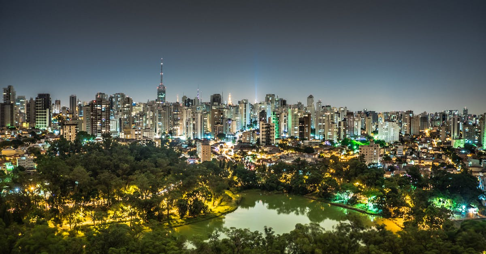

# São Paulo, Brazil

Country: Brazil
Region: Americas

São Paulo (Sampa) is the largest city in the southern hemisphere, a 22-million-person megacity that is Brazil's financial, business, and cultural capital. The home of the world's largest Japanese diaspora outside Japan, one of the world's great food cities, and a serious contemporary art and design centre.

---

## 🧭 Step 1: Choices

### ✨ Why Visit

São Paulo is the working engine of contemporary Brazil. MASP (Museu de Arte de São Paulo) on Avenida Paulista is the country's most important art museum. The Pinacoteca and the Japan House anchor the gallery scene. Liberdade is the world's largest Japanese diaspora district. The food scene (D.O.M., Maní, A Casa do Porco, Mocotó) rivals any global city.

The city is also a serious working São Paulo, less photogenic than Rio but more economically and culturally driven. Visitors who skip São Paulo for Rio miss most of contemporary Brazilian creative and food culture.

You come for the food, the art, the architecture (Oscar Niemeyer is everywhere), the Japanese-Brazilian and Italian-Brazilian heritage, and a city that does not depend on tourists.

### 🌍 Ethical Compass

- **💰 Economy.** Eat in actual neighbourhoods: Vila Madalena (creative), Pinheiros (food), Liberdade (Japanese), Bixiga (Italian), Mooca (Italian), Itaim Bibi (business-and-food). The Mercado Municipal de São Paulo is touristy but the working markets behind it are real.
- **👥 Employment.** Tip 10 percent at restaurants (often added as service; tip extra in cash). Use the Metro (one of South America's most extensive). Tip drivers, guides, and bartenders.
- **📚 Education.** Read about Brazilian slavery and its lasting impact, the Italian and Japanese immigrations that built São Paulo, the contemporary politics, and the inequality conversation. The Museum of the Portuguese Language, the Pinacoteca, and the Museum of Image and Sound (MIS) cover different angles.
- **🌱 Ecology.** Use the Metro; São Paulo traffic is among the world's worst. The Parque Ibirapuera (the city's Central Park equivalent) is excellent. Avoid driving in the centre during weekdays.

---

## 🎒 Step 2: Preparation

### 🔍 Governance Management

- Verify **visa rules** on the official Brazilian Ministry of Foreign Affairs portal. Some nationalities now require e-visas; verify before booking.
- **MASP** sells tickets at the door; verify hours and current exhibitions on the official portal. Free on Tuesdays (sometimes).
- **Pinacoteca de São Paulo** sells tickets at the door; verify hours.
- **Theatro Municipal** and **Sala São Paulo** (concerts) sell tickets on official venue portals.
- **Metro and bus** under SPTrans use the **Bilhete Único** card or contactless on most Metro lines.

### 📡 Information Curation

- **Folha de S. Paulo** and **O Estado de S. Paulo** for major Brazilian news; **The Brazilian Report** for English.
- **Visit São Paulo** (the official tourism site) for events.
- A Brazilian author: Machado de Assis; Clarice Lispector; Conceição Evaristo.
- A São Paulo-based food or neighbourhood guide.
- **Wikivoyage São Paulo** for orientation.

### 🎯 Inference Interaction

- **You decide on the safety strategy.** São Paulo is fine for prepared visitors using ride-hail and licensed transport; do not walk certain areas at night; do not display valuables on the street.
- **You decide on the food strategy.** A serious food walking tour for the first night, then exploring afterwards, is the best way into the city's massive scene.
- **You decide on the neighbourhood depth.** Vila Madalena, Pinheiros, Liberdade, Bixiga, Mooca each merit a full evening.
- **You decide on Ibirapuera.** Free, vast, Niemeyer-designed; one of the city's gifts.
- **You decide on the contemporary art scene.** MASP + Pinacoteca + Japan House + Instituto Tomie Ohtake covers a full day or two of contemporary art.

### 🔄 Intelligence Cooperation

São Paulo weather is subtropical; winter (June to August) is cool and grey; summer (December to February) is hot with rain. Major events (Lollapalooza Brasil in March, São Paulo Fashion Week, Formula 1 in November) reshape parts of the city.

Bring a soft plan. If a sudden rain closes outdoor plans, the museums and Liberdade dim sum absorb it. If traffic is impossible (often), the Metro covers most central routes. If a public-event closes Avenida Paulista, the Vila Madalena area is unaffected.

### 📍 Top 5 Anchor Spots

1. **MASP + Avenida Paulista.** The Lina Bo Bardi building; the floating-easel display of paintings; the Sunday street market on Paulista.
2. **Pinacoteca de São Paulo.** The country's oldest art museum; the Luz neighbourhood location near the Sala São Paulo concert hall.
3. **Liberdade.** Sunday street market; ramen and yakitori spots; the Museum of Japanese Immigration.
4. **A Vila Madalena evening.** Beco do Batman (street art) at golden hour; dinner and music in the neighbourhood.
5. **Parque Ibirapuera + the Museum of Image and Sound (MIS) or the Museum of Contemporary Art (MAC USP).**

### 🧰 Practical Essentials

- **Recommended Length.** Three to four days for São Paulo. Add a day for Paraty (beach colonial), Campos do Jordão (mountains), or onward to Rio (1 hour by air).
- **Transport.** **São Paulo Metro** (6 lines, large network); **Uber, 99, InDriver** for ride-hail. Walking only in well-trafficked areas; avoid walking at night in unfamiliar zones. GRU (Guarulhos International) and CGH (Congonhas, domestic) airports both serve the city.
- **Daily Cost (per person).**
  - **Budget:** roughly BRL 200 to 400 (about USD 40 to 80). Hostel in Vila Madalena or Pinheiros, *padaria* and food-hall meals, Metro, two major museums.
  - **Mid-range:** roughly BRL 600 to 1,300 (about USD 120 to 260). Three- or four-star hotel, mixed dining including a serious São Paulo restaurant, all major museums, a food walking tour.
  - **Higher-comfort:** roughly BRL 2,500 and up. Rosewood São Paulo, Palácio Tangará, Fasano São Paulo, fine dining at D.O.M., Maní, A Casa do Porco, Tuju, private guides.
- **Booking Notes.**
  - **Visa:** verify on the Brazilian Ministry of Foreign Affairs portal.
  - **Top restaurants** (D.O.M., A Casa do Porco): book weeks ahead.
  - **Lollapalooza Brasil (March) and Formula 1 (November)** book the city.
  - **Safety advisories:** verify your home government's current Brazil and São Paulo advisory.
  - **Carnival** is real but less spectacular than Rio.

---

## ✈️ Step 3: Delivery

### 🤖 AI Prompt

Copy this into your own AI assistant, fill in the brackets, and treat the answer as a researcher's draft, not a final plan.

> Please help me plan an ethical visit to São Paulo, Brazil for [NUMBER] days in [MONTH]. I am travelling with [WHO] and my interests are [INTERESTS, e.g. food, contemporary art, architecture, Japanese-Brazilian culture, music]. My total budget is around [AMOUNT] and my comfort level is [budget / mid-range / higher-comfort].
>
> Please structure your answer in three steps.
>
> **Step 1: Choices.** Help me decide what to prioritise. Recommend the two or three São Paulo experiences I should not miss given my interests, and one I should consider skipping (a centro-only day that misses the food neighbourhoods, walking certain areas at night, an Avenida Paulista visit on a non-Sunday). Briefly explain each trade-off.
>
> **Step 2: Preparation.** Cover all four of the following:
> - **Governance Management.** What assumptions should I check before I book? Include the Brazilian visa portal, MASP and Pinacoteca official portals, Theatro Municipal ticketing, Bilhete Único or contactless Metro, and home-government safety advisories.
> - **Information Curation.** Suggest at least four different source types: one official Brazilian source, one Brazilian newspaper, one Brazilian author, and one São Paulo-based food guide.
> - **Inference Interaction.** List the decisions I personally need to make (safety strategy, food-tour first night, neighbourhood depth, top-restaurant booking, art-museum cluster).
> - **Intelligence Cooperation.** How should I trust my own judgment and local advice over algorithmic defaults when conditions change? Build me a soft plan with at least two alternates for likely disruptions (heavy rain, traffic gridlock, a public-event Paulista closure, sold-out top restaurant).
>
> **Step 3: Delivery.** Give me the actual itinerary, day by day, with realistic timings and named neighbourhoods. Include at least one food walking tour and one neighbourhood evening (Vila Madalena, Liberdade, Pinheiros, or Bixiga). Mark each business as confidently locally owned, or flag for me to verify.
>
> Finally, please remind me at the end to verify your suggestions against:
> 1. Official sources: Visit São Paulo, MASP and Pinacoteca portals, and the Brazilian Ministry of Foreign Affairs.
> 2. Real people: a São Paulo resident, a Paulistano food guide, or hotel staff who live in the city now.
>
> Treat your output as a researcher's draft. I will make the final calls.

---

Part of **Gyro Governance Ethical Travel: AI-Empowered Guides for Humane Adventures**.

Explore more destinations, ethical domains, and AI prompts at [travel.gyrogovernance.com](https://travel.gyrogovernance.com/).
