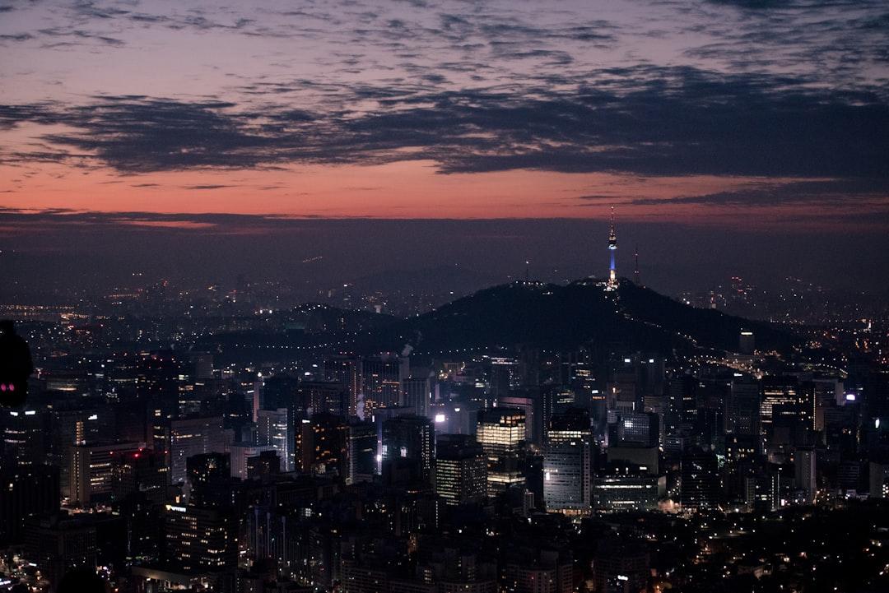

# Seoul, South Korea

Country: South Korea
Region: Asia

Seoul is the South Korean capital, a 10-million-person city in the wider 26-million Seoul metropolitan area, the world's fifth-largest metropolitan economy. Joseon-dynasty palaces, hanok villages, K-pop and K-drama global headquarters, and one of the most digitally connected and culinarily exciting cities on the planet.

---

## 🧭 Step 1: Choices

### ✨ Why Visit

Seoul compresses 600 years of Joseon-dynasty Korea, a serious modern history (Japanese colonial period, Korean War, the post-war miracle), and twenty-first-century global pop-culture leadership into one city. Five great palaces (Gyeongbokgung, Changdeokgung, Changgyeonggung, Deoksugung, Gyeonghuigung). The Bukchon Hanok Village. Insadong's traditional crafts. Hongdae's youth culture. Gangnam's affluence.

The city is also one of the world's safest large cities, with public transport (Metro, KTX, bus) that runs late and reliably. The food (Korean barbecue, fried chicken, tteokbokki, banchan-rich stew restaurants) is one of Asia's most distinctive cuisines.

You come for the palaces, the food, the K-culture, the contemporary design, and a city that has reinvented itself faster than almost any in the world over the last fifty years.

### 🌍 Ethical Compass

- **💰 Economy.** Eat at small restaurants in Mangwon, Euljiro, Jongno, and the side streets off Hongdae rather than only the chain restaurants on the main streets. Buy at the Gwangjang Market (food), Namdaemun, and Tongin Market for working food and crafts.
- **👥 Employment.** Tipping is not customary in Korea. Use the **Seoul Metro** (one of the world's best) and tap a **T-money** card or contactless on most lines.
- **📚 Education.** Read about Korean modern history (Japanese colonial period 1910-45, the Korean War 1950-53, the post-war development, the democracy movement of the 1980s). Visit the War Memorial of Korea and the Seodaemun Prison History Hall. K-pop and K-drama context: real industry research changes how you experience the city.
- **🌱 Ecology.** Walk and use Metro. The Hangang River parks are real urban breathing space. Bukhansan National Park is reachable by subway from the city centre.

---

## 🎒 Step 2: Preparation

### 🔍 Governance Management

- **K-ETA (Korea Electronic Travel Authorization)** is required for many visa-waiver nationalities; verify your status on the official K-ETA portal before booking flights.
- **Palace tickets** (Gyeongbokgung, Changdeokgung) sell at the gate; **the Joseon Palaces Pass** bundles all five.
- **Changing of the Guard** at Gyeongbokgung happens at set times daily; verify on the official Cultural Heritage Administration portal.
- **DMZ tours** are bookable through licensed operators (Koridoor, USO, several private operators); some areas require advance security check.
- **Seoul Metro** uses T-money or contactless on most lines.

### 📡 Information Curation

- **Korea Herald** and **Korea JoongAng Daily** (English-language Korean newspapers) for news.
- **Visit Seoul** (the official tourism site) for events and openings.
- A Korean author: Han Kang (Nobel laureate, *Human Acts*); Min Jin Lee (*Pachinko*); Hwang Sok-yong.
- A locally led Seoul food or palace walking tour (O'ngo Food Communications, Royal Palaces of Korea cultural tours).
- **Wikivoyage Seoul** for orientation.

### 🎯 Inference Interaction

- **You decide on the palace strategy.** Gyeongbokgung is the headline; Changdeokgung (UNESCO) and its Secret Garden (Huwon, separate timed entry) are more atmospheric. Pick one or both seriously, not all five superficially.
- **You decide on the DMZ.** A controlled tour to Joint Security Area (JSA) is a serious half-day; verify current access (it has fluctuated with political conditions).
- **You decide on K-pop engagement.** Studio merchandise stores in Hongdae, dance class with KPOP Dance Academy, or a real performance if your dates align.
- **You decide on the food walking tour.** A first-night food tour through Gwangjang Market or Euljiro changes how you eat the rest of the trip.
- **You decide on Bukhansan.** A serious half-day hike in the mountain national park, reachable by subway, that few visitors include.

### 🔄 Intelligence Cooperation

Seoul has four genuine seasons; spring and autumn are spectacular and brief; summer is hot and humid; winter is cold (occasional snow). Major holidays (Chuseok in autumn, Seollal in late January or February) close many businesses for several days. Air quality can be poor in spring (yellow dust from China).

Bring a soft plan. If air quality is red, indoor museums and the Coex underground complex absorb a day. If a Chuseok closure surprises you, K-pop venues and chain restaurants stay open. If a sudden rain ruins a palace walk, the palace interior buildings work.

### 📍 Top 5 Anchor Spots

1. **Gyeongbokgung Palace + Bukchon Hanok Village + Insadong.** A morning of Joseon Seoul; arrive at Gyeongbokgung at opening; combine with the Bukchon walking circuit and Insadong's traditional crafts.
2. **Changdeokgung Palace and the Huwon (Secret Garden).** UNESCO; the Secret Garden requires advance timed entry.
3. **A food walking tour through Gwangjang Market and Euljiro.** First-night food orientation.
4. **A Hongdae or Itaewon evening.** Hongdae for youth culture and K-pop dance studios; Itaewon for international food and design.
5. **DMZ half-day** (if your interests include modern history). JSA access has changed; verify current rules.

### 🧰 Practical Essentials

- **Recommended Length.** Three to five days for Seoul. Add days for Busan (KTX 2.5 hours south), Jeju Island (flight), or Andong/Gyeongju.
- **Transport.** Walk in Jongno, Insadong, and Hongdae. **Seoul Metro** (1 main and 9+ extensions); **T-money or contactless**. **KakaoTaxi** for ride-hail. **KTX** for inter-city. Incheon (ICN) and Gimpo (GMP) airports both serve Seoul; AREX train is the easiest from Incheon.
- **Daily Cost (per person).**
  - **Budget:** roughly KRW 50,000 to 90,000 (about USD 35 to 65). Hostel or budget hotel, market and street meals, Metro, palace tickets.
  - **Mid-range:** roughly KRW 130,000 to 250,000 (about USD 95 to 180). Three- or four-star hotel, Korean BBQ and mid-range restaurant dinners, all major palaces, a food tour.
  - **Higher-comfort:** roughly KRW 400,000 and up. Park Hyatt Seoul, Shilla, Four Seasons, fine dining at Mingles, Toc Toc, or Soigné, private guided tours, DMZ private tour.
- **Booking Notes.**
  - **K-ETA:** verify your nationality on the official K-ETA portal.
  - **Changdeokgung Secret Garden:** advance timed entry.
  - **Chuseok (autumn) and Seollal (lunar new year)** close many businesses for days; verify your dates.
  - **DMZ access:** verify current rules.
  - **Spring cherry blossom and autumn foliage** book the city.

---

## ✈️ Step 3: Delivery

### 🤖 AI Prompt

Copy this into your own AI assistant, fill in the brackets, and treat the answer as a researcher's draft, not a final plan.

> Please help me plan an ethical visit to Seoul, South Korea for [NUMBER] days in [MONTH]. I am travelling with [WHO] and my interests are [INTERESTS, e.g. Joseon palaces, K-pop, food, modern Korean history, hiking, design]. My total budget is around [AMOUNT] and my comfort level is [budget / mid-range / higher-comfort].
>
> Please structure your answer in three steps.
>
> **Step 1: Choices.** Help me decide what to prioritise. Recommend the two or three Seoul experiences I should not miss given my interests, and one I should consider skipping (a five-palace day that exhausts everyone, an over-marketed K-pop experience, a Myeongdong cosmetics tour if I came for culture). Briefly explain each trade-off.
>
> **Step 2: Preparation.** Cover all four of the following:
> - **Governance Management.** What assumptions should I check before I book? Include the K-ETA portal, palace ticketing and the Secret Garden timed entry, DMZ tour operator licensing, T-money or contactless setup, and Chuseok/Seollal closures.
> - **Information Curation.** Suggest at least four different source types: one official Korean source, one English-language Korean newspaper, one Korean author, and one Seoul-based food or palace guide.
> - **Inference Interaction.** List the decisions I personally need to make (palace selection, DMZ commitment, K-pop engagement, food-tour first night, Bukhansan hike).
> - **Intelligence Cooperation.** How should I trust my own judgment and local advice over algorithmic defaults when conditions change? Build me a soft plan with at least two alternates for likely disruptions (yellow-dust air-quality day, a Chuseok closure, a sold-out Secret Garden slot, a DMZ-tour access change).
>
> **Step 3: Delivery.** Give me the actual itinerary, day by day, with realistic timings, Metro lines, and named neighbourhoods. Include at least one palace, one food market, and one Hongdae or Itaewon evening. Mark each business as confidently locally owned, or flag for me to verify.
>
> Finally, please remind me at the end to verify your suggestions against:
> 1. Official sources: Visit Seoul, the K-ETA portal, the Cultural Heritage Administration for palaces, and KORAIL for KTX.
> 2. Real people: a Seoul resident, a licensed Seoul guide, or hotel staff who live in Seoul now.
>
> Treat your output as a researcher's draft. I will make the final calls.

---

Part of **Gyro Governance Ethical Travel: AI-Empowered Guides for Humane Adventures**.

Explore more destinations, ethical domains, and AI prompts at [travel.gyrogovernance.com](https://travel.gyrogovernance.com/).
