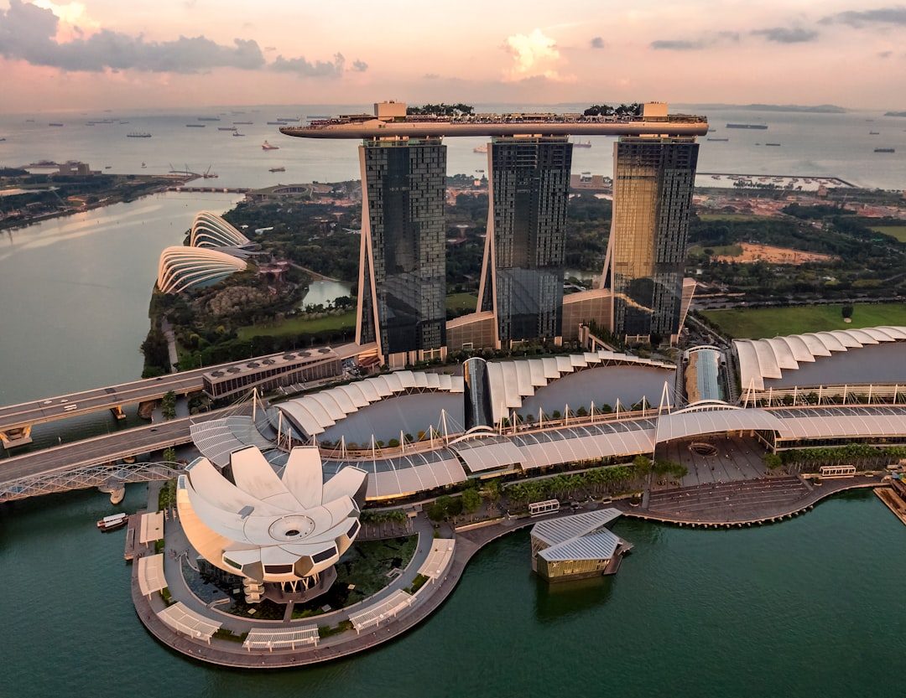

# Singapore, Singapore

Country: Singapore
Region: Asia

Singapore is the city-state at the southern tip of the Malay Peninsula, a 5.6-million-person island metropolis that is one of the world's wealthiest, safest, and most carefully engineered cities. A multicultural society (Chinese, Malay, Indian, Eurasian, and global expat communities), the world's third-busiest container port, and one of Asia's culinary capitals.

---

## 🧭 Step 1: Choices

### ✨ Why Visit

Singapore concentrates more first-class urban infrastructure into one place than almost anywhere on Earth: Changi Airport (often ranked the world's best), the Mass Rapid Transit (MRT), the integrated waterfront of Marina Bay (Marina Bay Sands, Gardens by the Bay, the Helix Bridge), and the genuinely walkable historic neighbourhoods (Chinatown, Little India, Kampong Glam).

The country is also a working multicultural society and one of Asia's great food cities. The hawker centres (Maxwell, Lau Pa Sat, Newton, Tiong Bahru) deliver Michelin-starred chicken rice and laksa for a few dollars. Strict rules (chewing gum, jaywalking, vandalism) coexist with one of the world's most diverse populations.

You come for the food, the multicultural urban experience, the Gardens by the Bay, the airport itself, and as the gateway to Malaysia, Indonesia, and the wider region.

### 🌍 Ethical Compass

- **💰 Economy.** Eat at **hawker centres** (Maxwell, Lau Pa Sat, Newton, Old Airport Road, Tiong Bahru) and in actual neighbourhoods (Geylang, Joo Chiat, Tiong Bahru) rather than only Orchard Road and Marina Bay luxury restaurants. Hawker culture is now UNESCO-recognised.
- **👥 Employment.** Tipping is not customary in Singapore; a 10 percent service charge is added at sit-down restaurants. The migrant-worker community (Bangladeshi, Indian, Filipino, Indonesian) is large; their wages are stretched.
- **📚 Education.** Read about Singapore's modern history: independence in 1965, the Lee Kuan Yew era, the multiracial design of housing and education, the strict-rules public-discipline social contract, the ongoing labour-rights conversation around migrant workers. Visit the Asian Civilisations Museum and the National Museum.
- **🌱 Ecology.** Walk and use the MRT; cars are heavily taxed by design (Certificate of Entitlement). The city has serious **green design** (the supertrees, the Cloud Forest, vertical-green buildings). Hydrate; equatorial heat is real.

---

## 🎒 Step 2: Preparation

### 🔍 Governance Management

- Most visitors are **visa-exempt** for Singapore for short stays; verify on the official **Immigration & Checkpoints Authority (ICA)** portal. The **SG Arrival Card** is required before arrival; complete online.
- **MRT and bus** use **EZ-Link** card or **contactless payment** (Visa, Mastercard, Amex, Apple Pay, Google Pay) on most lines.
- **Gardens by the Bay (Cloud Forest, Flower Dome, Floral Fantasy)** sell timed tickets on the official portal.
- **Singapore Zoo, Night Safari, River Wonders, Bird Paradise** are operated by **Mandai Wildlife Reserve**; sell tickets on official portals.
- **Strict laws:** verify current rules on **chewing gum, smoking zones, vaping, drug penalties, jaywalking, vandalism**; Singapore enforces them.

### 📡 Information Curation

- **The Straits Times** and **Channel News Asia** for serious Singaporean and Asian news.
- **Visit Singapore** (the official tourism site) for events and openings.
- A Singaporean author: Tash Aw; Sonny Liew (the graphic novelist); Kevin Kwan (Crazy Rich Asians); Catherine Lim.
- A locally led food walking tour (Wok 'n' Stroll, Eat Pray Love Singapore).
- **Wikivoyage Singapore** for orientation.

### 🎯 Inference Interaction

- **You decide on the food strategy.** A serious hawker-centre-focused trip is the right Singapore food approach; a Marina-Bay-Sands-only food trip misses the point.
- **You decide on Gardens by the Bay.** The outdoor Supertree Grove is free; the indoor Cloud Forest and Flower Dome are ticketed; both reward visits.
- **You decide on Sentosa.** Resort-island; Universal Studios; family beaches; some find it artificial, others find it relaxing.
- **You decide on the neighbourhood depth.** Chinatown, Little India, Kampong Glam (Arab Street and the Sultan Mosque), Tiong Bahru each give a different Singapore.
- **You decide on day-trips.** Pulau Ubin (the rustic island), Bintan (Indonesia, ferry), Johor Bahru (Malaysia, causeway) are all reachable.

### 🔄 Intelligence Cooperation

Singapore weather is equatorial; warm and humid year-round (typically 25-32°C with high humidity); afternoon thunderstorms are routine; haze (forest-fire smoke from Indonesia) occasionally affects air quality.

Bring a soft plan. If a downpour shuts outdoor plans, the major malls (ION Orchard, the Shoppes at Marina Bay Sands) and the museums absorb it. If haze worsens air quality, indoor experiences are the default. If a hawker centre is closed for renovation, the next is steps away.

### 📍 Top 5 Anchor Spots

1. **Hawker centre meal.** Maxwell Food Centre, Lau Pa Sat, or Tiong Bahru Market. Chicken rice, laksa, char kway teow.
2. **Gardens by the Bay + Marina Bay Sands evening.** Cloud Forest indoor; Supertree Grove free at night for the Garden Rhapsody light show.
3. **Chinatown + Little India + Kampong Glam walking circuit.** A day of multicultural Singapore on foot.
4. **National Museum or Asian Civilisations Museum.** A serious morning on Singaporean and Asian context.
5. **Singapore Zoo or Night Safari.** One of the world's most ethically respected zoos; the Night Safari is a unique experience.

### 🧰 Practical Essentials

- **Recommended Length.** Two to four days for Singapore. Add a day for Sentosa or a day-trip to Pulau Ubin or Johor Bahru.
- **Transport.** Walk in the historic neighbourhoods. **MRT** (8 lines) and buses with EZ-Link or contactless. **Grab** for ride-hail. **Changi Airport (SIN)** is connected by MRT in 30 minutes to the centre.
- **Daily Cost (per person).**
  - **Budget:** roughly SGD 70 to 130. Hostel, hawker-centre meals, MRT, free attractions.
  - **Mid-range:** roughly SGD 180 to 350. Three- or four-star hotel, mixed dining including a hawker tour, Gardens by the Bay paid domes, Zoo.
  - **Higher-comfort:** roughly SGD 500 and up. Marina Bay Sands, Raffles, Fullerton Bay, fine dining at Odette, Burnt Ends, Cloudstreet, private guides.
- **Booking Notes.**
  - **SG Arrival Card:** complete online before arrival.
  - **Strict laws** on chewing gum, smoking, drugs, jaywalking, vandalism: verify current rules.
  - **Singapore F1 Grand Prix (September)** books the city; Singapore Airshow (alternating years) similarly.
  - **National Day (August 9)** fireworks and parade.
  - **Hawker culture** is UNESCO-recognised; engage respectfully.

---

## ✈️ Step 3: Delivery

### 🤖 AI Prompt

Copy this into your own AI assistant, fill in the brackets, and treat the answer as a researcher's draft, not a final plan.

> Please help me plan an ethical visit to Singapore for [NUMBER] days in [MONTH]. I am travelling with [WHO] and my interests are [INTERESTS, e.g. hawker food, multicultural neighbourhoods, Gardens by the Bay, modern architecture, day-trips]. My total budget is around [AMOUNT] and my comfort level is [budget / mid-range / higher-comfort].
>
> Please structure your answer in three steps.
>
> **Step 1: Choices.** Help me decide what to prioritise. Recommend the two or three Singapore experiences I should not miss given my interests, and one I should consider skipping (an Orchard Road luxury-mall day that misses hawker culture, a Sentosa-only trip, an Indonesian-haze outdoor plan). Briefly explain each trade-off.
>
> **Step 2: Preparation.** Cover all four of the following:
> - **Governance Management.** What assumptions should I check before I book? Include the SG Arrival Card, ICA visa rules, EZ-Link or contactless MRT, Gardens by the Bay timed tickets, Mandai Wildlife portal, and strict-law verification.
> - **Information Curation.** Suggest at least four different source types: one official Singapore source, one Singapore news outlet (Straits Times or Channel News Asia), one Singaporean author, and one Singapore food walking tour.
> - **Inference Interaction.** List the decisions I personally need to make (hawker focus, Gardens by the Bay paid vs free, Sentosa commitment, neighbourhood depth, day-trip).
> - **Intelligence Cooperation.** How should I trust my own judgment and local advice over algorithmic defaults when conditions change? Build me a soft plan with at least two alternates for likely disruptions (downpour, haze day, F1 weekend, a hawker centre renovation).
>
> **Step 3: Delivery.** Give me the actual itinerary, day by day, with realistic timings, MRT lines, and named neighbourhoods. Include at least one hawker-centre meal and one multicultural-neighbourhood walk. Mark each business as confidently locally owned, or flag for me to verify.
>
> Finally, please remind me at the end to verify your suggestions against:
> 1. Official sources: Visit Singapore, ICA, the Gardens by the Bay portal, and Mandai Wildlife Reserve.
> 2. Real people: a Singapore resident, a Singaporean food guide, or hotel staff who live in Singapore now.
>
> Treat your output as a researcher's draft. I will make the final calls.

---

Part of **Gyro Governance Ethical Travel: AI-Empowered Guides for Humane Adventures**.

Explore more destinations, ethical domains, and AI prompts at [travel.gyrogovernance.com](https://travel.gyrogovernance.com/).
