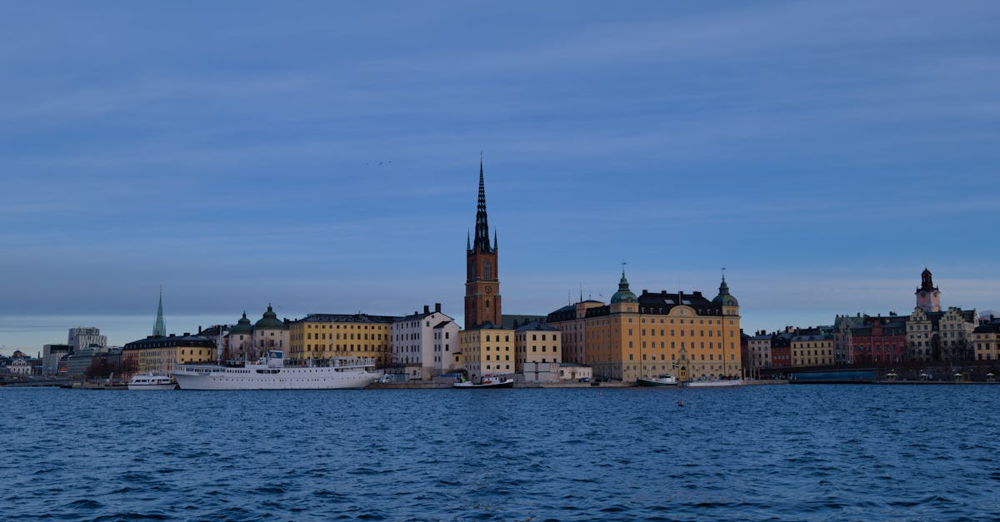

# Stockholm, Sweden

Country: Sweden
Region: Europe

Stockholm is the Swedish capital, a 1-million-person city built across 14 islands at the meeting of Lake Mälaren and the Baltic Sea. The Royal Palace and the medieval Gamla Stan (Old Town) on Stadsholmen island; the Vasa Museum's restored seventeenth-century warship; the Stockholm Archipelago of 30,000 islands begins at the city's edge.

---

## 🧭 Step 1: Choices

### ✨ Why Visit

Stockholm is one of Europe's most beautifully sited capitals, half on water. The Gamla Stan (Old Town) on Stadsholmen is a complete medieval island. The Vasa Museum is one of Europe's most surprising visits (a 1628 warship that sank on its maiden voyage and was raised, almost intact, in 1961). The ABBA Museum, the Skansen open-air museum on Djurgården, and the Moderna Museet anchor different cultural threads.

The city is also the gateway to the **Stockholm Archipelago**, one of the world's largest archipelagos, with ferries from the city centre to hundreds of islands. Sandhamn, Vaxholm, Grinda, and Utö are summer escapes.

You come for the Old Town, the Vasa, the archipelago, the design (Swedish design is everywhere), and a Nordic capital that handles its short summer with serious style.

### 🌍 Ethical Compass

- **💰 Economy.** Sweden is expensive; budget honestly. Eat at neighbourhood places in Södermalm (SoFo area), Vasastan, and Kungsholmen rather than only Old Town tourist restaurants. The *Östermalms Saluhall* and Hötorgshallen are excellent food halls.
- **👥 Employment.** Tipping is not customary in Sweden; service is included by law and Swedish wages are properly funded. A small tip for exceptional service is appreciated.
- **📚 Education.** Read about the Sami (the Indigenous people of northern Scandinavia); the Nordic Museum on Djurgården covers some Sami material. The Vasa Museum tells the story of a Swedish imperial-era disaster. The contemporary Sweden conversation includes immigration and the social-democratic legacy.
- **🌱 Ecology.** Walk and use SL (the transport authority); the centre is small. Cycle in summer. The Stockholm Archipelago and Mälaren islands are real urban-edge nature. Refill water; tap is excellent.

---

## 🎒 Step 2: Preparation

### 🔍 Governance Management Traceability

- Most visitors are **visa-exempt for short Schengen stays**; verify on the official Swedish Migration Agency portal.
- **Vasa Museum, ABBA Museum, Skansen, Moderna Museet, Nationalmuseum** sell tickets on official portals; the Vasa is the most-visited museum in Scandinavia and worth booking ahead.
- **Royal Palace** (Kungliga Slottet) sells tickets and changing-of-the-guard schedule on the official portal.
- **SL transport** (Metro, bus, tram, ferry) uses the SL access card or contactless payment.
- **Archipelago ferries** (Waxholmsbolaget, Strömma) sell tickets and timetables on official portals.

### 📡 Information Curation Variety

- **The Local Sweden** and **SVT News** (Swedish public broadcaster, has English) for current news.
- **Visit Stockholm** (the official city tourism site) for events.
- A Swedish author: Stieg Larsson (the *Millennium* series, set in Stockholm); Henning Mankell; Selma Lagerlöf (canonical); Karin Boye.
- A locally led Old Town or Södermalm walking tour.
- **Wikivoyage Stockholm** for orientation.

### 🎯 Inference Interaction Accountability

- **You decide on the Vasa.** A serious one-hour visit; one of Europe's most unusual museums.
- **You decide on the archipelago.** Half-day to Vaxholm (closest, 1 hour by ferry), full day to Sandhamn or Grinda (further out, more dramatic), or an overnight in summer.
- **You decide on Old Town pace.** Gamla Stan is small and best at quieter hours (morning, evening); avoid the souvenir-shop main streets except as quick walks.
- **You decide on Södermalm.** The hipster south island; SoFo cafés; Monteliusvägen sunset walk; one of the city's most pleasant evenings.
- **You decide on the day-trip.** Drottningholm Palace (UNESCO, royal residence, hour by boat or train + bus); Birka (Viking site).

### 🔄 Intelligence Cooperation Integrity

Stockholm weather is wide-amplitude; winter (December-February) is short days and cold; summer (June-August) has very long days; spring and autumn are dramatic and short. The archipelago is best in summer when ferries are frequent.

Bring a soft plan. If winter dark closes outdoor energy, the museums and a long restaurant lunch absorb the day. If a sudden summer rain closes the archipelago plan, the Old Town and Vasa work. If midsummer (Midsommar, late June) closes shops, the parks are festive.

### 📍 Top 5 Anchor Spots

1. **Gamla Stan (Old Town) walking morning + Royal Palace + Storkyrkan cathedral.** Half-day in the medieval island.
2. **Vasa Museum on Djurgården.** One of Scandinavia's most surprising museums.
3. **Skansen + the wider Djurgården.** Open-air museum; ABBA Museum nearby; the island is a green half-day.
4. **A Stockholm Archipelago boat day.** Vaxholm (closest, easy) or a full day to Grinda or Sandhamn in summer.
5. **A Södermalm evening: Monteliusvägen sunset, SoFo dinner, the Photographic Museum (Fotografiska).**

### 🧰 Practical Essentials

- **Recommended Length.** Three to four days for Stockholm. Add a day or two for archipelago islands or Uppsala.
- **Transport.** Walk in the central islands. **SL Metro, bus, tram, ferry**; SL access card or contactless. **Archipelago ferries** by Waxholmsbolaget or Strömma. Arlanda Airport (ARN) is 20 minutes by Arlanda Express train.
- **Daily Cost (per person).**
  - **Budget:** roughly SEK 750 to 1,400 (about EUR 65 to 120). Hostel, supermarket and bakery meals, SL, two ticketed museums.
  - **Mid-range:** roughly SEK 1,600 to 2,800 (about EUR 140 to 245). Three-star hotel, restaurant dinners, all major museums, an archipelago day.
  - **Higher-comfort:** roughly SEK 4,000 and up. Grand Hôtel, Ett Hem, the Lydmar, fine dining at Frantzén, Aira, or Operakällaren, private guides, a Drottningholm Palace boat trip.
- **Booking Notes.**
  - **Schengen:** verify your nationality.
  - **Vasa Museum:** book ahead in peak season.
  - **Midsummer (Midsommar, late June)** is the Swedish summer holiday; most shops close.
  - **Nobel Prize ceremony (December 10)** fills the Grand Hôtel and concert hall area briefly.
  - **Archipelago ferries:** verify on Waxholmsbolaget; off-season schedules are limited.

---

## ✈️ Step 3: Delivery

### 🤖 AI Prompt

Copy this into your own AI assistant, fill in the brackets, and treat the answer as a researcher's draft, not a final plan.

> Please help me plan an ethical visit to Stockholm, Sweden for [NUMBER] days in [MONTH]. I am travelling with [WHO] and my interests are [INTERESTS, e.g. Vasa and maritime history, design, archipelago, ABBA, food]. My total budget is around [AMOUNT] and my comfort level is [budget / mid-range / higher-comfort].
>
> Please structure your answer in three steps.
>
> **Step 1: Choices.** Help me decide what to prioritise. Recommend the two or three Stockholm experiences I should not miss given my interests, and one I should consider skipping (a midday Gamla Stan main-street souvenir crawl, an archipelago day on a cloud-locked off-season day, a Drottningholm trip if I have only two days). Briefly explain each trade-off.
>
> **Step 2: Preparation.** Cover all four of the following:
> - **Governance Management Traceability.** What assumptions should I check before I book? Include Schengen, official Vasa and ABBA Museum portals, Royal Palace, SL transport setup, and archipelago ferry schedules.
> - **Information Curation Variety.** Suggest at least four different source types: one official Swedish source, one Swedish news outlet, one Swedish author, and one Stockholm-based walking guide.
> - **Inference Interaction Accountability.** List the decisions I personally need to make (Vasa visit, archipelago choice, Old Town timing, Södermalm evening, day-trip).
> - **Intelligence Cooperation Integrity.** Build me a soft plan with at least two alternates for likely disruptions (winter dark, summer rain, Midsommar closures, a sold-out top restaurant).
>
> **Step 3: Delivery.** Give me the actual itinerary, day by day, with realistic timings and named islands and neighbourhoods. Include at least one Djurgården day and one Södermalm evening. Mark each business as confidently locally owned, or flag for me to verify.
>
> Finally, please remind me at the end to verify your suggestions against:
> 1. Official sources: Visit Stockholm, the Vasa Museum, the Royal Palace, SL, and Waxholmsbolaget.
> 2. Real people: a Stockholm resident, a Stockholm guide, or hotel staff who live in the city now.
>
> Treat your output as a researcher's draft. I will make the final calls.

---

Part of **Gyro Governance Ethical Travel: AI-Empowered Guides for Human Adventures**.

Explore more destinations, ethical domains, and AI prompts at [travel.gyrogovernance.com](https://travel.gyrogovernance.com/).
