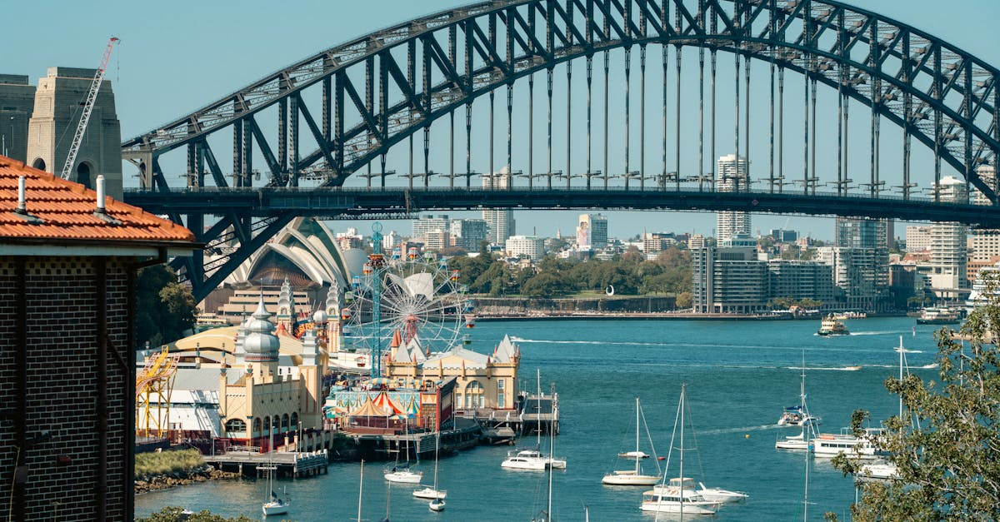

# Sydney, Australia

Country: Australia
Region: Oceania

Sydney (*Warrane* in Gadigal language for the harbour) is the capital of New South Wales and Australia's largest city, a 5.5-million-person harbour metropolis on the Pacific. The Sydney Opera House and Harbour Bridge silhouette is one of the planet's most-recognised images; the beaches (Bondi, Manly, Bronte, Coogee) define a serious surf and swim culture.

---

## 🧭 Step 1: Choices

### ✨ Why Visit

Sydney compresses one of the world's great natural harbours, world-class beaches reachable by ferry or train, a serious food and arts scene, and the Blue Mountains an hour west. The Opera House guided tour and performance, the Harbour Bridge BridgeClimb, the Royal Botanic Garden, the Art Gallery of New South Wales, and the MCA contemporary collection are the cultural anchors.

The city is also one of the most expensive in the world; budget honestly. The beaches and the ferries are free or cheap; the central restaurants and the Opera Bar are not.

You come for the harbour, the beaches, the food, the Opera House, the Blue Mountains, and as the most photographed introduction to Australia.

### 🌍 Ethical Compass

- **💰 Economy.** Eat in actual neighbourhoods: Surry Hills, Newtown, Marrickville, Glebe, Bondi back streets. The Sydney Fish Market is excellent. Avoid Circular Quay's most tourist-focused restaurants.
- **👥 Employment.** Tipping is not customary in Australia; service-industry wages are properly paid. Use Opal card or contactless on Sydney trains, ferries, buses, and light rail.
- **📚 Education.** This is **Gadigal land** of the Eora nation. Visit the Australian National Maritime Museum and the Museum of Sydney for the colonial history; engage with Aboriginal-led tours (Dreamtime Southern X, Royal Botanic Garden Aboriginal Heritage Tour) for the deeper context.
- **🌱 Ecology.** Use the **Sydney Ferries** and trains rather than driving; ferries are both transport and sightseeing. **Reef-safe sunscreen** at the beaches. The Blue Mountains National Park is fragile; stay on trails. Sydney has had recent serious bushfires; check air quality in summer.

---

## 🎒 Step 2: Preparation

### 🔍 Governance Management Traceability

- **ETA or eVisitor** required for most visa-waiver nationals; verify on the Department of Home Affairs portal.
- **Opera House guided tours and performances** sell on the official Sydney Opera House portal.
- **BridgeClimb** sells on the official BridgeClimb Sydney portal.
- **Sydney trains, ferries, light rail, buses** under Transport for NSW; **Opal card** or contactless payment; daily and weekly caps apply.
- **Bondi to Coogee coastal walk** is free; no booking required.

### 📡 Information Curation Variety

- **Sydney Morning Herald** and **ABC Sydney** for serious local journalism.
- **Sydney.com** and the official **Destination NSW** for events and openings.
- An Australian author with Sydney roots: Patrick White (Nobel laureate); Christos Tsiolkas; Charlotte Wood; Tara June Winch.
- An Aboriginal-led Sydney tour (Dreamtime Southern X, Royal Botanic Garden Aboriginal Heritage Tour).
- **Wikivoyage Sydney** for orientation.

### 🎯 Inference Interaction Accountability

- **You decide on the Opera House.** A guided tour and a performance are different experiences; book whichever fits your schedule.
- **You decide on Bondi vs Manly.** Bondi is the postcard beach; Manly is a 30-minute ferry from Circular Quay and more local. Both reward visits.
- **You decide on the Blue Mountains.** A full day from Sydney (1.5 hours each way by train); Three Sisters, Govett's Leap, Wentworth Falls. An overnight in Katoomba is the deeper experience.
- **You decide on the Aboriginal cultural engagement.** A guided Aboriginal walking tour gives a different reading of harbour and city.
- **You decide on Sydney Fish Market vs neighbourhood restaurants.** The Fish Market is touristy but the fish is real; the SoCo/Surry Hills/Newtown restaurants are dramatically better food experiences.

### 🔄 Intelligence Cooperation Integrity

Sydney weather is mostly mild; summers (December-February) hot and occasionally extreme; winters mild (no snow). Major events (Sydney New Year's Eve fireworks, the Mardi Gras parade in late February or early March, Vivid Sydney light festival in May-June) reshape parts of the city briefly.

Bring a soft plan. If a summer thunderstorm closes outdoor plans, the Art Gallery of New South Wales and the MCA absorb a wet afternoon. If wildfire smoke degrades air quality, indoor experiences and beach-front bars work. If a ferry is delayed, the train network is dense.

### 📍 Top 5 Anchor Spots

1. **Sydney Opera House + Circular Quay + Royal Botanic Garden walk.** Half-day around the harbour foreshore.
2. **Bondi to Coogee coastal walk.** Free; 6 km; 2 to 3 hours; one of the world's great urban coastal walks.
3. **A Manly ferry day.** 30-minute ferry from Circular Quay; lunch in Manly; the walk to Shelly Beach.
4. **Blue Mountains day or overnight.** Train to Katoomba, Three Sisters, Govett's Leap, the Scenic World cable car.
5. **An Aboriginal-led walking tour.** Royal Botanic Garden Aboriginal Heritage Tour or Dreamtime Southern X.

### 🧰 Practical Essentials

- **Recommended Length.** Three to five days for Sydney. Add a day for the Blue Mountains; consider extending to the Hunter Valley wine region.
- **Transport.** **Trains, ferries, buses, light rail** under Transport for NSW; **Opal card or contactless**, with automatic daily and weekly caps. The **ferry network** is both transport and sightseeing (Manly, Watsons Bay, Cockatoo Island). Sydney Airport (SYD) is 20 minutes from the CBD by Airport Link train.
- **Daily Cost (per person).**
  - **Budget:** roughly AUD 120 to 200. Hostel or budget hotel, supermarket and food-court meals, Opal, free walks and beaches.
  - **Mid-range:** roughly AUD 280 to 480. Three-star hotel, restaurant dinners, Opera House tour, Blue Mountains day.
  - **Higher-comfort:** roughly AUD 700 and up. Park Hyatt Sydney, Capella Sydney, the Langham, fine dining at Quay, Tetsuya's, Bennelong, BridgeClimb premium, helicopter harbour flights.
- **Booking Notes.**
  - **ETA or eVisitor:** verify on the Department of Home Affairs portal.
  - **Opera House performances:** book months ahead for popular shows.
  - **New Year's Eve fireworks:** book vantage points months ahead.
  - **Vivid Sydney (late May to mid-June):** major festival.
  - **Mardi Gras (late February or early March):** the parade and party events.

---

## ✈️ Step 3: Delivery

### 🤖 AI Prompt

Copy this into your own AI assistant, fill in the brackets, and treat the answer as a researcher's draft, not a final plan.

> Please help me plan an ethical visit to Sydney, Australia for [NUMBER] days in [MONTH]. I am travelling with [WHO] and my interests are [INTERESTS, e.g. harbour and Opera House, beaches and surf, Blue Mountains, Aboriginal culture, food]. My total budget is around [AMOUNT] and my comfort level is [budget / mid-range / higher-comfort].
>
> Please structure your answer in three steps.
>
> **Step 1: Choices.** Help me decide what to prioritise. Recommend the two or three Sydney experiences I should not miss given my interests, and one I should consider skipping (a Circular Quay tourist restaurant, a Blue Mountains day-trip in bushfire-smoke conditions, a BridgeClimb if my budget is limited). Briefly explain each trade-off.
>
> **Step 2: Preparation.** Cover all four of the following:
> - **Governance Management Traceability.** What assumptions should I check before I book? Include the ETA or eVisitor, official Opera House and BridgeClimb portals, Opal or contactless transport, Blue Mountains train service, and bushfire-season air-quality alerts.
> - **Information Curation Variety.** Suggest at least four different source types: one official Sydney or NSW source, one local news outlet, one Australian author, and one Aboriginal-led tour (Royal Botanic Garden Aboriginal Heritage or Dreamtime Southern X).
> - **Inference Interaction Accountability.** List the decisions I personally need to make (Opera House tour vs performance, Bondi vs Manly, Blue Mountains day vs overnight, Aboriginal engagement).
> - **Intelligence Cooperation Integrity.** Build me a soft plan with at least two alternates for likely disruptions (summer thunderstorm, bushfire smoke, a ferry delay, a sold-out Opera House show).
>
> **Step 3: Delivery.** Give me the actual itinerary, day by day, with realistic timings and named neighbourhoods. Include at least one ferry trip and one Aboriginal-led experience if available. Mark each business as confidently locally owned, or flag for me to verify.
>
> Finally, please remind me at the end to verify your suggestions against:
> 1. Official sources: Destination NSW, the Sydney Opera House, BridgeClimb Sydney, Transport for NSW, and the Department of Home Affairs.
> 2. Real people: a Sydney resident, an Aboriginal-led tour guide, or hotel staff who live in Sydney now.
>
> Treat your output as a researcher's draft. I will make the final calls.

---

Part of **Gyro Governance Ethical Travel: AI-Empowered Guides for Human Adventures**.

Explore more destinations, ethical domains, and AI prompts at [travel.gyrogovernance.com](https://travel.gyrogovernance.com/).
