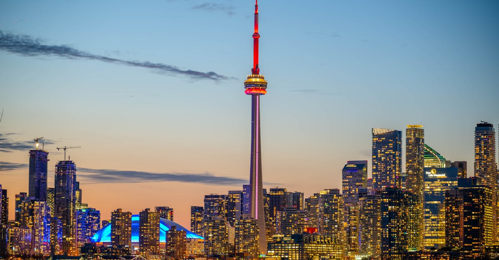

# Toronto, Canada

Country: Canada
Region: Americas

Toronto is Canada's largest city, a 3-million-person city centre with 6.4 million in the wider Greater Toronto Area, on the north shore of Lake Ontario. Canada's financial and entertainment capital, one of the world's most ethnically diverse cities (around half the population is foreign-born), and the gateway to Niagara Falls (1.5 hours by car or bus).

---

## 🧭 Step 1: Choices

### ✨ Why Visit

Toronto is one of the world's most culturally diverse cities, and that shapes everything: the food, the neighbourhoods, the festivals, the cultural calendar. Kensington Market, Little Italy, Chinatown, Little India on Gerrard Street, Greektown on the Danforth, Koreatown, the new Chinatown East, and dozens more give the city a working multicultural texture.

The CN Tower's edgewalk and observation deck, the Royal Ontario Museum, the Art Gallery of Ontario, the Distillery District, the Harbourfront, and the Toronto Islands (a free ferry ride from the city) anchor the visitor map. Niagara Falls is a day-trip.

You come for the food, the multicultural neighbourhoods, the museums, the lake and islands, and as the gateway to Niagara.

### 🌍 Ethical Compass

- **💰 Economy.** Eat in actual ethnic neighbourhoods: Kensington Market (eclectic), Greektown on the Danforth, Chinatown West (Spadina) and East (Gerrard), Little India on Gerrard, Little Italy on College, the Junction. Avoid limiting yourself to downtown chains.
- **👥 Employment.** Tip 18-20 percent at sit-down restaurants; tip rideshare drivers; tip hotel staff. Toronto service-industry wages are stretched by high cost of living.
- **📚 Education.** Read about the Indigenous First Nations (Mississaugas of the Credit, Anishinaabe, Haudenosaunee, Huron-Wendat) who lived here first. Visit the Indigenous-led First Story Toronto tours; the Royal Ontario Museum has serious Indigenous collections; the Aga Khan Museum is essential for Islamic art.
- **🌱 Ecology.** Use the **TTC** (Toronto Transit Commission). Walk and cycle (the BeltLine and waterfront trails). Take the **free Toronto Islands ferry** for a real city escape. Refill water; Toronto tap is excellent.

---

## 🎒 Step 2: Preparation

### 🔍 Governance Management Traceability

- Most visitors need an **eTA (Canadian Electronic Travel Authorization)** if visa-exempt, or a visa otherwise; verify on the official Government of Canada Immigration portal.
- **CN Tower** sells timed tickets on the official portal.
- **Royal Ontario Museum, Art Gallery of Ontario, Aga Khan Museum, Hockey Hall of Fame** sell tickets on official portals.
- **TTC** (subway, streetcars, buses) uses **Presto card** or contactless on most lines.
- **Toronto Islands ferries** sell tickets at the Jack Layton Ferry Terminal; verify on the official Toronto Islands portal.

### 📡 Information Curation Variety

- **Toronto Star** and **CBC Toronto** for serious local news.
- **Destination Toronto** (the official city tourism site) for events.
- A Toronto author: Margaret Atwood; Michael Ondaatje; Catherine Bush; Lawrence Hill; Cherie Dimaline.
- An Indigenous-led First Story Toronto tour or a Kensington Market food tour.
- **Wikivoyage Toronto** for orientation.

### 🎯 Inference Interaction Accountability

- **You decide on the neighbourhood depth.** Spending most of your trip downtown is the most common mistake. Add at least one full day in Kensington/Chinatown, the Danforth, or Little Italy.
- **You decide on the CN Tower.** The Edgewalk is the only adrenaline addition; the observation deck is the calmer option.
- **You decide on Niagara.** A long day-trip is achievable (bus from Union Station); an overnight in Niagara-on-the-Lake is the better experience.
- **You decide on the Toronto Islands.** Half-day on the free ferry; Ward's Island and Centre Island; one of the city's most pleasant escapes.
- **You decide on Indigenous engagement.** First Story Toronto's walking tours or a Native Canadian Centre visit gives real context.

### 🔄 Intelligence Cooperation Integrity

Toronto weather is four-season; serious winter (December-March, often below freezing with windchill), beautiful but short summer (June-August), dramatic shoulder seasons. Major events (TIFF film festival in September, Pride in June, Caribana in August) reshape parts of the city.

Bring a soft plan. If a snow day surprises you, the underground **PATH** network (29 km of underground city) covers most of downtown. If a Niagara day is forecast rain, the Royal Ontario Museum absorbs an alternative.

### 📍 Top 5 Anchor Spots

1. **CN Tower + Harbourfront walk.** Observation deck or Edgewalk; harbourside walk; ferry to the Toronto Islands if time allows.
2. **Kensington Market + Chinatown West walking afternoon.** Eclectic food, vintage shops, dim sum.
3. **Royal Ontario Museum.** Half-day; one of North America's most diverse natural and cultural-history collections.
4. **Toronto Islands.** Free ferry; Centre Island for families; Ward's Island for the quieter walk.
5. **Niagara Falls day-trip or overnight.** Bus or train from Union Station; the Falls + Niagara-on-the-Lake town.

### 🧰 Practical Essentials

- **Recommended Length.** Three to five days for Toronto. Add a day for Niagara; longer for the wine region or Algonquin Provincial Park.
- **Transport.** Walk in the centre. **TTC subway (4 lines), streetcars, and buses**; Presto card or contactless. The **PATH** underground network is excellent in winter. **GO Transit** for the wider region. Pearson Airport (YYZ) is connected to Union Station by the UP Express in 25 minutes.
- **Daily Cost (per person).**
  - **Budget:** roughly CAD 100 to 180. Hostel, food-court and ethnic-neighbourhood meals, TTC, free Toronto Islands ferry.
  - **Mid-range:** roughly CAD 250 to 450. Three-star hotel, restaurant dinners, all major museums, Niagara day-trip.
  - **Higher-comfort:** roughly CAD 600 and up. Fairmont Royal York, Shangri-La, the Ritz-Carlton Toronto, fine dining at Edulis, Alo, Canoe, private guided tours, premium TIFF screenings.
- **Booking Notes.**
  - **eTA:** verify on the official Canadian Immigration portal.
  - **TIFF (September):** book accommodation months ahead; major film festival.
  - **Caribana (early August):** Toronto's Caribbean Carnival, huge.
  - **Winter clothing:** sub-zero temperatures with windchill genuinely require it.
  - **Tipping:** 18-20 percent at sit-down meals.

---

## ✈️ Step 3: Delivery

### 🤖 AI Prompt

Copy this into your own AI assistant, fill in the brackets, and treat the answer as a researcher's draft, not a final plan.

> Please help me plan an ethical visit to Toronto, Canada for [NUMBER] days in [MONTH]. I am travelling with [WHO] and my interests are [INTERESTS, e.g. ethnic food, museums, Indigenous culture, TIFF, Niagara, sport]. My total budget is around [AMOUNT] and my comfort level is [budget / mid-range / higher-comfort].
>
> Please structure your answer in three steps.
>
> **Step 1: Choices.** Help me decide what to prioritise. Recommend the two or three Toronto experiences I should not miss given my interests, and one I should consider skipping (a downtown-only itinerary, a midday CN Tower, a Niagara one-day attempt if I could afford an overnight). Briefly explain each trade-off.
>
> **Step 2: Preparation.** Cover all four of the following:
> - **Governance Management Traceability.** What assumptions should I check before I book? Include the Canadian eTA, official CN Tower and museum portals, TTC Presto/contactless, the Toronto Islands ferry, and TIFF/Caribana dates.
> - **Information Curation Variety.** Suggest at least four different source types: one official Toronto source, one Toronto news outlet, one Toronto author, and one Indigenous-led tour (First Story Toronto).
> - **Inference Interaction Accountability.** List the decisions I personally need to make (neighbourhood depth, CN Tower experience choice, Niagara approach, Toronto Islands day, Indigenous engagement).
> - **Intelligence Cooperation Integrity.** Build me a soft plan with at least two alternates for likely disruptions (winter snowstorm, TIFF-week hotel spike, a Caribana street closure, a sold-out CN Tower).
>
> **Step 3: Delivery.** Give me the actual itinerary, day by day, with realistic timings and named neighbourhoods. Include at least one ethnic-neighbourhood food day. Mark each business as confidently locally owned, or flag for me to verify.
>
> Finally, please remind me at the end to verify your suggestions against:
> 1. Official sources: Destination Toronto, the TTC, the CN Tower, ROM, the Canadian Immigration eTA portal.
> 2. Real people: a Toronto resident, a First Story Toronto guide, or hotel staff who live in Toronto now.
>
> Treat your output as a researcher's draft. I will make the final calls.

---

Part of **Gyro Governance Ethical Travel: AI-Empowered Guides for Human Adventures**.

Explore more destinations, ethical domains, and AI prompts at [travel.gyrogovernance.com](https://travel.gyrogovernance.com/).
